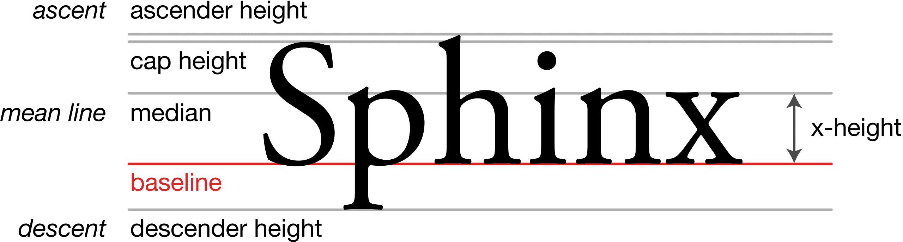
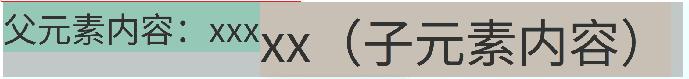

# CSS2笔记

## CSS三种写法及优先级

### 行内样式

```html
<p style="color: red;">文字</p>
```

### 内部样式

```html
<style>
    p {
        color: red;
    }
</style>

<body>
    <p>
        文字
    </p>
</body>
```

### 外部样式

=== "CSS文件"

    ```css
    p {
        color: red;
    }
    ```

=== "HTML文件"

    ```html
    <head>
        <link rel="stylesheet" href="./style.css">
    </head>
    <body>
        <p>
            文字
        </p>
    </body>
    ```

### 优先级

行内样式 > 内部样式 = 外部样式

## 基础选择器

选择器：负责选择元素定向设置样式，所有选择器都有自己的特点，根据需要选择即可，不需要太纠结选择哪一种选择器

### 通配选择器

选中所有HTML元素，一般用于清除样式

```css
* {
    /* 样式 */
}
```

### 元素选择器

选择页面中的某一个HTML标签（元素）设置样式

```css
h1 {
    /* 为h1标签设置样式 */
}
```

### 类选择器

使用全局属性`class`为元素指定值，选择相同`class`值的元素设置样式。设置样式时，对应的`class`名需要带`.`

```html
<style>
    /* class名前需要带. */
    .box {
        /* 为class名为box的元素设置样式 */
    }
</style>

<body>
    <!-- 选择下面的盒子 -->
    <div class="box">
        内容
    </div>
    <!-- 不选择下面的盒子 -->
    <div>
        内容
    </div>
</body>
```

注意：一个标签不可以有多个`class`，但是一个`class`可以有多个值，不同的值以空格分隔，最后样式会合并

### ID选择器

使用全局属性`id`为标签指定值，选择指定的`id`值单独为元素设置样式。设置样式时，对应的`id`值前需要带`#`

与`class`不同的是，同一个`id`值只能出现一次

```html
<style>
    #box {
        /* 为id为box的元素设置样式 */
    }
</style>

<body>
    <!-- 为下面的盒子设置样式 -->
    <div id="box">
        内容
    </div>
</body>
```

需要注意，一个标签既可以有`id`属性，也可以有`class`属性，同样只能有一个`id`属性

## 复合选择器

本部分共有两种：

1. 基于基础选择器，多个基础选择器之间的组合，包括：交集选择器、并集选择器、后代选择器、子代选择器和兄弟选择器
2. 在基础选择器之上进行拓展，包括：属性选择器、伪类选择器和伪元素选择器

!!! note

    需要注意，因为第二种是在基础选择器之上对已有的基础选择器进行拓展，所以第一种复合选择器对于第二种也是可以使用的

### 基于基础选择器

#### 交集选择器

不同的基础选择器之间用`.`连接，表示既满足……又满足……：

```css
/* 选择类名为box的p元素 */
p.box {
    /* 样式 */
}

/* 选择类名包含box1和box2的元素 */
.box1.box2 {
    
}
```

#### 并集选择器（分组选择器）

基础选择器之间用`,`分隔，表示满足其中之一：

```css
/* 选择有box1或者box2的元素 */
.box1, .box2 {
    /* 样式 */
}
```

并集选择器，通常用于集体声明，可以缩小样式表体积

#### 后代选择器

选择当前元素所有的后代元素，父元素和后代元素之间用空格` `隔开：

```html
<style>
    /* 选择ul中的li */
    ul li {

    }

    /* 选择ul中的li中的span */
    ul li span {

    }
</style>

<body>
    <ul>
        <!-- 下面的所有li和span都会被选中 -->
        <li>
            内容
        </li>
        <li>
            <span>内容</span>
        </li>
    </ul>
</body>
```

#### 子代选择器

选择当前元素的所有子代元素，父元素和子元素之间使用`>`分隔：

```html
<style>
    /* 选择ul的孩子li元素 */
    ul>li {
        /* 样式 */
    }
</style>

<body>
    <ul>
        <!-- 只会设置li中的内容样式，span的内容不会改变 -->
        <li>
            内容
            <span>内容</span>
        </li>
    </ul>
</body>
```

需要注意，如果对`li`设置背景颜色等其他整体样式，那么`span`的背景也会跟着改变，因为`span`是嵌套在li内部，如果单独为`span`设置背景，就不会出现`li`和`span`的背景相同

#### 单兄弟选择器（后兄弟元素）

选择与当前元素相邻的下一个元素，两个元素之间使用`+`进行分隔：

```html
<style>
    /* 选择div后的兄弟p元素 */
    div+p {

    }
</style>
<body>
    <div>
        <!-- 不会选择下面的p标签 -->
        <p>

        </p>
    </div>
    <!-- 选择下面的p标签 -->
    <p></p>
    <!-- 不会选择下面的p标签 -->
    <p></p>
</body>
```

#### 多兄弟选择器（后兄弟元素）

选择当前元素的所有兄弟元素，兄弟元素之间用`~`分隔：

```html
<style>
    /* 选择div后所有的p兄弟元素 */
    div~p{

    }
</style>

<body>
    <div>

    </div>
    <!-- 选择下面所有的p元素 -->
    <p></p>
    <p></p>
    <p></p>
    <p></p>
</body>
```

### 拓展基础选择器

#### 属性选择器

选择存在满足条件属性的元素，元素属性使用`[]`包裹，有下面几种使用：

1. `[属性名]` 选中**含有**某个属性的元素
2. `[属性名="值"]` 选中包含某个属性，且属性值**等于**指定值的元素
3. `[属性名^="值"]` 选中包含某个属性，且属性值以指定的值**开头**（或者第一个值的开头字母为指定值）的元素
4. `[属性名$="值"]` 选中包含某个属性，且属性值以指定的值**结尾**（或者最后一个值的最后一个字母为指定值）的元素
5. `[属性名*="值"]` 选中包含某个属性，属性值**包含**指定值（或者某一个值中含有指定值）的元素

```html
<style>
    /* 属性有title */
    div[title] {
        color: red;
    }
    /* 属性值以a开头 */
    div[title^="a"] {
        color: green;
    }
    /* 属性值为e结尾 */
    div[title$="e"] {
        color: blue;
    }
    /* 属性值为包含e的元素 */
    div[title*="e"] {
        color: lightblue;
    }
</style>

<body>
    <div title="apple orange">内容</div>
    <div title="a">内容</div>
    <div title="e">内容</div>
</body>
```

#### 伪类选择器

伪类选择器主要作用是选择拥有特殊状态的元素，因为这个特殊状态在DOM中并不直接存在，所以称为「伪类」。常见的伪类有下面几种：

1. 动态伪类选择器
2. 结构伪类选择器
3. 否定伪类选择器
4. UI伪类选择器
5. 目标伪类选择器（不重点介绍，了解）
6. 语言伪类选择器（不重点介绍，了解）

**动态伪类选择器：**

动态伪类一般有：

1. `:link`：超链接未被访问的状态
2. `:visited`：超链接被访问过的状态
3. `:hover`：鼠标悬浮在该元素时的状态
4. `:active`：元素<a href="javascript:;" class="custom-tooltip" data-title="按下鼠标不松开">被激活</a>的状态
5. `:focus`：元素获取焦点的状态，一般用于表单元素

!!! note

    需要注意，如果需要同时使用前4伪类选择器，一定要按照`LVHA`的顺序，因为前两种用在超链接上，所以这四个伪类一起用一般都是用在超链接上

=== "伪类选择器用在超链接上"

    ```html
    <style>
        /* 设置链接本身的样式 */
        a:link {
            color: red;
        }
    
        /* 设置链接悬浮样式 */
        a:hover {
            color: green;
        }
    
        /* 设置链接访问过后的样式 */
        a:visited {
            color: gray;
        }
    
        /* 设置链接激活的样式 */
        a:active {
            color: darkcyan;
        }
    </style>
    
    <body>
        <p>
            <a href="https://www.baidu.com">百度一下</a>
        </p>
    </body>
    ```

=== "伪类用在表单上"

    ```html
    <style>
        /* 输入框没有焦点时内容颜色为灰色 */
        input {
            color: grey;
        }
    
        /* 输入框获取焦点时内容颜色为红色 */
        input:focus {
            color: red;
        }
    </style>
    
    <body>
        请输入信息：<input type="text">
    </body>
    ```

**结构伪类选择器**

结构伪类一般有：

1. `:first-child`：选择作为第一个后代的指定元素
2. `:last-child`：选择作为最后一个后代的指定元素
3. `:nth-child(n)`：选择作为第`n`后代的指定元素
4. `:first-of-type`：选择作为第一个同类型的后代元素
5. `:last-of-type`：选择作为最后一个同类型的后代元素
6. `:nth-of-type(n)`：选择作为第`n`个同类型的后代元素
7. `:root`：选择根元素

其他伪类元素：

1. `:nth-last-child(n)`：选择作为倒数第`n`个子代元素
2. `:nth-last-of-type(n)`：所有倒数第`n`个同类型的元素
3. `:only-child`：选择没有兄弟（指定元素作为其父元素的唯一后代元素）的元素
4. `:only-of-type`：选择没有同类型兄弟（指定元素作为其父元素的唯一同类型元素）的元素

在上面的选择器中，`n`可以写的内容有：

1. 0或者不写：不选中任何内容
2. `n`：选中所有
3. `正整数`：选择指定序号的子元素，第一个子元素序号为1
4. `2n`或者`even`：选择偶数序号的子元素
5. `2n+1`或者`odd`：选择奇数序号的子元素
6. `-n+i`：选择前`i`个元素

```html
<style>
    /* 选择div中的第一个p元素中的后代元素 */
    div p:first-child span{
        color: red;
    }

    /* 选择div中的前6个p元素和其后代元素 */
    div p:nth-of-type(-n+6) {
        color: blue;
    }
</style>

<body>
    <div>
        <p>
            内容
            <span>内容</span>
        </p>
        <p>内容</p>
        <p>内容</p>
        <p>内容</p>
        <p>内容</p>
        <span>内容</span>
        <span>内容</span>
        <span>内容</span>
        <span>内容</span>
    </div>
</body>
```

**否定伪类选择器**

使用`:not(基础选择器)`选择不包括`基础选择器指定的元素`的元素

```html
<style>
    /* 选择div中不是p元素的元素 */
    div :not(p) {
        color: red;
    }
</style>

<body>
    <div>
        <p>
            <!-- p中的内容不变红 -->
            内容
            <!-- 下面span元素变红 -->
            <span>内容</span>
        </p>
        <p>
            内容
        </p>
        <p>内容</p>
        <!-- 下面span元素变红 -->
        <span>内容</span>
    </div>
</body>
```

**UI伪类选择器**

常见的UI伪类选择器有：

1. `:checked`：选择被选中的复选框或者单选框
2. `:enable`：选择可用的表单元素（没有使用`disabled`属性）
3. `:disabled`：选择不可用的表单元素（使用`disabled`属性）

```html
<style>
    /* 修改选中元素的选中效果 */
    /* 注意不能使用color修改单选框或者复选框的文本样式 */
    input:checked {
        accent-color: red;
    }
</style>
<body>
    <input type="checkbox" name="alpha" value="a">a
    <input type="checkbox" name="alpha" value="a">b
    <input type="checkbox" name="alpha" value="a">c

    <input type="radio" name="alpha-t">d
    <input type="radio" name="alpha-t">e
</body>
```

**目标伪类选择器**

例如，`:target`表示选中锚点指向的元素

```html
<style>
    /* 所有div的默认样式 */
    div {
        background-color: gray;
        height: 200px;
        margin: 10px 0;
        padding: 20px;
    }

    /* 当div成为目标元素时的样式 */
    div:target {
        background-color: green;
        color: white;
        font-weight: bold;
    }
</style>
<body>
    <!-- 设置锚点 -->
    <nav>
        <a href="#section1">跳转到第1节</a>
        <a href="#section2">跳转到第2节</a>
        <a href="#section3">跳转到第3节</a>
        <a href="#section4">跳转到第4节</a>
    </nav>

    <!-- 目标元素 -->
    <div id="section1">
        <h2>第1节内容</h2>
    </div>

    <div id="section2">
        <h2>第2节内容</h2>
    </div>

    <div id="section3">
        <h2>第3节内容</h2>
    </div>

    <div id="section4">
        <h2>第4节内容</h2>
    </div>
</body>
```

**语言伪类选择器**

`:lang()`：根据元素的`lang`属性值选择元素

```html
<style>
    /* 选择lang属性为en的元素 */
    :lang(en) {
        color: red;
    }

    /* 选择lang属性为fr的元素 */
    :lang(fr) {
        color: blue;
    }

    /* 选择lang属性为es的元素 */
    :lang(es) {
        color: green;
    }
</style>
<body>
    <!-- 选择lang属性为en的元素 -->
    <p lang="en">English</p>
    <!-- 选择lang属性为fr的元素 -->
    <p lang="fr">Français</p>
    <!-- 选择lang属性为es的元素 -->
    <p lang="es">Español</p>
</body>
```

#### 伪元素选择器

伪元素选择器主要作用是选择元素中的一些特殊位置，但是因为不是直接存在的元素，所以称为「伪元素」。常见的伪元素器有下面的几个：

1. `::first-letter`：选中元素中的第一个文字
2. `::first-line`：选中元素中的第一行文字
3. `::selection`：选中被鼠标选中的内容**（CSS3支持）**，如果不指定具体元素，就是针对所有元素中被鼠标选中的内容
4. `::placeholder`：选中输入框的提示文字**（CSS3支持）**
5. `::before`：在元素内容最开始的位置创建一个子元素，必须用`content`熟悉指定内容（文字内容不能用鼠标选中）
6. `::after`：在元素内容最后面的位置创建一个子元素，必须用`content`熟悉指定内容（文字内容不能用鼠标选中）

=== "选中元素中的第一个文字"

    ```html
    <style>
        .letter::first-letter {
            color: red;
            font-size: 40px;
        }
    </style>
    <body>
        <!-- “这”被选中 -->
        <div class="letter">
            这是一段内容
        </div>
    </body>
    ```

=== "选中元素中的第一行文字"

    ```html
    <style>
        .line::first-line {
            background-color: aqua;
        }
    </style>
    <body>
        <!-- 选中视口内第一行文字，具体一行内容由视口宽度决定 -->
        <div class="line">
            Lorem, ipsum dolor sit amet consectetur adipisicing elit. Corporis nam quasi exercitationem cumque distinctio
            consequatur? Maiores consequatur, quod placeat impedit voluptatibus tempore quae voluptatum. Excepturi deleniti
            voluptate nisi eius assumenda.
        </div>
    </body>
    ```

=== "选中被鼠标选中的内容"

    ```html
    <style>
        .selected::selection {
            background-color: blueviolet;
        }
    </style>
    <body>
        <!-- 选中内容效果 -->
        <div class="selected">
            Lorem ipsum dolor sit, amet consectetur adipisicing elit. Quod porro in nulla ab, eaque iste possimus quos non
            odio, alias quia fuga mollitia assumenda adipisci laudantium, sint aliquid sapiente inventore?
        </div>
    </body>
    ```

=== "选中输入框的提示文字"

    ```html
    <style>
        input::placeholder {
            color: antiquewhite;
        }
    </style>
    <body>
        <input placeholder="请输入内容"></input>
    </body>
    ```

=== "最开始的位置创建一个子元素"

    ```html
    <style>
        p::before {
            content: '$';
        }
    </style>
    <body>
        <!-- 元素内容最前添加内容 -->
        <!-- 实现的效果：<p>$199</p> -->
        <p>199</p>
    </body>
    ```

=== "最后面的位置创建一个子元素"

    ```html
    <style>
        p::after {
            content: '.00';
        }
    </style>
    <body>
        <!-- 元素内容最后添加内容 -->
        <!-- 实现的效果：<p>199.00</p> -->
        <p>199</p>
    </body>
    ```

## 选择器优先级

样式冲突：通过不同的选择器，选中相同的元素 ，并且为相同的样式名设置不同的值时，就发生了样式的冲突

简单优先级：`!important` > 行内样式 > ID选择器 > 类选择器 > 元素选择器 > 通配选择器

完整优先级：

每个选择器，都可计算出一组权重，格式为`(a,b,c)`，每个字母分别代表：

- `a`: ID选择器的个数
- `b`: 类、伪类、属性选择器的个数
- `c`: 元素、伪元素选择器的个数

例如：

| 选择器                  | 权重      |
| ----------------------- | --------- |
| `ul>li`                 | `(0,0,2)` |
| `div ul>li p a span`    | `(0,0,6)` |
| `#test .slogan`         | `(1,1,0)` |
| `#test .slogan a`       | `(1,1,1)` |
| `#test .slogan a:hover` | `(1,2,1)` |

比较规则：按照从左到右的顺序，依次比较大小，当前位胜出后，后面的不再对比，例如：

1. `(1,0,0)` > `(0,2,2)`
2. `(1,1,0)` > `(1,0,3)`
3. `(1,1,3)` > `(1,1,2)`

特殊地，行内样式权重大于所有选择器，而`!important`的优先级最高

!!! note

    需要注意的是，并集选择器的每一个部分是分开计算的，例如：`#container .text, p.text`：计算`#container .text`为`(1,1,0)`和计算`p.text`为`(0,1,1)`，但是并集选择器不会把这两个权重相加变成`(1,2,1)`，而是保持各自独立的权重

## CSS三大特性

1. 层叠性：如果发生了样式冲突，那就会根据一定的规则（选择器优先级），进行样式的层叠（覆盖）
2. 继承性：元素会自动拥有其父元素或其祖先元素上所设置的某些样式，优先继承离得近的。具体元素是否可以继承，可以参考[MDN](https://developer.mozilla.org/zh-CN/docs/Web/CSS/inheritance)上每一个元素的`Formal definition`
3. 优先级：见上一节

## CSS颜色表示

CSS中有多种方式来表示颜色，每种方式都有其特定的用途和优势。以下是主要的颜色表示方法：

### 颜色名称

使用预定义的颜色名称，CSS支持147种标准颜色名称

```css
/* 基本颜色 */
color: red;
color: blue;
color: green;
color: white;
color: black;

/* 扩展颜色 */
color: crimson;
color: lightblue;
color: forestgreen;
color: antiquewhite;
color: darkslategray;
```

### 十六进制表示法（常用）

使用`#`符号后跟6位或3位十六进制数字表示颜色

```css
/* 6位十六进制 */
color: #FF0000; /* 红色 */
color: #00FF00; /* 绿色 */
color: #0000FF; /* 蓝色 */
color: #FFFFFF; /* 白色 */
color: #000000; /* 黑色 */

/* 3位十六进制（简写形式） */
color: #F00; /* 等同于 #FF0000 */
color: #0F0; /* 等同于 #00FF00 */
color: #00F; /* 等同于 #0000FF */
color: #FFF; /* 等同于 #FFFFFF */
color: #000; /* 等同于 #000000 */

/* 8位十六进制（包含透明度） */
color: #FF000080; /* 红色，50%透明度 */
color: #00FF0040; /* 绿色，25%透明度 */
```

### RGB表示法（常用）

使用红（Red）、绿（Green）、蓝（Blue）三原色的数值组合

```css
/* RGB函数，值范围0-255 */
color: rgb(255, 0, 0);     /* 红色 */
color: rgb(0, 255, 0);     /* 绿色 */
color: rgb(0, 0, 255);     /* 蓝色 */
color: rgb(255, 255, 255); /* 白色 */
color: rgb(0, 0, 0);       /* 黑色 */
color: rgb(128, 128, 128); /* 灰色 */

/* 使用百分比 */
color: rgb(100%, 0%, 0%);     /* 红色 */
color: rgb(50%, 50%, 50%);    /* 灰色 */
```

### RGBA表示法（常用）

RGB的扩展，增加了Alpha通道（透明度）

```css
/* RGBA函数，Alpha值范围0-1 */
color: rgba(255, 0, 0, 1);     /* 红色，完全不透明 */
color: rgba(255, 0, 0, 0.5);   /* 红色，50%透明度 */
color: rgba(0, 0, 0, 0.8);     /* 黑色，80%不透明度 */
color: rgba(255, 255, 255, 0); /* 白色，完全透明 */

/* 使用百分比 */
color: rgba(100%, 0%, 0%, 50%); /* 红色，50%透明度 */
```

### HSL表示法

使用色相（Hue）、饱和度（Saturation）、亮度（Lightness）表示颜色

```css
/* HSL函数 */
color: hsl(0, 100%, 50%);     /* 红色 */
color: hsl(120, 100%, 50%);   /* 绿色 */
color: hsl(240, 100%, 50%);   /* 蓝色 */
color: hsl(0, 0%, 100%);      /* 白色 */
color: hsl(0, 0%, 0%);        /* 黑色 */
color: hsl(0, 0%, 50%);       /* 灰色 */

/* 色相值说明 */
color: hsl(0, 100%, 50%);     /* 0° = 红色 */
color: hsl(60, 100%, 50%);    /* 60° = 黄色 */
color: hsl(120, 100%, 50%);   /* 120° = 绿色 */
color: hsl(180, 100%, 50%);   /* 180° = 青色 */
color: hsl(240, 100%, 50%);   /* 240° = 蓝色 */
color: hsl(300, 100%, 50%);   /* 300° = 洋红色 */
```

### HSLA表示法

HSL的扩展，增加了Alpha通道（透明度）

```css
/* HSLA函数 */
color: hsla(0, 100%, 50%, 1);     /* 红色，完全不透明 */
color: hsla(120, 100%, 50%, 0.5); /* 绿色，50%透明度 */
color: hsla(240, 100%, 50%, 0.3); /* 蓝色，30%不透明度 */
color: hsla(0, 0%, 0%, 0.8);      /* 黑色，80%不透明度 */
```

### 特殊颜色值

```css
/* 透明色 */
color: transparent;

/* 继承父元素颜色 */
color: inherit;

/* 使用初始值 */
color: initial;

/* 当前元素的颜色值 */
border-color: currentColor;
```

### CSS3新增颜色函数（了解）

```css
/* 颜色混合 */
color: color-mix(in srgb, red 50%, blue 50%);

/* 相对颜色语法 */
color: rgb(from #ff0000 r g b / 0.5);

/* Lab颜色空间 */
color: lab(50% 20 -30);

/* LCH颜色空间 */
color: lch(50% 35 180);
```

### 颜色表示法选择建议

1. **十六进制**：最常用，简洁明了，适合大多数场景
2. **RGB/RGBA**：需要动态计算颜色值或需要透明度时使用
3. **HSL/HSLA**：需要调整色相、饱和度、亮度时使用，更直观
4. **颜色名称**：适合快速原型开发或基本颜色
5. **CSS3新函数**：用于高级颜色操作和现代浏览器

## CSS字体属性

### 字体大小

使用`font-size`属性控制指定元素中内容的字体大小，例如：

```css
div {
    font-size: 20px;
}
```

实际上，虽然字面意思上`font-size`控制的是字体大小，但是实际上`font-size`控制的是字体设计框的大小，而大部分的字体中心相对于字体设计框的中心位置都是偏下的，而以小写字母`x`为例，有一条水平直线紧贴`x`的下边缘，这条线也被称为[基线](https://zh.wikipedia.org/wiki/%E5%9F%BA%E7%B7%9A)，如下图所示：



### 字体族

使用`font-family`控制指定元素中内容的字体样式。`font-family`的值可以有一个或者多个，如果有多个则使用顺序是依次查找，直到找到指定字体中存在的字体为止，如果没有找到则使用设备默认的字体。使用方式如下：

```css
div {
    font-family: "宋体", "微软雅黑";
}
```

常见情况下，字体可以分为以下几种：

1. **衬线字体（`serif`）**：字体末端有额外的装饰线，如宋体、Times New Roman等
2. **非衬线字体（`sans-serif`）**：字体末端没有额外的装饰线，如Arial、Helvetica等
3. **等宽字体（`monospace`）**：每个字符的宽度相同，如Courier New、Courier等
4. **草书字体（`cursive`）**：字体笔画粗细变化明显，如Impact、Brush Script等
5. **装饰字体（`fantasy`）**：字体样式比较特殊，如Script MT、Algerian等

对应地，一般在设置字体族时会在最后添加通用字体族名，例如：

```css
div {
    font-family: /* 其他字体... */, sans-serif;
}
```

### 字体风格

使用`font-style`控制字体风格，一般使用下面的值：

1. **正常字体（`normal`）**：默认值，显示正常字体
2. **倾斜字体（`italic`）**：字体倾斜显示（如果字体本身有设计的斜体风格，则使用设计的，否则强制倾斜）
3. **倾斜倾斜字体（`oblique`）**：强制字体倾斜显示（不考虑字体是否有设计斜体，直接倾斜显示）

使用如下：

```css
div {
    font-style: italic;
}
```

### 字体粗细

使用`font-weight`控制字体粗细，一般使用下面的值：

1. **正常粗细（`normal`）**：默认值，显示正常粗细
2. **加粗字体（`bold`）**：字体加粗显示
3. **更粗字体（`bolder`）**：更粗的字体显示（相对于当前字体）
4. **更细字体（`lighter`）**：更细的字体显示（相对于当前字体）

例如：

```css
div {
    font-weight: bold;
}
```

也可以使用具体的数值：

```css
div {
    font-weight: 400; /* 正常粗细，一般情况下等于normal，具体取决于字体设计 */
}
```

## CSS文本属性

### 文本颜色

使用`color`设置元素内文本的颜色，例如：

```css
div {
    color: red;
}
```

其中，`color`属性值参考CSS颜色表示方法

### 文本间距

文本间距分为两种：

1. 字母间距（`letter-spacing`）：用于调整字符之间的间距
2. 单词间距（`word-spacing`）：用于调整单词之间的间距（通过单词间的空格识别是否是一个单词）

例如：

```css
div {
    letter-spacing: 2px;
    word-spacing: 5px;
}
```

!!! info

    文本间距也可以取负值，效果就是字母或者单词逐渐叠加在一起

### 文本修饰

使用`text-decoration`可以进行文本修饰，一般使用下面的值：

1. **下划线（`underline`）**：文本下方添加下划线
2. **删除线（`line-through`）**：文本中间添加删除线
3. **上划线（`overline`）**：文本上方添加上划线
4. **无装饰（`none`）**：不添加任何装饰

例如：

```css
div {
    text-decoration: underline;
}
```

除了单独使用上面的值以外，还可以搭配线条样式和颜色使用，并且三个类型值之间没有顺序要求，例如：

```css
div {
    text-decoration: underline dotted red; /* 表示下划线，线条样式为虚线，线条颜色为红色 */
}
```

### 文本缩进

使用`text-indent`属性可以设置文本的缩进，例如：

```css
div {
    font-size: 20px;
    text-indent: 40px; /* 表示首行缩进2个字符，即2*20px */
}
```

需要注意的是，上面的情况下缩进值是写死的，如果字体大小改变，那么缩进值也需要手动改变，解决方式为：

```css
div {
    font-size: 20px;
    text-indent: 2em; /* 表示首行缩进2个字符，即2*20px */
}
```

关于`em`单位的介绍可以在后面盒子模型章节的常用长度单位查询

### 行高

使用`line-height`可以设置字体的行高，该属性的值有四种表示方式：

1. 像素值：例如`line-height: 20px`
2. 倍数：例如`line-height: 1.5`，表示行高为字体大小的1.5倍（常用）
3. 百分比：例如`line-height: 150%`，表示行高为字体大小的150%，相当于字体大小的1.5倍
4. 长度值：例如`line-height: 2em`，表示行高为2个字体的高度

!!! note

    行高最小值为0，不可以为负数

例如：

```css
div {
    font-size: 20px;
    line-height: 1.6;
}
```

根据前面字体大小提到的内容，字体并不是完全在字体设计框中居中，有些字体会偏下一点，另外有些字体还会超出字体设计框，此时如果行高和字体大小设置的值一样，就会出现一行字体和其下一行字体出现重叠的问题，所以建议行高一般设计为字体大小的1.5倍到2.0倍之间，常见的是1.6倍。在没有出现重叠时，当前行的下边缘和下一行的上边缘是紧贴的，而不会出现重叠

另外，之所以更推荐使用倍数而不是像素值是因为行高可以被继承，如果直接写像素值，那么可能某一个元素的子元素内容字体大小非常大导致远远超过继承过来的行高从而造成文字重叠的问题

需要注意的是，如果包裹文字的元素设置了高度，并且元素高度小于行高也不会影响设置的行高值，但是如果没有设置高度，就以行高*行数为准。所以在设置了背景颜色的情况下，如果行高为0并且没有指定元素高度，那么就会出现背景颜色消失

行高的应用场景：

1. 调整多行文字的垂直间距
2. 调整单行文字的垂直居中（行高=元素高度），**但是只能调整单行文字，并且这个居中并不是绝对垂直居中**
3. 多行文字垂直居中：见定位部分

!!! note

    底部对齐同样可以使用行高完成，但是也是针对**单行文字**而言，具体方式为：行高=元素高度*2 - 字体大小 - 合适值（随机），但是实际上并不推荐使用行高来控制元素在垂直方向上进行底部对齐，具体的解决方案见定位部分

### 文本对齐

#### 水平对齐

使用`text-align`属性对文本的水平对齐方式进行控制，一般有三个值：

1. `left`：文本水平居左对齐（默认值）
2. `center`：文本水平居中对齐
3. `right`：文本水平居右对齐

例如：

```css
div {
    text-align: center;
}
```

#### 垂直对齐

使用`vertical-align`属性对行内元素的垂直对齐方式进行控制，常见的有下面四个值：

1. `baseline`（默认值）：使当前行内元素中文字的基线与父元素文字的基线对齐
2. `top`：使元素的顶部与其所在行的顶部对齐
3. `middle`：使元素的中心所在位置与父元素的基线加上父元素文字`x`的一半对齐
4. `bottom`：使元素的底部与其所在行的底部对齐

!!! note

    `vertical-align`属性不可以控制块级元素

现在有下面的结构：

```html
<style>
    div {
        height: 200px;
        background-color: azure;
        font-size: 100px;
    }

    div>span {
        font-size: 40px;
        background-color: blanchedalmond;
    }
</style>

<body>
    <div>
        父元素内容：xxx<span>xx（子元素内容）</span>
    </div>
</body>
```

当`vertical-align`的属性设置给`span`元素并提供上面四个值时，观察每一副图中红色线条位置：

=== "属性值为`baseline`"

    

=== "属性值为`top`"

    

=== "属性值为`middle`"

    

=== "属性值为`bottom`"

    

在上面的结构中，子元素也是包裹文字的行内元素，如果是非文字的行内元素，例如图片，一旦属性值为`middle`时，可以发现图片与父元素的`x`中心刚好对齐，因为默认情况下微软雅黑字体中的文字都是偏下的

需要注意的是，如果子元素的内容比父级元素的内容高，那么在子元素中设置`vertical-align`属性时调整的时父元素内容在当前行的位置，例如下面的代码：

```html
<style>
    div {
        height: 200px;
        background-color: azure;
        font-size: 100px;
    }

    .f {
        background-color: aquamarine;
    }

    .c {
        font-size: 150px;
        background-color: blanchedalmond;
        vertical-align: top;
    }
</style>

<body>
    <div>
        <span class="f">父元素内容：xxx</span><span class="c">xx（子元素内容）</span>
    </div>
</body>
```

效果如下：



除了用于调整行内元素的位置以外，`vertical-align`属性还可以用来调整一个单元格中文字垂直方向的位置（顶部、居中和底部），效果与表格单元格属性`valign`效果一致

### 字体复合属性

上面的属性都是独立的属性，也可以使用`font`属性来设置字体的复合属性，这个属性是以下属性的简写：

1. `font-style`
2. `font-weight`
3. `font-size`
4. `line-height`
5. `font-family`

例如：

```css
div {
    font: italic bold 20px/1.5 "宋体";
}
```

上面的属性值分别表示：字体风格、字体粗细、字体大小、行高、字体族

!!! note

    需要注意的是，**一定要保证字体大小和字体族作为后两个属性**，其他属性顺序可以任意

## CSS列表属性

专门作用于列表元素`ul`、`ol`和`li`元素上，常见的有下面几种属性：

| CSS属性名             | 功能               | 属性值       |
| --------------------- | ------------------ | ----------------------------------------------------------------------------------------------------------------------------------------------------------------------------------------------------------------------------- |
| `list-style-type`     | 设置列表符号       | 常用值如下：<br>`none`：不显示前面的标识（很常用！）<br>`square`：实心方块<br>`disc`：圆形<br>`decimal`：数字<br>`lower-roman`：小写罗马字<br>`upper-roman`：大写罗马字<br>`lower-alpha`：小写字母<br>`upper-alpha`：大写字母 |
| `list-style-position` | 设置列表符号的位置 | `inside`：在`li`的里面<br>`outside`：在`li`的外边    |
| `list-style-image`    | 自定义列表符号     | `url(图片地址)        |
| `list-style`    | 复合属性   | 没有数量、顺序的要求   |

!!! note

    需要注意的是，对于列表复合属性`list-style`来说，虽然没有单一属性顺序的规定，但是`list-style-type`和`list-style-image`这两个属性存在样式覆盖情况

## CSS表格属性

接下来提到的属性都是`<table>`标签所特有的属性：

| CSS 属性名        | 功能                 | 属性值                                                                |
| ----------------- | -------------------- | --------------------------------------------------------------------- |
| `table-layout`    | 设置列宽度           | `auto`：自动，列宽根据内容计算（默认值）<br>`fixed`：固定列宽，平均分 |
| `border-spacing`  | 单元格间距           | CSS 中可用的长度值<br>生效的前提：相邻单元格边框不能合并                  |
| `border-collapse` | 合并单元格边距       | `collapse`：合并<br>`separate`：不合并                                |
| `empty-cells`     | 隐藏没有内容的单元格 | `show`：显示，默认<br>`hide`：隐藏<br>生效前提：相邻单元格不能合并，否则效果不明显        |
| `caption-side`    | 设置表格标题位置     | `top`：上面（默认值）<br>`bottom`：在表格下面                         |

## CSS背景属性

常见的有下面的属性：

| CSS 属性名            | 功能             | 属性值  |
| --------------------- | ---------------- | ------------------------------------------------------------------------------------------------------------------------------------------------------------------------------------------------------------------------------------------------------------------------------------------------------------------------------------------------------- |
| `background-color`    | 设置背景颜色     | 符合 CSS 中颜色规范的值。<br>默认背景颜色是 `transparent`。  |
| `background-image`    | 设置背景图片     | `url(图片的地址) |
| `background-repeat`   | 设置背景重复方式 | `repeat`：重复，铺满整个元素，默认值。<br>`repeat-x`：只在水平方向重复。<br>`repeat-y`：只在垂直方向重复。<br>`no-repeat`：不重复。    |
| `background-position` | 设置背景图位置   | **通过关键字设置位置：**<br>写两个值，用空格隔开<br>水平：`left`、`center`、`right`<br>垂直：`top`、`center`、`bottom`<br>如果只写一个值，另一个方向的值取 `center`<br><br>**通过长度指定坐标位置：**<br>以元素左上角，为坐标原点，设置图片左上角的位置。<br>两个值，分别是 `x` 坐标和 `y` 坐标。<br>只写一个值，会被当做 `x` 坐标，`y` 坐标取 `center` |

存在一个复合属性`background`，在设置时没有顺序要求

例如下面的代码：

```css
div {
    background: url(1.jpg) no-repeat center center;
}
```

## CSS鼠标属性

| CSS属性名 | 功能               | 属性值  |
| --------- | ------------------ | ---------------------------------------------------------------------------------------------------------------- |
| `cursor`  | 设置鼠标光标的样式 | `pointer`：小手<br>`move`：移动图标<br>`text`：文字选择器<br>`crosshair`：十字架<br>`wait`：等待<br>`help`：帮助 |

上面表格展示的是常见的几种属性值，但是实际上根据[官方文档](https://developer.mozilla.org/en-US/docs/Web/CSS/cursor)还有很多的可选值。另外，属性值还可以自定义为具体的某一种图标图片，例如下面的代码：

```css
div {
    cursor: url(1.cur), pointer;
}
```

其中`url`中写的是图片的地址，`pointer`表示如果浏览器不支持自定义图片，就使用默认的样式

## CSS盒子模型

### 常用长度单位

在CSS中，有下面几种常用的长度单位：

1. `px`：像素值，写多少就是多少
2. `em`：相对当前元素设置的`font-size`的大小。如果当前元素没有设置`font-size`，就找当前元素的父元素，如果一直到根元素`<html>`都没有找到显式设置的`font-size`，则使用浏览器默认的字体大小进行计算，例如`font-size: 20px; width: 2em`，等价于`font-size: 20px; width: 40px`，即`width`的计算方式为$2 \times 20$
3. `rem`：与`em`比较类似，但是相对的是**根元素`<html>`**的字体大小
4. `%（百分比）`：相对于特定的参考值进行计算，具体参考值取决于属性类型：

    - `width`、`height`：相对于父元素的对应属性
    - `margin`、`padding`：相对于父元素的宽度（注意：垂直方向也是相对于宽度）
    - `font-size`：相对于父元素的字体大小
    - `line-height`：相对于当前元素的字体大小
   
    例如父元素宽度为`width: 200px;`，当前元素宽度为`width: 50%;`，则当前元素计算出的宽度值为`width: 100px;`

### 元素显示模式介绍与修改

