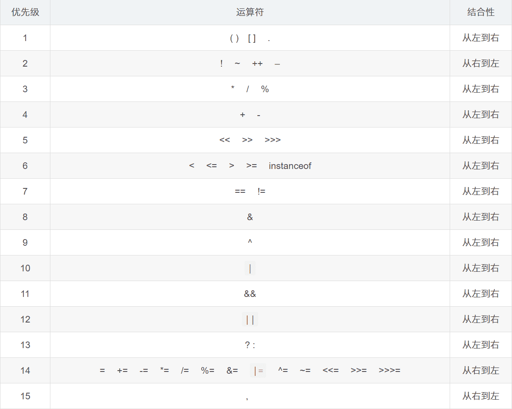

# Java基础知识

> 本文档只含有Java和C/C++不同的知识点

# 1. Java基础知识

## 1.1 JDK和JVM

在Java中，JDK称为Java开发工具包(Java Development Kit)，包含了Java开发需要使用的工具包，前面的版本中JRE和JDK是分开的两个文件夹，从Java9开始，JDK中还包含了JRE(Java Runtime Environment)，包含了Java运行的虚拟机JVM和其他，而，原因是Java9引入模块化运行，可能不是每一次的代码运行都需要完整的JRE，根据需要加载可以提高运行效率

JVM是Java中的运行虚拟机，所有的Java代码程序都会在JVM上运行，从而达到了Java的跨平台性

## 1.2 Java基础代码演示

```java
// 此处class后面的名称和当前文件名保持一致
public class Main {
    public static void main(String[] args) {
        // Java中的输出语句，包括换行
        System.out.println("Hello world!");// Java每条语句都要带分号
    }
}

输出结果：
Hello world!
```

在上面的代码中`public class`中的`public`不可以去除，因为类名与文件名相同，但是如果类名与文件名不同，则不可以写`public`。所以，在Java中，一个.java文件中只有一个`class`是`public class`

如果.java文件中有多个`class`，则编译后将会生成包括`public class`在内对应个数的.class文件，但是在实际开发中，一般一个.class文件中只有一个`class`

并且`main`函数必须在`public class`中

可以使用下面的命令对当前的文件进行编译和运行

```java
编译：javac Main.java -> 将.java文件编译生成.class文件
运行：java Main -> 运行.class文件
// java后的class文件不需要带后缀名
```

## 1.3 Java中的注释

在Java中，有下面三种注释方式：

1. `//`：单行注释
2. `/* */`：多行注释
3. `/** */`：文档(API文档)注释，可以在当前.java文件位置打开控制台使用`javadoc -d 文件夹名 -author -version 需要生成文档的Java文件`

```java
// 这是一个单行注释

/*
 *	这是一个多行注释
 */

/**
 *	这是一个文档注释
 *	可以包含下面的内容
 *	@author 代码的作者
 *	@version 当前代码的版本
 *	
**/
```

例如下面的Java程序生成文档注释：

```java
/**
 * ClassName: test
 * Package: PACKAGE_NAME
 * Description:
 * Hello World测试IDEA
 *
 * @author 憨八嘎
 * @version v1.0
 */
public class Main {
    /**
     * main函数
     */
    public static void main(String[] args) {
        System.out.println("Hello world!");
    }
}
```

使用`javadoc`命令如下：

```java
javadoc -d api -author -version -encoding UTF-8 Main.java
// 如果编译器的编码格式为UTF-8，需要使用-encoding UTF-8指定生成编码格式，否则默认为GBK从而编译失败或者出现乱码
```

生成文档如下：


需要查看内容可以打开`api`文件夹中的`index.html`文件

## 1.4 Java中的关键字

Java目前一共有53个关键字，48个关键字+3个特殊直接量+2个保留字

```java
48个关键字：
abstract assert boolean break byte case catch char class continue default do double else enum extends final finally float for if implements import int interface instanceof long native new package private protected public return short static strictfp super switch synchronized this throw throws transient try void volatile while

3个特殊直接量：
true false null

2个保留字：
goto const
```

## 1.5 Java中的`println`和`print`的区别

相同点:都是输出语句

不同点:

`println`:输出之后自带换行

`print`:输出之后不带换行   

```java
public class Main{
	public static void main(String[] args){
        // println
        System.out.println("床前明月光");
        System.out.println("疑是地上霜");
        System.out.println("举头望明月");
        System.out.println("低头思故乡");
        // print
        System.out.print("床前明月光");
        System.out.print("疑是地上霜");
        System.out.print("举头望明月");
        System.out.print("低头思故乡");
	}
}

输出结果：
床前明月光
疑是地上霜
举头望明月
低头思故乡
床前明月光疑是地上霜举头望明月低头思故乡
```

# 2. Java中的数据类型

## 2.1 常量

在Java中，有以下常量（也称字面量）：

1. 整型常量
2. 浮点型常量
3. 字符型常量
4. 字符串常量
5. 布尔常量
6. `null`

## 2.2 标识符

Java中的规定：

1. 标识符可以包含英文字母,数字,`$`和`_`
2. 标识符不能以数字开头
3. 标识符不能是关键字

建议命名风格：

1. 给类取名字:遵循大驼峰式 -> 每个单词首字母大写
2. 给方法和变量取名字:遵循小驼峰式 -> 从第二个单词开始往后首字母大写

## 2.3 变量

在Java中，有下面的变量类型

| 数据类型     | 关键字         | 内存占用 | 取值范围                                                     |
| :----------- | :------------- | :------- | :----------------------------------------------------------- |
| 字节型       | byte           | 1个字节  | -128 至 127                                                  |
| 短整型       | short          | 2个字节  | -32768 至 32767                                              |
| 整型         | int（默认）    | 4个字节  | $-2^{31}$ 至 $2^{31}-1$ $\pm$21亿 -2147483648——2147483647    |
| 长整型       | long           | 8个字节  | $-2^{63}$ 至 $2^{63}-1$ -9223372036854775808到9223372036854775807 |
| 单精度浮点数 | float          | 4个字节  | 1.4013E-45 至 3.4028E+38                                     |
| 双精度浮点数 | double（默认） | 8个字节  | 4.9E-324 至 1.7977E+308                                      |
| 字符型       | char           | 2个字节  | 0 至 $2^{16}-1$                                              |
| 布尔类型     | boolean        | 1个字节  | true，false                                                  |

Java中按照下面的语法定义变量

```java
变量类型 变量名 = 值;
```

在Java中，如果变量不初始化就无法使用

```java
public class Main {
    public static void main(String[] args) {
        int num;
        System.out.println(num);// 无法使用未初始化的变量
    }
}
```

## 2.4 类型转换

Java中遇到下面两个情况就会出现类型转换

1. 赋值符号左右两边类型不一致
2. 不同的类型做数据运算

Java中存在两种形式的类型转换

1. 自动类型转换
2. 强制类型转换

### 2.5 自动类型转换

1. 在对变量初始化时，当赋值符号左侧的类型比右侧的类型范围大时会出现自动类型转换

    ```java
    public class Main {
        public static void main(String[] args) {
            long num = 4; // 整型常量默认是int，所以赋值给long类型的num时就会出现自动类型转换，从int转换到long
            System.out.println(num);
        }
    }
    
    输出结果：
    4
    ```

2. 当范围小的类型与范围大的类型做运算时会出现类型转换

    ```java
    public class Main {
        public static void main(String[] args) {
            int num1 = 1;
            double num2 = 2.1;
            System.out.println(num1 + num2);// num1的类型为int，num2的类型为double，所以做运算时，int范围小，自动转换为double类型进行计算
        }
    }
    
    输出结果：
    3.1
    ```

    在Java中，自动转换按照下面的顺序：

    `byte`, `char`, `short` -> `int` -> `long` -> `float` -> `double`

    > 在C/C++中，boolean类型是整型，可以用0和1代替，但是在Java，boolean是个单独的类型，无法参与运算

### 2.6 强制类型转换

当出现大范围类型向小范围类型转换时，无法进行自动类型转换，如果仍需要操作，则需要用到强制类型转换，语法同C/C++语言

```java
public class Main {
    public static void main(String[] args) {
        float num = 1.2;// 因为浮点数默认类型为double，并且double的取值范围比float大，此时无法进行自动类型转换
        System.out.println(num);
    }
}
```

对于`long`类型的变量和`float`类型的变量来说，如果需要给常量值，需要在常量后面加上`L`和`F`

```java
public class Main {
    public static void main(String[] args) {
        float num = 1.2F;// 指定小数为float类型
        // 或者使用强制类型转换
        // float num = (float)1.2;
        System.out.println(num);
    }
}

输出结果：
1.2
```

> 特殊地，当`int`类型的常量值赋值给`byte`，`char`，`short`类型时，如果常量值没有超过三种类型的范围就不需要强制类型转换，此时JVM会自动进行转换
>
> ```java
> public class Main {
>  	public static void main(String[] args) {
>      		char num1 = 65;// 65在char类型的范围内，不需要强制类型转换
>      		byte num2 = 2;// 2在byte类型的范围内，不需要强制类型转换
>      		short num3 = 3;// 3在short类型的范围内，不需要强制类型转换
>      		// byte num4 = 200;// 超出byte范围，需要强制类型转换
>      		System.out.println((int)num1);
>      		System.out.println(num2);
>     		System.out.println(num3);
>  	}
> }
> 输出结果：
> 65
> 2
> 3
> ```
>
> 

强制类型转换一般会存在精度丢失问题，所以一般情况下不建议使用

# 3. 运算符

> 其余运算符与C/C++相同

## 3.1 自增运算符

规则与C/C++相同，但是注意下面的问题

### 3.1.1 赋值给自己后自增（C/C++也有同样的结果）

```java
public class test_assignment {
    public static void main(String[] args) {
        int num = 10;
        num = num++;
        System.out.println("num = " + num);
    }
}

输出结果:
10
```

上面的代码直观反应是`num`将10先给`num`，再自增为11，所以输出为11，但是实际上是`num`得到的是10，查看Java反编译的代码如下

```java
//
// Source code recreated from a .class file by IntelliJ IDEA
// (powered by FernFlower decompiler)
//

public class test_assignment {
    public test_assignment() {
    }

    public static void main(String[] args) {
        int num = 10;
        int num1 = num++;
        System.out.println("num = " + num1);
    }
}
```

实际上是创建了一个临时变量`num1`接受改变之前的`num`，再打印临时变量`num1`

### 3.1.2 小范围整型自增和显式加1

```java
public class test_assignment {
    public static void main(String[] args) {
        byte num = 10;
        num = num + 1; // 对于byte小范围整型来说，因为编译器无法确定执行运算后是否会超出byte的范围，所以本语句无法执行
        System.out.println("num = " + num);
    }
}
```

但是，如果写成`num += 1`则可以正常运行

```java
public class test_assignment {
    public static void main(String[] args) {
        byte num = 10;
//        num = num + 1;
        num += 1;
        System.out.println("num = " + num);
    }
}

输出结果：
num = 11
```

对于其余两个运算符`char`和`short`，`float`和`double`来说也是如此

> 注意浮点数类型和整型相加不存在该问题

```java
public class test_assignment {
    public static void main(String[] args) {
        float num1 = 10.0f;
        num1 = num1 + 1;// 正常运行
        System.out.println("num1 = " + num1);
    }
}

输出结果：
11.0
```

其余情况类比推理即可

## 3.2 无符号右移

在Java中，除了提供了C/C++中存在的算术右移，还提供了无符号右移，使用`>>>`表示

例如

```java
public class Main {
    public static void main(String[] args) {
        System.out.println(8 >>> 2);
        System.out.println(-8 >>> 2);
        System.out.println(8 >>> 32); // 特殊地，在Java中有特殊处理，移动32位次的整数倍为原数，而不是0，类似于模32运算
    }
}

输出结果：
2
1073741822
8
```

## 3.3 运算符优先级



# 4. Java中的包

在Java中，可以在模块中创建不同的包，即文件夹，一般一个包代表一种功能或者其他，该包中可以创建多个类

创建规则：

域名反写，例如www.baidu.com写为com.baidu（去掉www.）

例如www.epsda.com创建一个包为scanner，写为com.espda.scanner

对于第一个包来说，com.epsda没有二级目录，但是在文件夹下scanner包在com.epsda下

如果需要创建一个与scanner平级的包，则需要右键com.epsda上一级的文件夹，比如src，同样输入com.epsda后面再输入新的包名，例如创建包if_else，写为com.epsda.if_else，创建完成后com.epsda下就会存在两个平级包并且此时会有二级目录，下次再需要创建一个与前两个包平级时只需要右键com.epsda包即可

# 5. Java中的数据输入

在Java中，使用`Scanner`类创建`Scanner`对象控制输入，使用`Scanner`类前需要引包，使用`import`关键字进行引包操作，语法如下

```java
// package下方
import 包名;
// 类的上方
```

`Scanner`类在`java.Util`包中

使用`Scanner`创建一个对象

```java
Scanner 对象名 = new Scanner(System.in);
```

使用对象名调用方法，一般使用两种

1. 数值型（整型`nextInt()`等）
2. 字符串型(`next()`, `nextLine()`)

> 对于字符串型的输入来说，next()遇到空白字符就会结束读取输入，和scanf()效果类似，而nextLine()则是遇到换行才结束，所以next()和nextLine()一般不会一起使用
>
> ```java
> package com.epsda.scanner;
> 
> // 引包
> import java.util.Scanner;
> 
> /**
>  * ClassName: com.epsda.scanner.Test_scanner
>  * Package: PACKAGE_NAME
>  * Description:
>  *
>  * @author 憨八嘎
>  * @version v1.0
>  */
> public class Test_scanner {
>     public static void main(String[] args) {
>         // 创建scanner对象
>         Scanner sc = new Scanner(System.in);
> 
>         // 输入整数
>         int num = sc.nextInt();
>         System.out.println("num = " + num);
>         // 输入字符串，next()方法
>         String name = sc.next();
>         System.out.println("name = " + name);
>         // 输入字符串，nextLine()方法
>         name = sc.nextLine();
>         System.out.println("name = " + name);
>     }
> }
> 
> 输出结果：
> // 2
> num = 2
> // 这是一个带空格 的字符串
> name = 这是一个带空格
> name =  的字符串
> ```
>
> 

如果需要同时使用`next()`和`nextLine()`，则`next()`和`nextLine()`中间可以加一个`nextLine()`处理`next`未读取到的空格，再使用`nextLine()`读取新的输入

```java
package com.epsda.scanner;

// 引包
import java.util.Scanner;

/**
 * ClassName: com.epsda.scanner.Test_scanner
 * Package: PACKAGE_NAME
 * Description:
 *
 * @author 憨八嘎
 * @version v1.0
 */
public class Test_scanner {
    public static void main(String[] args) {
        // 创建scanner对象
        Scanner sc = new Scanner(System.in);

        // 输入整数
        int num = sc.nextInt();
        System.out.println("num = " + num);
        // 输入字符串，next()方法
        // 输入“这是一个带空格 的字符串”
        String name = sc.next();// 只取到“这是一个带空格”
        System.out.println("name = " + name);
        // 使用nextLine()处理next()剩余为读取的部分
        String rest = sc.nextLine();
        // 输入字符串，nextLine()方法
        name = sc.nextLine();// 直到遇到\n结束
        System.out.println("name = " + name);
    }
}

输入和输出结果：
// 2
num = 2
// 这是一个带空格 的字符串
name = 这是一个带空格
// 这是一个带空格的字符串
name = 这是一个带空格的字符串 
```

# 6. `Random`类

在Java中，如果想要使用系统生成的伪随机数，可以使用Java的伪随机类Random生成伪随机数，同Scanner类，Random类也再java.util包中，所以使用Random类也需要先引包

```java
import java.util.Random;
```

引包后，通过Random类创建Random对象

```java
Random r = new Random();
```

对于Random类来说，有下面的方法（其他类型的方法类似）：

1. `nextInt()`：生成整型范围内的任意一个数值
2. `nextInt(int bound)`：生成`0-bound-1`中的任意一个数值

```java
package com.epsda.random;

import java.util.Random;

/**
 * ClassName: Test_random
 * Package: com.epsda.random
 * Description:
 *
 * @author 憨八嘎
 * @version v1.0
 */
public class Test_random {
    public static void main(String[] args) {
        Random r = new Random();
        System.out.println("r = " + r);
        Random rb = new Random();
        int data = rb.nextInt(100);// 生成0-99中的一个数值
        System.out.println("data = " + data);
        int i = rb.nextInt(900) + 100;//生成100-999中的一个数值
        System.out.println("i = " + i);
    }
}

输出结果：
data = 518372707
data1 = 76
data2 = 648
```

# 7. 分支和循环语句

> 因为Java中的分支和循环语句与C/C++语法相同，此处不再赘述
>
> 在IDEA中，快速生成`for`循环可以使用`变量名.fori`

需要注意的是，**Java中没有goto语句**，但是有标签，但是只能配合循环控制语句使用

```java
标签名:
while(判断表达式){
	continue 标签名;
	// break 标签名;
}
```

对于其他两个循环也是如此

## 7.1 猜数字小游戏（结合`Random`类）

```java
package com.epsda.guessGame;

import java.util.Random;
import java.util.Scanner;

/**
 * ClassName: guessGame
 * Package: com.epsda.guessGame
 * Description:
 *
 * @author 憨八嘎
 * @version v1.0
 */

public class GuessGame {
    public static void main(String[] args) {
        // 生成伪随机数
        Random r = new Random();
        int ans = r.nextInt(100) + 1;// 猜1-100中间的数值
        // 读取用户的输入
        Scanner s = new Scanner(System.in);
        int input = s.nextInt();
        // 死循环读取直到用户猜对
        while (true) {
            if (input == ans) {
                System.out.println("猜对了");
                break;
            } else if (input < ans) {
                System.out.println("猜小了，重新猜");
            } else {
                System.out.println("猜大了，重新猜");
            }
            input = s.nextInt();
        }
    }
}
```

