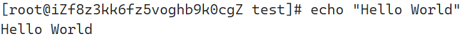
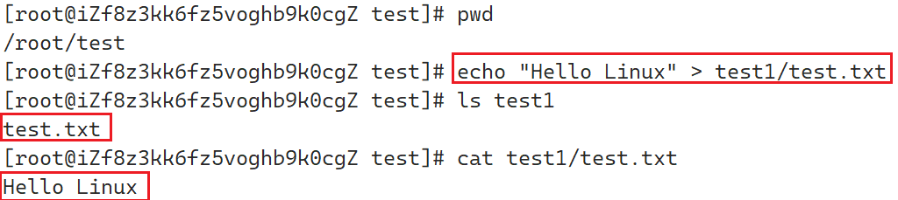

# Linux常用选项和指令

## Linux指令使用注意

1. 在输入Linux指令时，需要注意指令和选项/地址/内容时需要有空格间隔
2. 输入Linux指令时，一定要注意指令的大小写，大部分的指令都是小写

## 用户创建与删除

用户创建命令：`adduser 用户名`

用户密码创建命令：`passwd 用户名`

用户删除命令：`userdel -r 用户名`

实例：创建一个`lisi`用户，为其设置密码，再删除该用户

创建用户并设置密码


## `ls`指令

### `ls`指令介绍

在Linux中，可以使用`ls`指令查看当前路径下的文件（默认只查看部分可见文件并且只显示文件类型）

- 特殊用法（结合通配符`*`）：

`ls 固定内容*`：该命令会显示所有可见的匹配固定内容的文件

!!! note
    如果当前目录中只有一个目录满足与固定内容相同时，则上面的指令只会显示该目录内的匹配内容，如果该目录为空，那么将不显示任何内容

示例：

当前目录下存在一个`file`目录，其中有一个`file.c`的文件，还存在一个`test.c`文件以及一个test目录，`test`目录中有一个`test.c`文件

- 当当前目录中只有一个匹配的目录时，则此时只显示其中的文件


- 当当前目录中有一个匹配文件和一个匹配目录，匹配目录中存在一个匹配文件时，显示两个匹配文件，并且匹配目录的文件将以`目录名: 匹配文件`形式显示


### `ls`常见选项

1. `-l`：`ls -l`可以显示当前路径下的所有可见文件及文件对应的详细信息
2. `-a`：`ls -a`可以显示当前路径下的所有文件（包括可见文件和隐藏文件），但是没有文件的详细信息

!!! note
    在Linux中，以`.`开头的文件均为隐藏文件

3. `-d`：`ls -d`(+指定目录或文件)可以显示当前路径下某一个指定文件的

示例：

假设当前路径下有一个`test.c`文件，以及一个隐藏目录`.file`

- `ls -l`


!!! note
    在Linux中，文件属性开始的字符，如上图中的`-rw-r--r--`如果为第一个字符为`-`代表是普通文件，`d`开头的文件为目录

- `ls -a`


!!! note
    注意，当前在root目录下，所以存在其他文件夹

- `ls -d`(+指定目录或文件)


### `ls`选项组合使用

在Linux中，可以将多个选项放在一起使用，每一个选项显示其效果

示例：`ls -al`


## `pwd`指令

在Linux中，使用`pwd`指令可以显示用户当前所在的目录位置

示例：

当前在root目录下，使用`pwd`指令


## Linux文件系统结构

### 多叉树结构文件系统介绍

在Linux系统中，文件系统结构呈现一种多叉树的结构，由磁盘上的文件和目录组成，每一个节点都是目录或者文件，如下图所示：


!!! note
    在Linux中，路径中的第一个`/`为根目录

对于文件系统结构来说，使用多叉树的结构作为其结构基础的原因是每一个节点都对应一个父亲节点，当当从某一个父亲节点（目录）找某一个孩子节点（目录或文件）的路径是唯一的，而当某一个孩子节点想返回到某一个父亲节点时的路径也是唯一的，即逆向返回，正向查找的路径均唯一

所以，文件系统结构一般会考虑采用多叉树的结构配合路径来定位（查找）文件

### 多叉树结构文件系统的特点

1. 对于一个节点来说，如果该节点作为父亲节点，那么该节点对应的一定是一个目录，例如上图中的`usr`、`dev`、`home`、`etc`、`bin`、`sta`、`/`
2. 对于空目录和文件来说，其一定是叶子结点，例如上图中的`bin`、`lib`、`test.c`、`passwd`

## `cd`指令

### 绝对路径

所谓绝对路径，即不论何时路径都是绝对唯一的，所以绝对路径的特点就是从根目录开始，直到目标文件，绝对路径一般应用于编写配置文件时使用

例如：`/root/test/test.c`

!!! note
    在Linux中，除了第一个`/`以外，其余`/`均为路径分隔符，一般`/`左侧时目录，右侧时文件或者目录

### 相对路径

所谓相对路径，即每一次相对于某一个路径开始查找，因为参考对象不同，所以相对路径一般都不相同，相对路径一般使用命令行操作时使用

例如：

当前所在位置为`/root/test`

从当前位置出发找root目录下的`file`目录下的`file.c`为`/root/test/../../file/file.c`

!!! note

    在Linux中，一般`.`或`./`代表当前当前路径，而`..`或`../`代表当前路径的上一路径

    在Linux文件系统中，每一个目录都会有`.`与`..`，如下图所示：

    

    这两个符号分别代表指向当前目录和指向上一个目录，所以使用`cd .`或`cd ./`代表前往当前目录，而`cd ..`或`cd ../`代表前往当前目录的上一级目录。

    但是注意，如果用户当前处于根目录的位置，则`.`和`..`均代表当前目录（即根目录），即根目录没有上一级目录

    `.`限定当前路径的使用场景：

    一般可以使用`./可执行程序名` 运行可执行程序，例如`code`为可执行程序，可以使用`./code`执行程序`code`

### `cd`指令介绍

在Linux中，使用`cd`指令可以改变当前所在目录

示例：

当前所在目录为`/root/test`，使用`cd`指令按照相对路径的方式进入`/root/file`


### 家户目录

家户目录也称家目录，在Linux中即为用户目录所在的目录

根据用户权限的不同，在Linux中分为两种用户

1. 普通用户：对于普通用户来说，其家户目录为`/home/用户名`
2. root（超级管理员）用户：对于root用户来说，其家户目录为`/root`

!!! note

    在Linux中，一个用户（包括root用户）在每一次刚登陆进入系统时所在的目录即为家户目录

    

当用户需要不在家目录想快速返回家户目录时，则可以使用`cd ~`指令快速返回家户目录

示例：

当前处于`/root/test`下，需要快速返回家户目录


### 最近访问的目录

在Linux中，支持快速返回上一次访问的目录，可以使用`cd -`快速回到上一次所在的目录

示例：

上一次所在目录为`/root/test`，而当前所在目录为`/root`，使用`cd -`快速回到`/root/test`目录下


!!! note
    系统会提示上一次所在的目录并跳转到上一次的目录

## `touch`指令

在Linux中，可以使用`touch+文件名`创建一个文件，如果`touch`后面有多个文件时，则可以一次创建多个文件，例如`touch test.c test.txt`表示在当前目录创建一个名为`test.c`的文件和`test.txt`的文件

!!! note
    注意不可以使用`touch`创建目录

示例：

当前所处位置为`/root/test`，在当前位置创建一个名为`test.c`的文件


- 如果不想跳转至某一个目录下再创建文件，可以使用`touch+路径+文件名`

示例：

当前所在位置为`/root/test`，在当前位置创建一个`file.c`的文件


## `mkdir`指令

### `mkdir`指令介绍

在Linux中，可以使用`mkdir+目录名`创建一个目录，与`touch`指令同理，可以创建多个目录

!!! note
    注意，在Linux中，同一个目录下不可以创建两个同名的目录

示例：

在当前目录`/root/test`下，创建一个名为`test1`的目录


!!! note

    此时不可以再创建一个名为`test1`的目录

    

    但是可以再`test1`中再创建一个`test1`的目录

    

- 与`touch`一样，如果不想跳转至某一个目录下再创建目录，可以使用`mkdir+路径+目录名`，也称递归创建目录

### `mkdir`常见选项

`-p`：当需要一次实现创建一个目录后，再在该目录中创建一个目录，可以使用`-p`选项递归创建目录

示例：

当前在`/root/test`目录下，使用一次操作创建一个名为`test1`目录，接着在`test1`中创建一个名为`test2`目录


!!! note

    注意，图中的`tree`指令一般Linux系统默认没有该指令

    对于CentOS系统，可以使用`sudo yum install -y tree`指令安装`tree`指令

## `rmdir`指令

在Linux中可以使用`rmdir+目录名`指令删除目录

!!! note
    注意，当需要删除的目录中有文件或者目录时，此时不可以删除该目录

示例：

当前目录`/root/test/test1`中有一个`test2`目录，使用`rmdir`指令删除`test2`目录


`mkdir -p`可以递归创建文件夹，`rmdir -p`也可以递归删除文件夹

示例：

在当前目录`/root`下有一个`test`，`test`中只有一个`test1`文件夹，`test1`文件夹为空，一次操作删除`test`目录和`test1`目录


!!! note

    上面的过程中，如果`test`或`test1`其中任何一个目录不为空（存在其他目录或者文件）时，将不可以执行删除

    

为了解决上面的问题，常常使用`rm`指令代替`rmdir`指令

## `rm`指令

### `rm`指令介绍

在Linux中，可以使用`rm`指令删除目录或者文件，当后方有多个文件时，可以一次删除多个文件，**注意如果删除过程中如果对其中一个文件选择`n`并不会终止其他文件的删除（有询问的情况下）**

示例：

当前目录`/root/test`下有一个`test.c`文件，使用`rm`指令删除该文件


!!! note
    对于root用户删除文件，系统会询问用户是否需要执行删除，`y`/`yes`代表是，`n`/`no`代表否，不区分大小写

### `rm`指令常见选项

1. `-r`：递归删除目录

    !!! note

        不同于`rmdir -p`，当目录有其他文件或者目录时依旧可以执行删除

    
2. `-f`：强制删除

    对于特殊文件如果无法直接删除，可以使用强制删除

!!! note

    切忌在root权限下使用`rm -rf /*`

    `rm -rf/`：尝试删除根目录下的所有文件和目录，但是会删除失败

    `rm-rf /*`：删除根目录以下所有的文件，但是会保留根目录本身

使用`rm -rf *`可以删除当前目录下所有的文件和目录

## `man`指令

在Linux中，可以使用`man`指令查看帮助手册，当没有指定章节时，`man`指令默认从第一章节开始查找

!!! note
    部分Linux默认没有`man`指令，CentOS可以使用`sudo yum install -y man-pages `

`man`指令一般分为九类：


## `cp`指令

在Linux中，可以使用`cp`指令拷贝文件或者目录，同`touch`可以拷贝多个文件到最后的`dst`一个目录

在`cp src[文件/目录] dst[文件/目录]`中

1. 如果`dst`是目录，则`cp`即为将文件或者目录拷贝到`dst`目录
2. 如果`dst`为文件，此时`cp`命令表示新建`dst`名的文件并拷贝`src`的内容（**默认是拷贝到当前目录**）

`cp`指令可以搭配`-r`选项，将目录及其内容移动到指定位置，如果不是目录，则与移动普通文件没有区别

示例：

拷贝文件

当前处于`/root/test`目录，`test1`目录中有一个`test.c`文件，将`test1`中的`test.c`使用`cp`指令拷贝到`test`目录下


新建拷贝文件

当前处于`/root/test`目录，`test1`目录中有一个`test.c`文件，将`test1`中的`test.c`使用`cp`指令在`test1`目录下拷贝一个文件名为`test1.c`的文件


!!! note

    注意在拷贝文件到指定路径下时，路径一定要写全，否则会出现目标目录在当前目录下被创建了一份，如下图所示：

    

    将`test.txt`拷贝到`test3`目录下，如果直接执行`cp test.txt test3`指令，则会出现在`test1`当前目录重新创建一个`test3`目录，如下图所示：

    

    出现上面这种情况的原因是`test1`目录下没有`test3`目录，系统找不到`test3`目录所以`cp`指令创建了一个`test3`目录

## `mv`指令

在Linux中，可以使用`mv`指令移动文件或者为文件改名，同`cp`指令一样可以移动多个文件到最后的一个dst目录下

在`mv 选项 src[文件/目录] dst[文件/目录]`中

1. 如果`dst`是一个目录，则表示移动文件到`dst`目录
2. 如果`dst`是一个文件名，则表示为`src`重命名

示例：

移动文件

当前处于/root/test目录下，test1目录下有一个test1.c文件，使用mv指令将test1.c文件移动到test目录下


文件重命名

当前处于`/root/test`目录下，`test`目录下有一个`test1.c`文件，使用`mv`指令将`test1.c`文件更名为`mytest.c`


## `cat`指令

在Linux中，可以使用`cat+文件名`查看当前文件中的内容

示例：

在`/root/test`目录下，有一个`test.txt`文件，其中有`Hello Linux`内容，使用`cat`指令将其打印显示到控制台


在Linux中，cat指令是正向打印文件内容，对应的，tac指令是逆向打印文件内容（注意不是内容逆置）

示例：

在`/root/test`目录下，有一个`test.txt`文件，其中有内容，使用`tac`指令将其打印显示到控制台


对比`cat`打印的内容


cat指令也存在选项，下面是常见的选项：

1. `-b`：对非空行编号
2. `-n`：对输出的所有行都编号
3. `-s`：所有空行都只输出一行

例如下面的结果：


当`cat`指令后面不接文本文件名时表示回显输入的内容，按下 ++ctrl+d++（++d++按两下）或者 ++ctrl+c++ 结束输入

!!! note
    ++Ctrl+d++ 用于退出当前用户居多

## `echo`指令

在Linux中，使用`echo+字符串`可以在控制台打印出字符串内容



### 输出重定向

所谓在控制台打印字符串实际上在Linux看来意味着向显示器文件写入数据

在Linux中，一切内容皆文件，所以打印也相当于写数据进文件，同样可以使用`echo`向普通文本文件中写内容，此时需要改变输出流流向，可以使用`>`符号改变输入流流向，这一过程称为输出流重定向

示例：

当前在目录`/root/test`下，使用`echo`指令写`"Hello Linux"`到文件`test.txt`中，并且满足`test.txt`文件的位置在`test1`文件夹下

方式1：一步到位



方式2：结合管道`|`


如果不使用`echo`，直接使用`>+文件名`，则此时相当于创建一个新文件，因为在前面的演示中`test.txt`文件并不存在，而是写入数据的时候创建的，所以不写入内容时就相当于只创建一个新文件。

示例：

当前在目录`/root/test`下，使用`>`在当前目录下创建一个名为`test.c`的新文件


如果文件本身存在内容，直接使用`>+已存在的文件名`会清空该文件的内容


所以，如果向一个有内容的文件使用输出重定向进行写入，会清空当前文件内容再写数据


### 追加重定向

使用输出重定向写入数据时会清空原始文件的内容，为了不清空在原有内容之后插入可以使用追加重定向，使用`>>`表示，使用方法与输出重定向相同


使用`echo`配合追加重定向会在原来内容后的下一行进行写入，**不换行追加可以使用printf**

!!! note
    因为`echo`本身会给内容自动加一个换行符，所以上一次使用的是`echo`那么下一次使用`printf`依旧会在下一行写入，再使用`printf`就不会换行


### 输入重定向

对应输出重定向，还有输入重定向，使用`<`表示，使用`cat < + 文件名`可以将文件内容打印到控制台


## `more`指令

在Linux中，可以使用`more+文件名`指令查看文件内容

`more`指令会先从第一行打印满屏的文件内容，再通过用户点`n`进行一行一行向下浏览，输入`q`退出浏览

但是more指令不可以向上浏览，所以不经常使用

## `less`指令

对应有`more`指令就有`less`指令，`less`指令也是查看文件内容

`less`指令与`more`指令功能相同，但是支持上下翻动

选项：

1. `-i`：忽略搜索时的大小写 
2. `-N`：显示每行的行号 
3. `/+关键字`：向下搜索关键字的功能 
4. `?+关键字`：向上搜索关键字的功能 
5. `n`：重复前一个搜索（与/或?有关） 
6. `N`：反向重复前一个搜索（与/或?有关） 
7. `q`：退出浏览

## `head`指令

在Linux中，可以使用`head`指令取出文件的内容，默认取出前十行内容，也可以通过指定行数`-行数`取出内容

## `tail`指令

在Linux中，可以使用`tail`指令取出文件的内容，默认取出后十行内容，也可以通过指定行数`-行数`取出内容

### 管道

管道可以使用`|`表示，先执行管道前面的指令内容，执行完毕后将执行结果放置于管道，管道后方的指令从管道执行结果开始再执行

示例：

当前在`/root/test`目录下，使用管道在当前目录下创建一个`test.c`文件后将其移动到`test1`目录下


## 时间相关的指令

### `date`指令显示和修改时间

在Linux中，使用`date`指令可以查看当前服务器的时间（云服务器是服务器时间，本地就是本地时间）

也可以指定日期的显示格式，使用`date +指定格式`（此处`+`不能掉）：

1. `%H`：小时(00..23) 
2. `%M`：分钟(00..59) 
3. `%S`：秒(00..61) 
4. `%X`：相当于 `%H:%M:%S` 
5. `%d`：日 (01..31) 
6. `%m`：月份 (01..12)  
7. `%Y`：完整年份 (0000..9999) 
8. `%F`：相当于 `%Y-%m-%d`

示例：

使用`date`指令以`年/月/日 时:分:秒`的格式显示时间


!!! note
    注意，空格需要使用`\+空格`进行转义

也可以使用`-s + 时间字符串`设定时间

```shell
date -s //设置当前时间，只有root权限才能设置，其他只能查看
date -s 20080523 //设置成20080523，这样会把具体时间设置成空00:00:00
date -s 01:01:01 //设置具体时间，不会对日期做更改
date -s "01:01:01 2008-05-23" //这样可以设置全部时间
date -s "01:01:01 20080523" //这样可以设置全部时间
date -s "2008-05-23 01:01:01" //这样可以设置全部时间
date -s "20080523 01:01:01" //这样可以设置全部时间
```

### 时间戳

时间戳是格林威治时间1970年01月01日00时00分00秒（北京时间1970年01月01日08时00分00秒）起至现在的总秒数

在Linux下，可以进行时间和时间戳相互转换

1. 时间->时间戳：`date +%s`
2. 时间戳->时间：`date (指定格式) -d@时间戳`

示例：

显示当前系统时间戳


将时间戳转换为按照`年/月/日-时:分:秒`的格式时间


## `cal`指令

在Linux中，可以使用cal指令查看日历，直接调用cal日历将显示当前月份，也可以使用下面的选项查看日历：

1. `-3`：显示系统前一个月，当前月，下一个月的月历 ，**选项数字不可以更为其他数字**
2. `-j`：显示在当年中的第几天（一年日期按天算，从1月1号算起，默认显示当前月在一年中的天数） 
3. `-y`（也可以直接写年份）：显示当前年份的日历

## `find`指令

使用find指令可以在指定路径下查找文件，可以使用`-name + 文件名`查找指定文件（文件名后可以指定选项`-o`分开多个文件）

示例：

当前在`/root/test`目录下，test1目录下有一个`test.c`的文件，使用`find`指令查找该文件位置


## `which`指令

在Linux中，可以使用`which+指令`查看指令所在位置

示例：

使用`which`指令查找指令`mkdir`所在位置


### 指令的本质

在Linux下，指令本质都是一种文件，这种文件被称为可执行程序，因为其都在bin目录下，所以可以直接使用，但是如果是自己写的可执行程序（例如C语言编译后的可执行程序）需要指定运行路径

示例：

在`/root/test`目录下有一个`test.c`文件，其编译链接后生成一个`run`的可执行程序，运行该程序


使用`mv`指令将`run`可执行程序移动到指令所在目录下，再运行该程序


因为`run`此时放在了指令所在目录，所以此时需要使用`which`才能查找到位置，此时再运行`run`时不再需要限定可执行程序的路径了

### `alias`指令

在Linux中，可以使用alias查看当前系统中所有取别名的指令，也可以为指令取别名，例如ls指令是ls --color=auto的别名


示例：

将刚才的`run`程序取别名为`myrun`，再运行程序


不需要该别名时可以使用`unalias`取消别名


!!! note
    取消别名不会导致指令删除，并且我们自己指定的别名在当前用户注销后会自动清除

## `grep`指令

使用`grep`指令可以在`Linux`下在指定文件中查找指定字符串，默认不忽略大小写

示例：

在`/root/test`目录下，有一个`text.txt`文件，文件中有内容，使用`grep`指令查询文件中的`abc`


也可以使用下面的选项：

1. `-i`：忽略大小写的不同，所以大小写视为相同 
2. `-n`：顺便输出查找内容相对文件其他内容的行号 
3. `-v`：反向选择，即显示出没有"字符串"内容的行

示例：

重复上面的示例，这次忽略大小写并且打印查找位置所在文件的行号


## `zip`指令和`unzip`指令

在Linux中，可以使用`zip`指令为文件或者目录进行压缩，使用`-r`选项将待压缩的目录中的内容同目录一起压缩，`unzip`即为解压文件

!!! note
    压缩目录时，如果不带选项只写目录只会压缩一个空目录，该目录中的内容不会被压缩

    如果没有`unzip`指令，可以使用`sudo yum install -y unzip`指令安装`unzip`指令

示例：

在`/root/test`目录下有一个`test1`目录和`test2`目录，`test1`目录中有一个`test.c`文件，将`test1`目录及其文件使用`zip`指令进行压缩，并使用`unzip`指令在`test2`目录下解压


## `tar`指令

在Linux下，除了可以使用前面两个指令进行文件打包和解包以外，还可以使用`tar`指令

常见的选项为：

1. `-c`: 创建一个压缩文件
2. `-x`：解压缩一个压缩文件
3. `-z`：对文件进行压缩
4. `-v`：压缩的过程中显示正在进行的文件
5. `-f`：指定压缩文件名，需要在该指令后直接跟压缩文件名
6. `-C`：解压到指定目录

常见的指令组合：

1. 压缩文件：`tar -cvzf 压缩文件名.tgz 压缩目录`
2. 解压缩文件：`tar -xvzf 压缩文件名.tgz [-C] 指定路径`

示例：

在`/root/test`目录下有一个`test1`目录和`test2`目录，`test1`目录中有一个`test.c`文件，将`test1`目录及其文件使用`tar`指令进行压缩，并使用`tar`指令在`test2`目录下解压


## `bc`指令

Linux上面的计算器，可以进行简单的数值计算

例如：


## `uname`指令

使用`uname`指令可以看到当前操作系统以及处理器的相关信息

常见选项：

`-a`：显示全部信息

`-r`：只显示系统信息

例如，CentOS7下的信息


