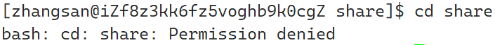

# Linux权限相关

在Linux中，权限包括用户的权限和文件的权限

## Linux中的用户

在Linux中，一共有两种用户

1. 超级用户（root）：在Linux下，root用户拥有最高权限，可以在Linux下做任何事情
2. 普通用户：只能在Linux下做有对应权限的事情

!!! tip
    超级用户的命令提示符为`#`，普通用户的命令提示符为`$`

在Linux中，如果需要切换用户，可以使用`su+用户名`

例如：

当前Linux系统下有一个张三用户，使用`su`命令切换到张三用户

!!! note
    需要注意：

    1. `su`命令执行的位置在哪个目录下，切换完用户之后就在哪个目录下，但是具体有没有操作权限需要看用户有没有对应的文件操作权限，**建议是切换完用户后使用`cd ~`回到对应用户的家户目录**，如果为了安全，可以使用`Ctrl+d`或者`exit`退出用户再切换用户
    2. 尽管用户可能有密码，但是如果是root用户切换到普通用户，则不需要输入普通用户的密码，如果是普通用户切换到root用户，则需要输入root用户的密码。如果需要切换到root用户，则可以使用`su -`或者`su root`
    3. 如果普通用户需要使用root权限执行任务，可以使用`sudo+命令`，但是如果该普通用户没有在提权白名单中，则无法使用`sudo`命令以root权限执行命令,下面是报错：
        

## Linux权限管理

!!!note
    **需要注意的是，root用户不受权限的限制，无论是否有对应的权限都可以执行对应的行为**

### Linux的文件访问者分类

在Linux下，文件访问者一共有三类：

1. 文件/目录的所有者：User(简写为u)
2. 文件/目录所有者所在的组：Group(简写为g)
3. 其他用户：Others(简写为o)

!!! note
    一般情况下，文件所有者会自成一组

### Linux的文件类型和访问权限

以下面的普通文件为例：

### 文件类型

Linux中有下面几种文件类型：

1. `d`：文件夹
2. `-`：普通文件
3. `l`：软链接（类似于Windows的快捷方式）
4. `b`：块设备文件
5. `p`：管道文件
6. `c`：字符设备文件
7. `s`：套接口文件

### 文件权限

1. `r`（位于权限表示的第一个位置`r--`）：文件可读。对于文件：具有读取文件内容的权限
2. `w`（位于权限表示的第二个位置`-w-`）：文件可写。对于文件：具有修改文件内容的权限
3. `x`（位于权限表示的第三个位置`--x`）：文件可执行。对于**可以执行**的文件：具有执行文件的权限
4. `-`：不具有权限（不同位置对应不含有对应的权限）

!!! note
    对于`x`权限来说，如果文件本身不具有可执行的性质，则用户就算有`x`权限，也无法执行文件

所以对于前面的示例文件`test.txt`来说：

1. 看文件类型：因为是`-`，所以文件是一个普通文件
2. 看文件所有者权限：文件所有者是`root`，对应第一类权限`rw-`，代表文件所有者可以**对该文件进行读和写**
3. 看文件所有者所在组的成员权限：文件所有者是`root`，对应第二类权限`r--`，代表文件所有者所在组成员**只能读文件**
4. 看其他人权限：对应第三类权限`r--`，代表其他人**只能读文件**

!!! note
    需要注意的是，Linux中文件权限检索只会从左往右进行一遍，例如，文件所有者如果权限是：`---`，文件所有者所在组的成员权限是：`r--`，尽管文件所有者属于文件所有者所在组，其对文件的权限依旧是`---`

### 文件权限的修改

在Linux中，文件权限可以通过`chmod 用户类别+/-文件权限 文件名`修改

!!! note
    只有文件拥有者和root用户才可以对文件权限进行修改

用户类型：

1. `u`：文件所有者
2. `g`：文件所有者所在组成员
3. `o`：其他人
4. `a`：所有用户

权限修改：

1. `+`：增加权限
2. `-`：减少权限

!!! note
    需要一次修改多个用户权限，可以使用`,`对不同的用户进行分割

例如，修改`test.txt`文件中文件所有者所在组的成员权限为可读可写，修改其他人权限为不可读

在Linux中，也可以使用三位八进制代表三个用户的权限，每一个八进制数字代表一个用户的权限：

!!! note
    表格解读：
    每一个八进制数字对应三位二进制数字，每一位二进制数字对应一种权限，例如`101`表示`r-x`，即可读可执行，转换为八进制数字`5`，即代表`r-x`，其余可类推

例如修改后的`test.txt`文件的权限可以用三位八进制表示为：

1. 文件所有者：6（4(r)+2(w)+0(x)）
2. 文件所有者所在组：6（4(r)+2(w)+0(x)）
3. 其他人：0（0(r)+0(w)+0(x)）

也可以通过八进制数字结合`chmod`指令修改文件权限

例如，修改`test.txt`权限为：文件所有者拥有`rwx`权限，文件所有者所在组成员拥有`rw`权限，其他人拥有x权限

### 文件所有者修改

在Linux中，除了可以通过修改文件权限还可以修改用户的身份，使用`chown 新用户名 待修改的文件/目录`命令

!!! note
    文件所有者只能root修改，其他人（包括文件所有者）无法修改

如果对目录以及目录中的内容一起进行修改，需要加`-R`选项，**如果只修改目录可以不需要`-R`选项**

例如：

在zhangsan家目录下有一个`test`目录和一个`test.txt`文件，修改`test`目录和`test.txt`文件的所有者为root

### 文件所有者所在组修改

在Linux下，还可以修改文件所有者所在组，使用`chgrp 新用户组名 待修改的文件/目录`命令

!!! note
    文件所有者只能root修改，其他人（包括文件所有者）无法修改

如果对目录以及目录中的内容一起进行修改，需要加`-R`选项，如果只修改目录可以不需要`-R`选项

例如：

在zhangsan家目录下有一个`test`目录和一个`test.txt`文件，修改`test`目录和`test.txt`文件的所有者为root

### 目录权限

每一个目录也有对应的权限，在前面介绍过当文件具有`r`、`w`、`x`权限时可以实现的行为，对应的目录有以下行为：

1. `r`对于目录：具有浏览目录中文件的权限（但是可以进入目录）
2. `w`对于目录：具有对修改目录内文件相关信息（创建/修改/删除）的权限
3. `x`对于目录：具有进入目录的权限
4. `-`：不具有指定权限

!!! note
    只有文件拥有者和root用户才可以对文件权限进行修改

修改目录的权限命令与文件命令相同，以下是演示：

在根目录下有`share`目录

**缺少`r`权限**：修改目录其他人权限为`-wx`

用户zhangsan无法在目录外浏览目录中文件

**缺少`w`权限**：修改目录其他人权限为r-x

用户zhangsan不可以对目录中的文件进行操作（以重命名文件为例），需要注意，**文件内容是否可修改取决于文件权限不取决于目录权限**

**缺少`x`权限**：修改目录其他人权限为`rw-`

用户zhangsan不可以进入`share`目录

### 粘滞位

假设张三在`share`目录中新建了一个文件，`share`目录当前权限完全放开（其他人具有`rwx`权限），该文件用于zhangsan和root用户进行内容交流，但是lisi作为其他人没有任何权限，如下图所示

lisi因为心生好奇心，特别想看，但是zhangsan不允许lisi查看，lisi因为生气直接把这个文件直接删掉（删除文件的权限取决于目录权限，不取决于文件权限），导致出现**本人创建的文件被另外普通用户删除**的情况

为了防止出现上面的问题，Linux引入了粘滞位的概念

粘滞位的作用：防止文件被文件非所有者删除，使用`chmod +t 目录名`设置目录为粘滞位

对于设置了粘滞位的目录来说，以下用户可以对目录中的文件进行删除

1. root用户
2. 目录所有者
3. 文件所有者

因为目录是root创建的，由root用户对目录添加粘滞位

此时zhangsan再创建的文件就无法被lisi删除

### 文件掩码

在Linux中，一个普通文件默认权限为0666（-rw-rw-rw-），一个目录默认权限为0777(drwxrwxrwx)，但是实际上在创建后并不是默认权限，例如：

根本原因是因为文件掩码umask，所以一个文件的最终权限=文件默认权限 & ~umask

在Linux下，root用户的默认掩码是0022，普通用户的默认掩码是0002

所以对于上图来说，test目录的最终权限为777 & ~022 = 111111111 & ~(000010010) = 111111111 & 111101101 = 111101101 = 755（drwxr-xr-x），同理可得文件最终权限为644

可以通过`umask 权限值（三位）`修改文件掩码，例如修改文件掩码为001为`umask 001`

