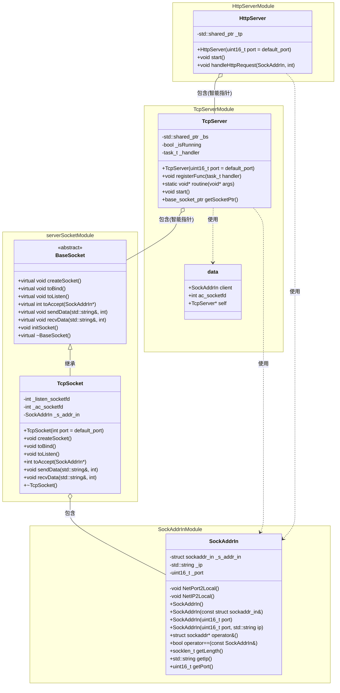
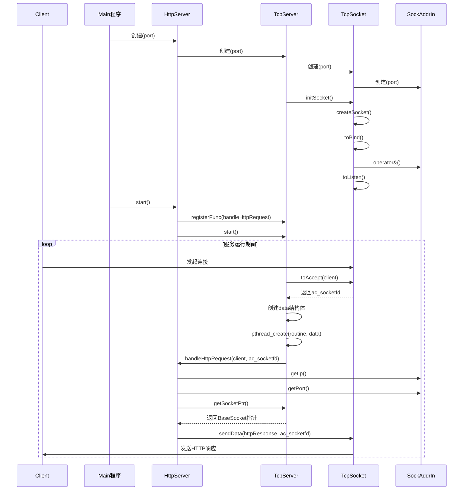

# 介绍HTTP协议基本结构与基本实现HTTPServer

## HTTP协议

前面已经了解了协议的重要性并且已经定义了属于我们自己的协议，但是在网络中，已经有一些成熟的协议，最常用的就是HTTP协议

在互联网世界中，HTTP（HyperText Transfer Protocol，超文本传输协议）是一个至关重要的协议。它定义了客户端（如浏览器）与服务器之间如何通信，以交换或传输超文本（如HTML文档）

HTTP协议是客户端与服务器之间通信的基础。客户端通过HTTP协议向服务器发送请求，服务器收到请求后处理并返回响应。HTTP协议是一个基于TCP协议的**无连接、无状态**的协议，即每次请求都需要建立新的连接，且服务器不会保存客户端的状态信息

因为HTTP是基于TCP的，而TCP是面向字节流的，所以在传递信息时肯定会存在收到的信息不完整的情况，那么根据前面的经验，不论是客户端和服务端都需要做数据完整性检查

## URL与URI

URI（统一资源标识符）是用于标识网络资源的字符串，而URL（统一资源定位符）是URI的一个扩展，它不仅标识资源，还提供了定位该资源的方法

一个标准的URL通常包含以下几个部分：

```
http://www.example.com:80/path/to/resource?param1=value1&param2=value2#fragment
```

1. 协议（`http://`）：指定客户端和服务器之间通信使用的协议
2. 主机名（`www.example.com`）：资源所在服务器的域名或IP地址
3. 端口号（`:80`）：服务器上运行的服务的端口号(HTTP默认为80)
4. 路径（`/path/to/resource`）：资源在服务器上的具体位置
5. 查询参数（`?param1=value1&param2=value2`）: 发送给服务器的额外参数
6. 片段标识符（`#fragment`）: 资源内的特定部分的引用

## 深入URL结构

仔细观察URL的结构，除去协议、主机名和端口号以外，剩余的部分正好就是文件的路径，而在操作系统之下标记一个文件的路径也是使用同样的结构，所以这里就可以得出一个结论：URL的结构实际上就是找到对应的主机，再在该主机上找到指定路径下的文件

两台计算机进行网络通信实际上就是在做IO，而要做IO就需要有对应的数据交换，所以首先就必须要定位到文件的位置，定位文件就是通过路径进行的，所以URL的设计思想对应的就是操作系统定位文件的方式，但是需要注意在URL中，路径开始的第一个`/`并不代表着操作系统的根目录，而是Web应用的根目录

## URL编码

URL编码是一种将非ASCII字符和特殊字符转换为可在URL中安全传输的编码方式。因为URL只能使用ASCII字符集中的一部分字符，所以需要对其他字符进行编码

### 编码原理

URL编码遵循以下规则：

1. **ASCII字母、数字和某些特殊字符**保持不变，即：
   - 字母：`A-Z`, `a-z`
   - 数字：`0-9`
   - 特殊字符：`-`, `_`, `.`, `~`

2. **其他字符**（如空格、中文、特殊符号）按照以下步骤编码：
   - 将字符转换为字节序列（通常使用UTF-8编码）
   - 每个字节用百分号`%`后跟两位十六进制数表示

### 常见编码示例

| 字符 | URL编码        | 说明                                    |
| ---- | -------------- | --------------------------------------- |
| 空格 | `%20` (或 `+`) | 空格可以编码为`%20`或`+`（表单提交时）  |
| `!`  | `%21`          | 感叹号                                  |
| `#`  | `%23`          | 井号（必须编码，因为在URL中有特殊含义） |
| `$`  | `%24`          | 美元符号                                |
| `&`  | `%26`          | 和号（必须编码，因为用于分隔参数）      |
| `+`  | `%2B`          | 加号                                    |
| `/`  | `%2F`          | 正斜杠（在路径中通常不编码）            |
| `:`  | `%3A`          | 冒号（在协议分隔符后通常不编码）        |
| `=`  | `%3D`          | 等号（在查询参数中通常不编码）          |
| `?`  | `%3F`          | 问号（必须编码，因为用于引导查询参数）  |
| `@`  | `%40`          | at符号                                  |
| `中` | `%E4%B8%AD`    | 汉字"中"的UTF-8编码                     |

### 编码示例

原始URL中包含中文和特殊字符：
```
https://example.com/搜索?关键词=中国&category=历史
```

编码后的URL：
```
https://example.com/%E6%90%9C%E7%B4%A2?%E5%85%B3%E9%94%AE%E8%AF%8D=%E4%B8%AD%E5%9B%BD&category=%E5%8E%86%E5%8F%B2
```

### URL编码的应用场景

1. **查询参数传递**：确保包含特殊字符的参数能正确传递
2. **表单提交**：当使用GET方法提交表单时，表单数据会编码到URL中
3. **国际化URL**：包含非英语字符的URL需要编码
4. **防止字符注入攻击**：编码可以防止某些特殊字符被解释为代码

### 注意事项

- 不同的字符集可能产生不同的编码结果，现代Web应用通常使用UTF-8
- 某些旧系统可能使用非标准编码（如GB2312）
- 浏览器会自动对输入的URL进行编码
- 在服务器端编程中，各种语言都提供了URL编码和解码的函数
- 编码应该在正确的位置进行，不要对整个URL进行编码，而是对各部分中的特殊字符进行编码

URL编码确保了含有特殊字符的数据可以通过URL安全传输，是Web应用开发中的基础知识

## HTTP请求结构和HTTP响应结构

### 基本认识

既然是传递数据，那么肯定要做的就是确定双方都认识的一个结构，这样获取到的数据才能被正确解释，在HTTP中，有两种结构，分别是HTTP请求和HTTP响应

一个基本的HTTP请求结构如下图所示：


一个基本的HTTP响应结构如下图所示：


在上面两个结构图中，可以看到都存在换行符，这里的换行符更准确来说应该是`\r\n`

但是这仅仅只是定义了结构，根据前面的知识可以知道除了有结构以外，还需要对结构化的数据进行序列化和反序列化，HTTP协议的设计者也考虑到了这一点，所以HTTP实际上有自己的序列化和反序列化方式，而不需要程序员自己去实现前面类似于使用JSONCPP库进行JSON格式字符串的来回转换

### HTTP请求结构

在HTTP请求结构中：

首先是请求行部分，其中第一个就是HTTP的请求方法，具体的方法一共有6种，但是最常见的就是`GET`和`POST`方法，具体二者的区别会在[后面的章节进行讲解](#)；接着是`URI`实际上对应的就是<a href="javascript:;" class="custom-tooltip" data-title="即去除协议+IP地址+端口号（域名）剩余的部分，但是不包括参数">资源路径</a>；最后就是HTTP版本，具体在[HTTP版本部分](#)会有具体介绍，此处不具体说明

第二部分就是请求报头，请求报头所有的属性都是以`key: value`的形式存在，具体存在哪些属性在[后面的章节会提及](#)，此处不具体说明

最后就是请求正文，这里一般存放着请求时传递给服务器的参数，但是具体是否存在请求参数需要看请求方式，具体见[后面的章节进行讲解](#)

### HTTP响应结构

在HTTP响应结构中：

首先是响应行部分，第一个就是HTTP版本，之所以HTTP请求和响应中都需要指定版本号是为了确保通信双方能够正确理解和处理彼此的消息，处理版本差异，并在不同版本的HTTP协议间提供平滑的过渡。这种设计使得HTTP协议能够在保持向后兼容的同时不断发展和改进；接着是状态码，HTTP协议规定，不论是请求成功还是请求失败都需要给客户端响应，但是如果一味地响应同一种数据，那么客户端就无法分辨哪一个为正常数据，所以为了标识不同的响应结果，就需要这个状态码，在[深入HTTP序列化和反序列化](https://www.help-doc.top/Linux/http/http-serialization/http-serialization.html#http_4)有具体讲解，此处不具体说明；最后就是状态码描述，这个描述文字对应的状态码的含义，具体见[深入HTTP序列化和反序列化](https://www.help-doc.top/Linux/http/http-serialization/http-serialization.html#http_4)

第二部分和第三部分与HTTP请求结构的第二部分相同，此处不再赘述

## 封装网络接口

接下来需要编写处理HTTP请求的服务器，而因为HTTP是基于TCP的，所以为了后面编写的方便，此处先对前面使用的网络接口进行封装

### 基本设计思路

本次封装考虑采用模版方法设计模式（Template Method Pattern），其是一种行为型设计模式，它定义了一个算法的框架，但将一些步骤的具体实现延迟到子类中。通过这种方式，模板方法允许子类在不改变算法结构的情况下重新定义某些步骤

该模式的核心思想是：在父类中定义算法的整体结构，而将某些具体步骤留给子类去实现 。这样可以确保算法的骨架保持一致，同时允许子类根据需要自定义某些细节

在模版方法设计模式中存在一些核心概念：

1. 抽象类（Abstract Class）：定义了算法的整体框架，并包含一个或多个抽象方法（由子类实现）。此外，它还可能包含一些具体方法（默认实现），这些方法可以直接被子类复用
2. 模板方法（Template Method）：模板方法是一个具体方法，一般不允许被子类重写。它定义了算法的执行步骤，调用了抽象方法和具体方法
3. 具体类（Concrete Class）：具体类（子类）继承抽象类，并实现抽象方法，提供具体的实现逻辑

根据这个模式的基本介绍，下面考虑具体的设计思路：

首先是抽象类，定义为`BaseSocket`，其中提供一系列抽象方法和一个具体模版方法`initSocket`，在具体模版方法中需要调用抽象方法，当子类实现抽象方法后，通过向上转型调用抽象类中的具体方法

接着是具体类，具体类一共有两个，一个是`UdpSocket`，另外一个是`TcpSocket`，因为本次需要实现`HttpServer`，所以重点实现`TcpSocket`类

在具体方法中，因为是针对`TcpSocket`，所以需要经过下面的三个步骤：

1. 创建服务器监听套接字
2. 绑定服务器监听套接字
3. 服务器进入监听状态

根据这三个步骤，在`initSocket`函数中就需要对应的三个方法的调用

### 设计抽象类

根据上面的思路，可以设计出抽象类如下：

```c++
class BaseSocket
{
public:
   virtual ~BaseSocket() = default;
   // 创建套接字
   virtual void createSocket() = 0;
   // 绑定
   virtual void toBind() = 0;
   // 监听
   virtual void toListen() = 0;

   // 具体实现方法
   void initSocket()
   {
      createSocket();
      toBind();
      toListen();
   }
};
```

### 设计具体类

本次以TCP为例，设计`TcpServer`类，需要继承`BaseServer`并实现对应的抽象方法，需要注意，子类不允许实现`initServer`方法，实现方式与前面类似，只是将具体逻辑抽取到单独的函数中，代码如下：

```c++
// 默认端口
const uint16_t default_port = 8080;
// 默认最大支持排队等待连接的客户端个数
const int max_backlog = 8;

class TcpSocket : public BaseSocket
{
public:
    TcpSocket(int port = default_port)
        : _listen_socketfd(-1), _s_addr_in(port)
    {
    }

    // 实现创建套接字
    void createSocket() override
    {
        _listen_socketfd = socket(AF_INET, SOCK_STREAM, 0);
        if (_listen_socketfd < 0)
        {
            LOG(LogLevel::FATAL) << "监听套接字创建失败：" << strerror(errno);
            exit(static_cast<int>(ErrorNumber::SocketFail));
        }
        LOG(LogLevel::INFO) << "监听套接字创建成功：" << _listen_socketfd;
    }

    // 实现绑定
    void toBind() override
    {
        int n = bind(_listen_socketfd, &_s_addr_in, _s_addr_in.getLength());
        if (n < 0)
        {
            LOG(LogLevel::ERROR) << "绑定失败：" << strerror(errno);
            exit(static_cast<int>(ErrorNumber::BindSocketFail));
        }
        LOG(LogLevel::INFO) << "绑定成功";
    }

    // 实现监听
    void toListen() override
    {
        int ret = listen(_listen_socketfd, max_backlog);
        if (ret < 0)
        {
            LOG(LogLevel::ERROR) << "监听失败：" << strerror(errno);
            exit(static_cast<int>(ErrorNumber::ListenFail));
        }
        LOG(LogLevel::INFO) << "监听成功";
    }

    ~TcpSocket()
    {
    }

private:
    int _listen_socketfd;  // 监听套接字
    SockAddrIn _s_addr_in; // 套接字结构
};
```

接着，因为TCP还需要一个接收过程，所以还需要一个接口用于接收，并且为了让上层处理具体的客户端信息，考虑将客户端信息返回给上层

根据这个思路，首先在抽象类中定义接收抽象函数和获取接收套接字函数：

```c++
// 接收
virtual SockAddrIn toAccept() = 0;
```

接着在具体类中实现：

```c++
// 实现接收
SockAddrIn toAccept() override
{
    struct sockaddr_in peer;
    socklen_t length = sizeof(peer);
    int ac_socketfd = accept(_listen_socketfd, reinterpret_cast<struct sockaddr *>(&peer), &length);

    if(ac_socketfd < 0)
    {
        LOG(LogLevel::ERROR) << "接收失败：" << strerror(errno);
        exit(static_cast<int>(ErrorNumber::AcceptFail));
    }

    LOG(LogLevel::INFO) << "接收成功：";

    // 向上层返回客户端
    return peer;
}
```

## 实现`TcpServer`类

有了基本接口的封装后，因为`HttpServer`基于TCP，所以需要先实现`TcpServer`类，基本思路如下：

对于`TcpServer`类来说，需要考虑的事情就是执行任务，而因为是服务器，本次考虑只让服务器做监听和接收而不进行任何其他任务，所以考虑使用回调函数将任务交给上层。但是现在就遇到了一个问题，`TcpSocket`的`ac_socketfd`是一个局部变量，并且此时没有相应的接口可以获得该局部变量，所以为了解决这个问题，可以考虑对开始的`toAccept`函数进行改写

首先，为了外部可以获取到客户端的信息，可以考虑设计一个输出型参数：

```c++
void toAccept(SockAddrIn *client)
{
    // ...
}
```

接着，为了外部可以直接使用接收成功后的套接字，这里直接将函数返回值修改为`int`即可：

```c++
int toAccept(SockAddrIn *client)
{
    // ...
}
```

最后，整体修改`toAccept`函数的逻辑：

```c++
// 实现接收
int toAccept(SockAddrIn* client) override
{
    struct sockaddr_in peer;
    socklen_t length = sizeof(peer);
    int ac_socketfd = accept(_listen_socketfd, reinterpret_cast<struct sockaddr *>(&peer), &length);

    if (ac_socketfd < 0)
    {
        LOG(LogLevel::ERROR) << "接收失败：" << strerror(errno);
        exit(static_cast<int>(ErrorNumber::AcceptFail));
    }

    LOG(LogLevel::INFO) << "接收成功：";

    *client = peer;

    // 向上层返回客户端
    return ac_socketfd;
}
```

既然服务器要做监听和接收，那么少不了的就是调用`TcpSocket`中的监听和接收接口，而因为监听是在初始化就开始了，所以只需要在启动时处理接收即可，接着将其他任务交给上层，但是，交给上层之前，需要处理好接收和任务分离，保证接收和执行任务可以独立进行，此时就需要利用前面的线程或者进程，本次考虑使用线程，所以基本代码如下：

```c++
using task_t = std::function<void(SockAddrIn, int)>;
using base_socket_ptr = std::shared_ptr<BaseSocket>;

class TcpServer;

struct data
{
    SockAddrIn client;
    int ac_socketfd;
    TcpServer* self;
};

class TcpServer
{
public:
    TcpServer(uint16_t port = default_port)
        :_bs(std::make_shared<TcpSocket>(port))
        ,_isRunning(false)
    {
        _bs->initSocket();
    }

    // 注册方法
    void registerFunc(task_t handler)
    {
        _handler = handler;
    }

    static void* routine(void* args)
    {
        struct data* ptr = reinterpret_cast<struct data*>(args);
        ptr->self->_handler(ptr->client, ptr->ac_socketfd);

        return NULL;
    }

    void start()
    {
        _isRunning = true;
        while (_isRunning)
        {
            SockAddrIn client;
            // 因为在SockAddrIn内部重载了&，此处注意使用addressof取出当前对象的实际地址
            int ac_socketfd = _bs->toAccept(std::addressof(client));

            pthread_t pid;
            struct data d = {client, ac_socketfd, this};
            pthread_create(&pid, NULL, routine, &d);
        }
    }

    // 获取底层接口
    base_socket_ptr getSocketPtr()
    {
        return _bs;
    }

private:
    std::shared_ptr<BaseSocket> _bs; // 向上转型
    bool _isRunning;
    task_t _handler;
};
```

## 实现HTTP服务器

有了基本的`TcpServer`类后就可以开始实现基于TCP的HTTP服务器，为了能够快速看到服务器运行效果，先搭建一个基本的服务器端。这个服务器需要实现的功能：当浏览器请求服务端时可以看到服务端给浏览器回显的一行HTML内容

有了目标功能后，现在考虑如何实现这个功能。既然要给浏览器回显一行HTML内容，那么服务器就必须要有给客户端返回HTTP响应的功能。需要注意，本次客户端只是发送一个不含有任何请求报头和请求体的HTTP请求，所以服务器可以不用对客户端的请求进行细致化处理，具体如何细致化处理会在[深入HTTP序列化和反序列化](https://www.help-doc.top/Linux/http/http-serialization/http-serialization.html)

### 创建`HttpServer`类

因为HTTP是基于TCP的，所以在`HttpServer`类中需要有一个`TcpServer`成员，接着根据前面的思路，需要提供处理HTTP请求的函数，所以整体结构如下：

```c++
class HttpServer
{
public:
    HttpServer(uint16_t port = default_port)
        :_tp(std::make_shared<TcpServer>(port))
    {

    }

    void handleHttpRequest(SockAddrIn sock_addr_in, int ac_socketfd)
    {

    }

private:
    std::shared_ptr<TcpServer> _tp;
};
```

但是，上面的基本结构中还缺少一个关键的环节：启动服务器。启动HTTP服务器本质就是启动`TcpServer`，启动`TcpServer`时需要传递执行的任务，因为本次`TcpServer`执行的就是处理HTTP请求，所以执行的函数就是`handleHttpRequest`，所以实现如下：

```c++
void start()
{
    // 注册方法
    _tp->registerFunc([this](SockAddrIn sock_addr_in, int ac_socketfd){
        this->handleHttpRequest(sock_addr_in, ac_socketfd);
    });

    _tp->start();
}
```

### 实现处理HTTP请求接口

根据前面提到的目标，服务器只需要根据HTTP响应结构向客户端返回对应的内容即可。首先，构建一个内容作为HTTP响应结构的响应体：

```c++
std::string msg = "<h1>Hello Linux</h1>";
const std::string sep = "\r\n";
std::string body = msg + sep;
std::string status_line = "HTTP/1.1 200 OK" + sep + sep;

std::string httpResponse = status_line + body;
```

接着要实现发送，就必须要调用对应的接口，即`send`，所以基本实现如下：

```c++
void handleHttpRequest(SockAddrIn sock_addr_in, int ac_socketfd)
{
    LOG(LogLevel::INFO) << "收到来自：" << sock_addr_in.getIp() << ":" << sock_addr_in.getPort() << "的连接";

    // 不对客户端发送的HTTP请求进行处理

    // 向客户端发送一个HTTP响应
    std::string msg = "<h1>Hello Linux</h1>";
    const std::string sep = "\r\n";
    std::string body = msg + sep;
    std::string status_line = "HTTP/1.1 200 OK" + sep + sep;

    std::string httpResponse = status_line + body;

    ssize_t ret = send(ac_socketfd, httpResponse.c_str(), httpResponse.size(), 0);
    (void)ret;
}
```

### 测试

测试代码如下：

```c++
#include "HttpServer.hpp"
#include <memory>

using namespace HttpServerModule;

int main(int argc, char* argv[])
{
    uint16_t port = std::stoi(argv[1]);

    std::shared_ptr<HttpServer> hs = std::make_shared<HttpServer>(port);

    hs->start();

    return 0;
}
```

编译运行后打开浏览器输入对应的IP地址和端口号即可看到一个客户端收到的内容：


### 封装发送和接收接口

在上面最后一步：向客户端发送HTTP响应时使用的是底层`send`接口，既然是底层接口，同样可以考虑对这个接口进行封装，同时也对接收接口进行封装。因此，封装的基本思路为：首先在`BaseSocket`基类中创建接口和发送两个接口的声明，再在具体实现类`TcpSocket`中实现这两个接口：

=== "`BaseSocket`"

    ```c++
    // 发送数据
    virtual void sendData(std::string &in_data, int ac_socketfd) = 0;
    // 接收数据
    virtual void recvData(std::string &out_data, int ac_socketfd) = 0;
    ```

=== "`TcpSocket`"

    ```c++
    // 接收数据
    void recvData(std::string &out_data, int ac_socketfd) override
    {
        char buffer[4096] = {0};
        ssize_t ret = recv(ac_socketfd, buffer, sizeof(buffer), 0);
        if(ret > 0)
        {
            out_data = buffer;
        }
    }
    
    // 发送数据
    void sendData(std::string &in_data, int ac_socketfd) override
    {
        ssize_t ret = send(ac_socketfd, in_data.c_str(), in_data.size(), 0);
        (void)ret;
    }
    ```

但是，现在又遇到了第二个问题，因为接收数据接口和发送数据接口都是`TcpSocket`类中的，而在`HttpServer`中是`TcpServer`，无法直接调用到`TcpSocket`中的接收和发送接口，这里最直接的思路就是在`TcpServer`中提供一个接口返回底层的`TcpSocket`类或者其基类对象：

```c++
socket_ptr getSocketPtr()
{
    return _bs;
}
```

此时在上层就可以调用该接口获取到调用对象的指针，对应的整体处理HTTP请求接口实现如下：

```c++
void handleHttpRequest(SockAddrIn sock_addr_in, int ac_socketfd)
{
    LOG(LogLevel::INFO) << "收到来自：" << sock_addr_in.getIp() << ":" << sock_addr_in.getPort() << "的连接";

    // 不对客户端发送的HTTP请求进行处理

    // 向客户端发送一个HTTP响应
    // ...

    std::shared_ptr<BaseSocket> bs = _tp->getSocketPtr();
    bs->sendData(httpResponse, ac_socketfd);
}
```

再次编译运行后打开浏览器输入对应的IP地址和端口号即可看到一个客户端收到的内容：


## 图表梳理

### 类间关系



### 执行逻辑

