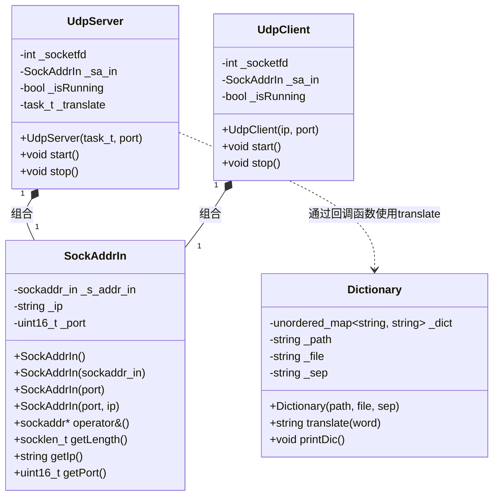
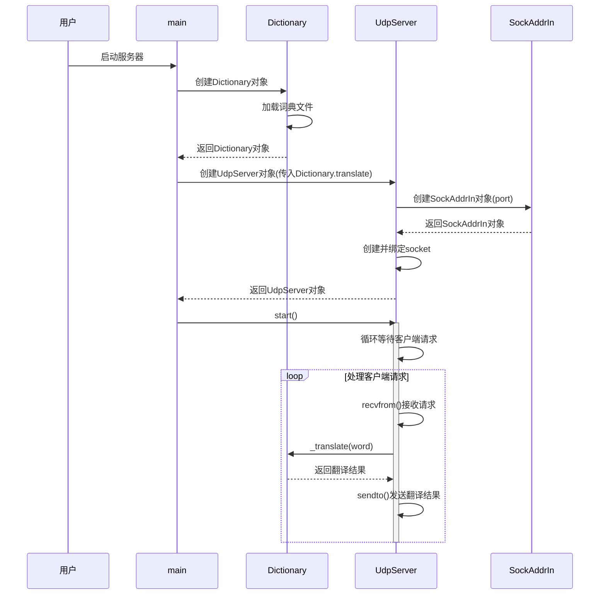
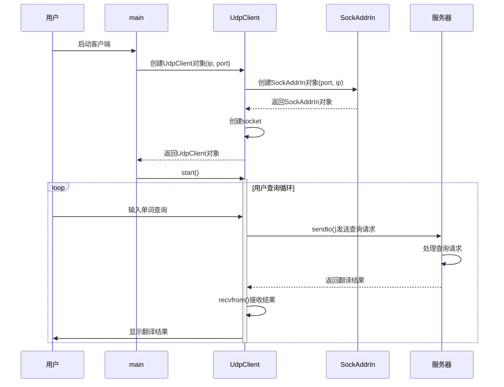

# UDP应用1：翻译软件

## 本篇介绍

本篇基于[UDP编程接口基本使用](https://www.help-doc.top/Linux/udp/udp-basic/udp-basic.html#udp)中封装的服务器和客户端进行改写，基本功能如下：

1. 从配置文件`dict.txt`读取到所有的单词和意思
2. 客户端向服务端发送英文
3. 服务端向客户端发送英文对应的中文意思

## 配置文件内容

下面的内容是本次实现使用的配置文件

```
apple: 苹果
banana: 香蕉
cat: 猫
dog: 狗
book: 书
pen: 笔
happy: 快乐的
sad: 悲伤的
run: 跑
jump: 跳
teacher: 老师
student: 学生
car: 汽车
bus: 公交车
love: 爱
hate: 恨
hello: 你好
goodbye: 再见
summer: 夏天
winter: 冬天
```

## 设计翻译软件

根据上面对功能描述，下面对功能实现进行具体分析

### 设计字典类

既然是字典类，那么对应的就需要一个便于查询的结构，本次以哈希表为例

因为服务端主要是接收客户端的数据，所以服务端本身不直接处理翻译功能，而是交给一个函数进行处理，但是如果这个函数直接裸露在外部就会导致字典本身和翻译函数分开，所以本次考虑将翻译函数作为字典类的成员函数

需要注意，本次默认使用的配置文件中英文单词和中文意思使用的是一个冒号和空格进行分割，即`: `，可以考虑让用户自己提供配置文件和分割符，所以类基本结构如下：

```c++
// 默认配置文件位置和配置文件
const std::string default_path = "./";
const std::string default_file = "dict.txt";

// 默认分隔符
const std::string default_sep = ": ";

class Dictionary
{
public:
    Dictionary(const std::string &path = default_path, const std::string &file = default_file, const std::string &sep = default_sep)
        : _path(path), _file(file), _sep(sep)
    {
        // 1. 读取配置文件

        // 2. 分割字符串并将key和value添加到哈希表
    }

    // 翻译
    std::string translate(const std::string &word)
    {
    }

    ~Dictionary()
    {
    }

private:
    std::unordered_map<std::string, std::string> _dict; // 字典哈希表
    std::string _path;                                  // 配置文件路径
    std::string _file;                                  // 配置文件
    std::string _sep;                                   // 分隔符
};
```

### 读取配置文件并分割

首先是读取配置文件，本次考虑将从配置文件中读取到的字符串通过分割成`key`和`value`依次存入到一个哈希表中。并且因为是字典类，所以考虑在创建字典类对象时就完成前面的读取和存储操作

根据上面的思路需要考虑两个步骤：

1. 获取并读取配置文件
2. 分割字符串获取到`key`和`value`存储到哈希表

读取配置文件的操作就是打开指定的文件并读取其中的内容，在本次配置文件的内容中，一行为<a href="javascript:;" class="custom-tooltip" data-title="即单词与对应的翻译">一组数据</a>，所以在读取文件内容时需要按照行读取

读到一行数据后，需要将该行数据按照指定的分隔符进行切割存入`key`和`value`中，这里有两种思路：

1. 自行实现分割逻辑
2. 使用库函数

本次考虑使用第一种思路，那么对于分割逻辑来说，基本思路如下：

1. 找到`:`第一次出现的位置，以该位置为终点，以字符串第一个字符为起点，切出第一个子串作为`key`
2. 找到分隔符的下一个字符，以该位置为起点，以字符串结尾为终点，切出第二个子串作为`value`

将获取到的`key`和`value`存入到哈希表中

重复上面的步骤直到读取完毕文件，将文件关闭，代码如下：

```c++
// 1. 读取配置文件
std::string dictPath = default_path + default_file;
// 1.1 打开文件
std::fstream out(dictPath);

// 2. 分割字符串并将key和value添加到哈希表
std::string message;
while (std::getline(out, message))
{
    // 分割字符串
    auto word_end = message.find(_sep, 0);
    std::string key = message.substr(0, word_end);
    std::string value = message.substr(word_end + sep.size(), message.size());

    // 存储到哈希表中
    _dict.insert({key, value});
}

out.close();
```

### 翻译函数

所谓翻译就是在哈希表中根据指定字符串查找对应的`value`并返回，基本代码如下：

```c++
// 翻译
std::string translate(const std::string &word)
{
    auto pos = _dict.find(word);

    if (pos == _dict.end())
        return "无指定单词对应的中文意思";

    return pos->second;
}
```

### 修改服务端类

本次服务端做的任务就是接收客户端发送的数据，再调用字典类的翻译函数将翻译结果返回给客户端，所以实际上需要修改的就是两点：

1. 服务端需要拿到翻译函数
2. 执行翻译功能并返回结果给客户端

首先修改第一点，因为服务端本身没有翻译函数，所以需要外界传递，此时可以考虑在构造服务端时要求外部传递翻译函数，对应地服务端就需要一个成员用于接收这个函数：

```c++
using task_t = std::function<std::string(const std::string &)>;

class UdpServer
{
public:
    UdpServer(task_t t, uint16_t port = default_port)
        : // ...
        ,_translate(t)
    {
        // ...
    }

    // ...
private:
    // ...

    task_t _translate; // 翻译函数
};
```

!!! note

    需要注意，在构造函数中，没有默认参数的形式参数一定要写在有默认参数的形式参数之前，具体原因见[C++中的缺省参数](https://www.help-doc.top/C%2B%2B/1.%20C%E8%AF%AD%E8%A8%80%E8%BF%87%E6%B8%A1C%2B%2B%E5%9F%BA%E7%A1%80%E7%9F%A5%E8%AF%86/1.%20C%E8%AF%AD%E8%A8%80%E8%BF%87%E6%B8%A1C%2B%2B%E5%9F%BA%E7%A1%80%E7%9F%A5%E8%AF%86.html#c_3)

接着修改第二点，执行翻译函数并将结果返回给客户端，这一步主要涉及到服务端的任务部分。在上一节中，主要任务是将客户端发送的信息再发给客户端，这次就是调用翻译函数再将结果返回给客户端，所以代码如下：

```c++
// 启动服务器
void start()
{
    if (!_isRunning)
    {
        _isRunning = true;
        while (true)
        {
            // 1. 接收客户端信息
            // ...

            if (ret > 0)
            {
                // ...

                // 翻译
                std::string ret = _translate(buffer);
                ssize_t n = sendto(_socketfd, ret.c_str(), ret.size(), 0, &temp, temp.getLength());

                // ...
            }
        }
    }
}
```

### 修改服务端主函数

主要修改的地方就是创建服务端对象部分，因为需要传递一个翻译任务函数，所以需要先创建一个字典类对象，再调用字典类对象中的翻译方法，需要注意的是，不能直接将字典类的翻译函数作为参数传递给服务端对象的构造函数，因为该函数的参数列表除了需要显示传递的字符串对象外，还存在一个字典类对象，这并不符合服务端类构造函数要求的函数类型，这里提供两个方法：

1. 使用绑定，将字典类对象作为固定参数绑定给翻译函数
2. 使用lambda表达式，在表达式中调用翻译函数

即：

=== "绑定"

    ```c++
    // 创建字典类对象
    std::shared_ptr<Dictionary> dict;
    // 创建UdpServerModule对象
    std::shared_ptr<UdpServer> udp_server = = std::make_shared<UdpServer>(std::bind(&Dictionary::translate, dict.get(), std::placeholders::_1));
    ```

=== "lambda表达式"

    ```c++
    // 创建字典类对象
    std::shared_ptr<Dictionary> dict;
    // 创建UdpServerModule对象
    std::shared_ptr<UdpServer> udp_server = = std::make_shared<UdpServer>([&dict](const std::string word){ 
        dict->translate(word); 
    });
    ```

## 测试

以绑定为例，服务端整体代码如下：

```c++
#include "udp_server.hpp"
#include "dictionary.hpp"
#include <memory>

using namespace UdpServerModule;
using namespace DictionaryModule;

int main(int argc, char *argv[])
{
    // 创建字典类对象
    std::shared_ptr<Dictionary> dict;
    // 创建UdpServerModule对象
    std::shared_ptr<UdpServer> udp_server;
    if (argc == 1)
    {
        // 绑定
        udp_server = std::make_shared<UdpServer>(std::bind(&Dictionary::translate, dict.get(), std::placeholders::_1));
    }
    else if (argc == 2)
    {
        // std::string ip = argv[1]; 去除
        uint16_t port = std::stoi(argv[1]);
        udp_server = std::make_shared<UdpServer>(std::bind(&Dictionary::translate, dict.get(), std::placeholders::_1), port);
    }
    else
    {
        LOG(LogLevel::ERROR) << "错误使用，正确使用：" << argv[0] << " 端口（或者不写）";
        exit(4);
    }

    udp_server->start();

    return 0;
}
```

客户端代码保持和上一节一样，此处不再展示，运行结果如下：


## 图表梳理

### 类间关系



### 执行逻辑

#### 服务端



#### 客户端

