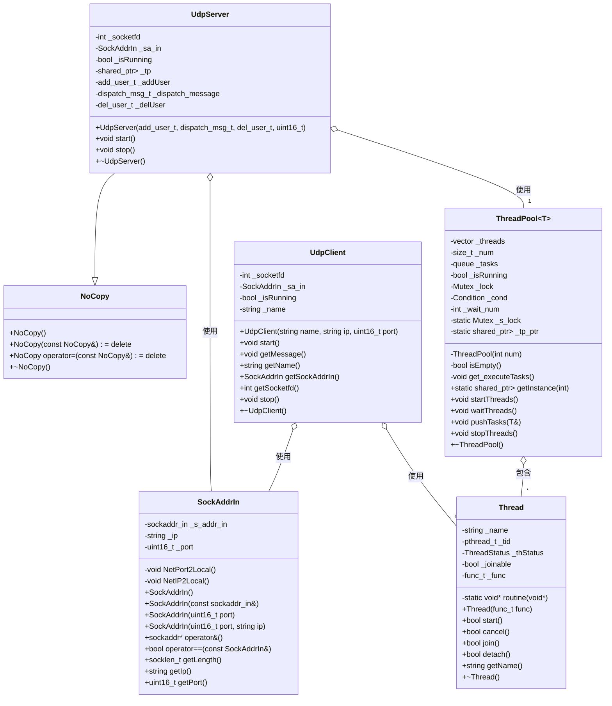
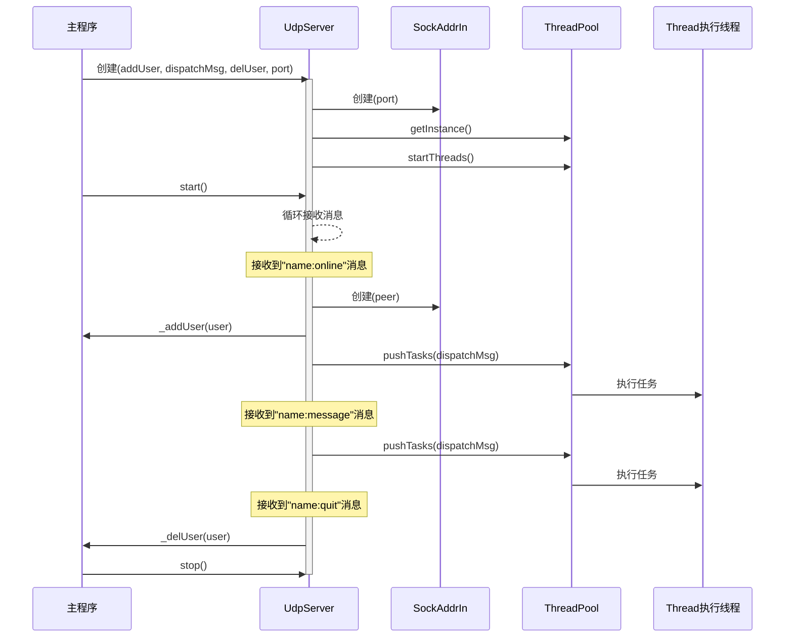
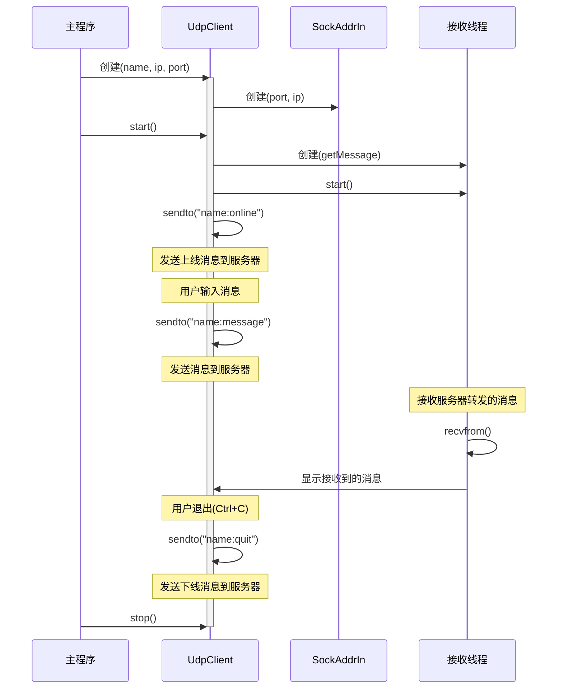

# UDP应用2：简易聊天室

## 本篇介绍

在前面的基本使用过程中已经完成了本地和网络通信，既然一个人和一台服务器可以进行通信，那么多个人连接一台服务器也可以和这台服务器实现通信。在这个基础上，如果服务器可以将某个人发给服务器的消息转发给所有连接到当前服务器的客户端，就可以实现一个人发消息，其他人看到消息的效果，这就是简易聊天室的原理

本篇就是利用UDP的操作实现上面提到的简易聊天室，其中客户端向服务端发送消息，服务端将收到的消息转发给所有连接到当前服务器的客户端

需要注意，本次实现基于[前面封装的服务端和客户端](https://www.help-doc.top/Linux/udp/udp-basic/udp-basic.html)

## 主要功能实现思路

在实现具体功能之前，先了解本次设计聊天室的主要功能的实现思路：

既然要实现多个用户连接一台服务器，那么每一个用户就需要有相关的属性，并且多个用户还需要进行管理，所以必须先对用户模块进行设计

本次设计的用户模块可以采用观察者模式。观察者模式是一种行为型设计模式，用于定义对象之间的一对多依赖关系。当一个对象的状态发生变化时，所有依赖于它的对象都会自动收到通知并更新，其有下面的核心对象：

1. 主题（Subject）：被观察的对象。维护一组观察者，并提供添加、删除和通知观察者的方法
2. 观察者（Observer）：监听主题状态变化的对象。定义一个更新接口，用于接收主题的通知

根据上面的概念，考虑接下来的设计思路

首先是设计基类，在观察者模式中，基类可以分为两种：

1. 主题基类：声明主题需要实现的三个方法，在本次聊天室中分别对应着：添加用户、删除用户和将消息转发给所有用户
2. 观察者基类：声明观察者在检测到状态变化时需要做出的行为，在本次聊天室中对应着：将指定的信息发给自己

??? question "为什么观察者基类需要将信息发给自己？"

    在本次实现中，实际上是由服务器调用转发函数，此时就会调用主题实现类中的<a href="javascript:;" class="custom-tooltip" data-title="即将消息转发给所有用户">转发函数</a>，在转发函数中，每一个观察者都会收到服务器传递的信息，此时每一个观察者携带着该信息调用自己的<a href="javascript:;" class="custom-tooltip" data-title="即观察这在检测到状态变化时需要做出行为对应的函数">更新函数</a>，在更新函数中，每一个观察者就会将指定信息根据自己的IP地址发送给自己，这样就相当于是服务器将信息转发给所有在线的客户端。简单来说，就是通过服务器从没有收到信息到接收到某一信息这一状态的变化间接更新所有的客户端

接着，有了基类就需要有对应的实现类，那么对应的就是观察者实现类和主题实现类，主题实现类需要对所有的观察者进行管理，实现类只需要实现需要的更新方法即可，具体见后面的解析

设计完用户模块之后，就是服务器端的处理，本次设计的聊天室服务器需要完成下面的内容：

1. 当用户第一次向服务器发送信息时需要将用户添加为观察者
2. 一个用户向服务器发送信息时，服务器需要将这条信息转发给所有连接到当前服务器的用户
3. 当用户发送一条固定消息（本次默认为字符串`quit`）时，服务器需要删除从在线用户列表中删除该用户

对于第一个任务，服务器可以完全胜任，因为完全就是调用主题实现类的添加方法，这一步不会有很大的消耗，但是对于第二个任务，因为`socketfd`是双工的，那么就会存在既接收信息又分发信息，而分发信息需要遍历到每一个观察者，此时只有服务器一个线程，那么这一个线程开销就会非常大，所以为了避免这个问题就可以考虑使用线程池完成分发任务

需要注意，本次会使用前面[封装的单例线程池](https://www.help-doc.top/Linux/linux-thread/thread-pool/thread-pool.html#_16)

## 实现用户模块

### 创建观察者基类

观察者基类最关键的方法就是更新数据，所以基本结构如下：

```c++
// 观察者基类
class UserObserver
{
public:
    virtual ~UserObserver() = default;
    virtual void sendMessage() = 0;
};
```

### 创建观察者实现类

既然是观察者实现类，那么少不了的就是对虚函数进行重写，在前面的主要功能中提到过，观察者的主要方法是将消息根据自己的IP地址，所以基本结构代码如下：

```c++
// 观察者实现类
class User : public UserObserver
{
public:
    virtual void sendMessage(int sockfd, const std::string& message) override
    {
    }
};
```

但是，为了这个类需要用于不同的用户，所以还需要相关的属性和构造方法，本次考虑用户可以有IP地址、端口和用户名作为属性，在构造时需要用户传递IP地址、端口和用户名：

!!! note

    需要注意，本次将使用前面封装的`struct sockaddr_in`结构

```c++
// 观察者实现类
class User : public UserObserver
{
public:
    User(uint16_t port, std::string ip, std::string name)
        : _name(name), _sa_in(port, ip)
    {
    }

    // ...

private:
    std::string _name;
    SockAddrIn _sa_in;
};
```

### 实现观察者实现类重写方法

在前面的主要功能中提到过，观察者的主要方法是将消息根据自己的IP地址发给自己，所以实现如下：

```c++
virtual void sendMessage(int sockfd, const std::string &message) override
{
    // 打印日志
    LOG(LogLevel::INFO) << "Client: " << _sa_in.getIp() << ":" << _sa_in.getPort() << "send message: " << message;

    // 发送信息给自己
    ssize_t = sendto(sockfd, message.c_str(), message.size(), 0, &_sa_in, _sa_in.getLength());
}
```

### 创建主题基类

根据前面的主要功能实现思路可以知道主题基类有三个主要方法：添加用户、删除用户和将消息转发给所有用户，所以代码如下：

```c++
// 主题基类
class UserManagerSubject
{
public:
    virtual ~UserManagerSubject() = default;
    // 添加方法
    virtual void addUser(const User &user) = 0;
    // 删除方法
    virtual void delUser(const User &user) = 0;
    // 通知方法
    virtual void dispatchMessage(int sockfd, const std::string &message) = 0;
};
```

### 创建主题实现类

根据上面的基类实现对应的方法，但是除了有对应的方法外，还需要有一个用于管理所有用户的结构，本次考虑<a href="javascript:;" class="custom-tooltip" data-title="也可以使用其他结构，但是不论是哪一种结构都要涉及到遍历，所以不论是使用查找快速的哈希表还是线性结构实际上的时间消耗都是大差不差的">使用list结构</a>，基本代码如下：

```c++
// 主题实现类
class UserManager : public UserManagerSubject
{
public:
    UserManager()
    {
    }

    // 实现添加方法
    virtual void addUser(const User &user) override
    {
    }

    // 实现删除方法
    virtual void delUser(const User &user) override
    {
    }

    // 通知方法
    virtual void dispathMessage(int sockfd, const std::string &message) override
    {
    }

private:
    std::list<std::shared_ptr<User>> _u_list;
};
```

### 实现主题实现类重写方法

主题实现类中一共三个方法，下面针对这三个方法进行分别实现：

#### 添加方法

对于第一个方法，既然是添加数据，那么肯定涉及到访问链表，因为后面会存在服务器线程访问这个链表，线程池中的线程也会访问这个链表，所以为了保证线程安全，每一个线程在访问链表时需要先申请锁，申请锁成功后再修改链表中的内容，所以在此基础之上还需要一个互斥锁成员

接着在主要逻辑中，因为是插入用户，所以首先需要判断插入的用户是否存在，如果存在就插入，否则就不插入。但是这里涉及到一个问题，需要判断用户是否存在就必然涉及到比较用户的属性，在前面观察者实现类中一共有两个属性，一个是字符串，这个类型的属性已经重载了比较运算符，所以可以直接比较，但是对于封装的结构`SockAddrIn`并没有重载对应的操作符，所以此处还需要在观察者实现类中实现`==`运算符重载函数

判断两个`SockAddrIn`类成员是否相同主要是判断端口和IP地址是否相同，注意不能本次不建议单独判断IP地址或者端口，假设只判断IP地址，那么如果当前用户与服务器断开再连接就会出现误判断，但是实际上这个用户是已经退出再添加的。同理，如果只是判断端口，那么可能存在两个端口相同的客户端连接服务器，当其中一个客户端连接服务器，第二个用户再连接也会出现误判断。所以在`SockAddrIn`类需要实现下面的方法：

```c++
// 重载==
bool operator==(const SockAddrIn &s)
{
    return _ip == s._ip && _port == s._port;
}
```

接着，为了比较两个用户是否是同一个用户，还需要在`User`类中重载`==`运算符，比较方式是比较`SockAddrIn`对象，即：

```c++
// 重载==
bool operator==(const User &u)
{
    return _sa_in == u._sa_in;
}
```

有了这两个重载函数之后，就可以比较两个用户是否相同。回到上面的逻辑，有了比较两个用户是否相等的方式后，只要判断插入的用户不存在于链表中，那么就可以插入，即：

```c++
// 实现添加方法
virtual void addUser(const User &user) override
{
    // 先申请锁
    MutexGuard guard(_mutex);
    // 确保用户不存在
    for (auto &u : _u_list)
        if (*u == user)
            return;

    // 不存在时插入
    _u_list.push_back(std::make_shared<User>(user));
}
```

!!! note

    上面的代码使用到了默认的拷贝构造，因为需要深拷贝的结构string有对应的拷贝构造函数，而`uint16_t`本质是一个内置类型，所以直接拷贝也不会有问题

#### 删除方法

删除方法的实现步骤就是找到指定的用户将其从链表中移除即可，此处可以考虑使用`remove_if`接口，该接口会将指定的用户节点移动到链表的最后，之后只需要删除最后一个节点即可

同样，为了确保多个线程下的线程安全，同样需要先申请锁，再进行删除操作：

```c++
// 实现删除方法
virtual void delUser(const User &user) override
{
    MutexGuard guard(_mutex);

    auto pos = std::remove_if(_u_list.begin(), _u_list.end(), [&user](const std::shared_ptr<User> &u)
                                { return *u == user; });

    _u_list.erase(pos, _u_list.end());
}
```

#### 通知方法

在主要功能实现思路部分重点提到了通知方法的本质就是让每一个客户端自己个自己发消息，所以只需要遍历用户链表，让每一个成员调用自己的发送更新方法即可

同样，为了确保多个线程下的线程安全，同样需要先申请锁，再进行删除操作：

```c++
// 通知方法
virtual void dispatchMessage(int sockfd, const std::string &message) override
{
    MutexGuard guard(_mutex);
    for (auto &u : _u_list)
        u->sendMessage(sockfd, message);
}
```

## 修改客户端模块

### 添加用户名字

本次实现的方式是用户通过命令行输入端口号、IP地址和名字的方式连接服务器，所以需要在创建客户端对象时指定端口号、IP地址和名字，对应地需要在客户端类中添加一个`_name`成员，并在构造函数中对其进行初始化：

```c++
class UdpClient
{
public:
    UdpClient(std::string name, /* ... */)
        : // ...
        , _name(name)
    {
        // ...
    }

    // ...

private:
    // ...
    std::string _name; // 客户端名字
};
```

### 更改消息类型

因为服务器需要拿到用户的名字和信息，所以本次考虑客户端向服务端发送带有`name:message`格式的字符串，根据这个思路将拼接后的字符串发送给服务端：

```c++
// 1.1 读取输入信息
std::string message;
getline(std::cin, message);

// 1.2 整合数据
std::string userinfo = _name + ":" + message;

// 1.3 发送数据
ssize_t ret = sendto(_socketfd, userinfo.c_str(), userinfo.size(), 0, &_sa_in, _sa_in.getLength());

if (ret < 0)
    LOG(LogLevel::WARNING) << "Client send failed";
```

## 修改客户端主函数逻辑

将客户端修改为必须输入IP地址、端口号和名字，如下：

```c++
// 获取到用户输入的端口和IP地址
std::string ip = argv[1];
uint16_t port = std::stoi(argv[2]);

// 获取用户名字
std::string name = argv[3];

// 创建客户端对象——用户自定义端口和IP地址
client = std::make_shared<UdpClient>(name, ip, port);

// 启动客户端
client->start();
```

## 修改服务器模块

完成了用户管理模块，接下来就是处理服务器应该执行的任务，在主要功能实现思路部分提到，服务器主要有两个任务：

1. 接收到用户消息后添加用户
2. 将收到的消息转发给所有在线用户
3. 收到固定消息时移除用户

对于第一个任务，服务器直接处理并无压力，但是对于第二个任务需要借助线程池。所以下面根据这个思路对已有的服务器模块进行修改

### 接收到用户消息后添加用户

在之前的服务器模块中，当服务器调用`recvfrom`时，如果返回值不为0，就说明服务器已经收到消息，那么只需要在这个判断中添加「接收到用户消息后添加用户」的逻辑即可

确定了修改位置，接下来思考如何处理添加用户。在前面主题实现类中存在着一个添加用户的方法，根据观察者模式的特点，添加用户本质就属于添加观察者，所以服务器添加用户本质就是调用主题实现类中的添加观察者方法。但是现在的问题是，服务器并不知道如何调用这个方法，所以根据前面实现[翻译软件](https://www.help-doc.top/Linux/22.%20UDP%E7%BC%96%E7%A8%8B/2.%20UDP%E5%BA%94%E7%94%A81%EF%BC%9A%E7%BF%BB%E8%AF%91%E8%BD%AF%E4%BB%B6/2.%20UDP%E5%BA%94%E7%94%A81%EF%BC%9A%E7%BF%BB%E8%AF%91%E8%BD%AF%E4%BB%B6.html#_7)的思路，可以考虑在创建服务器对象时要求传递对应地添加方法，所以此时就需要一个成员变量用于接收传递的函数，基本结构如下：

```c++
using add_user_t = std::function<void(const User &)>;

// ...

class UdpServer
{
public:
    UdpServer(add_user_t addUser, /* ... */)
        : // ...
        ,_addUser(addUser)
    {
        // ...
    }

    // ...

private:
    // ...

    add_user_t _addUser; // 添加用户函数
};
```

服务器有了添加用户的函数后，接下来的问题就是用户从哪来，因为用户在上线时传递了名字和信息构成的字符串，所以在服务器收到这个信息时需要将名字和信息进行分离，再将名字和收到的IP地址和端口构造成一个`User`对象，这样服务器就可以知道用户的相关信息从而正确调用添加用户的函数：

```c++
// 1. 接收客户端信息
char buffer[1024] = {0};
struct sockaddr_in peer;
socklen_t length = sizeof(peer);
ssize_t ret = recvfrom(_socketfd, buffer, sizeof(buffer) - 1, 0, reinterpret_cast<struct sockaddr *>(&peer), &length);

if (ret > 0)
{
    // 1. 根据收到的消息构建User对象
    SockAddrIn netUser(peer);
    // 切割字符串
    std::string fullInfo = buffer;
    // 获取名字
    auto pos = fullInfo.find(":", 0);
    std::string name = fullInfo.substr(0, pos);
    // 获取消息
    std::string message = fullInfo.substr(pos + 1, fullInfo.size());

    User user(netUser.getPort(), netUser.getIp(), name);

    // 添加用户
    _addUser(user);
}
```

### 将收到的消息转发给所有在线用户

当服务器收到消息时，除了需要将用户添加到链表中以外，还需要分发用户发送的消息，此时就需要借助线程池减小服务器单一线程的工作量，所以首先需要创建线程池。因为前面设计的线程池需要一个任务函数，所以在创建之前需要考虑线程池执行的任务，前面已经提到线程池需要执行派发任务，但是服务器本身没有这个任务，所以和添加用户一样，需要在创建服务器对象时给定，对应的还需要一个成员用于接收这个任务：

```c++
using dispatch_msg_t = std::function<void(int, const std::string &)>;

class UdpServer
{
public:
    UdpServer(/* ... */, dispatch_msg_t dispatchMsg, /* ... */)
        : // ...
        , _dispath_message(dispathMsg)
    {
        // ...
    }

    // ...

private:
    // ...

    add_user_t _addUser;            // 添加用户函数
    dispatch_msg_t _dispatch_message; // 分发消息函数
};
```

有了分发消息的函数之后，接下来就可以创建线程池。需要注意的是，在线程池的实现内部，每一个线程执行的是一个无参的任务函数，但是分发任务函数是存在形参的，所以还需要使用绑定将需要的参数固定在分发消息函数，再将其传递给一个无参的函数类型，最后将该类型作为任务类型派发给线程池即可：

!!! note

    需要注意，启动线程池不要在循环中启动，可能会出现服务器刚上线就收消息导致的服务器崩溃问题。另外，线程池插入任务函数不能使用右值的形参

```c++
using task_t = std::function<void()>;

class UdpServer
{
public:
    UdpServer(/* ... */)
        : // ...
    {
        // ...

        _tp = ThreadPool<task_t>::getInstance();

        if (!_tp)
        {
            LOG(LogLevel::ERROR) << "线程池启动失败";
            return;
        }

        _tp->startThreads();

        // ...
    }

    // 启动服务器
    void start()
    {
        if (!_isRunning)
        {
            _isRunning = true;
            while (true)
            {
                // ...

                if (ret > 0)
                {
                    // ...

                    // 2. 创建线程池并添加任务
                    task_t task = std::bind(_dispatch_message, _socketfd, message);
                    _tp->pushTasks(task);
                }
            }
        }
    }

    // ...

private:
    // ...

    std::shared_ptr<ThreadPool<task_t>> _tp;

    // ...
};
```

### 收到固定消息时移除用户

本次默认服务器收到固定的消息是`quit`字符串。当客户端想要退出时必须要结束对应的进程，所以可以考虑使用信号捕捉的方式，本次以捕捉++ctrl+c++的信号为例

首先，客户端需要对++ctrl+c++对应的信号进行捕捉，即一旦收到该信号时就向服务器端发送固定的字符串`quit`提示服务端指定用户退出，再结束该客户端。为了可以看到客户端的名字、端口与IP地址结构和套接字，可以考虑提供获取名字、端口+IP地址和套接字的接口，并且将客户端指针作为全局对象确保信号捕捉函数可以看到该指针对象：

=== "客户端主函数"

    ```c++
    std::shared_ptr<UdpClient> client;

    void quit(int sig)
    {
        (void)sig;
        std::string userinfo = client->getName() + ":" + "quit";
        int ret = sendto(client->getSocketfd(), userinfo.c_str(), userinfo.size(), 0, &client->getSockAddrIn(), client->getSockAddrIn().getLength());
        LOG(LogLevel::INFO) << client->getName() << "退出群聊";
        exit(0);
    }

    int main(int argc, char *argv[])
    {
        // 捕捉2号新号
        signal(2, quit);

        // ...
    }
    ```

=== "客户端类"

    ```c++
    // 获取名字
    std::string getName()
    {
        return _name;
    }

    // 获取IP地址+端口号
    SockAddrIn getSockAddrIn()
    {
        return _sa_in;
    }

    // 获取socketfd
    int getSocketfd()
    {
        return _socketfd;
    }
    ```

接着，在服务器端需要对收到的字符串进行判断，如果收到的字符串为`quit`，说明需要删除该用户，调用主题实现类中的`delUser`方法，思路与前面两个功能的思路一致，此处不再赘述：

```c++
using del_user_t = std::function<void(const User &)>;

class UdpServer
{
public:
    UdpServer(add_user_t addUser, dispatch_msg_t dispatchMsg, del_user_t delUser, uint16_t port = default_port)
        : // ...
        , _delUser(delUser)
    {
        // ...
    }

    // 启动服务器
    void start()
    {
        if (!_isRunning)
        {
            _isRunning = true;
            while (true)
            {
                // 1. 接收客户端信息
                // ...

                if (ret > 0)
                {
                    // ...

                    // 1.1 判断是删除还是添加
                    if (strcmp(message.c_str(), "quit") == 0)
                    {
                        // 删除用户
                        _delUser(user);
                    }
                    else
                    {
                        // 添加用户
                        _addUser(user);
                    }

                    // ...
                }
            }
        }
    }

    // ...

private:
    // ...
    del_user_t _delUser; // 删除用户函数
};
```

## 修改服务器主函数逻辑

在创建服务器时，需要指定三个函数，分别是：添加函数、分发函数和删除函数，其他逻辑不变，以使用默认端口为例：

```c++
// 创建UserManager对象
std::shared_ptr<UserManager> usm = std::make_shared<UserManager>();
// 创建UdpServerModule对象
udp_server = std::make_shared<UdpServer>([&usm](const User &user)
                                                 { usm->addUser(user); },
                                                 [&usm](int sockfd, const std::string &message)
                                                 { usm->dispatchMessage(sockfd, message); },
                                                 [&usm](const User &user)
                                                 { usm->delUser(user); });
```

## 客户端回显优化

默认情况下回显客户端的消息在发送之下，代码如下：

```c++
// 1.1 读取输入信息
std::string message;
LOG(LogLevel::INFO) << "请输入信息：";
getline(std::cin, message);

// 1.2 整合数据
std::string userinfo = _name + ":" + message;

// 1.3 发送数据
ssize_t ret = sendto(_socketfd, userinfo.c_str(), userinfo.size(), 0, &_sa_in, _sa_in.getLength());

if (ret < 0)
    LOG(LogLevel::WARNING) << "Client send failed";

// 2. 回显服务器的信息
struct sockaddr_in temp;
socklen_t length = sizeof(temp);
char buffer[1024] = {0};
ssize_t n = recvfrom(_socketfd, buffer, sizeof(buffer) - 1, 0, reinterpret_cast<struct sockaddr *>(&temp), &length);

if (n > 0)
    LOG(LogLevel::INFO) << "Received message from server: " << buffer;
```

但是这样会出现一个问题，因为`socketfd`是全双工的，即在收的同时还可以发送，所以就会出现`sendMessage`中的发送可以和`recvfrom`同时进行，而因为本次聊天室服务器并没有直接向客户端发送消息，导致客户端发送一条消息之后就会卡在`recvfrom`的位置。为了解决这个问题，需要再客户端部分使用两个线程，一个线程负责发送信息，另外一个线程负责发送信息，简单来说就是收和发分离

=== "启动客户端函数"

    ```c++
    void start()
    {
        if (!_isRunning)
        {
            // 创建新线程执行获取消息的函数
            Thread t([this]()
                        { getMessage(); });
            t.start();

            // ...
        }
    }
    ```

=== "获取消息函数"

    ```c++
    void getMessage()
    {
        LOG(LogLevel::DEBUG) << "新线程启动";
        while (true)
        {
            // 2. 回显服务器的信息
            struct sockaddr_in temp;
            socklen_t length = sizeof(temp);
            char buffer[1024] = {0};
            ssize_t n = recvfrom(_socketfd, buffer, sizeof(buffer) - 1, 0, reinterpret_cast<struct sockaddr *>(&temp), &length);

            if (n > 0)
                LOG(LogLevel::INFO) << "Received message from server: " << buffer;
        }
    }
    ```

## 触发添加用户逻辑优化

前面的设计中只有客户端发送一条消息之后才会添加用户，但是实际上只要用户上线了就应该可以算是连接成功，所以此处可以在用户上线时预先给服务器发送固定消息，一旦服务器收到该固定消息再决定添加用户，即：

=== "客户端启动函数"

    ```c++
    // 启动客户端
    void start()
    {
        if (!_isRunning)
        {
            // 创建新线程执行获取消息的函数
            // ...

            // 预先发送一条消息给服务器
            std::string online = _name + ":" + "online";
            ssize_t ret = sendto(_socketfd, online.c_str(), online.size(), 0, &_sa_in, _sa_in.getLength());

            // ...
        }
    }
    ```

=== "服务器启动函数"

    ```c++
    // 启动服务器
    void start()
    {
        if (!_isRunning)
        {
            // ...
            while (true)
            {
                // 1. 接收客户端信息
                // ...

                if (ret > 0)
                {
                    // ...

                    // 1.1 判断是删除还是添加
                    if (strcmp(message.c_str(), "quit") == 0)
                    {
                        // 删除用户
                        _delUser(user);
                    }
                    else if (strcmp(message.c_str(), "online") == 0)
                    {
                        // 添加用户
                        _addUser(user);
                    }

                    // ...
                }
            }
        }
    }
    ```

## 整体显示优化

上面已经基本上可以实现通信功能，但是显示的效果并不好，因为输入和输出都显示在同一个显示器上，所以可以考虑将当前客户端收到的分发消息打印到文件中，正常的输出依旧还是在控制台，此处可以借助标准错误输出流，例如`cerr`

根据这个思路，对回显进行优化：

```c++
void getMessage()
{
    LOG(LogLevel::DEBUG) << "新线程启动";
    while (true)
    {
        // ...

        if (n > 0)
            std::cerr << "收到消息：" << buffer << std::endl;
    }
}
```

另外，为了更好得显示用户上线和下线，可以在用户添加或者删除之后将携带的信息带上更具体的文字，例如：

```c++
// 启动服务器
void start()
{
    if (!_isRunning)
    {
        _isRunning = true;
        while (true)
        {
            // ...

            if (ret > 0)
            {
                // ...

                // 1.1 判断是删除还是添加
                if (strcmp(message.c_str(), "quit") == 0)
                {
                    // 删除用户
                    _delUser(user);
                    message = user.getName() + ":" + "(" + user.getSockAddrIn().getIp() + ":" + std::to_string(user.getSockAddrIn().getPort()) + ")" + " offline";
                }
                else if (strcmp(message.c_str(), "online") == 0)
                {
                    // 添加用户
                    _addUser(user);
                    message = user.getName() + ":" + "(" + user.getSockAddrIn().getIp() + ":" + std::to_string(user.getSockAddrIn().getPort()) + ")：" + message;
                }
                else
                {
                    // 仅添加用户标识
                    message = user.getName() + " (" + user.getSockAddrIn().getIp() + ":" + std::to_string(user.getSockAddrIn().getPort()) + ")：" + message;
                }

                // ...
            }
        }
    }
}
```

## 测试

在启动客户端之前，先通过下面的指令创建管道：

```shell
mkfifo 管道名称
```

启动客户端时输入下面的指令：

```c++
./客户端可执行程序名称 IP地址 端口号 名字 2> 管道名称
```

运行客户端和服务端即可看到收到的消息在管道中，输入的消息在标准输出中

## 图表梳理

### 类间关系



### 执行逻辑

#### 服务端



#### 客户端

