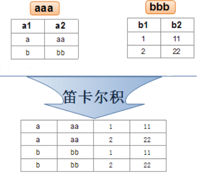

<!-- 添加对Katex的支持 -->
<script defer src="/javascripts/katex.min.js"></script>
<script defer src="https://help-site.oss-cn-hangzhou.aliyuncs.com/js/katex.min.js"></script>
<script defer src="https://help-site.oss-cn-hangzhou.aliyuncs.com/js/auto-render.min.js"></script>

<script defer src="/javascripts/waline.min.js"></script>
<link rel="stylesheet" href="https://help-site.oss-cn-hangzhou.aliyuncs.com/css/waline.css" />
<link rel="stylesheet" href="/stylesheets/waline.min.css" />

# MySQL基础操作

## 文档约定

1. 在MySQL中并不区分大小写，后续关于MySQL的代码都以小写为主
2. 在MySQL中字符串可以用单引号表示，也可以用双引号表示，后续关于字符串除特殊情况外都会以单引号表示

## MySQL中的注释

MySQL中支持两种注释：

1. 单行注释：使用`--`或者`#`。**需要注意，使用`--`时后面必须跟一个空格才能被识别为注释**
2. 多行注释：使用`/**/`

## 显示当前数据库

操作如下：

```sql
show databases;
```

## 创建数据库

基本语法如下：

```sql
create database 数据库名;
```

!!! note

    数据库名不能和已有的数据库名重复，数据库名在Windows下不区分大小写，但是Linux下区分大小写，因为数据库本身实际上就是一个文件。如果数据库名与SQL中的关键字重名，则在创建数据库时可以使用反引号包裹数据库名，例如：

    ```sql
    -- 创建名为order的数据库
    create database `order`;
    ```

在MySQL 5.7中，数据库默认的字符集为拉丁文，如果存储中文数据就会出现乱码，解决方式就是在创建数据库时指定字符集：

```sql
-- 指定字符集为UTF-8
create database 数据库名 charset utf8;
-- charset也可以写作character set
```

在MySQL8.0中，默认的字符集就是UTF-8，所以可以不用额外指定字符集

但是需要注意的是，MySQL中的UTF-8是“残血版”，即一部分UTF-8中的字符并不支持，所以MySQL还提供`utf8mb4`，但是这个字符集是MySQL独有的，如果是其他数据库，则无法正常识别该字符集

创建数据库时还可以指定条件：如果创建的数据库已经存在，则不继续创建并提示`database exists`（不指定条件时会报错为`database exists`），否则就创建，这个条件就可以使用`if not exists`来表示，语法如下：

```sql
create database if not exists 数据库名;
```

例如创建一个`test`数据库：

```sql
create database if not exists test;
```

## 使用数据库

操作如下：

```sql
use 数据库名;
```

## 删除数据库

基本语法如下：

```sql
drop database 数据库名;
```

也可以指定简单的条件：如果删除的数据库存在，则删除，否则不处理并提示`database doesn't exist`（不指定条件时会报错`database doesn't exist`），这个条件就可以使用`if exists`来表示，语法如下：

```sql
drop database if exists 数据库名;
```

例如删除`test`数据库：

```sql
drop database if exists test;
```

!!! warning

    删除数据库是非常危险的操作，所以删除时一定要格外小心

## MySQL中常用的数据类型

在MySQL中，数据类型分为三种：

1. 数值类型（整型和浮点型）
2. 字符串类型
3. 日期类型

每一种类型包含的具体类型如下表：

=== "数值类型"

    | 数据类型       | 大小               | 说明                                             | 对应Java包装类型                                    |
    | -------------- | ------------------ | ------------------------------------------------ | ----------------------------------------------- |
    | `BIT(M)`       | `M`指定位数，默认为1 | 二进制数，`M`范围从1到64，存储数值范围从0到$2^M - 1$   | 常用`Boolean`对应`BIT`，此时默认是1位，即只能存0和1 |
    | `TINYINT`      | 1字节              |                                                  | `Byte`                                            |
    | `SMALLINT`     | 2字节              |                                                  | `Short`                                           |
    | `INT`          | 4字节              |                                                  | `Integer`                                         |
    | `BIGINT`       | 8字节              |                                                  | `Long`                                            |
    | `FLOAT(M,D)`   | 4字节              | 单精度，`M`指定长度，`D`指定小数位数。会发生精度丢失 | `Float`                                           |
    | `DOUBLE(M,D)`  | 8字节              |                                                  | `Double`                                          |
    | `DECIMAL(M,D)` | `(M, D)`可以表示的最大值，例如`DECIMAL(5, 2)`最大值为999.99        | 双精度，`M`指定长度，`D`表示小数点位数。精确数值     | `BigDecimal`                                      |
    | `NUMERIC(M,D)` | `(M, D)`可以表示的最大值        | 和`DECIMAL`一样                                    | `BigDecimal`                                      |

=== "字符串类型"

    | 数据类型        | 大小           | 说明                   | 对应Java类型 |
    | --------------- | -------------- | ---------------------- | ------------ |
    | `VARCHAR(SIZE)` | 0-65,535字节   | 可变长度字符串         | `String`       |
    | `TEXT`          | 0-65,535字节   | 长文本数据             | `String`       |
    | `MEDIUMTEXT`    | 0-16777215字节 | 中等长度文本数据       | `String`       |
    | `BLOB`          | 0-65,535字节   | 二进制形式的长文本数据 | `byte[]`       |

    !!! note

        注意，`VARCHAR(SIZE)`中的`SIZE`单位为字符而不是字节，例如`varchar(5)`表示可以存储5个字符

=== "日期类型"

    | 数据类型    | 大小  | 说明                                             | 对应Java类型                       |
    | ----------- | ----- | ------------------------------------------------ | ---------------------------------- |
    | `DATETIME`  | 8字节 | 范围从1000到9999年，不会进行时区的检索及转换   | `java.util.Date`、`java.sql.Timestamp` |
    | `TIMESTAMP` | 4字节 | 范围从1970到2038年，自动检索当前时区并进行转换 | `java.util.Date`、`java.sql.Timestamp` |

## 显示数据库中的表

操作如下：

```sql
-- 需要先使用数据库
show tables;
```

## 查看表结构

操作如下：

```sql
desc 表名;
```

## 创建表

基本语法如下：

```sql
create table 表名(列名1 类型, 列名2 类型, ...);
```

可以在创建表时使用`comment`指定注释：

```sql
create table 表名(
    列名1 类型 comment '注释内容', 
    列名2 类型 comment '注释内容', 
    ...
);
```

例如创建一个`student`表：

```sql
create table student(
    id int comment '学生id',
    name varchar(20) comment '学生姓名',
    age int comment '学生年龄',
    gender varchar(10) comment '学生性别'
);
```

创建表时也可以指定简单的条件：不存在指定的表就创建，否则不创建（不指定条件时报错`Table '表名' already exists`），可以使用`if not exists`表示该条件，如下：

```sql
create table if not exists 表名(
    列名1 类型 comment '注释内容', 
    列名2 类型 comment '注释内容', 
    ...
);
```

## 删除表

基本语法如下：

```sql
drop table 表名;
```

也可以指定简单的条件：存在指定的表就删除，否则不删除（不指定条件时报错`Unknown table '数据库名.表名'`），可以使用`if exists`表示该条件，如下：

```sql
drop table if exists 表名;
```

可以删除多个表：

```sql
drop table if exists 表名1, 表名2, ...;
```

## 表中新增数据

基本语法如下：

```sql
insert into 表名 values('数据', '数据', '数据', ...);
-- 单列数据values可以用value代替
```

在这种写法下，MySQL会自动将数据插入到对应的列中

对于插入的数据类型来说，满足或者可以隐式类型转换到列类型，例如列类型为整型，数据类型可以为整型数据或者可以转换为整型的字符串（例如`'123'`，注意不可以是`123aa`等包含无法转换为数字的字符）

也可以指定插入的列：

```sql
insert into 表名 (列名1, 列名2, 列名3) values('数据', '数据', '数据', ...);
```

在这种写法下，MySQL数据对应的列是指定的列

例如针对下面的数据库：

```
+---------+-------------+------+-----+---------+-------+
| Field   | Type        | Null | Key | Default | Extra |
+---------+-------------+------+-----+---------+-------+
| id      | int         | YES  |     | NULL    |       |
| sn      | int         | YES  |     | NULL    |       |
| name    | varchar(20) | YES  |     | NULL    |       |
| qq_mail | varchar(20) | YES  |     | NULL    |       |
+---------+-------------+------+-----+---------+-------+
```

使用下面的代码插入数据：

```sql
-- 不指定列
insert into student values (1, 20210001, '张三', '123@qq.com');
-- 指定列
insert into student (id, name, sn, qq_mail) values (2, '李四', 20210002, '456@qq.com');
```

也可以一次插入指定多行数据：

```sql
insert into student values 
('数据', '数据', '数据'),
('数据', '数据', '数据'),
('数据', '数据', '数据');
```

!!! tips

    如果要插入多条数据，建议使用插入多行的方式而不是写多个单行的插入，减少硬盘IO的次数

除了上述的插入方式以外，还可以插入一个查询结果，基本语法如下：

```sql
-- 不指定列
insert into 表名 select 查询语句;
-- 指定列
insert into 表名 (列名1, 列名2, ...) select 查询语句;
```

这种插入方式必须保证查询出的表的列对应要插入的表的列，包括列的数量、列的类型以及列的顺序。关于查询语句的编写，见下面的查询部分

## 表中查询数据

基本语法如下：

```sql
select 列名/表达式/通配符/聚合函数 from 表名;
```

以下面的表为例：

```
+---------+--------------+------+-----+---------+-------+
| Field   | Type         | Null | Key | Default | Extra |
+---------+--------------+------+-----+---------+-------+
| id      | int          | YES  |     | NULL    |       |
| name    | varchar(20)  | YES  |     | NULL    |       |
| chinese | decimal(3,1) | YES  |     | NULL    |       |
| math    | decimal(3,1) | YES  |     | NULL    |       |
| english | decimal(3,1) | YES  |     | NULL    |       |
+---------+--------------+------+-----+---------+-------+
```

插入以下数据：

```sql
insert into exam_result (id, name, chinese, math, english) values
      (1,'唐三藏', 67, 98, 56),
      (2,'孙悟空', 87.5, 78, 77),
      (3,'猪悟能', 88, 98.5, 90),
      (4,'曹孟德', 82, 84, 67),
      (5,'刘玄德', 55.5, 85, 45),
      (6,'孙权', 70, 73, 78.5),
      (7,'宋公明', 75, 65, 30);
```

### 全列查询

操作如下：

```sql
select * from exam_result;
```

结果如下：

```
+------+--------+---------+------+---------+
| id   | name   | chinese | math | english |
+------+--------+---------+------+---------+
|    1 | 唐三藏 |    67.0 | 98.0 |    56.0 |
|    2 | 孙悟空 |    87.5 | 78.0 |    77.0 |
|    3 | 猪悟能 |    88.0 | 98.5 |    90.0 |
|    4 | 曹孟德 |    82.0 | 84.0 |    67.0 |
|    5 | 刘玄德 |    55.5 | 85.0 |    45.0 |
|    6 | 孙权   |    70.0 | 73.0 |    78.5 |
|    7 | 宋公明 |    75.0 | 65.0 |    30.0 |
+------+--------+---------+------+---------+
```

### 指定列查询

例如：

```sql
select id, name from exam_result;
```

结果如下：

```
+------+--------+
| id   | name   |
+------+--------+
|    1 | 唐三藏 |
|    2 | 孙悟空 |
|    3 | 猪悟能 |
|    4 | 曹孟德 |
|    5 | 刘玄德 |
|    6 | 孙权   |
|    7 | 宋公明 |
+------+--------+
```

### 查询字段为表达式

例如：

```sql
select id, name, chinese + math + english from exam_result;
```

结果如下：

```
+------+--------+--------------------------+
| id   | name   | chinese + math + english |
+------+--------+--------------------------+
|    1 | 唐三藏 |                    221.0 |
|    2 | 孙悟空 |                    242.5 |
|    3 | 猪悟能 |                    276.5 |
|    4 | 曹孟德 |                    233.0 |
|    5 | 刘玄德 |                    185.5 |
|    6 | 孙权   |                    221.5 |
|    7 | 宋公明 |                    170.0 |
+------+--------+--------------------------+
```

需要注意，**任何数据与`null`进行运算得到的结果都是`null`**

### 别名

可以在查询时给列、表达式或者聚合函数指定别名，语法如下：

```sql
-- 使用as
select id as stu_id, name from exam_result;
-- 省略as
select id stu_id, name from exam_result;
```

结果如下：

```
+--------+--------+
| stu_id | name   |
+--------+--------+
|      1 | 唐三藏 |
|      2 | 孙悟空 |
|      3 | 猪悟能 |
|      4 | 曹孟德 |
|      5 | 刘玄德 |
|      6 | 孙权   |
|      7 | 宋公明 |
+--------+--------+
```

需要注意，如果别名与MySQL中的关键字冲突，可以使用反引号将别名括起来，与数据库名的操作方式一致

### 查询结果去重

对查询结果去重可以使用`distinct`，基础语法如下：

```sql
select distinct 列名, 列名 from 表名;
```

需要注意，**查询的列必须保证存在两行数据完全相同才会对这两列进行去重**，例如插入下面两行数据观察去重效果：

```sql
-- 只是id重复
insert into exam_result values (7, '张飞', 90, 80, 90);
-- 完全重复数据
insert into exam_result values (7,'宋公明', 75, 65, 30);
```

当前`exam_result`表内容如下：

```
+------+--------+---------+------+---------+
| id   | name   | chinese | math | english |
+------+--------+---------+------+---------+
|    1 | 唐三藏 |    67.0 | 98.0 |    56.0 |
|    2 | 孙悟空 |    87.5 | 78.0 |    77.0 |
|    3 | 猪悟能 |    88.0 | 98.5 |    90.0 |
|    4 | 曹孟德 |    82.0 | 84.0 |    67.0 |
|    5 | 刘玄德 |    55.5 | 85.0 |    45.0 |
|    6 | 孙权   |    70.0 | 73.0 |    78.5 |
|    7 | 张飞   |    90.0 | 80.0 |    90.0 |
|    7 | 宋公明 |    75.0 | 65.0 |    30.0 |
|    7 | 宋公明 |    75.0 | 65.0 |    30.0 |
+------+--------+---------+------+---------+
```

执行下面的去重查询：

```sql
select distinct id, name from exam_result;
```

结果如下：

```
+------+--------+
| id   | name   |
+------+--------+
|    1 | 唐三藏 |
|    2 | 孙悟空 |
|    3 | 猪悟能 |
|    4 | 曹孟德 |
|    5 | 刘玄德 |
|    6 | 孙权   |
|    7 | 张飞   |
|    7 | 宋公明 |
+------+--------+
```

可以看到，两个`name = '宋公明'`的数据进行了去重，但是`name = '张飞'`一行尽管`id = 7`但是依旧在去重查询结果中保留

但是如果只是查询`id`，那么根据上面的原则，`id = 7`出现了重复，此时查询就会只保留一个`id`：

```sql
select distinct id from exam_result;
```

结果如下：

```
+------+
| id   |
+------+
|    1 |
|    2 |
|    3 |
|    4 |
|    5 |
|    6 |
|    7 |
+------+
```

### 查询结果排序

在MySQL中，表中的数据默认是**无序**的，直接使用`select`查询得到的结果默认也是无序的，可以使用`order by`指定排序，基本语法如下：

```sql
select 列名 from 表名 order by 列名 asc/desc;
-- 使用order by时默认是升序asc，可以显式写asc，也可以不写，desc表示降序
```

例如根据数学成绩排降序：

```sql
select name, math from exam_result order by math desc;
```

结果如下：

```
+--------+------+
| name   | math |
+--------+------+
| 猪悟能 | 98.5 |
| 唐三藏 | 98.0 |
| 刘玄德 | 85.0 |
| 曹孟德 | 84.0 |
| 张飞   | 80.0 |
| 孙悟空 | 78.0 |
| 孙权   | 73.0 |
| 宋公明 | 65.0 |
| 宋公明 | 65.0 |
+--------+------+
```

在MySQL排序中，`null`视为比任何数据都小，升序永远在最上面，降序永远在最下面

除了使用表名进行排序以外，还可以指定表达式：

```sql
-- order by中可以使用别名
select name, chinese + math + english as total from exam_result order by total desc;
```

结果如下：

```
+--------+-------+
| name   | total |
+--------+-------+
| 猪悟能 | 276.5 |
| 张飞   | 260.0 |
| 孙悟空 | 242.5 |
| 曹孟德 | 233.0 |
| 孙权   | 221.5 |
| 唐三藏 | 221.0 |
| 刘玄德 | 185.5 |
| 宋公明 | 170.0 |
| 宋公明 | 170.0 |
+--------+-------+
```

排序除了指定一个列以外，还可以指定多个列，此时的排序规则是先按照指定的第一个列和排序顺序进行排序，如果遇到相同的数据就按照第二个列和排序顺序进行排序，以此类推，例如：

```sql
-- 以数学降序排序，数学相同时语文升序，语文相同时英语降序
select name, math, chinese, english from exam_result order by math desc, chinese, english desc;
```

需要注意，多个列排序时，每一个列都必须指定排序方式（升序可以不写，默认升序）

### 条件查询

在MySQL中，可以通过一些比较运算符与逻辑运算符结合`where`关键字表示查询满足条件的数据，常见的比较运算符如下：

=== "比较运算符"

    | 运算符               | 说明                                                              |
    | -------------------- | ----------------------------------------------------------------- |
    | `>`、`>=`、`<`、`<=` | 大于，大于等于，小于，小于等于                                    |
    | `=`                  | 等于，`NULL`不安全，例如`NULL = NULL`的结果是`NULL`               |
    | `<=>`                | 等于，`NULL`安全，例如`NULL <=> NULL`的结果是`TRUE(1)`            |
    | `!=`、`<>`           | 不等于                                                            |
    | `BETWEEN a0 AND a1`  | 范围匹配，`[a0, a1]`，如果`a0 <= value <= a1`，返回`TRUE(1)`      |
    | `IN (option, ...)`   | 如果是`option`中的任意一个，返回`TRUE(1)`                         |
    | `IS NULL`            | 是`NULL`                                                          |
    | `IS NOT NULL`        | 不是`NULL`                                                        |
    | `LIKE`               | 模糊匹配。`%`表示任意多个（包括0个）任意字符；`_`表示任意一个字符 |

=== "逻辑运算符"

    | 运算符 | 说明                                         |
    | ------ | -------------------------------------------- |
    | `AND`  | 多个条件必须都为`TRUE(1)`，结果才是`TRUE(1)` |
    | `OR`   | 任意一个条件为`TRUE(1)`，结果为`TRUE(1)`     |
    | `NOT`  | 条件为`TRUE(1)`，结果为`FALSE(0)`            |

例如下面的示例：

```sql
-- 查询英语成绩小于60的同学
select name, english from exam_result where english < 60;
-- 查询语文成绩大于英语成绩的同学
select name, chinese, english from exam_result where chinese > english;
-- 查询数学成绩在80到85之间的同学
select name, math from exam_result where math between 80 and 95;
-- 查询总成绩小于200的同学
select name, chinese + english + math as total from exam_result where chinese + english + math < 200;
```

需要特别注意最后一个示例，在`where`后的表达式中不可以使用别名

### 分页查询

可以使用`limit`关键字指定分页条件，例如：

```sql
-- 从0开始，每页n条数据
select * from 表名 limit n;
-- 从m开始，每页n条数据
select * from 表名 limit m, n;
-- 也可以写成limit n offset m
```

### 排序、条件、分页的书写顺序

在MySQL中，一条正确的查询语句排序、条件和分页的书写顺序是：条件 -> 排序 -> 分页，例如：

```sql
select * from exam_result where id < 5 order by math limit 3 offset 2;
```

## 表中修改数据

基本语法如下：

```sql
-- 指定条件
update 表名 set 列名1 = 值, 列名2 = 值, ... where 条件;
-- 不指定条件
update 表名 set 列名1 = 值, 列名2 = 值, ...;
```

需要注意的是，如果使用`update`时不指定条件，就会把指定列的所有数据全部修改为指定的值，所以绝大部分情况下修改表数据都会指定条件

例如：

```sql
-- 修改名字为张飞的同学的id为8
update exam_result set id = 8 where name = '张飞';
-- 修改id为8的同学的数学成绩为原来的两倍
update exam_result set math = math * 2 where id = 8;
-- 注意，SQL中没有*=这样的复合运算符
```

## 表中删除数据

基本语法如下：

```sql
-- 指定条件
delete from 表名 where 条件;
-- 不指定条件
delete from 表名;
```

需要注意的是，如果使用`delete`时不指定条件，就会把表中所有数据都删除（保留表结构），所以绝大部分情况下删除表数据都会指定条件

例如：

```sql
-- 删除id为7的同学的数据
delete from exam_result where id = 7;
```

## 表的约束

数据库表的约束类型有下面几种：

1. `not null`：表示指定列不能存储`null`值
2. `unique`：表示指定列的值必须保证唯一，不能出现重复
3. `default`：表示指定列的默认值
4. `primary key`：表示主键，是`not null`与`unique`的结合体。确保某列（或两个列多个列的结合）有唯一标识，有助于更容易更快速地找到表中的一个特定的记录。经常结合`auto_increment`使用，该字段表示自动增长，默认情况下使用当前列最大值+1。如果删除最大值，后续依旧以最大值进行自动增长。启动自动增长也可以手动存储值
5. `foreigh key`：表示外键，保证一张表中的数据必须确保在另外一张表中存在
6. `check`：保证列中的值复合指定的条件。但是，对于MySQL来说，会对`check`进行分析，但是插入数据时并不会考虑`check`条件

对于上面每一种约束类型，基本使用如下：

=== "`not null`"

    ```sql
    create table test_null(
        id int not null -- id列不能为空
    );
    ```

=== "`unique`"

    ```sql
    create table test_unique(
        id int unique -- id列必须保证值唯一
    );
    ```

=== "`default`"

    ```sql
    create table test_default(
        id int default 10
    );
    ```

=== "`primary key`"

    ```sql
    create table test_primary_key(
        id int primary key auto_increment
    );
    ```

=== "`foreign key`"

    ```sql
    -- 班级表和学生表，学生表中的班级编号需要保证一定存在于班级表
    -- 班级表
    create table class(
        id int primary key auto_increment comment '班级编号',
        name varchar(20) not null comment '班级名称'
    );

    -- 学生表
    create table student(
        id int primary key auto_increment comment '学生编号',
        name varchar(20) not null comment '学生姓名',
        class_id int comment '班级编号',
        foreign key (class_id) references class(id)
        -- foreign key后面紧跟当前表中的字段，references后紧跟其他表名+列名
    );
    ```

=== "`check`"

    ```sql
    -- MySQL中忽略check约束，此处了解即可
    create table test_check(
        id int,
        check ( id > 0 and id < 100 )
    );
    ```

在上面的几种约束中，需要注意下面几个问题：

1. 在数据库中，一张表只能有一个主键列
2. 使用外键约束时需要注意，`references`后面指定的列必须有主键约束或者`unique`约束，因为需要构建索引加快查询速度

## 表的关系

在关系型数据库中，表与表之间存在着三种关系：

1. 一对一关系：表示一个字段能够唯一查询到另外一个字段，反之亦然。例如人与身份证号码
2. 一对多关系：表示一个字段能够查询到多个字段，这些多个字段拥有共同的一个字段。例如学生和班级编号
3. 多对多关系：一张表中的一条记录可以对应另一张表中的多条记录，另一张表中的一条记录也可以对应第一张表中的多条记录。例如学生与课程

在数据库中，表示以上三种关系的常见方式可以有：

1. 一对一关系：使用两张表。例如，对于人与身份证号码可以用一张表存储人的姓名，另一张表存储身份证号码
2. 一对多关系：使用两张表并结合外键约束。例如，学生和班级编号，一张学生表和一张班级表，学生表中的班级字段通过外键约束关联到班级表
3. 多对多关系：使用第三张表表示关系。例如，学生与课程，一张学生表和一张课程表，再建立一张学生与课程的关系表

## 聚合函数

在MySQL中，常见的聚合函数如下表：

| 函数                     | 说明                                       |
| ------------------------ | ------------------------------------------ |
| `count([distinct] expr)` | 返回查询到的数据的数量                     |
| `sum([distinct] expr)`   | 返回查询到的数据的总和，不是数字或者无法转换为数字没有意义   |
| `avg([distinct] expr)`   | 返回查询到的数据的平均值，不是数字或者无法转换为数字没有意义 |
| `max([distinct] expr)`   | 返回查询到的数据的最大值，不是数字或者无法转换为数字没有意义 |
| `min([distinct] expr)`   | 返回查询到的数据的最小值，不是数字或者无法转换为数字没有意义 |

其中，`[distinct]`表示可以使用`distinct`关键字进行去重

例如，统计班上学生的数量：

```sql
select count(*) as number from exam_result;
-- count(*)等价于count(0)
```

需要注意的是，如果指定的列存在`null`，那么`null`所在的行会被忽略

例如，向`exam_result`中插入一条数据如下：

```sql
insert into exam_result values(null, '宋江', 90, 80, 90);
```

接着使用下面的SQL语句进行统计：

```sql
-- id列存在null值，插入后总行数为8，但是第8行id为null，所以结果为7
select count(id) as number from exam_result;
```

## 分组查询

基本语法如下：

```sql
select 分组依据列名, 聚合函数(其他列名), 聚合函数(其他列名), ... from 表名 group by 分组依据列名;
```

以下面的表为例：

```
+--------+---------------+------+-----+---------+----------------+
| Field  | Type          | Null | Key | Default | Extra          |
+--------+---------------+------+-----+---------+----------------+
| id     | int           | NO   | PRI | NULL    | auto_increment |
| name   | varchar(20)   | NO   |     | NULL    |                |
| role   | varchar(20)   | NO   |     | NULL    |                |
| salary | decimal(11,2) | YES  |     | NULL    |                |
+--------+---------------+------+-----+---------+----------------+
```

插入以下数据：

```sql
insert into emp(name, role, salary) values
('马云','服务员', 1000.20),
('马化腾','游戏陪玩', 2000.99),
('孙悟空','游戏角色', 999.11),
('猪无能','游戏角色', 333.5),
('沙和尚','游戏角色', 700.33),
('隔壁老王','董事长', 12000.66);
```

现在要求查询出每一种角色的最高工资、最低工资和平均工资。根据这个要求可以得到「分组依据列」为角色，「其他列」都是`salary`，并且需要用到`max`、`min`和`avg`聚合函数，所以可以得到SQL语句为：

```sql
select role, max(salary), min(salary), avg(salary) from emp group by role;
```

得到的结果如下：

```
+----------+-------------+-------------+--------------+
| role     | max(salary) | min(salary) | avg(salary)  |
+----------+-------------+-------------+--------------+
| 服务员   |     1000.20 |     1000.20 |  1000.200000 |
| 游戏陪玩 |     2000.99 |     2000.99 |  2000.990000 |
| 游戏角色 |      999.11 |      333.50 |   677.646667 |
| 董事长   |    12000.66 |    12000.66 | 12000.660000 |
+----------+-------------+-------------+--------------+
```

如果需要对**分组的结果**进行进一步筛选，此时就需要用到`having`而不是之前的`where`，例如找出平均工资小于1500的角色和平均工资就可以写为：

```sql
-- 在having中可以使用别名
select role, avg(salary) as average from emp group by role having average < 1500;
```

得到的结果如下：

```
+----------+-------------+
| role     | average     |
+----------+-------------+
| 服务员   | 1000.200000 |
| 游戏角色 |  677.646667 |
+----------+-------------+
```

了解了`having`和`where`两个可以指定条件的关键字之后就需要知道何时使用`having`，何时使用`where`，而确定的思路就是判断条件是针对分组之前的数据还是分组之后的数据，**如果是分组之前（原始数据）的数据，则使用`where`，否则（统计数据）使用`having`**

例如统计每个角色的薪资，找出平均工资大于1500的角色，但是不统计员工姓名为猪无能的员工。对于这个案例来说，一共有两个条件：

1. 平均工资大于1500的角色
2. 员工姓名为猪无能

第一个条件需要针对「平均工资」这种统计数据进行比较，所以使用`having`；第二个条件针对「员工姓名」这种原始数据进行比较，所以使用`where`。所以可以编写SQL语句如下：

```sql
select role, avg(salary) as average from emp where name != '猪无能' group by role having average > 1500;
```

得到的结果如下：

```
+----------+--------------+
| role     | average      |
+----------+--------------+
| 游戏陪玩 |  2000.990000 |
| 董事长   | 12000.660000 |
+----------+--------------+
```

## 联合查询

### 笛卡尔积

两个集合中，一个集合的每个元素都要和另一个集合中的每个元素配对一次。在数据库中的体现就是两张表中，一张表中的每一行数据要和另一张表的每一行数据匹配一次，如下图所示：



在数据库的多表查询中需要使用到笛卡尔积的结果，但是笛卡尔积的结果就是简单的组合，其中包含很多无意义的数据，所以大多数时候需要指定条件以减少数据量

多表查询一般分为5个步骤：

1. 明确查询的信息来自哪些表
2. 将需要用到的表进行笛卡尔积
3. 指定连接条件，减少数据量
4. 根据需要的条件进一步筛选
5. 根据需要用到的列进行查询

以下面四张表为例分别演示多表查询

=== "班级表"

    ```
    +-------+--------------+------+-----+---------+----------------+
    | Field | Type         | Null | Key | Default | Extra          |
    +-------+--------------+------+-----+---------+----------------+
    | id    | int          | NO   | PRI | NULL    | auto_increment |
    | name  | varchar(20)  | NO   | UNI | NULL    |                |
    | desc  | varchar(100) | YES  |     | NULL    |                |
    +-------+--------------+------+-----+---------+----------------+
    ```

=== "学生表"

    ```
    +----------+-------------+------+-----+---------+----------------+
    | Field    | Type        | Null | Key | Default | Extra          |
    +----------+-------------+------+-----+---------+----------------+
    | id       | int         | NO   | PRI | NULL    | auto_increment |
    | sn       | varchar(20) | NO   | UNI | NULL    |                |
    | name     | varchar(20) | NO   |     | NULL    |                |
    | qq_email | varchar(20) | NO   | UNI | NULL    |                |
    | class_id | int         | YES  | MUL | NULL    |                |
    +----------+-------------+------+-----+---------+----------------+
    ```

=== "课程表"

    ```
    +-------+-------------+------+-----+---------+----------------+
    | Field | Type        | Null | Key | Default | Extra          |
    +-------+-------------+------+-----+---------+----------------+
    | id    | int         | NO   | PRI | NULL    | auto_increment |
    | name  | varchar(20) | NO   | UNI | NULL    |                |
    +-------+-------------+------+-----+---------+----------------+
    ```

=== "分数表"

    ```
    +------------+-------------+------+-----+---------+-------+
    | Field      | Type        | Null | Key | Default | Extra |
    +------------+-------------+------+-----+---------+-------+
    | scores     | double(3,1) | YES  |     | 0.0     |       |
    | student_id | int         | YES  | MUL | NULL    |       |
    | course_id  | int         | YES  | MUL | NULL    |       |
    +------------+-------------+------+-----+---------+-------+
    ```

接下来分别插入以下数据：

=== "班级表"

    ```sql
    -- 自增的主键可以在插入数据时不指定
    insert into classes(name, `desc`) values
    ('计算机系2019级1班', '学习了计算机原理、C和Java语言、数据结构和算法'),
    ('中文系2019级3班','学习了中国传统文学'),
    ('自动化2019级5班','学习了机械自动化');
    ```

=== "学生表"

    ```sql
    insert into students(sn, name, qq_email, class_id) values
    ('09982','黑旋风李逵','xuanfeng@qq.com',1),
    ('00835','菩提老祖','123@qq.com',1),
    ('00391','白素贞','456@qq.com',1),
    ('00031','许仙','xuxian@qq.com',1),
    ('00054','不想毕业','789@qq.com',1),
    ('51234','好好说话','say@qq.com',2),
    ('83223','白蛇','snake@qq.com',2),
    ('09527','老外学中文','foreigner@qq.com',2);
    ```

=== "课程表"

    ```sql
    insert into course(name) values
    ('Java'),('中国传统文化'),('计算机原理'),
    ('语文'),('高阶数学'),('英文');
    ```

=== "分数表"

    ```sql
    insert into score(scores, student_id, course_id) values
    (70.5, 1, 1),(98.5, 1, 3),(33, 1, 5),(98, 1, 6),
    (60, 2, 1),(59.5, 2, 5),
    (33, 3, 1),(68, 3, 3),(99, 3, 5),
    (67, 4, 1),(23, 4, 3),(56, 4, 5),(72, 4, 6),
    (81, 5, 1),(37, 5, 5),
    (56, 6, 2),(43, 6, 4),(79, 6, 6),
    (80, 7, 2),(92, 7, 6);
    ```

### 内连接

基本语法如下：

```sql
select 列名 from 表1 [别名] [inner] join 表2 [别名] on 连接条件 and 其他条件;
select 列名 from 表1 [别名], 表2 [别名] where 连接条件 and 其他条件;
-- 其中[inner]表示可以省略不写inner关键字，默认就是内连接
```

实例如下：

??? question "查询名字为许仙的同学的成绩"

    按照多表查询的步骤：

    1. 明确查询的信息来自哪些表：名字->学生表，成绩->分数表
    2. 将需要用到的表进行笛卡尔积：`select * from students, score`
    3. 指定连接条件，减少数据量：此处的连接条件即为两个表相关联的条件，在学生表和分数表中，关联的条件就是`students.id = score.student_id`
    4. 根据需要的条件进一步筛选：只需要许仙同学的成绩，所以条件为`name = '许仙'`
    5. 查询列为`name`和`scores`

    根据上面的步骤分析，可以得出SQL语句如下：

    ```sql
    select name, scores 
    from students, score 
    where students.id = score.student_id 
    and name = '许仙';
    -- 也可以写成
    select name, scores 
    from students 
    inner join score on students.id = score.student_id 
    and name = '许仙';
    ```

    结果如下：

    ```
    +------+--------+
    | name | scores |
    +------+--------+
    | 许仙 |   67.0 |
    | 许仙 |   23.0 |
    | 许仙 |   56.0 |
    | 许仙 |   72.0 |
    +------+--------+
    ```

??? question "查询所有同学的总成绩，及同学的个人信息"

    按照多表查询的步骤：

    1. 明确查询的信息来自哪些表：个人信息->学生表，成绩->分数表
    2. 将需要用到的表进行笛卡尔积：`select * from students, score`
    3. 指定连接条件，减少数据量：此处的连接条件即为两个表相关联的条件，在学生表和分数表中，关联的条件就是`students.id = score.student_id`
    4. 根据需要的条件进一步筛选：所有同学的总成绩，因为每一个同学有不同的课程，所以需要根据学生的`id`进行分组
    5. 查询列为`sum(scores)`、`sn`、`name`和`qq_email`

    根据上面的步骤分析，可以得出SQL语句如下：

    ```sql
    select sn, name, qq_email, sum(scores) 
    from students, score 
    where students.id = score.student_id 
    group by student_id;
    -- 也可以写成
    select sn, name, qq_email, sum(scores) 
    from students 
    inner join score 
    on students.id = score.student_id 
    group by student_id;
    ```

    结果如下：

    ```
    +-------+------------+-----------------+-------------+
    | sn    | name       | qq_email        | sum(scores) |
    +-------+------------+-----------------+-------------+
    | 09982 | 黑旋风李逵 | xuanfeng@qq.com |       300.0 |
    | 00835 | 菩提老祖   | 123@qq.com      |       119.5 |
    | 00391 | 白素贞     | 456@qq.com      |       200.0 |
    | 00031 | 许仙       | xuxian@qq.com   |       218.0 |
    | 00054 | 不想毕业   | 789@qq.com      |       118.0 |
    | 51234 | 好好说话   | say@qq.com      |       178.0 |
    | 83223 | 白蛇       | snake@qq.com    |       172.0 |
    +-------+------------+-----------------+-------------+
    ```

??? question "查询每个同学的成绩，列出同学名字、课程名字和课程分数"

    按照多表查询的步骤：

    1. 明确查询的信息来自哪些表：同学名字->学生表，课程名字->课程表，课程分数->分数表
    2. 将需要用到的表进行笛卡尔积：`select * from students, course, score`
    3. 指定连接条件，减少数据量：此处的连接条件即为学生表关联分数表的条件和课程表关联分数表的条件，在学生表和分数表中，关联的条件就是`students.id = score.student_id`，在课程表和分数表中，关联条件就是`course.id = score.course_id`
    4. 根据需要的条件进一步筛选：本次查询没有其他的条件，忽略
    5. 查询列为`students.name`、`course.name`和`score.scores`

    根据上面的步骤分析，可以得出SQL语句如下：

    ```sql
    select students.name, course.name, score.scores 
    from students, course, score 
    where students.id = score.student_id 
    and course.id = score.course_id;
    ```

    结果如下：

    ```
    +------------+--------------+--------+
    | name       | name         | scores |
    +------------+--------------+--------+
    | 黑旋风李逵 | Java         |   70.5 |
    | 菩提老祖   | Java         |   60.0 |
    | 白素贞     | Java         |   33.0 |
    | 许仙       | Java         |   67.0 |
    | 不想毕业   | Java         |   81.0 |
    | 好好说话   | 中国传统文化 |   56.0 |
    | 白蛇       | 中国传统文化 |   80.0 |
    | 黑旋风李逵 | 英文         |   98.0 |
    | 许仙       | 英文         |   72.0 |
    | 好好说话   | 英文         |   79.0 |
    | 白蛇       | 英文         |   92.0 |
    | 黑旋风李逵 | 计算机原理   |   98.5 |
    | 白素贞     | 计算机原理   |   68.0 |
    | 许仙       | 计算机原理   |   23.0 |
    | 好好说话   | 语文         |   43.0 |
    | 黑旋风李逵 | 高阶数学     |   33.0 |
    | 菩提老祖   | 高阶数学     |   59.5 |
    | 白素贞     | 高阶数学     |   99.0 |
    | 许仙       | 高阶数学     |   56.0 |
    | 不想毕业   | 高阶数学     |   37.0 |
    +------------+--------------+--------+
    ```

### 外连接

外连接分为左外连接和右外连接。进行左外连接时，左侧表的内容会完全显示，右侧表的内容如果内容不足会以`null`代替，右外连接相反。基本语法如下：

```sql
-- 左外连接
select 列名 from 列名1 [别名] left join 列名2 [别名] on 连接条件
-- 右外连接
select 列名 from 列名1 [别名] right join 列名2 [别名] on 连接条件
```

??? question "查询所有同学的成绩，及同学的个人信息，如果该同学没有成绩，也需要显示"

    按照多表查询的步骤：

    1. 明确查询的信息来自哪些表：个人信息->学生表，成绩->分数表
    2. 将需要用到的表进行笛卡尔积：`select * from students, score`
    3. 指定连接条件，减少数据量：此处的连接条件即为学生表关联分数表的条件和课程表关联分数表的条件，在学生表和分数表中，关联的条件就是`students.id = score.student_id`，因为需要满足「如果该同学没有成绩，也需要显示」，所以判断是左外连接
    4. 根据需要的条件进一步筛选：本次查询没有其他的条件，忽略
    5. 查询列为`scores`、`sn`、`name`和`qq_email`

    根据上面的步骤分析，可以得出SQL语句如下：

    ```sql
    select sn, name, qq_email, scores from students left join score on students.id = score.student_id;
    ```

    得到的结果如下：

    ```
    +-------+------------+------------------+--------+
    | sn    | name       | qq_email         | scores |
    +-------+------------+------------------+--------+
    | 09982 | 黑旋风李逵 | xuanfeng@qq.com  |   70.5 |
    | 09982 | 黑旋风李逵 | xuanfeng@qq.com  |   98.5 |
    | 09982 | 黑旋风李逵 | xuanfeng@qq.com  |   33.0 |
    | 09982 | 黑旋风李逵 | xuanfeng@qq.com  |   98.0 |
    | 00835 | 菩提老祖   | 123@qq.com       |   60.0 |
    | 00835 | 菩提老祖   | 123@qq.com       |   59.5 |
    | 00391 | 白素贞     | 456@qq.com       |   33.0 |
    | 00391 | 白素贞     | 456@qq.com       |   68.0 |
    | 00391 | 白素贞     | 456@qq.com       |   99.0 |
    | 00031 | 许仙       | xuxian@qq.com    |   67.0 |
    | 00031 | 许仙       | xuxian@qq.com    |   23.0 |
    | 00031 | 许仙       | xuxian@qq.com    |   56.0 |
    | 00031 | 许仙       | xuxian@qq.com    |   72.0 |
    | 00054 | 不想毕业   | 789@qq.com       |   81.0 |
    | 00054 | 不想毕业   | 789@qq.com       |   37.0 |
    | 51234 | 好好说话   | say@qq.com       |   56.0 |
    | 51234 | 好好说话   | say@qq.com       |   43.0 |
    | 51234 | 好好说话   | say@qq.com       |   79.0 |
    | 83223 | 白蛇       | snake@qq.com     |   80.0 |
    | 83223 | 白蛇       | snake@qq.com     |   92.0 |
    | 09527 | 老外学中文 | foreigner@qq.com |   NULL |
    +-------+------------+------------------+--------+
    ```

    可以看到最后一行的分数列值为`null`，因为该同学没有成绩

### 自连接

自连接是指在同一张表连接自身进行查询，一般用于将行关系转换为列关系

??? "显示所有计算机原理成绩比Java成绩高的计算机原理成绩"

    首先对`score`表和`course`表进行内连接，只显示计算机原理和Java两门课程名称、课程`id`和成绩以及对应的学生姓名：

    ```sql
    select students.name, course.name, course.id, scores 
    from students, course, score 
    where course.id = score.course_id 
    and students.id = score.student_id 
    and (course.name = 'Java' or course.name = '计算机原理') 
    order by students.name;
    ```

    根据题目要求，现在要找出满足「计算机原理比Java成绩高」这一条件的计算机原理成绩就需要用到比较运算符，但是比较运算符是建立在列而非行，所以接下来就需要考虑使用自连接将行关系转换为列关系，写出SQL语句如下：

    ```sql
    select s2.* 
    from score s1, score s2 -- 自连接需要别名
    where s1.student_id = s2.student_id 
    and s1.scores < s2.scores 
    and s1.course_id = 1 
    and s2.course_id = 3;
    ```

    结果如下：

    ```
    +--------+------------+-----------+
    | scores | student_id | course_id |
    +--------+------------+-----------+
    |   98.5 |          1 |         3 |
    |   68.0 |          3 |         3 |
    +--------+------------+-----------+
    ```

### 子查询（嵌套查询）

子查询表示将一条查询语句的结果作为另外一条查询语句的条件值。但是因为子查询对性能消耗大，所以一般很少用，此处了解即可。子查询分为两种：

1. 单行子查询：表示只返回一条查询结果的子查询
2. 多行子查询：表示返回多条查询结果的子查询

示例如下：

=== "单行子查询"

    查询与名字为不想毕业的同学同班的同学

    ```sql
    select name, class_id from students where class_id = (
        select class_id from students where name = '不想毕业'
    ) and name != '不想毕业';
    ```

    结果如下：

    ```
    +------------+----------+
    | name       | class_id |
    +------------+----------+
    | 黑旋风李逵 |        1 |
    | 菩提老祖   |        1 |
    | 白素贞     |        1 |
    | 许仙       |        1 |
    +------------+----------+
    ```

=== "多行子查询"

    查询语文或英文课程的成绩信息

    ```sql
    -- 使用[not] in关键字
    select * from score where course_id in (
        select id from course where name='语文' or name='英文'
    );
    -- 使用[not] exists关键字
    select * from score where exists (
        select course.id
        from course
        where course.id = score.course_id
        and (name='语文' or name='英文')
    );
    -- 上面的exists写法等价于
    select distinct s.* from score s
    join course c on s.course_id = c.id
    where c.name in ('语文', '英文');
    ```

子查询的结果还可以用在`from`中，例如查找所有成绩高于中文系2019级3班平均分的成绩记录，可以写为：

```sql
select * from
    score,
    (
        select
        avg( score.scores ) average
        from score
        join students
        on score.student_id = students.id
        join classes on students.class_id = classes.id
        where classes.name = '中文系2019级3班'
    ) tmp
where scores > tmp.average;
```

### 合并查询

在实际应用中，为了合并多个查询结果，可以使用集合操作符`union`，`union all`。使用`union`和`union all`时，前后查询的结果集中，字段需要一致

例如：

```sql
select * from course where id < 3
union
select * from course where id < 6;
-- 或者使用or来实现
select * from course where id < 3 or id < 6;
```

默认情况下使用`union`会去除重复行，如果要包含重复行需要使用`union all`：

```sql
select * from course where id < 3
union all
select * from course where id < 6;
```