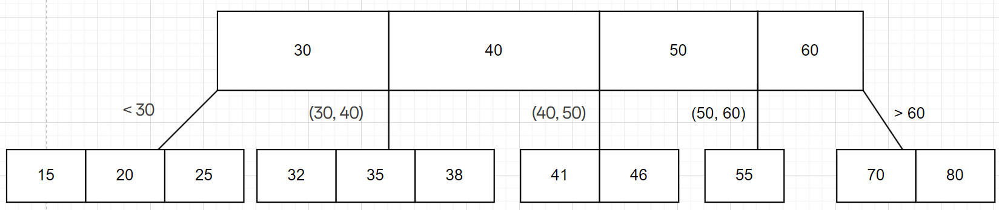
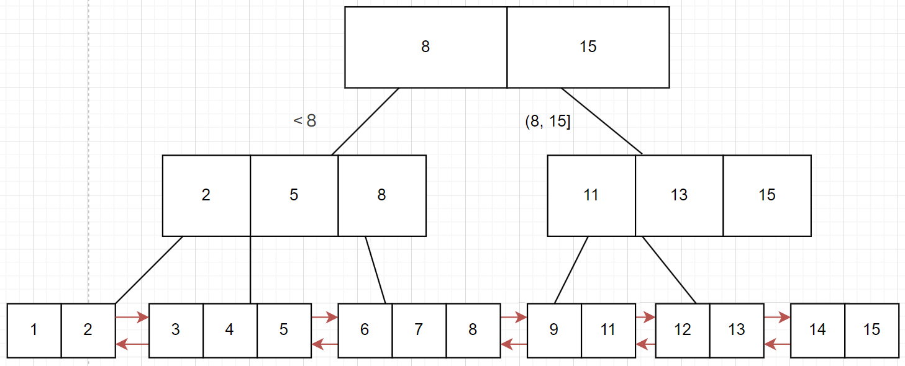

# MySQL索引与事务

## 索引

### 介绍

索引是一种特殊的文件，包含着对数据表里所有记录的引用指针。可以对表中的一列或多列创建索引，并指定索引的类型，各类索引有各自的数据结构实现。索引的特点一般有如下几点：

1. 索引需要额外的硬盘空间来保存
2. 索引可能会影响增删改查的效率，但是大部分情况下都是利大于弊

### 基本使用

在MySQL中，可以使用下面的代码查看一张表已有的索引：

```sql
show index from 表名;
```

默认情况下，创建主键约束、唯一约束和外键约束时，会自动创建对应列的索引

也可以手动为指定列创建索引：

```sql
create index 索引名 on 表名(列名);
```

!!! note

    需要注意，索引是针对列来创建的，在查询条件中的列和索引中的列相匹配时，该列的索引才会生效进而提高效率

如果要删除一个列的索引，可以使用：

```sql
drop index 索引名 on 表名;
```

### 索引的数据结构

索引底层使用的是B+树，在介绍B+树之前，先了解一下何为B树

B树是一种N叉搜索树，因为是N叉，所以每个节点可以有多个子树，进而降低树的高度。对于B树中的每一个节点来说，可以保存多个值（也被成为`key`），根据这些值可以划分出多个区间，每一个区间连接一棵子树，如果有N个`key`，那么对应的就有N + 1个子树，如下图所示：



当进行查找时，例如查找68，就会先比较根节点的值确定68所在区间，因为68>60，所以确定在大于60的区间，后续查找以此类推。这种数据结构虽然降低了树的高度，但是每一个节点的比较次数增加了，然而这个结构最大的特点就在于每个节点有多个值，这样在比较之前取出一个节点到内存中就可以拿到四个值，总体来看就降低了硬盘IO的次数

但是B树对于范围查找来说并不友好，如果是获取一定范围内的所有数据，那么需要对该范围中的每一个数据都进行一次查找，这样做还是会进行比较多的IO，所以在B树的基础上引入了B+树，并对一些细节进行了修改：

1. B+树有N个`key`就有N个子树
2. 父节点的`key`会作为子节点中的最大值存储在子节点中
3. B+树会将所有叶子结点以不带头双向链表的形式进行连接

如下图所示：



因为「父节点的`key`会作为子节点中的最大值存储在子节点中」，所以在B+树中，所有叶子节点构成的数据集合就包括了整棵树的数据，结合「B+树会将所有叶子结点以不带头双向链表的形式进行连接」进行范围查找就会变得非常方便，只需要找到头和尾，剩下的通过遍历链表即可获取到数据

对于数据库来说，非叶子节点只需要存储一个索引的`key`值而不需要存储整行数据，只需要叶子节点保存整行数据即可

## 事务

### 介绍与基本使用

事务指逻辑上的一组操作，组成这组操作的各个语句，要么全部成功，要么全部失败。如果有一条语句失败，那么事务中就会自动进行回滚操作。以下面的例子介绍如何开启和关闭事务：

首先创建一张表如下：

```
+-------+---------------+------+-----+---------+----------------+
| Field | Type          | Null | Key | Default | Extra          |
+-------+---------------+------+-----+---------+----------------+
| id    | int           | NO   | PRI | NULL    | auto_increment |
| name  | varchar(20)   | YES  |     | NULL    |                |
| money | decimal(11,2) | YES  |     | NULL    |                |
+-------+---------------+------+-----+---------+----------------+
```

接着，插入以下数据：

```sql
insert into account(name, money) values
('阿里巴巴', 5000),
('四十大盗', 1000);
```

现在要求四十大盗把从阿里巴巴的账户上偷盗了2000元，正常的SQL语句为：

```sql
-- 阿里巴巴账户减少2000
update account set money=money - 2000 where name = '阿里巴巴';
-- 四十大盗账户增加2000
update account set money=money + 2000 where name = '四十大盗';
```

结合事务：

```sql
start transaction; -- 开启事务
-- 阿里巴巴账户减少2000
update account set money=money - 2000 where name = '阿里巴巴';
-- 四十大盗账户增加2000
update account set money=money + 2000 where name = '四十大盗';
rollback/commit; -- rollback（回滚）即是全部失败，commit（提交）即是全部成功
```

### 事务的基本特性

事务的基本特性包括四个方面：

1. 原子性：事务是一个不可分割的工作单位，事务中的操作要么全部完成，要么全部不做
2. 一致性：事务执行前后，数据库必须处于一致性状态，不会出现非法的临时结果的状态
3. 持久性：一旦事务提交，其对数据库的改变就是永久性的，即硬盘上的数据会被修改
4. 隔离性：多个事务并发执行时，一个事务的执行不应影响其他事务的执行

当有多个客户端同时给数据库服务端提交事务执行时可能会存在以下问题：

1. 脏读：一个事务读取了另一个未提交事务的数据，这个数据可能在最后提交之后有所改变，此时读取的事务读到的数据就是错误的
2. 不可重复读：在同一个事务中，多次读取同一数据返回的结果不同
3. 幻读：在同一个事务中，多次执行同一查询，返回的记录数量不同，但是重复出现的内容还是一致的

对于隔离性来说，在数据库中提供了四个隔离级别：

1. `read uncommitted`：读未提交，会出现脏读、不可重复读、幻读问题
2. `read committed`：读已提交，解决了脏读问题，但是会出现不可重复读、幻读问题（可以理解为给写加锁）
3. `repeatable read`：可重复读，解决了脏读和不可重复读问题，但是会出现幻读问题。**这个级别也是MySQL默认的隔离级别**（可以理解为给读和写都加锁）
4. `serializable`：串行化，解决了所有问题