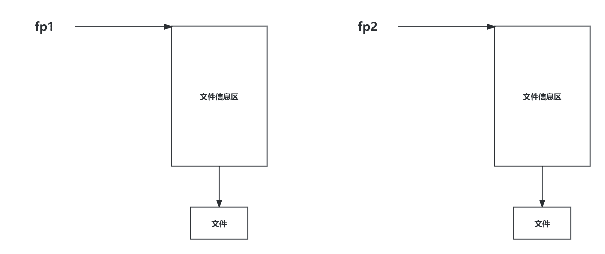
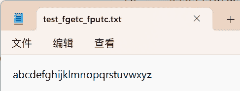

# C语言文件操作

## C语言中的流与文件指针

### C语言中的流

在C语言中，流表示任意输入的源或任意输出的目的地


### 计算机中的读写操作与输入输出操作的关系

在计算机中，读/写操作是相对于计算机而言，而输入/输出操作是相对于人而言

读操作：从键盘/文件中输入数据到输入流中，由计算机从输入流中进行读取

写操作：由计算机向输出流中写入数据，再通过输出流向屏幕/文件中输出数据

!!! tip

    简单理解：

    对于读操作（相对于计算机而言）：用户从键盘/文件中输入数据至流中，CPU需要处理数据首先得有数据，所以计算机需要从流中读取数据

    对于写操作（相对于计算机而言）：计算机当前已经知道需要输出的数据在自己身上以及数据位置，但是人不知道，所以计算要输出数据需要先进行写操作，将数据写入输出流，再输出到屏幕/文件中

### 文件指针

在C语言中，对流的访问是通过文件指针实现的。该指针类型为`FILE*`类型，定义在头文件`stdio.h`

用文件指针表示的特定的流具有标准的名字，如果需要还可以声明其他的一些文件指针

```C
//两个文件指针类型的指针变量
FILE* fp1;
FILE* fp2;
```

可以使`fp1`与`fp2`指向两个文件的文件信息区（文件信息区是⼀个结构体变量）。通过该文件信息区中的信息就能够访问该文件。也就是说，通过文件指针变量能够间接找到与它关联的⽂件

!!! note
    尽管操作系统会限制可以同时打开的流的数量，但是程序可以通过声明任意数量的`FILE*`类型的变量



## C语言中的标准流

### C语言中的标准流

在C语言头文件`stdio.h`中，提供了3个默认流，这三个流的类型是`FILE*`，并且这3个流可以直接使用，不需要对其进行声明，也不用打开或关闭它们

| 文件指针 | 流       | 默认含义 |
| -------- | -------- | -------- |
| `stdin`  | 标准输入 | 键盘     |
| `sdtout` | 标准输出 | 屏幕     |
| `stderr` | 标准错误 | 屏幕     |

## 文件类型

### 程序文件

文件的内容不一定是程序，而是程序运行时读写的数据，例如程序运行需要从中读取数据的文件

程序文件在C语言中包括源程序文件（Windows平台下后缀为`.c`），目标文件（Windows平台下后缀为`.obj`）,可执行程序文件（Windows平台下后缀为`.exe`）

### 数据文件

数据文件表示文件的内容不一定是程序，而是程序运行时读写的数据，例如程序运行时需要从中读取数据的文件，或者输出内容的文件

在C语言头文件`stdio.h`中支持两种数据文件，一种是文本文件，另一种是二进制文件。在文本文件中，字节表示字符，使得用户可以检查或编辑文件，而在二进制文件中，字节不一定表示字符

#### 文本文件

所谓文本文件，即在内存中以二进制形式存储，再以ASCII字符的形式存储到外存的文件

文本文件具有两种特性：

1. 文本文件分为若干行。文本文件的每一行通常以一两个特殊字符结尾，在Windows系统中，行末标记是回车符`\x0d`与一个紧跟其后的回行符`\x0a`
2. 文本文件可以包含一个特殊的“文件末尾”标记，在Windows中，标记为`\x1a`（++ctrl+z++）++ctrl+z++不是必需的，但如果存在，他就标志着文件的结束，其后的所有字节都会被忽略

#### 二进制文件

所谓二进制文件，即数据在内存中以二进制的形式存储，不加转换输出到外存的文件

二进制没有文本文件的两种特性，即二进制文件不会分行，也没有行末标记和文件结尾标记，所有字节都是平等对待

!!! note
    在无法确定文件是文本形式还是二进制形式时，安全的做法是把文件假定为二进制文件

!!! note
    字符不论是文本文件还是二进制文件一律以ASCII形式存储于外存，数值型数据根据需要选择其中一种存储于外存

例如，在外存中存储数值10000


## 文件的打开和关闭

文件在读写之前应该先打开文件，在使用结束之后应该关闭文件

在编写程序的时候，在打开文件的同时，都会返回⼀个`FILE*`的指针变量指向该文件，也相当于建立了指针和文件的关系。

ANSIC规定使用 `fopen` 函数来打开文件， `fclose` 来关闭文件

### 文件的打开`fopen`与关闭`fclose`

```C
//文件打开
函数原型
FILE * fopen ( const char * filename, const char * mode );

参数说明
第一个参数是char*类型的指针，该指针指向文件的文件名，通过该文件名找到文件（如果系统支持路径则可以带上文件路径）
第二个参数是char*类型的指针，该指针指向文件的打开模式

返回类型
函数返回类型是FILE*类型的指针，该指针指向文件内容的开头，如果文件打开失败，则返回NULL，故需要对该指针进行非空检查

//文件关闭
函数原型
int fclose ( FILE * stream );

参数说明
参数为FILE*类型的指针，该指针指向即将关闭的文件流

返回类型
函数返回类型是int类型，如果文件成功关闭，则返回0，否则返回EOF
```

!!! note
    在Windows中，用`.`来表示文件当前路径，用`..`来表示文件当前路径的上一路径，例如，当前路径下的`test.txt`文件，表示为`./test.txt`，当前路径下的上一路径的`test.txt`文件，表示为`./../test.txt`。指定具体路径例如：`C:\data\test.txt`（注意`\`防止与紧随其后的字母形成转义，写成`\\`）

#### 文件打开模式

| 文件使用方式  | 含义                                                         | 如果指定文件不存在 |
| ------------- | ------------------------------------------------------------ | ------------------ |
| "r"（只读）   | 为了输入数据，打卡一个已经存在的文本文件                     | 出错               |
| "w"（只写）   | 为了输出数据，打开一个文本文件（如果指定的文件中有内容，会清空文件的内容） | 建立一个新的文件   |
| "a"（追加）   | 向文本文件尾添加数据                                         | 建立一个新的文件   |
| "rb"（只读）  | 为了输入数据，打开一个二进制文件                             | 出错               |
| "wb"（只写）  | 为了输出数据，打开一个二进制文件                             | 建立一个新文件     |
| "ab" （追加） | 向一个二进制文件尾添加数据                                   | 建立一个新文件     |
| "r+"（读写）  | 为了读和写，打开一个文本文件                                 | 出错               |
| "w+"（读写）  | 为了读和写，建立一个新文件                                   | 建立一个新文件     |
| "a+"（读写）  | 打开一个文件，在文件尾进行读写                               | 建立一个新的文件   |
| "rb+"（读写） | 为了读和写，打开一个二进制文件                               | 出错               |
| "wb+"（读写） | 为了读和写，建立一个新的二进制文件                           | 建立一个新的文件   |
| "ab+"（读写） | 打开一个二进制文件，在文件尾进行读和写                       | 建立一个新文件     |

代码实例：

```C
#include <stdio.h>
int main ()
{
    FILE * pFile;
    //打开文件 
    pFile = fopen ("myfile.txt","w");//默认情况下，代码路径与文件路径相同
    //若打开失败会fopen函数会返回空指针，所以需要对指针进行判断，防止野指针
    //⽂件操作 
    if (pFile!=NULL)
    {
        fputs ("fopen example",pFile);
        //关闭文件 
        fclose (pFile);
        pf = NULL;//需要手动对指针置为空，防止野指针
    }
    return 0;
}
```

## 文件的顺序读写

顺序读写：文件指针依次向后移动进行内容读写操作

### 顺序读写函数

| 函数名    | 功能                               | 适用于     |
| --------- | ---------------------------------- | ---------- |
| `fgetc`   | 字符输入函数（读字符函数）         | 所有输入流 |
| `fputc`   | 字符输出函数（写字符函数）         | 所有输出流 |
| `fgets`   | 文本行输入函数（读文本函数）       | 所有输入流 |
| `fputs`   | 文本行输出函数（写文本函数）       | 所有输出流 |
| `fscanf`  | 格式化输入函数（格式化读操作函数） | 所有输入流 |
| `fprintf` | 格式化输出函数（格式化写操作函数） | 所有输出流 |
| `fread`   | 二进制输入函数（二进制读操作函数） | 文件       |
| `fwrite`  | 二进制输出函数（二进制写操作函数） | 文件       |

!!! note

    所有输入流一般指适用于标准输入流和其他输入流（如文件输入流）

    所有输出流一般指适用于标准输出流和其他输出流（如文件输出流）

### 函数`fgetc`和`fputc`

```C
fgetc
函数原型
int fgetc ( FILE * stream );

参数说明
参数表示FILE*类型的文件指针，该指针指向特定的输入流

返回类型
函数返回int类型的值，该值代表成功读取到的字符，根据ASCII码转换为对应的值

fputc
函数原型
int fputc ( int character, FILE * stream );

参数说明
函数第一个参数为int类型的变量，该变量代表需要输出的字符
函数第二个参数为FILE*类型的文件指针，该指针指向特定的输出流

返回类型
函数返回int类型的值，该值代表成功输出的字符，根据ASCII码转换为对应的值
```

!!! note
    `fgetc`与`fputc`函数针对字符输入和输出，并且`fputc`函数在输出时不会自动换行

代码实例（文件输入流与文件输出流）

```C
#define _CRT_SECURE_NO_WARNINGS 1

#include <stdio.h>
#include <assert.h>

int main()
{
    //fputc
    //打开文件
    //文件输出流
    FILE* pfputc = fopen("test_fgetc_fputc.txt", "w");
    //若文件打开失败会返回空指针，故需要进行判断
    assert(pfputc);

    //向文件中写入26个英文字母
    for (int i = 0; i < 26; i++)
    {
        fputc('a' + i, pfputc);
    }
    //关闭文件
    fclose(pfputc);
    pfputc = NULL;//fclose不会将指针置为空，为避免野指针，需要手动将文件指针置为空

    //fgetc
    //文件输入流
    //打开文件
    FILE* pfgetc = fopen("test_fgetc_fputc.txt", "r");
    assert(pfgetc);

    int ch = 0;
    //从文件中读取26个英文字母
    //fgetc函数正常读到文件结尾会返回EOF
    while ((ch = fgetc(pfgetc)) != EOF)
    {
        printf("%c ", ch);
    }
    //关闭文件
    fclose(pfgetc);
    pfgetc = NULL;

    return 0;
}
输出结果：
a b c d e f g h i j k l m n o p q r s t u v w x y z
```

文件结果：



代码实例（标准输入流与标准输出流）

```C
#define _CRT_SECURE_NO_WARNINGS 1

#include <stdio.h>

int main()
{
    //标准输入流
    //fgetc从标准输入中读取字符，返回该字符的ASCII码
    //fputc将对应字符输出到控制台
    for (int i = 0; i < 3; i++)
    {
        fputc(fgetc(stdin), stdout);//fputc不会自动换行
    }
    return 0;
}
输入：
abc
输出结果：
abc
```

### 函数`fgets`和`fputs`

```C
fgets
函数原型
char * fgets ( char * str, int num, FILE * stream );

参数说明
第一个参数为char*类型的指针，该指针指向流数据的目标位置（即将流中的数据读取到的目标位置）
第二个参数为int类型的变量，改变量代表需要读取的字符个数，该个数为num-1个，因为函数会为\0预留位置
第三个参数为FILE*类型的文件指针，该指针指向特定的输入流

返回类型
函数返回char*类型的指针，该指针指向目标位置的起始地址

fputs
函数原型
int fputs ( const char * str, FILE * stream );

参数说明
第一个参数为char*类型的指针，该指针指向需要写入流中的字符串的起始地址
第二个参数为FILE*类型的文件指针，该指针指向特定的输出流

返回类型
函数返回int类型的值，该值表示函数是否成功写入，成功写入返回非负值，否则返回EOF
```

!!! note
    函数`fgets`和`fputs`针对字符串的输入和输出，并且`fputs`不会自动换行

代码实例（文件输入和输出流）

```C
#define _CRT_SECURE_NO_WARNINGS 1

#include <stdio.h>
#include <assert.h>

int main()
{
    char* str = "abcdefg";
    //fputs
    //文件输出流
    FILE* pfputs = fopen("test_fputs_fgets.txt", "w");
    assert(pfputs);

    fputs(str, pfputs);
    
    //关闭文件
    fclose(pfputs);
    pfputs = NULL;

    //fgets
    //文件输入流
    char arr[10] = { 0 };
    FILE* pfgets = fopen("test_fputs_fgets.txt", "r");
    assert(pfgets);

    fgets(arr, 5, pfgets);//读入4个字符，并为最后的\0留下一个位置，总共5个字符

    fclose(pfgets);
    pfgets = NULL;

    printf("%s\n", arr);

    return 0;
}
输出结果：
abcd
```

文件结果：


代码实例（标准输入和输出流）

```C
#define _CRT_SECURE_NO_WARNINGS 1

#include <stdio.h>

int main()
{
    //标准输入流
    char arr[10] = { 0 };
    fgets(arr, 10, stdin);
    fputs(arr, stdout);

    return 0;
}
输入：
abcdefghijklmn
输出结果：
abcdefghi
```

!!! note
    因为`fgets`函数可以限制读取的字符个数，故在输入字符串至数组中，可以在一定程度上确保不会出现数组越界，而`scanf`不可以，故可以用`fgets`函数代替`scanf`输入字符串

### 函数`fscanf`与`fprintf`

```C
fscanf
函数原型
int fscanf ( FILE * stream, const char * format, ... );

参数说明
第一个参数为FILE*类型的文件指针，该指针指向特定的输入流
第二个参数为可变参数列表

返回类型
函数返回int类型的值，该值表示成功读取到数据的占位符的个数

fprintf
函数原型
int fprintf ( FILE * stream, const char * format, ... );

参数说明
第一个参数为FILE*类型的文件指针，该指针指向特定的输出流
第二个参数为可变参数列表

返回类型
函数返回int类型的值，该值表示成功输出的字符个数
```

代码实例（文件输入和输出流）

```C
#define _CRT_SECURE_NO_WARNINGS 1

#include <stdio.h>
#include <assert.h>
#include <stdlib.h>

struct test
{
    int age;
    char name[20];
    double score;
};

int main()
{
    //fprintf
    //文件输出流
    FILE* pfprintf = fopen("test_fprintf_fscanf.txt", "w");
    
    if (pfprintf == NULL)
    {
        perror("pfprintf");
        return EXIT_FAILURE;//相当于return 1，对应的return 0有return EXIT_SUCCESS
    }

    struct test p = {20, "Mark Watney", 90.5};
    fprintf(pfprintf, "%d %.1f %s", p.age, p.score, p.name);

    //关闭文件
    fclose(pfprintf);
    pfprintf = NULL;
    
    //fscanf
    //文件输入流
    FILE* pfscanf = fopen("test_fprintf_fscanf.txt", "r");

    if (pfscanf == NULL)
    {
        perror("pfscanf");
        return EXIT_FAILURE;
    }

    struct test p1 = {0};
    fscanf(pfscanf, "%d %lf %s", &(p1.age), &(p1.score), p1.name);

    //关闭文件
    fclose(pfscanf);
    pfscanf = NULL;

    printf("%d %.1f %s", p1.age, p1.score, p1.name);

    return 0;
}
输出结果：
20 90.5 Mark
```

文件结果：


代码实例（标准输入和输出流）

```C
#define _CRT_SECURE_NO_WARNINGS 1

#include <stdio.h>

int main()
{
    //标准输入和输出流
    int age = 0;
    char c = 0;
    double d = 0.0;
    fscanf(stdin, "%d %c %lf", &age, &c, &d);
    fprintf(stdout, "%d %c %.1f", age, c, d);

    return 0;
}
输入：
20 a 90.5
输出结果：
20 a 90.5
```

### 函数`fread`与`fwrite`

```C
fread
函数原型
size_t fread ( void * ptr, size_t size, size_t count, FILE * stream );

参数说明
第一个参数为void*类型的指针，该指针指向读取的数据需要存储到的目标地址
第二个参数为size_t类型的变量，该变量表示数据类型在内存中占用的大小
第三个参数为size_t类型的变量，该变量表示需要读取的数据的个数
第四个参数为FILE*类型的文件指针，该指针指向文件输入流

返回类型
函数返回size_t类型的值，该值表示成功读到的数据个数

fwrite
函数原型
size_t fwrite ( const void * ptr, size_t size, size_t count, FILE * stream );

参数说明
第一个参数为void*类型的指针，该指针指向需要写入目标文件流的数据的地址
第二个参数为size_t类型的变量，该变量表示数据类型在内存中占用的大小
第三个参数为size_t类型的变量，该变量表示需要读取的数据的个数
第四个参数为FILE*类型的文件指针， 该指针指向文件输出流

返回类型
函数返回size_t类型的值，该值表示成功写入的数据个数
```

代码实例（文件输入和输出流）

!!! note
    函数`fread`和`fwrite`只能用于文件的输入和输出流，不可以用于其他输入和输出流

```C
#define _CRT_SECURE_NO_WARNINGS 1

#include <stdio.h>
#include <assert.h>
#include <stdlib.h>

struct test
{
    int age;
    char name[20];
    double score;
};

int main()
{
    //fwrite
    //文件输出流
    struct test p = { .age = 20, .name = "Peter Parker", .score = 90.5 };
    FILE* pfwrite = fopen("test_fwrite_fread.txt", "wb");

    assert(pfwrite);

    fwrite(&p, sizeof(p), 1, pfwrite);

    fclose(pfwrite);
    pfwrite = NULL;

    //fread
    //文件输入流
    struct test p1 = { 0 };
    FILE* pfread = fopen("test_fwrite_fread.txt", "rb");
    
    assert(pfread);

    fread(&p1, sizeof(p1), 1, pfread);

    fclose(pfread);
    pfread = NULL;

    printf("%d %.1f %s", p1.age, p1.score, p1.name);

    return 0;
}
输出结果：
20 90.5 Peter Parker
```

文件结果：


### 函数`printf`/`scanf`、`fprintf`/`fscanf`和`sprintf`/`sscanf`对比

| 函数名    | 功能                                       | 使用于                   |
| --------- | ------------------------------------------ | ------------------------ |
| `printf`  | 格式化输出函数                             | 标准输出流               |
| `scanf`   | 格式化输入函数                             | 标准输入流               |
| `fprintf` | 格式化输出函数                             | 所有输出流               |
| `fscanf`  | 格式化输入函数                             | 所有输入流               |
| `sprintf` | 将格式化数据转化成字符串                   | 存在可格式化数据         |
| `sscanf`  | 将字符串转化成格式化数据，遇到空格停止读取 | 字符串中存在可格式化数据 |

```C
sscanf
函数原型
int sscanf ( const char * s, const char * format, ...);

参数说明
第一个参数为char*类型的指针，该指针指向待转化为格式化数据的字符串的地址
第二个参数为可变参数列表

返回类型
函数返回int类型的值，该值表示成功读取到数据的占位符的个数

sprintf
函数原型
int sprintf ( char * str, const char * format, ... );

参数说明
第一个参数为char*类型的指针，该指针指向将格式化数据转换成功后的字符串的起始地址
第二个参数为可变参数列表

返回类型
函数返回int类型的值，该值表示成功打印的字符个数
```

代码实例

```C
#define _CRT_SECURE_NO_WARNINGS 1

#include <stdio.h>
#include <assert.h>
#include <stdlib.h>

enum
{
    SIZE = 5
};

struct test
{
    int age;
    char name[20];
    double score;
};

int main()
{
    //ssprintf
    struct test p = { .age = 20, .name = "Sherlock Holmes", .score = 90.5 };
    char arr[50] = { 0 };
    sprintf(arr, "%d %s %.1f", p.age, p.name, p.score);
    printf("%s\n", arr);

    //sscanf
    struct test p1 = { 0 };
    char* s = "30 John 95.5";
    sscanf(s, "%d %s %lf", &(p1.age), p1.name, &(p1.score));//sscanf的占位符顺序需要与字符串中的数据类型顺序相同，并且sscanf读到空格时表示当前占位符已经读完，读下一个数据填充占位符直到填满占位符
    //sscanf(s, "%s %d %lf", p1.name, &(p1.age), &(p1.score));//读不到数据
    //char* s = "30 John Watson 95.5"
    //sscanf(s, "%d %s %lf", &(p1.age), p1.name, &(p1.score))//读到John时，填充%s，接着将会将读Watson，但是Watson不属于%f可识别的内容，故%f读取不到内容，当前缓冲区还有Watson和95.5
    printf("%d %.1f %s\n", p1.age, p1.score, p1.name);

    return 0;
}
输出结果：
20 Sherlock Holmes 90.5
30 95.5 John
```

## 文件随机读写

随机读写：按照用户需求，指定文件指针的位置，以该位置为标准进行读写

### 函数`fseek`

函数作用：根据文件指针的位置和偏移量来定位文件指针

```C
函数原型
int fseek ( FILE * stream, long int offset, int origin );

参数说明
第一个参数为FILE*类型的文件指针，该指针指向文件输入和输出流
第二个参数为long int类型的变量，该变量表示偏移量，即指针移动到指定位置需要的值
第三个参数为int类型的变量，该变量表示开始计算偏移量的文件指针起始位置，包括SEEK_CUR（文件指针当前位置）、SEEK_SET（文件起始位置）、SEEK_END（文件末尾位置）

返回类型
函数返回int类型的值，当函数成功回到指定位置函数返回0，否则返回非0值
```

代码实例

```C
#define _CRT_SECURE_NO_WARNINGS 1

#include <stdio.h>
#include <assert.h>
int main()
{
    //fseek
    FILE* p = fopen("test_fseek.txt", "w");
    assert(p);

    for (int i = 0; i < 26; i++)
    {
        fputc('a' + i, p);
    }

    fclose(p);
    p = NULL;
    
    FILE* pfseek = fopen("test_fseek.txt", "r");
    //当前光标在第一个字符前
    char ch = fgetc(pfseek);
    printf("%c ", ch);//打印a

    //当前光标在第二个字符前
    ch = fgetc(pfseek);
    printf("%c ", ch);//打印b

    //当前光标在第三个字符前
    ch = fgetc(pfseek);
    printf("%c ", ch);//打印c

    //当前光标在第四个字符前
    ch = fgetc(pfseek);
    printf("%c ", ch);//打印d

    //使光标从当前位置到文件起始位置
    fseek(pfseek, -4, SEEK_CUR);//从SEEK_CUR开始计算偏移量，当前光标在d位置，在当前位置前面有4个字符，传入-4值
    ch = fgetc(pfseek);
    printf("%c ", ch);//打印a

    //使光标从起始位置到文件中某一位置
    fseek(pfseek, 8, SEEK_SET);//从SEEK_SET开始计算偏移量，当前光标在起始位置，在当前位置向后跳过8个字符，打印第9个字符，传入8
    ch = fgetc(pfseek);
    printf("%c ", ch);//打印h

    fclose(pfseek);
    pfseek = NULL;

    return 0;
}
输出结果：
a b c d a i
```

### 函数`ftell`

函数作用：返回文件指针相对于起始位置的偏移量

```C
函数原型
long int ftell ( FILE * stream );

参数说明
函数参数为FILE*类型的文件指针，该指针指向文件的输入和输出流

返回类型
函数返回long int类型的值，该值表示文件指针相对于起始位置的偏移量，错误时返回-1L
```

代码实例

```C
#define _CRT_SECURE_NO_WARNINGS 1

#include <stdio.h>
#include <assert.h>
#include <stdlib.h>

struct test
{
    int age;
    char name[20];
    double score;
};

int main()
{
    //fseek
    FILE* p = fopen("test_fseek.txt", "w");
    assert(p);

    for (int i = 0; i < 26; i++)
    {
        fputc('a' + i, p);
    }

    fclose(p);
    p = NULL;
    
    FILE* pfseek = fopen("test_fseek.txt", "r");
    //当前光标在第一个字符前
    char ch = fgetc(pfseek);
    printf("%c ", ch);//打印a

    //当前光标在第二个字符前
    ch = fgetc(pfseek);
    printf("%c ", ch);//打印b

    //当前光标在第三个字符前
    ch = fgetc(pfseek);
    printf("%c ", ch);//打印c

    //当前光标在第四个字符前
    ch = fgetc(pfseek);
    printf("%c ", ch);//打印d

    //使光标从当前位置到文件起始位置
    //fseek(pfseek, -4, SEEK_CUR);//从SEEK_CUR开始计算偏移量，当前光标在d位置，在当前位置前面有4个字符，传入-4值
    //ch = fgetc(pfseek);
    //printf("%c ", ch);//打印a
    //使用ftell函数确定偏移量
    fseek(pfseek, -ftell(pfseek), SEEK_CUR);
    ch = fgetc(pfseek);
    printf("%c ", ch);

    fclose(pfseek);
    pfseek = NULL;

    return 0;
}
输出结果：
a b c d a
```

### 函数`rewind`

函数作用：让文件指针回到文件的起始位置

```C
#define _CRT_SECURE_NO_WARNINGS 1

#include <stdio.h>
#include <assert.h>
#include <stdlib.h>

struct test
{
    int age;
    char name[20];
    double score;
};

int main()
{
    //fseek
    FILE* p = fopen("test_fseek.txt", "w");
    assert(p);

    for (int i = 0; i < 26; i++)
    {
        fputc('a' + i, p);
    }

    fclose(p);
    p = NULL;
    
    FILE* pfseek = fopen("test_fseek.txt", "r");
    //当前光标在第一个字符前
    char ch = fgetc(pfseek);
    printf("%c ", ch);//打印a

    //当前光标在第二个字符前
    ch = fgetc(pfseek);
    printf("%c ", ch);//打印b

    //当前光标在第三个字符前
    ch = fgetc(pfseek);
    printf("%c ", ch);//打印c

    //当前光标在第四个字符前
    ch = fgetc(pfseek);
    printf("%c ", ch);//打印d

    //使光标从当前位置到文件起始位置
    //fseek(pfseek, -4, SEEK_CUR);//从SEEK_CUR开始计算偏移量，当前光标在d位置，在当前位置前面有4个字符，传入-4值
    //ch = fgetc(pfseek);
    //printf("%c ", ch);//打印a
    //使用ftell函数确定偏移量
    //fseek(pfseek, -ftell(pfseek), SEEK_CUR);
    //ch = fgetc(pfseek);
    //printf("%c ", ch);
    //使用rewind函数使光标从当前位置回到文件起始位置
    rewind(pfseek);
    ch = fgetc(pfseek);
    printf("%c ", ch);

    fclose(pfseek);
    pfseek = NULL;

    return 0;
}
输出结果：
a b c d a
```

## 文件读取结束后的原因判定

### 函数`feof`

函数作用：当文件读取结束的时候（已知文件读取结束），判断是读取结束的原因是否是：遇到文件末尾结束

!!! note
    在文件读取过程中，不能用`feof`函数的返回值直接来判断文件的是否结束

### 函数`ferror`

函数作用：当文件读取结束的时候（已知文件读取结束），用于检测在读取或写入文件时是否发生错误。如果在进行文件操作时发生错误，`ferror`函数会返回非零值

### 文本文件中的错误判定

文本文件读取是否结束，判断返回值是否为 `EOF` ，或者 `NULL` 

例如：

- `fgetc` 判断是否为 `EOF`
- `fgets` 判断返回值是否为 `NULL`

代码实例

```C
#define _CRT_SECURE_NO_WARNINGS 1

#include <stdio.h>

int main()
{
    int c = 0;
    FILE* fp = fopen("test_feof_text.txt", "r");
    if (!fp) {
        perror("File opening failed");
        return EXIT_FAILURE;
    }
    //fgetc 当读取失败的时候或者遇到文件结束的时候，都会返回EOF 
    while ((c = fgetc(fp)) != EOF)
    {
        putchar(c);
    }
    //判断是什么原因结束的 
    if (ferror(fp))
        puts("I/O error when reading");
    else if (feof(fp))
        puts("End of file reached successfully");

    fclose(fp);
    fp = NULL;

    return 0;
}
输出结果：
End of file reached successfully
```

### 二进制文件的错误判定

函数作用：二进制文件的读取结束判断，判断返回值是否小于预期中要读的个数

例如：

`fread`判断返回值是否小于预期中要读的个数

代码实例

```C
#define _CRT_SECURE_NO_WARNINGS 1

#include <stdio.h>
#include <assert.h>
#include <stdlib.h>

enum
{
    SIZE = 5
};

struct test
{
    int age;
    char name[20];
    double score;
};

int main()
{
    double a[SIZE] = { 1.,2.,3.,4.,5. };
    FILE* fp = fopen("test.bin", "wb");
    fwrite(a, sizeof * a, SIZE, fp);
    fclose(fp);
    double b[SIZE];
    fp = fopen("test.bin", "rb");
    size_t ret_code = fread(b, sizeof * b, SIZE, fp);

    if (ret_code == SIZE)
    {
        puts("Array read successfully, contents: ");
        for (int n = 0; n < SIZE; ++n) 
        {
            printf("%.1f ", b[n]);
        }
            
        putchar('\n');
    }
    else 
    {
        if (feof(fp))
            printf("Error reading test.bin: unexpected end of file\n");
        else if (ferror(fp))
        {
            perror("Error reading test.bin");
        }
    }

    fclose(fp);
    fp = NULL;

    return 0;
}
输出结果：
Array read successfully, contents:
1.0 2.0 3.0 4.0 5.0
```

## 文件缓冲区

ANSIC标准采用“缓冲文件系统”处理的数据文件的，所谓缓冲文件系统是指系统自动地在内存中为
程序中每⼀个正在使用的文件开辟一块“文件缓冲区”。从内存向磁盘输出数据会先送到内存中的缓
冲区，装满缓冲区后才⼀起送到磁盘上。如果从磁盘向计算机读入数据，则从磁盘文件中读取数据输
入到内存缓冲区（充满缓冲区），然后再从缓冲区逐个地将数据送到程序数据区（程序变量等）。缓
冲区的大小根据C编译系统决定


代码演示

```C
#include <stdio.h>
#include <windows.h>
//VS2022 Win11环境测试 
int main()
{
        FILE*pf = fopen("test.txt", "w");
        fputs("abcdef", pf);//先将代码放在输出缓冲区 
        printf("睡眠10秒-已经写数据了，打开test.txt⽂件，发现⽂件没有内容\n");
        Sleep(10000);
        printf("刷新缓冲区\n");
        fflush(pf);//刷新缓冲区时，才将输出缓冲区的数据写到⽂件（磁盘） 
        printf("再睡眠10秒-此时，再次打开test.txt⽂件，⽂件有内容了\n");
        Sleep(10000);
        fclose(pf);
        //注：fclose在关闭⽂件的时候，也会刷新缓冲区 
        pf = NULL;
        return 0;
}
输出结果：
睡眠10秒-已经写数据了，打开test_fflush.txt文件，发现文件没有内容
刷新缓冲区
再睡眠10秒-此时，再次打开test_fflush.txt文件，文件有内容了
```

刷新缓冲区之前：


刷新缓冲区之后：


!!! tip
    因为有缓冲区的存在，C语言在操作文件的时候，需要做刷新缓冲区或者在文件操作结束的时候使用`fclose`函数关闭文件来对缓冲区进行刷新