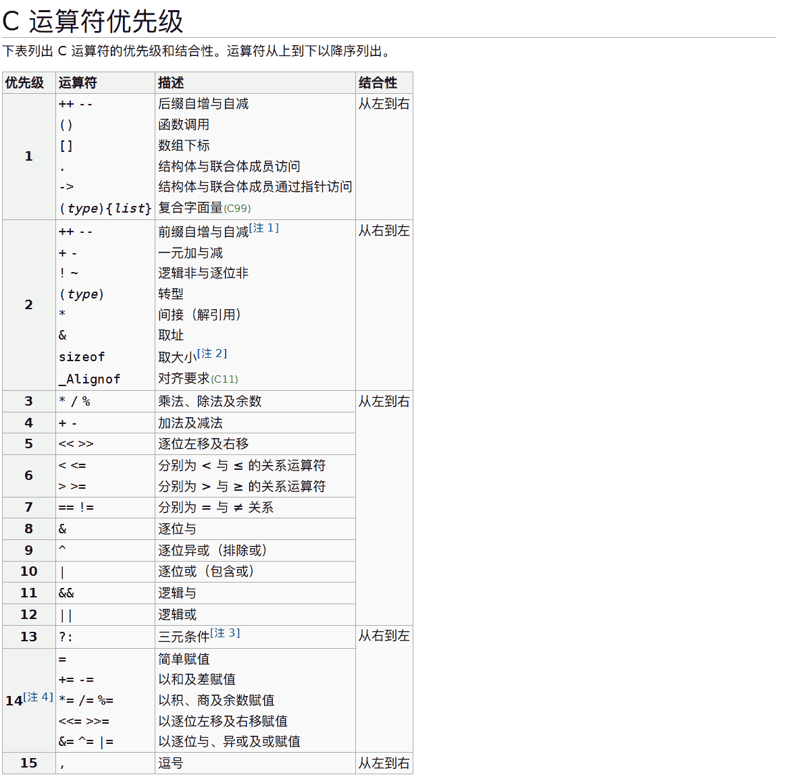

<!-- 添加对Katex的支持 -->
<script defer src="/javascripts/katex.min.js"></script>
<script defer src="https://cdn.jsdelivr.net/npm/katex@0.16.21/dist/katex.min.js"></script>
<script defer src="https://cdn.jsdelivr.net/npm/katex@0.16.21/dist/contrib/auto-render.min.js"></script>

<script defer src="/javascripts/waline.min.js"></script>
<link rel="stylesheet" href="https://unpkg.com/@waline/client@v3/dist/waline.css" />
<link rel="stylesheet" href="/stylesheets/waline.min.css" />

# C语言操作符

## 操作符分类

- 算术操作符： `+` 、`-`  、`*` 、`/` 、`%`
- 移位操作符: `<<` 、`>>` 
- 位操作符: `&` 、`|`、 `^`、`~`
- 赋值操作符: `=`  、`+=` 、 `-=` 、 `*=` 、 `/=` 、`%=` 、`<<=` 、`>>=` 、`&=` 、`|=` 、`^=` 
- 单目操作符： `！`、`++`、`--`、`&`、`*`、`+`、`-`、`~` 、`sizeof`、`(类型)`
- 关系操作符: `>` 、`>=` 、`<` 、`<=` 、 `==` 、 `!=` 
- 逻辑操作符： `&&` 、`||`
- 条件操作符： `? :`
- 逗号表达式： `,`
- 下标引用： `[]`
- 函数调用： `()`
- 结构成员访问： `.` 、`->`

## 算术操作符（运算符）：`+、-、*、/、%`

### `+`和`-`运算符

`+`和`-`分别用来做加法和减法运算

`+` 和 `-` 都是有2个操作数的，位于操作符两端的就是它们的操作数，这种操作符也叫双目操作符

```C
#define _CRT_SECURE_NO_WARNINGS 1

#include <stdio.h>

int main()
{
    int a = 10;
    int b = 20;
    int sum = 0;
    int sub = 0;

    sum = a + b;//加法运算符
    sub = a - b;//减法运算符

    printf("%d %d\n", sum, sub);

    return 0;
}
输出结果：
30 -10
```

### `*`运算符

`*`运算符用来做乘法运算

同样，`*`运算符也是双目运算符，有两个操作数

```C
#define _CRT_SECURE_NO_WARNINGS 1

#include <stdio.h>

int main()
{
    int a = 10;
    int b = 20;
    int times = 0;
    times = a * b;//乘法运算符

    printf("%d\n", times);

    return 0;
}
输出结果：
200
```

### `/`运算符

`/`运算符用来计算两个数相除获得的商值

!!! note
    `/`运算符可以计算两个整数相除后的结果，但是如果两个整数相除有余数时，`/`运算符会丢掉余数只得到商值，如果想要得到余数则需要采用浮点数运算，并且只需要有一个数值是浮点类型即可

```C
#define _CRT_SECURE_NO_WARNINGS 1

#include <stdio.h>

int main()
{
    int c = 6;
    int d = 4;
    double c1 = 6.0;
    double d1 = 4.0;
    int quotient_by = 0;
    double quotient_by1 = 0;

    quotient_by = c / d;//求商除法（整型情况下）
    quotient_by1 = c1 / d1;//求商除法（被除数和除数都是浮点情况下）
    
    printf("%d\n", quotient_by);
    printf("%.1f\n", quotient_by1);

    printf("%.1f\n", c1 / d);//被除数是浮点数，除数是整数
    printf("%.1f\n", c / d1);//被除数是整数，除数是浮点数

    return 0;
}
输出结果：
1
1.5
1.5
1.5
```

### `%`运算符

`%`运算符计算两个整数相除得到的余数，并且`%`运算符不可以用于浮点数

!!! note
    取模操作符本质是找出被除数比除数大的部分，并且余数的数据范围为0 ~ 除数值 - 1

```C
#define _CRT_SECURE_NO_WARNINGS 1

#include <stdio.h>

int main()
{
    int c = 6;
    int d = 4;
    int quotient_rem = 0;

    quotient_rem = c % d;//求余运算（两个数必须是整数）

    printf("%d\n", quotient_rem);
    
    return 0;
}
输出结果：
2
```

对于负数求模运算来说，结果的正负号由第⼀个运算数的正负号决定

```C
#define _CRT_SECURE_NO_WARNINGS 1

#include <stdio.h>

int main()
{
    int c = 6;
    int d = 4;
    int c2 = -6;
    int d2 = -4;

    printf("%d\n", c % d2);//算出余数值为正，第一个运算数为正整数
    printf("%d\n", c2 % d2);//算出余数值为负，第一个运算数为负整数
    printf("%d\n", c2 % d);//算出余数值为负，第一个运算数为负整数

    return 0;
}
输出结果：
2
-2
-2
```

## 赋值运算符：`=`

在变量创建的时候给⼀个初始值叫初始化，在变量创建好后，再给⼀个值叫赋值

```C
int a = 10;//初始化
int b;
b = 10;//赋值
```

赋值操作符 `=` 是⼀个随时可以给变量赋值的操作符

!!! note
    赋值运算符的返回值为赋值运算符左侧变量中的值

### 连续赋值

赋值运算符可以连续赋值

```C
int a = 3;
int b = 5;
int c = 0;
c = b = a+3;//连续赋值，从右向左依次赋值的。
            //先计算a+3给b，再将b赋值给a
            //虽然⽀持这种连续赋值，但是写出的代码不容易理解，建议还是拆开来写，这样⽅便观  察代码的执⾏细节
//建议写法
b = a + 3;
c = b;
```

### 复合赋值符`++`、`--`

`++`表示对一个变量进行自增操作

```C
//使用常规的算术运算符自增操作
a = a + 10;
//使用自增运算符进行自增操作
a += 10;
```

代码实例：

```C
#define _CRT_SECURE_NO_WARNINGS 1

#include <stdio.h>

int main()
{
    int a = 10;

    printf("%d\n", a++);//先使用a，在对a自增，故此处打印10
    printf("%d\n", a);//此时由于a刚才进行了自增，故此处打印11
    printf("%d\n", ++a);//先对a自增，在使用a，此时打印12
    printf("%d\n", a);//此时由于刚才a已经进行了自增，故此处打印12

    return 0;
}
输出结果：
10
11
12
12
```

`--`表示对一个变量进行自减操作

```C
//使用常规的算术运算符自减操作
a = a - 10;
//使用自减运算符进行自减操作
a -=10;
```

代码实例：

```C
#define _CRT_SECURE_NO_WARNINGS 1

#include <stdio.h>

int main()
{
    int a = 10;

    printf("%d\n", a--);//先使用a，在对a自减，故此处打印10
    printf("%d\n", a);//此时由于a刚才进行了自减，故此处打印9
    printf("%d\n", --a);//先对a自减，在使用a，此时打印8
    printf("%d\n", a);//此时由于刚才a已经进行了自减，故此处打印8

    return 0;
}
```

C语言常见的符合赋值符

```C
+=        -=
*=        /=        %=
>>=       <<=
&=        |=        ^=
```

## 单目操作符：`++`、`--`、`+`、`-`、`sizeof`

单目操作符指只有一个操作数

```C
++`表示变量自增1，并且区分前置`++`和后置`++
a = a + 1;
a++;//后置++，先使用，后+1
++a;//先+1，后使用
--`表示变量自减1，并且区分前置`--`和后置`--
a = a - 1;
a--;//后置--，先使用，后-1
--a;//前置--，先-1，后使用
```

`+`和`-`单独使用表示数值的正负，属于单目运算符，并且表示正数时`+`可以省略

```C
//+运算符
int a = +10;
//等价于
int a = 10;

//-运算符
//对于-运算符，在负数前面加-可以使负数变为正数，在正数前面加-可以使正数变为负数
int a = 10;
int b = 0;
b = -a;//此时b中存的是-10
int c = 0;
c = -b;//此时c中存的是-(-)10，即10
```

### `sizeof`运算符

在C语言中使用`sizeof`关键字（也是操作符）来计算一个类型在内存中占用的大小，返回类型是`size_t`，单位是字节。

`sizeof` 操作符的操作数可以是类型，也可是变量或者表达式

```C
sizeof (数据类型)
sizeof 表达式
```

- `sizeof` 的操作数如果不是类型，是表达式的时候，可以省略掉后边的括号的

```C
#define _CRT_SECURE_NO_WARNINGS 1

#include <stdio.h>

int main()
{
    int a = 10;
    int b = 10;
    size_t sz_specific_type = sizeof(int);//类型需要加括号
    size_t sz_formula = sizeof a;//变量可以不加括号
    size_t sz_formula_1 = sizeof(a);//变量也可以加括号
    size_t sz_formula_2 = sizeof(a + b);//表达式可以加括号
    size_t sz_formula_3 = sizeof a + b;//表达式也可以不加括号，但是会按照从左往右的运算顺序先算sizeof(a)再+b后的值
    printf("%zd %zd %zd %zd %zd", sz_specific_type, sz_formula, sz_formula_1, sz_formula_2, sz_formula_3);
    return 0;
}
输出结果：
4 4 4 4 14
```

- `sizeof`中的表达式不计算

```C
#define _CRT_SECURE_NO_WARNINGS 1

#include <stdio.h>
int main()
{
    short s = 2;
    int d = 10;
    printf("%zd\n", sizeof(s = d + 1));
    printf("%zd\n", sizeof(s + d));//short类型在表达式中会进行整型提升，此时sizeof(s+d)相当于计算sizeof(int)
    printf("s = %d\n", s);//s中的值依旧是2，而不是d+1算出的11，而因为s是short类型，故sizeof(s = d + 1)相当于算的是sizeof(short)（最后以表达式左侧数据为准）
    return 0;
}
输出结果：
2
4
s = 2
```

!!! note

    关于`size_t`类型：

    `sizeof` 运算符的返回值，C语言只规定是无符号整数，并没有规定具体的类型，而是留给系统自己去决定， `sizeof` 到底返回什么类型。不同的系统中，返回值的类型有可能是`unsigned int` ，也有可能是 `unsigned long` ，甚⾄是 `unsigned long long` ，对应的 `printf()` 占位符分别是 `%u` 、 `%lu` 和 `%llu` 。这样不利于程序的可移植性。C语言提供了⼀个解决方法，创造了⼀个类型别名 `size_t` ，用来统⼀表⽰ `sizeof` 的返回值类型。对应当前系统的 `sizeof` 的返回值类型，可能是 `unsigned int` ，也可能是`unsigned long long`

## 移位操作符：`<<`、`>>`

!!! note
    移位操作符的操作数只能是整数，并且都是在数值的补码上进行操作再转成原码

### 左移操作符`<<`

移位规则：左边抛弃、右边补0

```C
#define _CRT_SECURE_NO_WARNINGS 1

#include <stdio.h>

int main()
{
    int num = 10;
    int n = num << 1;
    printf("n = %d\n", n);
    printf("num = %d\n", num);//左移操作符不会改变原来的数值

    return 0;
}
输出结果：
n = 20
num = 10
```


!!! tip
    左移快速计算：$当前数值\times2^{移位次}$，例如`8 << 2` = $8\times2^2$ = 32

### 右移操作符`>>`

移位规则：

右移运算分两种：

1. 逻辑右移：左边用0填充，右边丢弃

2. 算术右移：左边用原该值的符号位填充，右边丢弃（大部分都是算术右移）

    !!! tip
        算术右移快速计算：$当前数值 / 2^{移位次}$，例如`8 >> 2` = $8 / 2^2$ = 2
        
        如果无法整除，则向下取整
        
        `9 >> 2` = 2，`-9 >> 2` = -3

```C
//对于正数，右移时左边补0
#define _CRT_SECURE_NO_WARNINGS 1

#include <stdio.h>

int main()
{
    int num = 10;
    int n = num >> 1;
    printf("n= %d\n", n);
    printf("num= %d\n", num);//右移操作符不改变原来的数值

    return 0;
}
输出结果：
n= 5
num= 10
```


```C
//对于负数，右移时左边补1
#define _CRT_SECURE_NO_WARNINGS 1

#include <stdio.h>

int main()
{
    int num = -5;
    int n = num >> 1;
    printf("n= %d\n", n);
    printf("num= %d\n", num);//右移操作符不改变原来的数值

    return 0;
}
输出结果：
n= -3
num= -5
```


!!! note
    对于移位运算符，不要移动负数个数的二进制位，这个是标准未定义的

### 循环中的左移和右移

```C
#define _CRT_SECURE_NO_WARNINGS 1

#include <stdio.h>

int main()
{
    //循环中的右移
    int num = 32;
    for (int i = 0; i < 8; i++)
    {
        printf("%d ", num >> i);//由于右移操作符不改变原来num中的值，当i = 1时，num向右移动1位，当i = 2时，num向右移动2位（相当于在移动一位之后的基础上再移动1位），以此类推
    }

    putchar('\n');

    //循环中的左移
    for (int i = 0; i < 8; i++)
    {
        printf("%d ", num << i);//由于左移操作符不改变原来num中的值，当i = 1时，num向左移动1位，当i = 2时，num向左移动2位（相当于在左移一位的基础上再向左移动一位）
    }

    return 0;
}
输出结果：
32 16 8 4 2 1 0 0
32 64 128 256 512 1024 2048 4096
```

循环中的右移分析


循环中的左移分析


## 关系操作符: `>` 、`>=` 、`<` 、`<=` 、 `==` 、 `!=` 

- `>` 大于运算符
- `<` 小于运算符
- `>=` 大于等于运算符
- `<=` 小于等于运算符
- `==` 相等运算符
- `!=` 不相等运算符

关系表达式通常返回 0 或 1 ，表示真假。在C语言中， 0 表示假，所有非零值表示真。比如， `20 > 12` 返回 1 ， `12 > 20` 返回 0

- 为了防止出现将相等运算符 `==` 写成赋值运算符`=`的错误，可以将变量写在等号的右边

```C
if(3 == x)
{
    //语句
}
if(3 = x)//赋值运算符规定其左侧必须是可以修改的左值，故3 = x写法会报错
{
    //语句
}
```

- 多个关系运算符不宜连用

```C
i < y < z;//不建议这样写，因为关系运算符是从左到右计算，故会被解析为(i < y) < z，如果i<y为真，则返回一个非零值和z比较大小，如果为假，返回0和z比较大小
```

## 条件运算符（三目操作符）

条件操作符也叫三目操作符，需要接受三个操作数

```C
表达式1 ? 表达式2 : 表达式3
```

条件操作符的计算逻辑是：如果表达式1为真，表达式2计算，表达式2计算的结果是整个表达式的结果；如果表达式1为假， 表达式3计算，表达式3计算的结果是整个表达式的结果

```C
#define _CRT_SECURE_NO_WARNINGS 1

#include <stdio.h>

int main()
{
    int num = 3;
    int num1 = 5;
    printf("%d\n", num > num1 ? num : num1);
    int ret = num > num1 ? num : num1;
    printf("%d\n", ret);//条件表达式计算的结果即为满足条件的表达式的结果
    return 0;
}
输出结果：
5
5
```

## 逻辑操作符：`&&`、`||`、`！`

逻辑运算符提供逻辑判断功能，⽤于构建更复杂的表达式，主要有下⾯三个运算符。

- `!`：逻辑取反运算符（改变单个表达式的真假）
- `&&` ：与运算符，就是并且的意思（两侧的表达式都为真，则为真，否则为假）
- `||` ：或运算符，就是或者的意思（两侧至少有⼀个表达式为真，则为真，否则为假）

### 逻辑与`&&`操作符

计算规则：两边同时为真才为真，否则为假

| a    | b    | `a && b` |
| ---- | ---- | -------- |
| 0    | 0    | 0        |
| 0    | 非0  | 0        |
| 非0  | 0    | 0        |
| 非0  | 非0  | 1        |

### 逻辑或`||`操作符

计算规则：两边有一个为真就为真，两边同时为假才为假

| a    | b    | `a || b` |
| ---- | ---- | -------- |
| 0    | 0    | 0        |
| 0    | 非0  | 1        |
| 非0  | 0    | 1        |
| 非0  | 非0  | 1        |

### 逻辑取反`!`操作符

计算规则：将真表达式取假，将假表达式取真

| a    | `! a` |
| ---- | ----- |
| 0    | 1     |
| 非0  | 0     |

### 短路问题

C语言逻辑运算符还有⼀个特点，它总是先对左侧的表达式求值，再对右边的表达式求值，如果左边的表达式满足逻辑运算符的条件，就不再对右边的表达式求值，这种情况称为“短路”

```C
//对于&&操作符
if(i >= 3 && i <= 5)
{
    //语句
}
在上面的if条件判断中，如果满足了i >= 3为0，那么i <= 5将不会再判断
对于&&操作符来说，左边操作数的结果是0的时候，右边操作数就不再执⾏

//对于||操作符
if(month == 12 || month==1 || month == 2)
{
    //语句
}
在上面的if条件判断中，如果满足了month == 12，那么后面的month == 1与month == 2将不在判断
对于||操作符来说，只要最左侧为真时，右边的表达式将不再执行
```

!!! note
    像这种仅仅根据左操作数的结果就能知道整个表达式的结果，不再对右操作数进行计算的运算称为短路求值

```C
#define _CRT_SECURE_NO_WARNINGS 1

#include <stdio.h>

int main()
{
    int i = 0;
    int a = 0;
    int b = 2;
    int c = 3;
    int d = 4;
    //逻辑与&&运算符
    //i = a++ && ++b && d++;//i得到整个表达式的值，因为a++是后置++，故先比较再+1，此时&&表达式为假，i = 0，并且a = 1，其余变量不改变
    //printf("i = %d\n", i);
    //printf("a = %d b = %d c = %d d = %d\n", a, b, c, d);
    //逻辑或||运算符
    i = a++ || ++b || d++;//i得到整个表达式的值，因为a++是后置++，故先比较再+1，但是a是0，执行+1后执行++b，前置++，先+1再比较，故此时b是3，并且使得||表达式为真，返回1赋值给i，i = 1，d不再计算
    printf("i = %d\n", i);
    printf("a = %d b = %d c = %d d = %d\n", a, b, c, d);
    return 0;
}
输出结果：
i = 1
a = 1 b = 3 c = 3 d = 4
```

## 位操作符：`&`、`|`、`^`、`~`

!!! note
    所有位操作符的操作数必须为整数，并且都是在数值的补码上进行操作再转成原码，并且符号位参与运算

### 按位与`&`操作符

计算规则：同时为1则为1，其余全为0

```C
0 & 0 = 0
0 & 1 = 0
1 & 0 = 0
1 & 1 = 1 引申为a & a = 1(其中a代表任意值)
#define _CRT_SECURE_NO_WARNINGS 1

#include <stdio.h>

int main()
{
    int num = 3;//正数原码反码补码相同，故num的补码为0011，第一位为符号位
    int num1 = -5;//负数通过原码取反+1得到补码，故num1原码为1101，补码为1011，第一位为符号位

    printf("%d", num & num1);//num和num1按位与计算，算出的值是正数（符号位参与运算），因为正数原码反码补码相同，故补码即原码，即0011，故值为3

    return 0;
}
输出结果：
3
```

按位与`&`计算方法：

| 十进制3（补码） | 0（符号位） | 0    | 1    | 1    |
| --------------- | ----------- | ---- | ---- | ---- |
| 十进制5（补码） | 1（符号位） | 0    | 1    | 1    |
| `&`             | 0（符号位） | 0    | 1    | 1    |

### 按位或`|`操作符

计算规则：有1则为1，同时为0才为0

```C
0 | 0 = 0
0 | 1 = 1
1 | 0 = 1
1 | 1 = 1 引申为a | a = a (其中a为任意值)
#define _CRT_SECURE_NO_WARNINGS 1

#include <stdio.h>

int main()
{
    int num = 3;//正数原码反码补码相同，故num的补码为0011，第一位为符号位
    int num1 = -5;//负数通过原码取反+1得到补码，故num1原码为1101，补码为1011，第一位为符号位

    printf("%d\n", num | num1);//因为计算的值为负数，负数的补码需要通过取反+1得到原码，故值为-5

    return 0;
}
输出结果：
-5
```

按位或`|`计算方法：

| 十进制3（补码） | 0（符号位） | 0    | 1    | 1                        |
| --------------- | ----------- | ---- | ---- | ------------------------ |
| 十进制5（补码） | 1（符号位） | 0    | 1    | 1                        |
| `|`             | 1（符号位） | 0    | 1    | 1                        |
| 取反+1          | 1（符号位） | 1    | 0    | 1（（取反）0 →（+1） 1） |

### 按位异或`^`操作符

计算规则：同时为1或者同时为0时为1，否则为0（异1同0）

```C
0 ^ 0 = 0
0 ^ 1 = 1 引申出0 ^ a = a (其中a代表任意值)
1 ^ 0 = 1
1 ^ 1 = 0 引申出a ^ a = 0 (其中a代表任意值)
#define _CRT_SECURE_NO_WARNINGS 1

#include <stdio.h>

int main()
{
    int num = 3;//正数原码反码补码相同，故num的补码为0011，第一位为符号位
    int num1 = -5;//负数通过原码取反+1得到补码，故num1原码为1101，补码为1011，第一位为符号位

    printf("%d\n", num ^ num1);//在补码中不存在-0，故1000默认为-8

    return 0;
}
输出结果：
-8
```

按位异或`^`计算方法：

| 十进制3（补码） | 0（符号位） | 0    | 1    | 1    |
| --------------- | ----------- | ---- | ---- | ---- |
| 十进制5（补码） | 1（符号位） | 0    | 1    | 1    |
| `^`             | 1（符号位） | 0    | 0    | 0    |

### 按位取反`~`运算符

计算规则：对每一位二进制位取反，0变1，1变0

```C
~0 = 1
~1 = 0
#define _CRT_SECURE_NO_WARNINGS 1

#include <stdio.h>

int main()
{
    int num = -5;//负数通过原码取反+1得到补码，故num1原码为1101，补码为1011，第一位为符号位
    printf("%d\n", ~num1);//由于计算结果符号位为0，正数原码反码补码相同，故直接输出值4

    return 0;
}
输出结果：
4
```

按位取反`~`计算方法

|                 |             |      |      |      |      |      |
| --------------- | ----------- | ---- | ---- | ---- | ---- | ---- |
| 十进制5（补码） | 0（符号位） | 0    | 0    | 1    | 0    | 1    |
| `~`(补码)       | 1（符号位） | 1    | 1    | 0    | 1    | 0    |

### 逻辑运算符与位运算符对比

| 逻辑运算符 |                                  | 位运算符 |                                  |
| ---------- | -------------------------------- | -------- | -------------------------------- |
| `&&`       | 两边同时为真才为真，存在短路问题 | `&`      | 两边同时为1才为1，不存在短路问题 |
| `||`       | 有一个为真即为真，存在短路问题   | `|`      | 有一个为即为1，不存在短路问题    |
| `!`        | 真变假，假变真                   | `~`      | 1变0，0变1                       |

```c
#define _CRT_SECURE_NO_WARNINGS 1

#include <stdio.h>

int main()
{
	// &&和&
	printf("&&和&\n");
	int num = 20;
	int num1 = 11;
    // & 不存在短路，所以不论两个逻辑表达式是否为真两个计算表达式都会执行
	printf("%d\n", (++num > 30) & (--num1 < 10));
	printf("%d\n", num);
	printf("%d\n", num1);
	printf("==================\n");
	num = 20;
	num1 = 11;
    // && 存在短路，所以++num < 30为假，只执行了++num而没有执行--num
	printf("%d\n", (++num > 30) && (--num1 < 10));
	printf("%d\n", num);
	printf("%d\n", num1);

	// ||和|
	printf("||和|\n");
	num = 20;
	num1 = 11;
    // | 不存在短路，所以不论两个逻辑表达式是否为真两个计算表达式都会执行
	printf("%d\n", (++num > 30) | (--num1 < 10));
	printf("%d\n", num);
	printf("%d\n", num1);
	printf("==================\n");
	num = 20;
	num1 = 11;
    // || 存在短路，所以++num < 30为假，只执行了++num而没有执行--num
	printf("%d\n", (++num < 30) || (--num1 < 10));
	printf("%d\n", num);
	printf("%d\n", num1);

	return 0;
}

输出结果：
&&和&
0
21
10
==================
0
21
11

||和|
0
21
10
==================
1
21
11
```

## 逗号表达式

逗号表达式，即用逗号隔开的多个表达式

逗号表达式，从左向右依次执行。整个表达式的结果是最后⼀个表达式的结果

```C
exp1, exp2, exp3, …expN//表达式的结果式expN的结果
#define _CRT_SECURE_NO_WARNINGS 1

#include <stdio.h>

int main()
{
    int a = 1;
    int b = 2;
    int c = (a > b, a = b + 10, a, b = a + 1);
    //           0      a = 12        b = 13，在逗号表达式中，会从左至右计算每一个表达式，但是最后的值为最后一个表达式的值
    //b = 13，此时原式化为c = b = 13，故c的值为13
    printf("%d\n", c);
    return 0;
}
输出结果：
13
```

## 下标访问操作符`[]`、函数调用操作符`()`

### 下标访问操作符`[]`

使用方法：数组/指针名[索引值]

`[]`操作符也可以理解为*(指针/数组首元素地址 + 索引值)

```C
int arr[10] = {0};
int *p = arr;
arr[7];//访问arr数组的第8个元素
p[7];//访问arr数组的第8个元素
```

### 函数调用操作符`()`

使用方法：函数名(实际参数)

```C
test();//无实际参数
add(2, 3);//传入两个实际参数
```

## 结构体成员访问操作符

### 结构体成员直接访问操作符`.`

使用方法：结构体类型变量 `.`  成员变量名

```C
struct Point
{
    int x;
    int y;
}
#define _CRT_SECURE_NO_WARNINGS 1

#include <stdio.h>

int main()
{
    struct stu s = {0, 0};//结构体类型变量创建与初始化
    printf("%d %d", s.x, s.y);//使用结构体类型变量直接访问成员变量x和y
    return 0;
}
输出结果：
0 0
```

### 结构体成员间接访问操作符`->`

使用方法：结构体类型指针变量`->`成员变量名

```C
struct Point
{
    int x;
    int y;
}
#include <stdio.h>

int main()
{
    struct stu s = {0, 0};//结构体类型变量创建与初始化
    struct stu *p = &s;//将结构体类型变量地址赋值给结构体类型指针变量
    printf("%d %d", p->x, p->y);//使用结构体类型指针变量间接访问成员变量
    return 0;
}
输出结果：
0 0
```

## 强制类型转换

C语言中的两种强制转换方式：

1. 保持内存内容不变，只修改对这段内存的解释方式：例如，int和char的互转。
2. 保持值不变（近似），但修改内存中的内容：例如，int和double的互转。

使用方法：(目标类型)表达式

代码实例：

```C
int a = 3.14;
//a是整型，而3.14是浮点数类型，赋值运算符两侧类型不一致，直接赋值将会报警告
//但是可以使用强制转换消除这个警告
int a = (int)3.14;
//将3.14强制转换为整型
int a = (int)3.65;
//强制类型转换不会进行四舍五入，此时a中存的值为3
```

!!! tip
    没有必要使用强制转换时尽量不用强制转换

## 操作符属性：优先级与结合性

### 优先级

在C语言中，优先级表示当⼀个表达式包含多个运算符时的运算顺序



C语言运算优先级查询：[C语言优先级与结合性表](https://zh.cppreference.com/w/c/language/operator_precedence)

### 结合性

当两个运算符优先级相同时需要根据结合性决定运算符是左结合，还是右结合，决定执行顺序。大部分运算符是左结合（从左到右执行），少数运算符是右结合（从右到左执行），例如赋值运算符（ = ）

## 表达式求值

### 整型提升（针对`char`类型和`short`类型）

C语言中整型算术运算总是至少以int整型类型的精度来进行的，为了获得这个精度，表达式中的字符和短整型操作数在使用之前被转换为普通整型，这种转换称为整型提升

```C
char a = 0;
char b = 0;
char c = 0;

a = b + c;
//因为a，b，c均为char类型，在计算b + c时，需要进行整型提升，即b和c均要提升到int类型，求和完成之后再根据数值是否能存入char类型考虑是否需要截断
```

### 整型提升方法

1. 有符号整数提升是按照变量的数据类型的符号位在数值补码基础上来提升的
2. 无符号整数提升，补码高位补0

```C
//负数整型提升
char c1 = -1;
对于char类型，占1个字节，总共八位二进制
故-1以八位二进制补码存入计算机中
-1原码：10000001
-1反码：11111110
-1补码：11111111
根据符号位的值进行整型提升，即
-1整型提升：11111111111111111111111111111111

//正数整型提升
char c2 = 1;
对于char类型，占1个字节，总共八位二进制
故1以八位二进制补码存入计算机中
由于正数原码、反码、补码相同，故
1的原码、反码和补码均为
00000001
根据符号位的值进行整型提升，即
1整型提升：00000000000000000000000000000001

//无符号整型提升，高位补0即可
unsigned char c = 1;
 对于char类型，占1个字节，总共八位二进制
故1以八位二进制补码存入计算机中
由于正数原码、反码、补码相同，故
1的原码、反码和补码均为
00000001
由于时无符号整型提升，高位补0
1整型提升：00000000000000000000000000000001
```


### 数据存储的整型提升与截断

!!! quote
    本部分以具体代码实例对数据存储中的整型提升与截断进行分析

=== "代码1"

    ```C
    #define _CRT_SECURE_NO_WARNINGS 1

    #include <stdio.h>

    int main()
    {
        char a = -1;
        //-1是有符号int类型的数值，在内存中占用4个字节，并且在内存中存储是以补码形式存储
        //-1原码：10000000000000000000000000000001
        //-1反码：11111111111111111111111111111110
        //-1补码：11111111111111111111111111111111
        //因为a为char类型，在内存中占用1个字节，并且在VS2022中char类型为有符号char类型
        //故a取-1补码的最低八位，即11111111
        signed char b = -1;
        //同a
        unsigned char c = -1;
        //-1是有符号int类型的数值，在内存中占用4个字节，并且在内存中存储是以补码形式存储
        //-1原码：10000000000000000000000000000001
        //-1反码：11111111111111111111111111111110
        //-1补码：11111111111111111111111111111111
        //因为c为无符号的char，故最高位为数值位
        //c中存的补码为11111111
        printf("a=%d,b=%d,c=%d", a, b, c);
        //因为%d为十进制有符号整数，故a需要进行整型提升，而因为a是有符号的char类型，故整型提升按照符号位进行提升
        //a进行整型提升为：11111111111111111111111111111111，打印时按照原码打印，即10000000000000000000000000000001，故打印-1
        //b同a
        //c按照无符号char类型进行整型提升（高位补0）为：00000000000000000000000011111111，即255（正数补码反码原码相同）

        return 0;
    }
    输出结果：
    -1,-1,255
    ```

=== "代码2"

    ```C
    #define _CRT_SECURE_NO_WARNINGS 1

    #include <stdio.h>

    //unsigned char i = 0;

    //union test
    //{
    //    int i;
    //    char c;
    //}un;

    int main()
    {
        char a = -128;
        //-128为有符号int类型的整数
        //-128原码为：10000000000000000000000010000000
        //-128反码为：11111111111111111111111101111111
        //-128补码为：11111111111111111111111110000000
        //因为a为有符号char类型，只能存入一个字节大小的数据
        //a中存储：10000000
        printf("%u\n", a);
        //%u为十进制无符号整数，故a需要进行整型提升
        //因为a原来是有符号的char类型，故整型提升按照符号位进行提升
        //a进行整型提升为：11111111111111111111111110000000
        //因为无符号整数原码反码补码相同，故11111111111111111111111110000000即为原码，打印4294967168

        return 0;
    }
    输出结果：
    4294967168
    ```

=== "代码3"

    ```C
    #define _CRT_SECURE_NO_WARNINGS 1

    #include <stdio.h>

    int main()
    {
        char a = 128;
        //128为有符号int类型的整数
        //128原码反码补码为：00000000000000000000000010000000
        //因为a为有符号char类型
        //故a中存储为：10000000
        printf("%u\n", a);
        //%u为十进制无符号整型，故a需要进行整型提升
        //因为a原来是有符号的char类型，故整型提升按照符号位进行提升
        //a进行整型提升为：11111111111111111111111110000000
        //打印4294967168

        return 0;
    }
    输出结果：
    4294967168
    ```

上述代码分析思路：

1. 判断字面量的数据类型（上述代码中均为`int`类型），按照原码、反码和补码转换规则写出该数值的补码
2. 判断变量的类型，根据需要决定补码值是否需要进行截断（上述代码中因为`a`是`char`类型，故需要截断多余的24位高位数值）
3. 根据占位符判断打印时，需要考虑补码值是否需要整型提升，整型提升需要关注该变量的类型是否是有符号的类型以选择合适的整型提升方式
4. 最后将补码转换成原码得出具体值

### 算术转换

如果某个操作符的各个操作数属于不同的类型，那么除非其中一个操作数的类型转换为另一个操作数的类

型，否则操作就无法进行

#### 转换顺序

