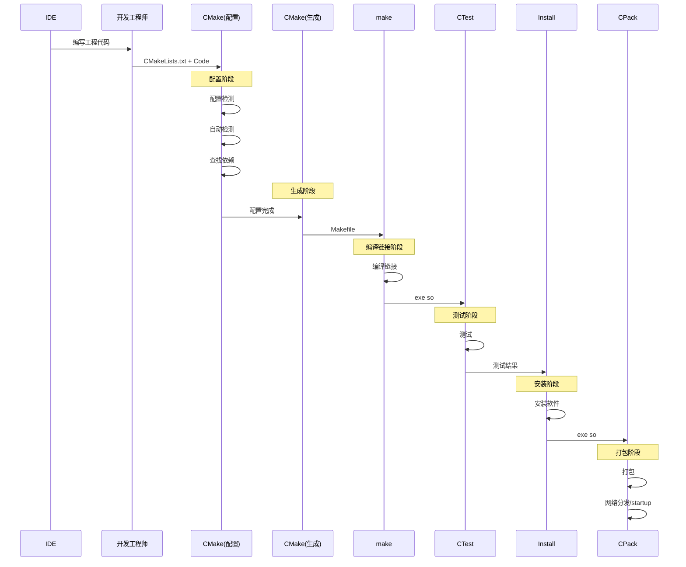

<!-- 添加mermaid支持 -->
<script defer src="https://cdn.jsdelivr.net/npm/mermaid@11.5.0/dist/mermaid.min.js"></script>

<script defer src="/javascripts/waline.min.js"></script>
<link rel="stylesheet" href="https://help-site.oss-cn-hangzhou.aliyuncs.com/css/waline.css" />
<link rel="stylesheet" href="/stylesheets/waline.min.css" />

# CMake控制台命令核心操作

!!! abstract

    本次演示均在Ubuntu系统环境下进行

## Ubuntu下安装CMake

在Ubuntu中，输入以下命令安装CMake：

```bash
sudo apt install cmake
```

安装完成后可以使用下面的命令验证CMake是否安装成功：

```bash
cmake --version
```

如果安装成功，会提示类似下面的版本信息：

```
cmake version 3.28.3

CMake suite maintained and supported by Kitware (kitware.com/cmake).
```

## CMake介绍

CMake（Cross-platform Make）是一个开源的构建系统，由Kitware公司开发和维护。它不直接构建程序，而是生成标准的构建文件（如Makefile、Visual Studio项目文件等），然后使用平台原生的构建工具进行实际的编译和链接

## CMake从构建到可执行程序

创建一个`hello_world`目录，在该目录中编写`main.cpp`和`CMakeLists.txt`，目录结构如下：

```
.
├── CMakeLists.txt
└── main.cpp
```

在CMake中，`CMakeLists.txt`是一个项目中的配置文件，由程序员手动编写，是使用CMake进行构建时需要查找的文件，所以在使用构建命令时，命令执行的目录或者手动指定的目录中一定要有`CMakeLists.txt`文件

在`main.cpp`中编写打印`hello world`的语句，在`CMakeLists.txt`中编写下面的内容：

```cmake
# 设置最低要求版本
cmake_minimum_required(VERSION 3.18)

# 设置项目名称
project(hello_world)

# 添加构建目标
add_executable(main main.cpp)
```

基于`CMakeLists.txt`的内容，下面做简单的介绍：

1. 设置最低要求版本：这个版本的设置可以通过`cmake_minimum_required`进行，`VERSION`关键字不能遗漏，`3.18`表示版本号，本次项目中会使用3.18版本的部分新特性，所以使用该版本。之所以要设置最低版本，是因为CMake是一个不断迭代的工具（目前最新4.x，历史有3.x），不同版本可能会引入新的语法、命令、模块或行为变更。如果项目中使用了高版本CMake才支特的特性（例如特定的函数、生成器表达式、目标属性等），而用户本地安装的CMake版本低于项目要求的版本，就会出现报错并提示最低要求的CMake版本，否则正常执行后续流程
2. 设置项目名称：这个项目名称通过`project`进行，其中的`hello_world`就是项目名称，可以自行决定
3. 添加构建目标：在CMake中，“目标（Target）”代表了一个需要被生成的实体，如可执行文件、静态库/动态库等，和`Makefile`里的目标是一个意思，他是现在CMake里最核心的3个概念之一

接着，在`hello_world`目录所在的路径下执行CMake的构建命令生成`Makefile`，这一步有两种构建方式：

1. 源文件所在目录原地构建（源内构建）：直接在源文件所在目录下执行CMake构建命令
2. 源文件所在目录外地构建（源外构建）：单独创建一个构建目录，在该构建目录中执行CMake构建命令

CMake构建命令有三种写法，根据官方文档的提示如下：

```bash
cmake [options] <path-to-source>
cmake [options] <path-to-existing-build>
cmake [options] -S <path-to-source> -B <path-to-build>
```

第一种方式和第二种方式都属于源内构建，二者不同的是，第一种方式是基于`CMakeLists.txt`文件进行构建，第二种方式是基于`CMakeCache.txt`文件进行构建

第三种方式属于源外构建，其中`-S`后面指定`CMakeLists.txt`文件所在的目录，`-B`表示自动生成文件所在的目录

??? note "关于`CMakeCache.txt`"

    `CMakeCache.txt`是使用CMake构建命令生成的临时缓存配置文件，其中包含了一写配置结果和变量缓存，一般不会去手动修改，基于`CMakeCache.txt`进行构建就是利用缓存的配置结果，跳过重复检测

下面是两种构建方式演示：

=== "源内构建"

    执行命令：

    ```bash
    # 当前目录./中存在CMakeLists.txt文件
    cmake ./
    ```

    结果如下：

    ```
    .
    ├── CMakeCache.txt
    ├── CMakeFiles/*
    ├── cmake_install.cmake
    ├── CMakeLists.txt
    ├── main.cpp
    └── Makefile
    ```

=== "源外构建"

    在当前目录下创建一个`build`目录，当前目录结构如下：

    ```
    .
    ├── build
    ├── CMakeLists.txt
    └── main.cpp
    ```

    接着，执行下面的命令：

    ```bash
    # 当前目录下存在CMakeLists.txt，生成的文件放置在当前目录下的build目录
    cmake -S ./ -B ./build
    ```

    结果如下：

    ```
    .
    ├── build/*
    ├── CMakeLists.txt
    └── main.cpp
    ```

可以看到源外构建生成的目录不会影响到源文件所在的目录，这样可以保证源文件目录的整洁，所以官方**推荐源外构建**

不论是哪种构建方式，最后都会基于`CMakeLists.txt`生成一个`Makefile`文件，在`Makefile`文件所在目录下执行`make`命令即可获得编译后的可执行程序，接下来运行可执行程序即可看到执行结果。可以得出CMake从构建到获得执行程序的整个流程如下：


在`CMakeCache.txt`所在的目录也可以使用下面的命令生成可执行程序：

```bash
cmake --build .
```

在`CMakeCache.txt`中存在一行：

```cmake
CMAKE_MAKE_PROGRAM:FILEPATH=/usr/bin/gmake
```

这一行就是执行`cmake --build`命令实际执行的程序，而`/usr/bin/gmake`实际上是一个软链接，指向的正是`make`：

```bash
lrwxrwxrwx 1 root root 4  4月  9  2024 /usr/bin/gmake -> make*
```

## CMake从构建到打包基本流程

### 基本介绍与配置准备

使用CMake构建一个工程基本流程如下：



根据上面的过程，创建一个目录`cmake_tools`，在该目录下创建`main.cpp`和`CMakeLists.txt`文件，两个文件的内容分别如下：

=== "`main.cpp`"

    ```cpp
    #include <iostream>
    #include <cassert>

    int main()
    {
        assert(1 + 2 == 3);
        // assert(1 + 2 == 4);
        std::cout << "测试通过" << "\n";

        return 0;
    }
    ```

=== "`CMakeLists.txt`"

    ```cmake
    cmake_minimum_required(VERSION 3.18)
    project(cmake_tools)
    add_executable(main main.cpp)

    # 集成单元测试
    include(CTest)
    add_test(NAME test_add COMMAND main)

    # 本地安装
    include(GNUInstallDirs) # GNU标准安装路径
    install(TARGETS main) # 将main程序安装到GNU标准安装路径

    # 打包
    include(CPack)
    ```

在`CMakeLists.txt`中，除了前一节提到的三个配置以外，新增了三个配置，分别表示：

1. 使用CMake官方提供的单元测试工具CTest，使用`include`引入CTest，使用`add_test`指定测试名称和测试的命令，本次将`main.cpp`作为测试程序，所以使用`main.cpp`生成的可执行程序作为测试程序
2. 将程序安装到指定目录，安装使用`install`，其中`main`表示待安装的程序，而为了统一安装路径，一般用CMake标准路径，即`GNUInstallDirs`，使用`include`引入该路径配置。在Linux下，该路径默认为`/usr/local/bin`
3. 使用CMake官方提供的打包工具CPack，使用`include`引入CPack

使用源外构建在当前目录中的`build`中生成文件

### 使用CTest单元测试

在`build`目录所在的路径下执行下面的命令进行单元测试：

```bash
ctest
```

执行结果如下：

```
Test project /home/epsda/CmakeLearning_code/cmake_tools/build
    Start 1: test_add
1/1 Test #1: test_add .........................   Passed    0.00 sec

100% tests passed, 0 tests failed out of 1

Total Test time (real) =   0.01 sec
```

在输出结果中，`Start 1: test_add`和`Test #1: test_add`中的`test_add`都是在`CMakeLists.txt`文件中`add_test`的`NAME`值。同时，测试会在`build`目录中生成`Testing`目录，其中`LastTest.log`文件记录着最近的测试日志

如果取消注释`assert(1 + 2 == 4);`并重新构建项目运行测试可以看到下面的结果：

```
Test project /home/epsda/CmakeLearning_code/cmake_tools/build
    Start 1: test_add
1/1 Test #1: test_add .........................Subprocess aborted***Exception:   1.15 sec

0% tests passed, 1 tests failed out of 1

Total Test time (real) =   1.15 sec

The following tests FAILED:
          1 - test_add (Subprocess aborted)
Errors while running CTest
Output from these tests are in: /home/epsda/CmakeLearning_code/cmake_tools/build/Testing/Temporary/LastTest.log
```

对应的可以在`LastTest.log`看到测试错误的日志，**注意这个日志是覆盖写，即每一次执行测试都会清空上一次的日志**

除了执行上面的命令可以进行单元测试以外，还可以使用下面的命令：

```bash
make test
```

执行结果与直接执行`ctest`结果一样，实际上这一点是因为在`Makefile`中关于`test`的伪目标对应的依赖关系使用的就是`ctest`：

```makefile
test:
	@$(CMAKE_COMMAND) -E cmake_echo_color "--switch=$(COLOR)" --cyan "Running tests..."
	/usr/bin/ctest --force-new-ctest-process $(ARGS)
.PHONY : test
```

之所以可以通过`ctest`找到测试程序，原因就在于生成的`CTestTestfile.cmake`文件中的定义：

```cmake
add_test(test_add "/home/epsda/CmakeLearning_code/cmake_tools/build/main")
```

一旦运行`ctest`，就会通过这一行去查找可执行程序并执行

### 使用安装命令进行程序安装

安装当前临时构建目录`build`中的可执行程序到指定的目录中，可以在`build`目录所在路径使用下面的命令：

```bash
cmake --install .
# 也可以使用make install，效果一致
```

但是，如果是普通用户直接执行该命令会出现权限不足的问题，这是因为`GNUInstallDirs`中对于Linux来说默认配置的路径是`/usr/local/bin`，这个目录只有`root`可以直接进入，所以普通用户需要加`sudo`：

```bash
sudo cmake --install .
# 也可以使用sudo make install，效果一致
```

输出的结果如下：

```
-- Install configuration: ""
-- Installing: /usr/local/bin/main
```

那么为什么执行`sudo make install`会得到同样的效果呢？实际上也是因为`Makefile`中关于`install`伪目标的依赖关系：

```makefile
install: preinstall
	@$(CMAKE_COMMAND) -E cmake_echo_color "--switch=$(COLOR)" --cyan "Install the project..."
	/usr/bin/cmake -P cmake_install.cmake
.PHONY : install
```

在CMake中，执行`cmake --install <dir>`命令时实际上执行的是脚本命令，而`-P`选项就表示执行指定的脚本，`cmake_install.cmake`就是安装时执行的脚本

执行安装命令后可以看到当前项目会生成一个`install_manifest.txt`的文件，其中的内容就是安装的程序清单：

```
/usr/local/bin/main
```

### 使用CPack进行打包

要进行安装可以在`build`目录中执行下面的命令：

```bash
cpack
```

执行结果如下：

```
CPack: Create package using STGZ
CPack: Install projects
CPack: - Run preinstall target for: cmake_tools
CPack: - Install project: cmake_tools []
CPack: Create package
CPack: - package: /home/epsda/CmakeLearning_code/cmake_tools/build/cmake_tools-0.1.1-Linux.sh generated.
CPack: Create package using TGZ
CPack: Install projects
CPack: - Run preinstall target for: cmake_tools
CPack: - Install project: cmake_tools []
CPack: Create package
CPack: - package: /home/epsda/CmakeLearning_code/cmake_tools/build/cmake_tools-0.1.1-Linux.tar.gz generated.
CPack: Create package using TZ
CPack: Install projects
CPack: - Run preinstall target for: cmake_tools
CPack: - Install project: cmake_tools []
CPack: Create package
CPack: - package: /home/epsda/CmakeLearning_code/cmake_tools/build/cmake_tools-0.1.1-Linux.tar.Z generated.
```

在当前的构建目录下就会多出四个文件：

```
cmake_tools-0.1.1-Linux.sh
cmake_tools-0.1.1-Linux.tar.gz
cmake_tools-0.1.1-Linux.tar.Z
install_manifest.txt
```

同时还会多出一个临时安装目录：`_CPack_Packages`

其中，`.tar.gz`和`tar.z`文件就是两个用于分发的压缩包，而`install_manifest.txt`表示安装的程序

而压缩包的命名和压缩包的格式在`CPackConfig.cmake`文件中可以看到定义：

```cmake
# 生成的压缩包后缀
set(CPACK_GENERATOR "STGZ;TGZ;TZ")
# 压缩包文件名称
set(CPACK_PACKAGE_FILE_NAME "cmake_tools-0.1.1-Linux")

# 包文件名称
set(CPACK_PACKAGE_NAME "cmake_tools")
# 版本组合
set(CPACK_PACKAGE_VERSION "0.1.1")
set(CPACK_PACKAGE_VERSION_MAJOR "0")
set(CPACK_PACKAGE_VERSION_MINOR "1")
set(CPACK_PACKAGE_VERSION_PATCH "1")
# 系统名称
set(CPACK_SYSTEM_NAME "Linux")
```

需要注意的是，如果在`CMakeLists.txt`中正确配置了`install`指令，那么CPack可以独立工作，无需手动执行`cmake --install <dir>`命令。如果是先手动执行`cmake --install <dir>`命令，再执行`cpack`，此时会出现权限不足问题：

```
CPack: Create package using STGZ
CPack: Install projects
CPack: - Run preinstall target for: cmake_tools
CPack: - Install project: cmake_tools []
CMake Error at /home/epsda/CmakeLearning_code/cmake_tools/build/cmake_install.cmake:69 (file):
  file failed to open for writing (Permission denied):

    /home/epsda/CmakeLearning_code/cmake_tools/build/install_manifest.txt


CPack Error: Error when generating package: cmake_tools
```

因为执行安装命令时会生成`install_manifest.txt`文件，这个文件此时是由`root`生成的，所以只有`root`用户可以访问，而执行`cpack`时也需要打开并覆写`install_manifest.txt`文件，直接执行`cpack`时除非是`root`用户，否则就会报错。对于普通用户解决方案就是使用`sudo`执行`cpack`

### 脚本模式

使用下面的代码即可执行脚本：

```bash
cmake -P 脚本文件
```

CMake脚本模式，不会生成构建产物，也不会生成中间过程。适合处理各种与构建系统无关的自动化任务，通过编写简洁的脚本文件，你可以实现环境检查、文件处理、部署打包等功能

例如前面提到的安装过程就使用到了脚本模式

### 调用外部命令

使用下面的代码即可调用外部命令：

```bash
cmake -E 命令
```

??? "可以调用的外部命令"

    | 命令                                                                | 功能描述                                                 |
    | ------------------------------------------------------------------- | -------------------------------------------------------- |
    | `capabilities`                                                      | 以JSON格式报告CMake内置的功能                            |
    | `cat [--] <files>...`                                               | 连接文件并将其打印到标准输出                             |
    | `chdir dir cmd [args...]`                                           | 在指定目录中运行命令                                     |
    | `compare_files [--ignore-eol] file1 file2`                          | 检查`file1`是否与`file2`相同                                 |
    | `copy <file>... destination`                                        | 将文件复制到目标位置(文件或目录)                         |
    | `copy_directory <dir>... destination`                               | 将目录内容复制到目标目录                                 |
    | `copy_directory_if_different <dir>... destination`                  | 将已更改的目录内容复制到目标目录                         |
    | `copy_if_different <file>... destination`                           | 如果文件已更改则复制文件                                 |
    | `echo [<string>...]`                                                | 将参数显示为文本                                         |
    | `echo_append [<string>...]`                                         | 将参数显示为文本但不换行                                 |
    | `env [--unset=NAME ...] [NAME=VALUE ...] [--] <command> [<arg>...]` | 在修改的环境中运行命令                                   |
    | `environment`                                                       | 显示当前环境                                             |
    | `make_directory <dir>...`                                           | 创建父目录和指定目录                                     |
    | `md5sum <file>...`                                                  | 创建文件的MD5校验和                                      |
    | `sha1sum <file>...`                                                 | 创建文件的SHA1校验和                                     |
    | `sha224sum <file>...`                                               | 创建文件的SHA224校验和                                   |
    | `sha256sum <file>...`                                               | 创建文件的SHA256校验和                                   |
    | `sha384sum <file>...`                                               | 创建文件的SHA384校验和                                   |
    | `sha512sum <file>...`                                               | 创建文件的SHA512校验和                                   |
    | `remove [-f] <file>...`                                             | 删除文件，使用`-f`强制删除(已弃用：请使用`rm`)               |
    | `remove_directory <dir>...`                                         | 删除目录及其内容(已弃用：请使用`rm`)                       |
    | `rename oldname newname`                                            | 重命名文件或目录(在同一卷上)                             |
    | `rm [-rRf] [--] <file/dir>...`                                      | 删除文件或目录，使用`-f`强制删除，`r`或`R`递归删除目录及其内容 |
    | `sleep <number>...`                                                 | 休眠指定秒数                                             |
    | `tar [cxt][vf][zjJ] file.tar [file/dir1 file/dir2 ...]`             | 创建或提取`tar`或`zip`归档文件                               |
    | `time command [args...]`                                            | 运行命令并显示耗时                                       |
    | `touch <file>...`                                                   | 创建或更新文件时间戳                                     |
    | `touch_nocreate <file>...`                                          | 更新文件时间戳但不创建文件                               |
    | `create_symlink old new`                                            | 创建符号链接`new`->`old`                                     |
    | `create_hardlink old new`                                           | 创建硬链接`new`->`old`                                       |
    | `true`                                                              | 什么都不做，退出代码为0                                  |
    | `false`                                                             | 什么都不做，退出代码为1                                  |

## 配置命令详细介绍

### 最低安装版本命令

在前面已经提到可以使用`cmake_minimum_required`配置最低要求版本以及需要配置的原因，本次对该命令进行进一步的补充。除了可以指定最低版本以外，还可以指定版本范围，写法如下：

```cmake
cmake_minimum_required(VERSION 3.18...4.0)
```

需要注意的是，`cmake_minimum_required`的配置必须在顶级`CMakeLists.txt`中的最开始位置，甚至要在`project`配置之前调用

??? "何为顶级`CMakeLists.txt`"

    在CMake中，允许一个项目中有多个`CMakeLists.txt`，但是分布在不同的目录中，项目根目录中的`CMakeLists.txt`一般为顶级`CMakeLists.txt`。顶级`CMakeLists.txt`是CMake构建系统的起始位置，定义了整个项目的构建规则和配置并且管理项目的目录结构和依赖关系

### 项目命令

项目命令即`project`命令，基本语法介绍如下：

```cmake
project(<PROJECT-NAME> [<language-name>...])
project(<PROJECT-NAME>
        [VERSION <major>[.<minor>[.<patch>[.<tweak>]]]]
        [COMPAT_VERSION <major>[.<minor>[.<patch>[.<tweak>]]]]
        [DESCRIPTION <project-description-string>]
        [HOMEPAGE_URL <url-string>]
        [LANGUAGES <language-name>...])
```

根据官方介绍，`project`命令可以有两种写法：

1. 第一种写法（简单写法），项目名称和语言名称，其中语言名称可选
2. 第二种写法（完整写法），项目名称、项目版本号、兼容版本号、项目描述、项目主页URL和语言名称，其中除了项目名称以外，其余全部可选

在CMake中，如果执行了`project`命令，那么默认会设置下面的变量：

| 变量                    | 描述                                             |
| ----------------------- | ------------------------------------------------ |
| `PROJECT_NAME`          | 项目名称（如`MyProject`）                        |
| `CMAKE_PROJECT_NAME`    | 顶级项目名称（与`PROJECT_NAME`相同）         |
| `PROJECT_VERSION`       | 完整版本号（如`1.2.3`）                          |
| `PROJECT_VERSION_MAJOR` | 主版本号                              |
| `PROJECT_VERSION_MINOR` | 次版本号                                |
| `PROJECT_VERSION_PATCH` | 修订号                                 |
| `PROJECT_SOURCE_DIR`    | 顶级`CMakeLists.txt`所在目录（即源文件树根目录） |
| `PROJECT_BINARY_DIR`    | 构建目录（如`build/`）                           |

这些变量在后续的其他命令中可以直接通过`${}`进行引用，例如`${PROJECT_NAME}`

需要注意的是语言名称的值，指定时可以指定一门语言，也可以指定多门语言。如果不指定语言，那么默认就是C和C++，如果值为`none`或者写了`LANGUAGES`但是没有给值，那么表示不启用任何语言

根据官方文档的描述，`LANGUAGES`可以指定的语言有：C、CXX（即C++）、CSharp（即C#）、CUDA、OBJC（即Objective-C）、OBJCXX（即Objective-C++）、Fortran、HIP、ISPC、Swift、ASM、ASM_NASM、ASM_MARMASM、ASM_MASM和ASM-ATT

对于`LANGUAGES`，推荐的使用方法就是**显式指定项目中所有使用到的语言**，确保CMake可以正确查找编译器

### 安装命令

安装命令的作用可以理解为拷贝，基本用法此处不再赘述。根据官方文档的描述，`install`命令有如下几种写法：

```cmake
install(TARGETS <targets>... [EXPORT <export-name>]
        [RUNTIME DESTINATION <dir>]
        [LIBRARY DESTINATION <dir>]
        [ARCHIVE DESTINATION <dir>]
        [INCLUDES DESTINATION <dir>]
        [...])

install(FILES <files>... DESTINATION <dir>
        [PERMISSIONS <permissions>...]
        [CONFIGURATIONS <configs>...]
        [COMPONENT <component>]
        [...])

install(DIRECTORY <dirs>... DESTINATION <dir>
        [FILE_PERMISSIONS <permissions>...]
        [DIRECTORY_PERMISSIONS <permissions>...]
        [...])

install(EXPORT <export-name> DESTINATION <dir>
        [NAMESPACE <namespace>::]
        [FILE <filename>]
        [...])
```

其中的关键参数解释如下表所示：

| 参数          | 含义    |
| ------------- | ---------------------------------------------------------------------------------- |
| `TARGETS`     | 安装使用`add_executable`和`add_library`构建的目标文件                              |
| `FILES`       | 安装文件 |
| `DIRECTORY`   | 安装整个目录  |
| `EXPORT`      | 安装导出目录，用于发布自己的程序，供别人使用   |
| `DESTINATION` | 指定安装路径，路径可以是绝对路径，也可以是相对路径（相对于`CMAKE_INSTALL_PREFIX`）|

在Linux中，`CMAKE_INSTALL_PREFIX`表示的就是`/usr/local`，在部分脚本中可以见到该路径，例如在`cmake_install.cmake`中可以看到该变量的设置：

```cmake
if(NOT DEFINED CMAKE_INSTALL_PREFIX)
  set(CMAKE_INSTALL_PREFIX "/usr/local")
endif()
```

### 包含命令

包含命令即`include`，其作用是加载指定的脚本文件或者模块到当前`CMakeLists.txt`执行上下文中并运行。在官方文档的描述中，该命令的使用如下：

```cmake
include(<file|module> [OPTIONAL] [RESULT_VARIABLE <var>] [NO_POLICY_SCOPE])
```

其中`<file|module>`表示的就是要运行的文件（一般会包含路径）或者模块名称。对于要查找的路径，如果是要运行的文件，`include`命令查找原则如下：

1. 如果是相对路径，那么相对于当前`include`命令所在的`CMakeLists.txt`文件开始查找
2. 如果是绝对路径，直接从根路径开始查找

如果是模块，那么查找原则为：首先在当前目录中查找，如果没有再到`CMAKE_MODULE_PATH`变量指定的目录中查找

对于包含到当前`CMakeLists.txt`的文件来说，会先执行`include`之前的代码，再在当前`CMakeLists.txt`中展开指定的文件并执行其中的内容。以下面的目录结构为例：

```
.
├── build
├── CMakeLists.txt
└── sub
    └── sub.cmake
```

其中`CMakeLists.txt`和`sub.cmake`脚本的内容分别如下：

=== "`CMakeLists.txt`"

    ```cmake
    cmake_minimum_required(VERSION 3.18)

    project(test_include)

    message(STATUS "main cmake")
    # 打印当前正在执行的源代码目录
    message(STATUS, "当前源代码目录：" ${CMAKE_CURRENT_SOURCE_DIR})
    # 打印正在执行的cmake脚本
    message(STATUS "正在执行的cmake脚本：" ${CMAKE_CURRENT_LIST_FILE})
    # 打印正在执行的cmake脚本的全目录
    message(STATUS "正在执行的cmake脚本的全目录：" ${CMAKE_CURRENT_LIST_DIR})

    # 包含子目录cmake脚本
    include(./sub/sub.cmake) 
    ```

=== "`sub.cmake`"

    ```cmake
    message(STATUS "sub cmake")
    # 打印当前正在执行的源代码目录
    message(STATUS, "当前源代码目录：" ${CMAKE_CURRENT_SOURCE_DIR})
    # 打印正在执行的cmake脚本
    message(STATUS "正在执行的cmake脚本：" ${CMAKE_CURRENT_LIST_FILE})
    # 打印正在执行的cmake脚本的全目录
    message(STATUS "正在执行的cmake脚本的全目录：" ${CMAKE_CURRENT_LIST_DIR})
    ```

!!! info

    关于`message`函数的介绍和使用会在[CMake常见语法](#)中介绍

在`build`目录中运行构建命令，可以看到结果如下：

```
-- The C compiler identification is GNU 13.3.0
-- The CXX compiler identification is GNU 13.3.0
-- Detecting C compiler ABI info
-- Detecting C compiler ABI info - done
-- Check for working C compiler: /usr/bin/cc - skipped
-- Detecting C compile features
-- Detecting C compile features - done
-- Detecting CXX compiler ABI info
-- Detecting CXX compiler ABI info - done
-- Check for working CXX compiler: /usr/bin/c++ - skipped
-- Detecting CXX compile features
-- Detecting CXX compile features - done
-- main cmake
STATUS,当前源代码目录：/home/epsda/CmakeLearning_code/test_include
-- 正在执行的cmake脚本：/home/epsda/CmakeLearning_code/test_include/CMakeLists.txt
-- 正在执行的cmake脚本的全目录：/home/epsda/CmakeLearning_code/test_include
-- sub cmake
STATUS,当前源代码目录：/home/epsda/CmakeLearning_code/test_include
-- 正在执行的cmake脚本：/home/epsda/CmakeLearning_code/test_include/sub/sub.cmake
-- 正在执行的cmake脚本的全目录：/home/epsda/CmakeLearning_code/test_include/sub
-- Configuring done (0.3s)
-- Generating done (0.0s)
-- Build files have been written to: /home/epsda/CmakeLearning_code/test_include/build
```

可以看到先执行了`CMakeLists.txt`文件中的打印，再执行`sub.cmake`中的打印，并且因为`sub.cmake`中的命令在`CMakeLists.txt`中展开，所以不论是`CMakeLists.txt`还是`sub.cmake`文件中的源代码目录打印均相同且均为`test_include`项目目录

### 添加可执行程序命令

根据官方文档的描述，`add_executable`命令使用方式如下：

```cmake
add_executable(<name> <options>... <sources>...)
```

其中，`name`表示生成的目标名称，`<sources>`表示目标的来源文件。根据官方文档对目标生成的路径描述：<a href="javascript:;" class="custom-tooltip" data-title="By default the executable file will be created in the build tree directory corresponding to the source tree directory in which the command was invoked">默认情况下，可执行文件会生成在构建目录里，位置和源代码目录的结构是对应的</a>

例如，假设当前项目根目录为`project`，项目源代码目录为`src`，项目构建目录为`build`，那么根据上面的描述，应该为：编译出来的程序会放在`build`文件夹里，而且`build`文件夹中的结构和源代码的文件夹结构是一样的，即：

- 源文件目录：`project/src/`
- 构建程序目录：`project/build/src/`

简单理解就是**源代码的目录会被拷贝到构建目录中用于存放生成的目标文件**