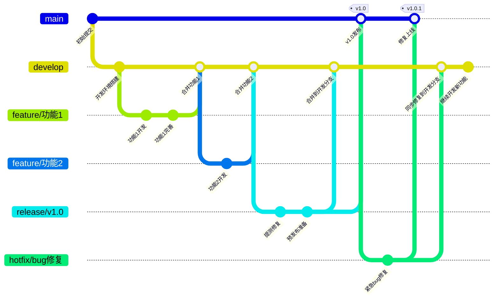

# Git多人协作

## 多人协作实例1

要求：以当前`master`分支的最新提交为基础，现在需要有两个人**在同一个分支**上同时进行开发，开发完成后，需要将各自的代码合并到`master`分支上

首先准备两个分支，本次考虑直接在远程仓库上创建一个分支`dev`，结果如下：


现在，使用下面的命令可以查看本地和远程的所有分支：

```bash
git branch -a
```

可以看到类似下面的结果：

```
* master
  remotes/origin/HEAD -> origin/master
  remotes/origin/master
```

其中`remotes/origin/`表示的就是远程仓库中的分支

可以看到，尽管远程创建了一个`dev`分支，但是本地新创建的`dev`分支，所以需要使用下面的命令将远程的`dev`分支拉取到本地：

```bash
git pull
```

此时会看到类似下面的结果：

```
From gitee.com:EPSDA/test_git
 * [new branch]      dev        -> origin/dev
Already up to date.
```

再查看当前所有分支就可以得到类似下面的结果：

```
* master
  remotes/origin/HEAD -> origin/master
  remotes/origin/dev
  remotes/origin/master
```

另外，再另外一个系统下克隆当前仓库，模拟第二个开发者，克隆完成后查看当前所有分支：

```
* master
  remotes/origin/HEAD -> origin/master
  remotes/origin/dev
  remotes/origin/master
```

现在本地仓库中可以看到远程的`dev`分支，但是不可以直接在这个`dev`分支上进行开发，考虑下面的思路：

1. 在本地创建一个`dev`分支
2. 关联本地的`dev`分支与远程的`dev`分支

首先执行第一步：在本地创建一个`dev`分支

```bash
git branch dev
```

接着执行第二步：关联本地的`dev`分支与远程的`dev`分支

在执行关联操作之前，首先解释一下何为关联？在前面介绍过，不论是使用`git pull`还是使用`git push`都需要指定一个远程分支，这样做的目的就是为了让Git知道当前是从哪个分支下拉取或者向哪一个分支推送，而在之后的过程中也会涉及到远程仓库的指定分支和本地仓库的指定分支建立连接，但是注意当前这种做法不会建立连接（具体如何建立分支，后面会具体提及），而一旦明确了分支，就可以简写`git pull`和`git push`命令如下：

```bash
# 从远程仓库拉取
git pull
# 推送到远程仓库
git push
```

那么如何查看本地分支与远程分支的连接呢？可以使用下面的命令：

```bash
git branch -vv
```

可以看到类似下面的结果：

```
epsda@ham-carrier:~/test_git$ git branch -vv
  dev    6dbcbd3 update test.txt.
* master 6dbcbd3 [origin/master] update test.txt.
```

可以看到，当前只有`master`分支与远程的`master`分支建立了连接，而`dev`分支并没有与远程的`dev`分支建立连接，现在先不建立连接，直接切换到`dev`分支进行开发看看会发生什么：

首先切换到`dev`分支：

```bash
git checkout dev
```

接着，在`dev`分支上进行开发：

```bash
echo "this is dev" > test.txt
```

接着，执行下面的命令完成提交和推送：

```bash
git add .
git commit -m "change test.txt on dev: this is dev"
git push
```

可以看到类似下面的结果：

```
epsda@ham-carrier:~/test_git$ git push
fatal: The current branch dev has no upstream branch.
To push the current branch and set the remote as upstream, use

    git push --set-upstream origin dev

To have this happen automatically for branches without a tracking
upstream, see 'push.autoSetupRemote' in 'git help config'.
```

可以看到，因为当前`dev`分支并没有与远程的`dev`分支建立连接，所以提交时Git无法知道当前要提交到哪一个远程分支，所以需要使用下面的命令建立连接：

```bash
git push --set-upstream 远程仓库名 远程分支名
```

例如当前情况下执行下面的命令：

```bash
git push --set-upstream origin dev
```

执行完成后，就可以看到类似下面的结果：

```
Enumerating objects: 5, done.
Counting objects: 100% (5/5), done.
Delta compression using up to 2 threads
Compressing objects: 100% (2/2), done.
Writing objects: 100% (3/3), 276 bytes | 276.00 KiB/s, done.
Total 3 (delta 1), reused 0 (delta 0), pack-reused 0
remote: Powered by GITEE.COM [1.1.5]
remote: Set trace flag c44a8bab
To gitee.com:xxx/xxx.git
   6dbcbd3..f8b6ba4  dev -> dev
branch 'dev' set up to track 'origin/dev'.
```

接着，再使用查看已经连接的分支命令：

```bash
git branch -vv
```

可以看到类似下面的结果：

```
* dev    f8b6ba4 [origin/dev] change test.txt on dev: this is dev
  master 6dbcbd3 [origin/master] update test.txt.
```

此时，远程仓库和本地仓库的`dev`分支已经建立了连接，并且远程仓库的内容也与本地仓库保持一致，而远程仓库下的`master`分支并没有更新到最新版本，至此第一个开发者已经完成

接着，第二个开发者此时也执行上面的步骤进行开发，这里介绍另外一种方式：在创建分支的同时建立与远程分支的连接：

```bash
git checkout -b 新建分支名 远程仓库名/远程分支名
```

例如当前情况下执行下面的命令：

```bash
git checkout -b dev origin/dev
```

此时会看到类似下面的结果：

```
branch 'dev' set up to track 'origin/dev'.
Switched to a new branch 'dev'
```

现在假设第二个开发者并不知道第一个开发者已经对`test.txt`文件进行了修改，所以如果第二个开发者直接将开发结果推送给远程仓库，就会出现冲突出现下面类似的结果：

```
 ! [rejected]        dev -> dev (fetch first)
error: failed to push some refs to 'https://gitee.com/EPSDA/test_git.git'
hint: Updates were rejected because the remote contains work that you do not
hint: have locally. This is usually caused by another repository pushing to
hint: the same ref. If you want to integrate the remote changes, use
hint: 'git pull' before pushing again.
hint: See the 'Note about fast-forwards' in 'git push --help' for details.
```

出现上面结果的原因就在于当前远程仓库的`dev`分支和当前本地的`dev`分支之间存在冲突，所以解决方案如下：

1. 将远程仓库的`dev`分支拉取到本地
2. 在本地的`dev`分支上进行冲突处理
3. 将处理后的结果推送到远程仓库

首先执行第一步可以得到类似下面的结果：

```
remote: Enumerating objects: 5, done.
remote: Counting objects: 100% (5/5), done.
remote: Compressing objects: 100% (2/2), done.
remote: Total 3 (delta 1), reused 0 (delta 0), pack-reused 0 (from 0)
Unpacking objects: 100% (3/3), 256 bytes | 32.00 KiB/s, done.
From https://gitee.com/EPSDA/test_git
   6dbcbd3..f8b6ba4  dev        -> origin/dev
Auto-merging test.txt
CONFLICT (content): Merge conflict in test.txt
Automatic merge failed; fix conflicts and then commit the result.
```

此时在当前本地`dev`分支中的`test.txt`文件中就会出现类似下面的内容：

```
<<<<<<< HEAD
this is a test
this is a new test
this is dev2
=======
this is dev
>>>>>>> f8b6ba4b6208effd5f864ba319512a9e38367953
```

接着手动处理冲突，处理完成后，再提交到远程仓库：

```bash
git add.
git commit -m "merge remote dev and local dev"
git push
```

执行完成后，就可以看到类似下面的结果：

```
Enumerating objects: 10, done.
Counting objects: 100% (10/10), done.
Delta compression using up to 12 threads
Compressing objects: 100% (5/5), done.
Writing objects: 100% (6/6), 820 bytes | 820.00 KiB/s, done.
Total 6 (delta 2), reused 0 (delta 0), pack-reused 0 (from 0)
remote: Powered by GITEE.COM [1.1.5]
remote: Set trace flag 6c41dd8b
To https://gitee.com/EPSDA/test_git.git
   f8b6ba4..5a885e1  dev -> dev
```

那么，为了尽可能避免上面的冲突，**在进行多人位于同一个分支上进行开发，执行前先进行拉取保证当前本地与远程保持同步**，回到第一个开发者，因为当前远程仓库的`dev`分支中的内容和本地`dev`分支中的内容还没有同步，所以先执行`git pull`确保一致

现在两个开发者都完成了开发，在实际开发中，一旦测试发现开发结果没有问题就可以考虑合并代码了，根据前面的介绍，现在有两种合并方式：

1. `dev`分支提出`Pull Request`请求合并到`master`分支
2. 在本地合并再提交到远程分支

本次考虑第二个方式，首先为了确保本地`master`分支和远程`master`分支保持一致，先执行`git pull`拉取远程`master`分支的内容，接着执行下面的命令：

```bash
# 切换到dev分支
git checkout dev
# 合并master分支
git merge master
```

之所以要在`dev`分支上合并`master`分支是为了确保如果存在冲突，能够在`dev`分支上解决，而不是在`master`分支上解决

执行完成后没有问题再将`dev`合并到`master`分支：

```bash
# 切换到master分支
git checkout master
# 合并dev分支
git merge dev
```

合并完成后，再将结果推送到远程仓库：

```bash
git push
```

执行完成后，就可以看到类似下面的结果：

```
Total 0 (delta 0), reused 0 (delta 0), pack-reused 0
remote: Powered by GITEE.COM [1.1.5]
remote: Set trace flag a04202b9
To gitee.com:EPSDA/test_git.git
   6dbcbd3..5a885e1  master -> master
```

回到远程仓库即可看到`master`分支已经更新到最新版本

开发完成后，如果需要将`dev`分支删除，执行下面的命令：

```bash
git branch -d dev
```

但是上面的命令只是删除了本地的`dev`分支，而远程的`dev`分支并没有删除，可以考虑在远程仓库的界面上直接删除，删除后再查看所有的分支如下：

```
* master
  remotes/origin/HEAD -> origin/master
  remotes/origin/dev
  remotes/origin/master
```

可以看到，远程的`dev`分支依然存在，此时查看远程分支的状态可以使用下面的命令：

```bash
git remote show origin
```

可以看到类似下面的结果：

```
* remote origin
  Fetch URL: git@gitee.com:EPSDA/test_git.git
  Push  URL: git@gitee.com:EPSDA/test_git.git
  HEAD branch: master
  Remote branches:
    master                  tracked
    refs/remotes/origin/dev stale (use 'git remote prune' to remove)
  Local branch configured for 'git pull':
    master merges with remote master
  Local ref configured for 'git push':
    master pushes to master (up to date)
```

可以看到，远程的`dev`分支已经标记为`stale`，表示已经过时，可以使用下面的命令删除：

```bash
git remote prune 远程仓库名
```

执行完成后，再查看远程分支的状态，就可以看到类似下面的结果：

```
$ git remote prune origin
Pruning origin
URL: git@gitee.com:EPSDA/test_git.git
 * [pruned] origin/dev
```

再次查看即可看到远程的`dev`分支已经被删除

## 多人协作实例2

要求：以当前`master`分支的最新提交为基础，现在需要有两个人**在两个不同的分支**上同时进行开发，开发完成后，需要将各自的代码合并到`master`分支上

同样，现在需要两个开发者有两个分支，但是本次不考虑在远程仓库上创建分支，而是让两个开发者在本地创建分支，首先让第一个开发者创建一个`dev1`分支：

```bash
git checkout -b dev1
```

接着，在该分支上创建一个`dev1.txt`文件并写入以下内容：

```
this is dev1
```

接着，执行下面的命令完成提交：

```bash
git add.
git commit -m "this is dev1 change"
```

但是，现在有个问题，`dev1`分支已经完成了本地开发，需要将结果提交到远程仓库的`dev1`分支，但是远程并不存在`dev1`分支，所以现在需要先创建一个远程分支`dev1`，之后再建立连接，此时就需要执行完整版本的`git push`命令：

```bash
git push origin dev1
```

执行完成后，就可以看到类似下面的结果：

```
Enumerating objects: 4, done.
Counting objects: 100% (4/4), done.
Delta compression using up to 2 threads
Compressing objects: 100% (2/2), done.
Writing objects: 100% (3/3), 282 bytes | 282.00 KiB/s, done.
Total 3 (delta 1), reused 0 (delta 0), pack-reused 0
remote: Powered by GITEE.COM [1.1.5]
remote: Set trace flag f74f04b2
remote: Create a pull request for 'dev1' on Gitee by visiting:
remote: xxx
To https://gitee.com/xxx/xxx
 * [new branch]      dev1 -> dev1
```

可以看到使用了上面的命令不仅会在远程仓库创建一个`dev1`分支，还会将修改的内容推送到远程仓库的`dev1`分支

接着让第二个开发者也执行上面的操作，写入内容为`this is dev2`

执行完上面的操作后，现在远程仓库就存在着三个分支：

1. `master`分支：不存在任何一个开发者的修改
2. `dev1`分支：第一个开发者的修改
3. `dev2`分支：第二个开发者的修改

现在，假设第二个开发者需要拜托第一个开发者在其分支下继续开发，那么对于`dev1`分支来说，目前能看到的分支只有两个`dev1`和`master`，即如下：

```
* dev1
  master
  remotes/origin/HEAD -> origin/master
  remotes/origin/dev1
  remotes/origin/master
```

那么要使`dev1`分支可以看到`dev2`分支并且修改其中的内容，就需要先拿到`dev2`分支，所以可以使用下面的命令：

```bash
git pull
```

执行之后可以看到类似下面的结果：

```
remote: Enumerating objects: 4, done.
remote: Counting objects: 100% (4/4), done.
remote: Compressing objects: 100% (2/2), done.
remote: Total 3 (delta 1), reused 0 (delta 0), pack-reused 0 (from 0)
Unpacking objects: 100% (3/3), 272 bytes | 68.00 KiB/s, done.
From https://gitee.com/EPSDA/test_git2
 * [new branch]      dev2       -> origin/dev2
There is no tracking information for the current branch.
Please specify which branch you want to merge with.
See git-pull(1) for details.

    git pull <remote> <branch>

If you wish to set tracking information for this branch you can do so with:

    git branch --set-upstream-to=origin/<branch> dev1
```

可以看到，尽管`dev1`分支没有和远程仓库中的`dev1`分支进行连接，但是依旧可以拉取到远程仓库中的`dev2`分支，这是因为在使用`git pull`时有两种情况：

1. 拉取远程仓库中指定分支的内容：需要建立连接
2. 拉取远程仓库中指定分支：不需要建立连接

现在，第一个开发者再在`master`分支下创建一个`dev2`本地分支并与远程仓库的`dev2`建立连接即可，这里考虑另外一种建立连接的方式，首先创建一个`dev2`本地分支，再使用下面的命令进行：

```bash
git branch --set-upstream-to=远程仓库名/远程分支名 本地分支名
```

例如当前情况下执行下面的命令：

```bash
git branch --set-upstream-to=origin/dev2 dev2
```

此时就可以看到类似下面的结果：

```
branch 'dev2' set up to track 'origin/dev2'.
```

这就说明远程仓库的`dev2`分支与本地的`dev2`分支已经建立了连接

接着进入到本地`dev2`分支中，先进行`git pull`再继续写入内容，例如：

```
this is dev2 by dev1
```

接着，执行下面的命令完成提交：

```bash
git add.
git commit -m "this is dev2 by dev1"
```

再使用`git push`将修改推送到远程仓库：

```bash
git push
```

执行完成后，就可以看到类似下面的结果：

```
Enumerating objects: 5, done.
Counting objects: 100% (5/5), done.
Delta compression using up to 2 threads
Compressing objects: 100% (2/2), done.
Writing objects: 100% (3/3), 272 bytes | 272.00 KiB/s, done.
Total 3 (delta 1), reused 0 (delta 0), pack-reused 0
remote: Powered by GITEE.COM [1.1.5]
remote: Set trace flag 574f2d87
To https://gitee.com/EPSDA/test_git2.git
   8ba10a8..3e29afd  dev2 -> dev2
```

此时，远程仓库的`dev2`分支下的`dev2.txt`内容已经更新到最新版本，但是对于第二个开发者来说，他的`dev2`分支并没有更新到最新版本，所以需要先执行`git pull`拉取最新版本，才能进行修改。拉取后依旧需要保证远程仓库的`dev2`和本地仓库的`dev2`是已经建立连接的

现在，第二个开发者在`dev2`分支下继续修改`dev2.txt`的内容，例如：

```
this is last dev2
```

接着，执行下面的命令完成提交：

```bash
git add.
git commit -m "this is last dev2"
```

再使用`git push`将修改推送到远程仓库：

```bash
git push
```

可以看到整个过程中不需要处理任何冲突问题，同时也不影响到`dev1`分支中的内容

最后，全部开发完毕需要将两个分支的内容全部合并到`master`分支中，这里为了简便，首先将`dev2`分支的内容使用提交`Pull Request`的方式合并到`master`分支中，再使用另外一种方式合并`master`和`dev1`分支的内容

首先，准备`Pull Request`提交的申请：


接着，点击下面的内容准备进行审核：


再点击“提交”即可：


最后合并分支即可：


现在再看远程仓库的`master`分支下的内容就可以看到`dev2`分支的内容已经合并到`master`分支中了

!!! info

    在实际开发中，审核`Pull Request`并不是由程序员来进行的，而是由专门的人员负责

接着就是合并`dev1`分支下的内容，首先第一个开发者切换到`master`分支：

```bash
git checkout master
```

接着先进行`git pull`拉取最新版本，再切换到`dev1`分支下执行下面的命令：

```bash
git merge master
```

执行完成后，如果没有冲突就可以切换到`master`分支进行合并，最后再将结果推送到远程仓库即可

至此，整个多人协作的过程就完成了，最后删除不需要的分支即可

## 企业开发模型

### 系统开发环境

1. 开发环境：开发环境是程序猿们专门用于日常开发的服务器。为了开发调试方便，一般打开全部错误报告和测试工具，是最基础的环境
2. 测试环境：一个程序在测试环境工作不正常，那么肯定不能把它发布到生产机上。该环境是开发环境到生产环境的过渡环境
3. 预发布环境：该环境是为避免因测试环境和线上环境的差异等带来的缺陷漏测而设立的一套环境。其配置等基本和生产环境一致，目的是能让发正式环境时更有把握！所以预发布环境是产品质量最后一道防线，因为下一步项目就要上线了
4. 生产环境：是指正式提供对外服务的线上环境，例如目前在移动端或PC端能访问到的APP都是生产环境

关系如下图所示：


### Git分支设计规范与Git Flow模型

在实际开发中，一般会使用`Git Flow`模型，该模型主要包含以下几个分支：

| 分支    | 名称         | 适用环境        |
| ------- | ------------ | --------------- |
| master  | 主分支       | 生产环境        |
| release | 预发布分支   | 预发布/测试环境 |
| develop | 开发分支     | 开发环境        |
| feature | 需求开发分支 | 本地            |
| hotfix  | 紧急修复分支 | 本地            |

下面是每一个分支的介绍：

**master 分支**

- **master**为主分支，该分支为只读且唯一分支。用于部署到正式发布环境，一般由合并`release`分支得到
- 主分支作为稳定的唯一代码库，任何情况下不允许直接在`master`分支上修改代码
- 产品的功能全部实现后，最终在`master`分支对外发布，另外所有在`master`分支的推送应该打标签（tag）做记录，方便追溯
- `master`分支不可删除

**release分支**

- **release**为预发布分支，基于本次上线所有的`feature`分支合并到`develop`分支之后，基于`develop`分支创建。可以部署到测试或预发布集群
- 命名以`release/`开头，建议的命名规则：`release/version_publishtime`
- `release`分支主要用于提交给测试人员进行功能测试。发布提测阶段，会以`release`分支代码为基准进行提测
- 如果在`release`分支测试出问题，需要回归验证`develop`分支看是否存在此问题
- `release`分支属于临时分支，产品上线后可选删除

**develop分支**

- **develop** 为开发分支，基于`master`分支创建的只读且唯一分支，始终保持最新完成以及bug修复后的代码。可部署到开发环境对应集群
- 可根据需求大小程度确定是由`feature`分支合并，还是直接在上面开发（非常不建议）

**feature分支**

- **feature**分支通常为新功能或新特性开发分支，以`develop`分支为基础创建`feature`分支
- 命名以`feature/`开头，建议的命名规则：`feature/user_createtime_feature`
- 新特性或新功能开发完成后，开发人员需合到`develop`分支
- 一旦该需求发布上线，便将其删除

**hotfix分支**

- **hotfix** 分支为线上bug修复分支或叫补丁分支，主要用于对线上的版本进行 bug 修复。当线上出现紧急问题需要马上修复时，需要基于 `master` 分支创建 `hotfix` 分支
- 命名以 `hotfix/` 开头，建议的命名规则：`hotfix/user_createtime_hotfix`
- 当问题修复完成后，需要合并到 `master` 分支和 `develop` 分支并推送远程。一旦修复上线，便将其删除

下面是一个`Git Flow`模型的示例：

