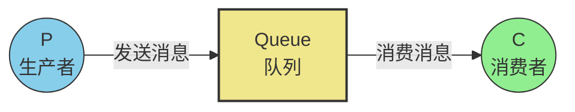
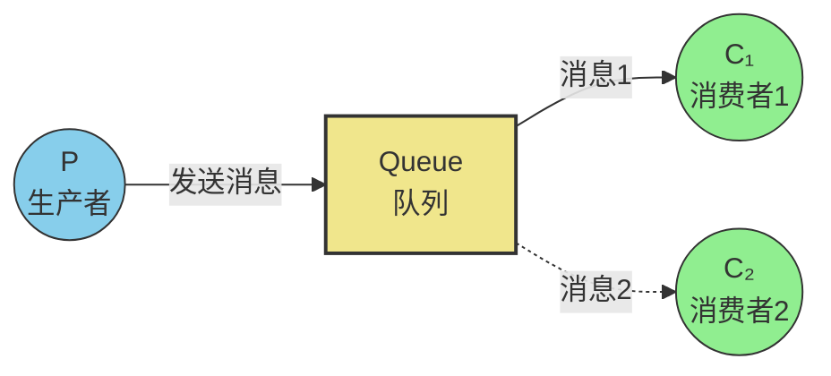
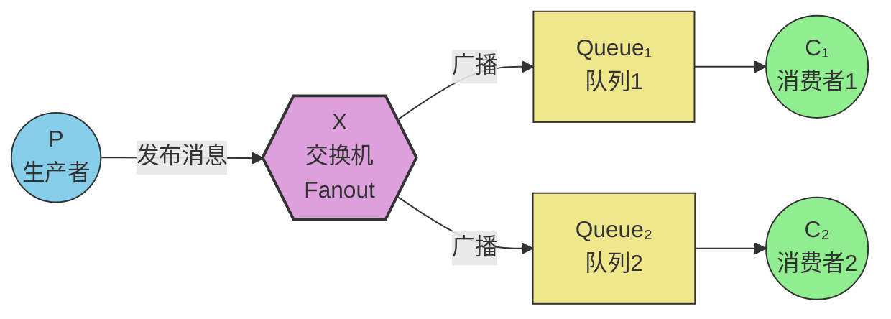
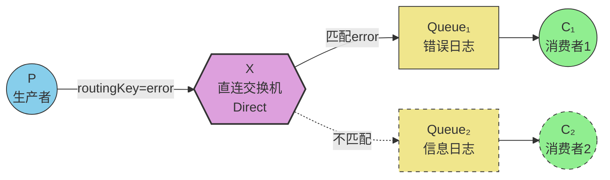
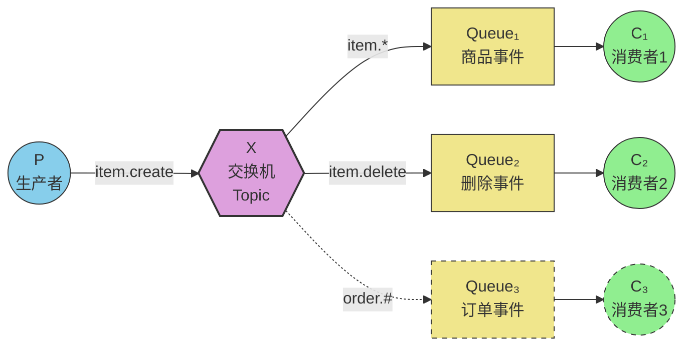
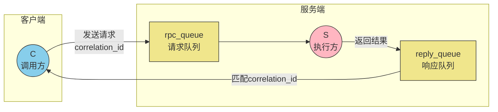

<script defer src="/javascripts/waline.min.js"></script>
<link rel="stylesheet" href="https://help-site.oss-cn-hangzhou.aliyuncs.com/css/waline.css" />
<link rel="stylesheet" href="/stylesheets/waline.min.css" />
<script defer src="https://help-site.oss-cn-hangzhou.aliyuncs.com/js/mermaid.min.js"></script>

# RabbitMQ工作模式介绍

## 基本概览

在RabbitMQ中提供了7种工作模式，分别为：

1. 简单模式
2. 工作队列模式（work queues）
3. 发布/订阅模式（publish/subscribe）
4. 路由模式（routing）
5. 通配符模式（topics）
6. RPC（RPC通信）
7. 生产者消息确认模式（publisher confirms）

下面针对这7种工作模式进行介绍

## 简单模式

简单模式工作图如下：



简单模式就是“点对点”的一种形式，即一个消费者对应一个生产者。参考代码见[基础代码演示](https://www.help-doc.top/rabbitmq/rabbitmq-intro/rabbitmq-intro.html#_1)

## 工作队列模式

工作队列模式工作图如下：



工作队列模式最大的特点就是一个生产者对应多个消费者，多个消费者同时从队列中获取消息，不会出现消息重复消费，例如有10条数据，两个消费者，那么两个消费者最后消费的消息总数为10条。参考代码如下：

=== "生产者"

    ```java
    public class Producer {
        public static void main(String[] args) throws IOException, TimeoutException {
            // 创建连接对象工厂
            ConnectionFactory connectionFactory = new ConnectionFactory();
            // 设置属性
            connectionFactory.setHost("127.0.0.1");
            connectionFactory.setPort(5672);
            connectionFactory.setUsername("admin");
            connectionFactory.setPassword("admin");
            connectionFactory.setVirtualHost("study");
            // 拿到连接对象
            Connection connection = connectionFactory.newConnection();
            // 获取信道
            Channel channel = connection.createChannel();
            // 设置交换机，使用内置交换机，无需手动设置
            // 设置队列
            channel.queueDeclare("work-queue", true, false, false, null);
            // 发送10条消息
            for (var i = 0; i < 10; i++) {
                String message = "rabbitmq intro-" + i;
                channel.basicPublish("", "work-queue", null, message.getBytes());
            }
            // 释放资源，先关闭信道，再关闭连接
            channel.close();
            connection.close();
        }
    }
    ```

=== "消费者1"

    ```java
    public class Consumer1 {
        public static void main(String[] args) throws IOException, TimeoutException {
            // 创建连接对象工厂
            ConnectionFactory connectionFactory = new ConnectionFactory();
            // 设置属性
            connectionFactory.setHost("127.0.0.1");
            connectionFactory.setPort(5672);
            connectionFactory.setUsername("admin");
            connectionFactory.setPassword("admin");
            connectionFactory.setVirtualHost("study");
            // 拿到连接对象
            Connection connection = connectionFactory.newConnection();
            // 获取信道
            Channel channel = connection.createChannel();
            // 声明队列（为了防止消费者启动时队列不存在而报错，消费者建议声明队列）
            channel.queueDeclare("work-queue", true, false, false, null);
            // 消费消息
            DefaultConsumer defaultConsumer = new DefaultConsumer(channel) {
                @Override
                public void handleDelivery(String consumerTag,
                                        Envelope envelope,
                                        AMQP.BasicProperties properties,
                                        byte[] body) throws IOException {
                    System.out.println("消费消息：" + new String(body));
                }
            };

            channel.basicConsume("work-queue", true, defaultConsumer);
            // 硬编码以确保收到消息
            // Thread.sleep(2000);
            // 释放资源，先关闭信道，再关闭连接
            // 为了演示效果，此处不关闭资源
            // channel.close();
            // connection.close();
        }
    }
    ```

=== "消费者2"

    ```java
    public class Consumer2 {
        public static void main(String[] args) throws IOException, TimeoutException {
            // 创建连接对象工厂
            ConnectionFactory connectionFactory = new ConnectionFactory();
            // 设置属性
            connectionFactory.setHost("127.0.0.1");
            connectionFactory.setPort(5672);
            connectionFactory.setUsername("admin");
            connectionFactory.setPassword("admin");
            connectionFactory.setVirtualHost("study");
            // 拿到连接对象
            Connection connection = connectionFactory.newConnection();
            // 获取信道
            Channel channel = connection.createChannel();
            // 声明队列（为了防止消费者启动时队列不存在而报错，消费者建议声明队列）
            channel.queueDeclare("work-queue", true, false, false, null);
            // 消费消息
            DefaultConsumer defaultConsumer = new DefaultConsumer(channel) {
                @Override
                public void handleDelivery(String consumerTag,
                                        Envelope envelope,
                                        AMQP.BasicProperties properties,
                                        byte[] body) throws IOException {
                    System.out.println("消费消息：" + new String(body));
                }
            };

            channel.basicConsume("work-queue", true, defaultConsumer);
            // 硬编码以确保收到消息
            // Thread.sleep(2000);
            // 释放资源，先关闭信道，再关闭连接
            // 为了演示效果，此处不关闭资源
            // channel.close();
            // connection.close();
        }
    }
    ```

为了看到效果，先启动两个消费者，再启动生产者，就可以看到两个消费者分别消费了一定数量的消息

## 发布/订阅模式

发布/订阅模式工作图如下：



在发布/订阅模式中，只要指定的队列“订阅了”对应的交换机，那么发布的消息就会走到对应的队列中，由该队列的消费者进行消费

与工作队列模式不同的是，发布/订阅模式中生产者发布了多少消息，每一个队列的消费者就会接收到相同数量的消息，相当于每条消息都拷贝给所有的消费者，即消息会重复

参考代码如下：

=== "生产者"

    ```java
    public class Producer {
        public static void main(String[] args) throws IOException, TimeoutException {
            // 创建连接对象工厂
            ConnectionFactory connectionFactory = new ConnectionFactory();
            // 设置属性
            connectionFactory.setHost("127.0.0.1");
            connectionFactory.setPort(5672);
            connectionFactory.setUsername("admin");
            connectionFactory.setPassword("admin");
            connectionFactory.setVirtualHost("study");
            // 拿到连接对象
            Connection connection = connectionFactory.newConnection();
            // 获取信道
            Channel channel = connection.createChannel();
            // 声明交换机为Fanout
            // 参数分别为交换机名称、交换机类型和是否持久化
            channel.exchangeDeclare("fanout-exchange", BuiltinExchangeType.FANOUT, true);
            // 声明队列
            channel.queueDeclare("fanout-queue1", true, false, false, null);
            channel.queueDeclare("fanout-queue2", true, false, false, null);
            // 绑定队列和交换机
            channel.queueBind("fanout-queue1", "fanout-exchange", "");
            channel.queueBind("fanout-queue2", "fanout-exchange", "");
            // 发送消息
            String msg = "hello fanout";
            channel.basicPublish("fanout-exchange", "", null, msg.getBytes());
            // 关闭资源
            channel.close();
            connection.close();
        }
    }
    ```

=== "消费者1"

    ```java
    public class Consumer1 {
        public static void main(String[] args) throws IOException, TimeoutException, InterruptedException {
            // 创建连接对象工厂
            ConnectionFactory connectionFactory = new ConnectionFactory();
            // 设置属性
            connectionFactory.setHost("127.0.0.1");
            connectionFactory.setPort(5672);
            connectionFactory.setUsername("admin");
            connectionFactory.setPassword("admin");
            connectionFactory.setVirtualHost("study");
            // 拿到连接对象
            Connection connection = connectionFactory.newConnection();
            // 获取信道
            Channel channel = connection.createChannel();
            // 声明队列
            channel.queueDeclare("fanout-queue1", true, false, false, null);
            // 消费消息
            DefaultConsumer defaultConsumer = new DefaultConsumer(channel) {
                // 重写DefaultConsumer中的handleDelivery方法
                // 参数分别是消费者标签、消息的封包信息、配置信息、消息
                @Override
                public void handleDelivery(String consumerTag,
                                        Envelope envelope,
                                        AMQP.BasicProperties properties,
                                        byte[] body) throws IOException {
                    System.out.println("消费消息：" + new String(body));
                }
            };
            // 参数分别是队列名称、是否自动确认消息接收、消息回调函数
            channel.basicConsume("fanout-queue1", true, defaultConsumer);
            // 硬编码以确保收到消息
            Thread.sleep(2000);
            // 释放资源，先关闭信道，再关闭连接
            channel.close();
            connection.close();
        }
    }
    ```

=== "消费者2"

    ```java
    public class Consumer2 {
        public static void main(String[] args) throws IOException, TimeoutException, InterruptedException {
            // 创建连接对象工厂
            ConnectionFactory connectionFactory = new ConnectionFactory();
            // 设置属性
            connectionFactory.setHost("127.0.0.1");
            connectionFactory.setPort(5672);
            connectionFactory.setUsername("admin");
            connectionFactory.setPassword("admin");
            connectionFactory.setVirtualHost("study");
            // 拿到连接对象
            Connection connection = connectionFactory.newConnection();
            // 获取信道
            Channel channel = connection.createChannel();
            // 声明队列
            channel.queueDeclare("fanout-queue2", true, false, false, null);
            // 消费消息
            DefaultConsumer defaultConsumer = new DefaultConsumer(channel) {
                // 重写DefaultConsumer中的handleDelivery方法
                // 参数分别是消费者标签、消息的封包信息、配置信息、消息
                @Override
                public void handleDelivery(String consumerTag,
                                        Envelope envelope,
                                        AMQP.BasicProperties properties,
                                        byte[] body) throws IOException {
                    System.out.println("消费消息：" + new String(body));
                }
            };
            // 参数分别是队列名称、是否自动确认消息接收、消息回调函数
            channel.basicConsume("fanout-queue2", true, defaultConsumer);
            // 硬编码以确保收到消息
            Thread.sleep(2000);
            // 释放资源，先关闭信道，再关闭连接
            channel.close();
            connection.close();
        }
    }
    ```

## 路由模式

路由模式工作图如下：



路由模式就是由交换机根据Routing Key和Binding Key的比对判断应该走哪个队列，这个比对必须是完全匹配，而不是模糊匹配。参考代码：

=== "生产者"

    ```java
    public class Producer {
        public static void main(String[] args) throws IOException, TimeoutException {
            // 创建连接对象工厂
            ConnectionFactory connectionFactory = new ConnectionFactory();
            // 设置属性
            connectionFactory.setHost("127.0.0.1");
            connectionFactory.setPort(5672);
            connectionFactory.setUsername("admin");
            connectionFactory.setPassword("admin");
            connectionFactory.setVirtualHost("study");
            // 拿到连接对象
            Connection connection = connectionFactory.newConnection();
            // 获取信道
            Channel channel = connection.createChannel();
            // 声明交换机为Fanout
            // 参数分别为交换机名称、交换机类型和是否持久化
            channel.exchangeDeclare("routing-exchange", BuiltinExchangeType.DIRECT, true);
            // 声明队列
            channel.queueDeclare("routing-queue1", true, false, false, null);
            channel.queueDeclare("routing-queue2", true, false, false, null);
            // 绑定队列和交换机
            channel.queueBind("routing-queue1", "routing-exchange", "error"); // 错误信息队列
            channel.queueBind("routing-queue2", "routing-exchange", "info"); // 日志信息队列
            // 发送消息
            String errMsg = "hello error";
            channel.basicPublish("routing-exchange", "error", null, errMsg.getBytes());
            String infoMsg = "hello info";
            channel.basicPublish("routing-exchange", "info", null, infoMsg.getBytes());
            // 关闭资源
            channel.close();
            connection.close();
        }
    }
    ```

=== "消费者1"

    ```java
    public class Consumer1 {
        public static void main(String[] args) throws IOException, TimeoutException, InterruptedException {
            // 创建连接对象工厂
            ConnectionFactory connectionFactory = new ConnectionFactory();
            // 设置属性
            connectionFactory.setHost("127.0.0.1");
            connectionFactory.setPort(5672);
            connectionFactory.setUsername("admin");
            connectionFactory.setPassword("admin");
            connectionFactory.setVirtualHost("study");
            // 拿到连接对象
            Connection connection = connectionFactory.newConnection();
            // 获取信道
            Channel channel = connection.createChannel();
            // 声明队列
            channel.queueDeclare("routing-queue1", true, false, false, null);
            // 消费消息
            DefaultConsumer defaultConsumer = new DefaultConsumer(channel) {
                // 重写DefaultConsumer中的handleDelivery方法
                // 参数分别是消费者标签、消息的封包信息、配置信息、消息
                @Override
                public void handleDelivery(String consumerTag,
                                        Envelope envelope,
                                        AMQP.BasicProperties properties,
                                        byte[] body) throws IOException {
                    System.out.println("消费消息：" + new String(body));
                }
            };
            // 参数分别是队列名称、是否自动确认消息接收、消息回调函数
            channel.basicConsume("routing-queue1", true, defaultConsumer);
            // 硬编码以确保收到消息
            Thread.sleep(2000);
            // 释放资源，先关闭信道，再关闭连接
            channel.close();
            connection.close();
        }
    }
    ```

=== "消费者2"

    ```java
    public class Consumer2 {
        public static void main(String[] args) throws IOException, TimeoutException, InterruptedException {
            // 创建连接对象工厂
            ConnectionFactory connectionFactory = new ConnectionFactory();
            // 设置属性
            connectionFactory.setHost("127.0.0.1");
            connectionFactory.setPort(5672);
            connectionFactory.setUsername("admin");
            connectionFactory.setPassword("admin");
            connectionFactory.setVirtualHost("study");
            // 拿到连接对象
            Connection connection = connectionFactory.newConnection();
            // 获取信道
            Channel channel = connection.createChannel();
            // 声明队列
            channel.queueDeclare("routing-queue2", true, false, false, null);
            // 消费消息
            DefaultConsumer defaultConsumer = new DefaultConsumer(channel) {
                // 重写DefaultConsumer中的handleDelivery方法
                // 参数分别是消费者标签、消息的封包信息、配置信息、消息
                @Override
                public void handleDelivery(String consumerTag,
                                        Envelope envelope,
                                        AMQP.BasicProperties properties,
                                        byte[] body) throws IOException {
                    System.out.println("消费消息：" + new String(body));
                }
            };
            // 参数分别是队列名称、是否自动确认消息接收、消息回调函数
            channel.basicConsume("routing-queue2", true, defaultConsumer);
            // 硬编码以确保收到消息
            Thread.sleep(2000);
            // 释放资源，先关闭信道，再关闭连接
            channel.close();
            connection.close();
        }
    }
    ```

在上面的示例中，消费者1会从`routing-queue1`中拿到数据，对应的消息即为`hello error`，消费者2会从`routing-queue2`中拿到数据，对应的消息即为`hello info`

## 通配符模式

通配符模式工作图如下：



通配符模式可以说是路由模式的一种升级版，从完全匹配到支持模糊匹配，只要满足匹配规则即可。其余特点与路由模式类似。RabbitMQ支持下面两种通配符：

| 符号          | 含义            | 示例                                                           |
| ----------- | ------------- | --------------------------------------------------------------- |
| **`*`** | 匹配**恰好一个**单词  | `user.*.login`匹配`user.123.login`，但不匹配`user.123.456.login`    |
| **`#`** | 匹配**零个或多个**单词 | `user.#`匹配`user.login`、`user.123.logout.failed`等所有以`user`开头的 |

参考代码如下：

=== "生产者"

    ```java
    public class Producer {
        public static void main(String[] args) throws IOException, TimeoutException {
            // 创建连接对象工厂
            ConnectionFactory connectionFactory = new ConnectionFactory();
            // 设置属性
            connectionFactory.setHost("127.0.0.1");
            connectionFactory.setPort(5672);
            connectionFactory.setUsername("admin");
            connectionFactory.setPassword("admin");
            connectionFactory.setVirtualHost("study");
            // 拿到连接对象
            Connection connection = connectionFactory.newConnection();
            // 获取信道
            Channel channel = connection.createChannel();
            // 声明交换机为Topic
            // 参数分别为交换机名称、交换机类型和是否持久化
            channel.exchangeDeclare("topic-exchange", BuiltinExchangeType.TOPIC, true);
            // 声明队列
            channel.queueDeclare("topic-queue1", true, false, false, null);
            channel.queueDeclare("topic-queue2", true, false, false, null);
            channel.queueDeclare("topic-queue3", true, false, false, null);
            // 绑定队列和交换机
            channel.queueBind("topic-queue1", "topic-exchange", "item.*"); // 商品事件
            channel.queueBind("topic-queue2", "topic-exchange", "item.delete"); // 商品删除事件
            channel.queueBind("topic-queue3", "topic-exchange", "order.#"); // 订单事件
            // 发送消息
            String dogMsg = "hello item.dog"; // 发给q1
            channel.basicPublish("topic-exchange", "item.dog", null, dogMsg.getBytes());
            String deleteMsg = "hello item.delete"; // 发给q1和q2
            channel.basicPublish("topic-exchange", "item.delete", null, deleteMsg.getBytes());
            String orderMsg = "hello order.create.pay"; // 发给q3
            channel.basicPublish("topic-exchange", "order.create.pay", null, orderMsg.getBytes());
            // 关闭资源
            channel.close();
            connection.close();
        }
    }
    ```

=== "消费者1"

    ```java
    public class Consumer1 {
        public static void main(String[] args) throws IOException, TimeoutException, InterruptedException {
            // 创建连接对象工厂
            ConnectionFactory connectionFactory = new ConnectionFactory();
            // 设置属性
            connectionFactory.setHost("127.0.0.1");
            connectionFactory.setPort(5672);
            connectionFactory.setUsername("admin");
            connectionFactory.setPassword("admin");
            connectionFactory.setVirtualHost("study");
            // 拿到连接对象
            Connection connection = connectionFactory.newConnection();
            // 获取信道
            Channel channel = connection.createChannel();
            // 声明队列
            channel.queueDeclare("topic-queue1", true, false, false, null);
            // 消费消息
            DefaultConsumer defaultConsumer = new DefaultConsumer(channel) {
                // 重写DefaultConsumer中的handleDelivery方法
                // 参数分别是消费者标签、消息的封包信息、配置信息、消息
                @Override
                public void handleDelivery(String consumerTag,
                                        Envelope envelope,
                                        AMQP.BasicProperties properties,
                                        byte[] body) throws IOException {
                    System.out.println("消费消息：" + new String(body));
                }
            };
            // 参数分别是队列名称、是否自动确认消息接收、消息回调函数
            channel.basicConsume("topic-queue1", true, defaultConsumer);
            // 硬编码以确保收到消息
            Thread.sleep(2000);
            // 释放资源，先关闭信道，再关闭连接
            channel.close();
            connection.close();
        }
    }
    ```

=== "消费者2"

    ```java
    public class Consumer2 {
        public static void main(String[] args) throws IOException, TimeoutException, InterruptedException {
            // 创建连接对象工厂
            ConnectionFactory connectionFactory = new ConnectionFactory();
            // 设置属性
            connectionFactory.setHost("127.0.0.1");
            connectionFactory.setPort(5672);
            connectionFactory.setUsername("admin");
            connectionFactory.setPassword("admin");
            connectionFactory.setVirtualHost("study");
            // 拿到连接对象
            Connection connection = connectionFactory.newConnection();
            // 获取信道
            Channel channel = connection.createChannel();
            // 声明队列
            channel.queueDeclare("topic-queue2", true, false, false, null);
            // 消费消息
            DefaultConsumer defaultConsumer = new DefaultConsumer(channel) {
                // 重写DefaultConsumer中的handleDelivery方法
                // 参数分别是消费者标签、消息的封包信息、配置信息、消息
                @Override
                public void handleDelivery(String consumerTag,
                                        Envelope envelope,
                                        AMQP.BasicProperties properties,
                                        byte[] body) throws IOException {
                    System.out.println("消费消息：" + new String(body));
                }
            };
            // 参数分别是队列名称、是否自动确认消息接收、消息回调函数
            channel.basicConsume("topic-queue2", true, defaultConsumer);
            // 硬编码以确保收到消息
            Thread.sleep(2000);
            // 释放资源，先关闭信道，再关闭连接
            channel.close();
            connection.close();
        }
    }
    ```

=== "消费者3"

    ```java
    public class Consumer3 {
        public static void main(String[] args) throws IOException, TimeoutException, InterruptedException {
            // 创建连接对象工厂
            ConnectionFactory connectionFactory = new ConnectionFactory();
            // 设置属性
            connectionFactory.setHost("127.0.0.1");
            connectionFactory.setPort(5672);
            connectionFactory.setUsername("admin");
            connectionFactory.setPassword("admin");
            connectionFactory.setVirtualHost("study");
            // 拿到连接对象
            Connection connection = connectionFactory.newConnection();
            // 获取信道
            Channel channel = connection.createChannel();
            // 声明队列
            channel.queueDeclare("topic-queue3", true, false, false, null);
            // 消费消息
            DefaultConsumer defaultConsumer = new DefaultConsumer(channel) {
                // 重写DefaultConsumer中的handleDelivery方法
                // 参数分别是消费者标签、消息的封包信息、配置信息、消息
                @Override
                public void handleDelivery(String consumerTag,
                                        Envelope envelope,
                                        AMQP.BasicProperties properties,
                                        byte[] body) throws IOException {
                    System.out.println("消费消息：" + new String(body));
                }
            };
            // 参数分别是队列名称、是否自动确认消息接收、消息回调函数
            channel.basicConsume("topic-queue3", true, defaultConsumer);
            // 硬编码以确保收到消息
            Thread.sleep(2000);
            // 释放资源，先关闭信道，再关闭连接
            channel.close();
            connection.close();
        }
    }
    ```

## RPC通信

[RPC](https://www.help-doc.top/projects/json-rpc/intro/intro.html#rpc)通信不完全算是RabbitMQ的主要功能，但是因为可以借助RabbitMQ来实现，所以官方也提供了这种模式，基本工作图如下：



在RPC通信中，不再有生产者和消费者的概念，而是客户端和服务端，当客户端调用指定服务时，会将请求、响应结果所处的队列名称和`correlation_id`一同发送给服务端（RabbitMQ服务器）的请求队列，服务端处理完结果之后，将响应和接收到的`correlation_id`发到客户端规定的响应队列，客户端判断`correlation_id`来确定是否是自己请求的服务进行结果处理，进而实现RPC通信

尽管可以使用RabbitMQ实现RPC通信，但是实际应用中使用的更多还是其他的RPC服务，例如grpc等

参考代码如下：

=== "客户端"

    ```java
    public class Client {
        public static void main(String[] args) throws IOException, TimeoutException, InterruptedException {
            // 创建连接对象工厂
            ConnectionFactory connectionFactory = new ConnectionFactory();
            // 设置属性
            connectionFactory.setHost("127.0.0.1");
            connectionFactory.setPort(5672);
            connectionFactory.setUsername("admin");
            connectionFactory.setPassword("admin");
            connectionFactory.setVirtualHost("study");
            // 拿到连接对象
            Connection connection = connectionFactory.newConnection();
            // 获取信道
            Channel channel = connection.createChannel();
            // 声明队列
            channel.queueDeclare("rpc-request-queue", true, false, false, null); // 请求队列
            channel.queueDeclare("rpc-response-queue", true, false, false, null); // 响应队列
            // 设置响应队列名称和correlation_id
            String correlationId = UUID.randomUUID().toString();
            AMQP.BasicProperties basicProperties = new AMQP.BasicProperties()
                    .builder()
                    .correlationId(correlationId)
                    .replyTo("rpc-response-queue")
                    .build(); // 创建外部类对象
            String request = "client request";
            // 构建消息发送给RPC服务端
            channel.basicPublish("", "rpc-request-queue", basicProperties, request.getBytes());
            // 判断响应并处理消息
            // 使用阻塞队列，确保客户端可以在接收到消息时才处理消息
            BlockingQueue<String> blockingQueue = new ArrayBlockingQueue<>(1);
            DefaultConsumer defaultConsumer = new DefaultConsumer(channel) {
                @Override
                public void handleDelivery(String consumerTag,
                                        Envelope envelope,
                                        AMQP.BasicProperties properties,
                                        byte[] body) throws IOException {
                    System.out.println("消费消息：" + new String(body));
                    // 判断correlation_id是否和请求时的相同
                    if (correlationId.equals(properties.getCorrelationId())) {
                        blockingQueue.offer(new String(body));
                    }
                }
            };
            channel.basicConsume("rpc-response-queue", true, defaultConsumer);
            // 此时可以从阻塞队列中拿到消息
            System.out.println(blockingQueue.take());
        }
    }
    ```

=== "服务端"

    ```java
    public class Server {
        public static void main(String[] args) throws IOException, TimeoutException {
            // 创建连接对象工厂
            ConnectionFactory connectionFactory = new ConnectionFactory();
            // 设置属性
            connectionFactory.setHost("127.0.0.1");
            connectionFactory.setPort(5672);
            connectionFactory.setUsername("admin");
            connectionFactory.setPassword("admin");
            connectionFactory.setVirtualHost("study");
            // 拿到连接对象
            Connection connection = connectionFactory.newConnection();
            // 获取信道
            Channel channel = connection.createChannel();
            // 声明队列
            channel.queueDeclare("rpc-request-queue", true, false, false, null); // 请求队列
            channel.queueDeclare("rpc-response-queue", true, false, false, null); // 响应队列
            // 设置最多获取一条消息
            channel.basicQos(1);
            // 服务端先消费消息
            DefaultConsumer defaultConsumer = new DefaultConsumer(channel) {
                @Override
                public void handleDelivery(String consumerTag,
                                        Envelope envelope,
                                        AMQP.BasicProperties properties,
                                        byte[] body) throws IOException {
                    System.out.println("服务端接收到：" + new String(body));
                    // 构建响应放到响应队列中
                    AMQP.BasicProperties basicProperties = new AMQP.BasicProperties()
                            .builder()
                            .correlationId(properties.getCorrelationId())
                            .build(); // 创建外部类对象
                    String response = "服务端成功处理请求：" + new String(body);
                    // 构建消息发送给响应队列
                    channel.basicPublish("", "rpc-response-queue", basicProperties, response.getBytes());
                    // 手动确认
                    // 单条确认指定编号的消息
                    channel.basicAck(envelope.getDeliveryTag(), false);
                }
            };
            // 此处设置手动确认，而不是自动确认，本次设计为消息被服务端正常处理才表示接收到消息
            channel.basicConsume("rpc-request-queue", false, defaultConsumer);
        }
    }
    ```

在上面代码中，手动确认机制和同时处理一条消息的特性会在后续章节提到，此处了解即可

## 生产者消息确认模式

前面介绍的模式都是在考虑消息如何被存储到队列中的问题，但是生产者消息确认模式只是考虑消息是否到达队列，当生产者发送消息给交换机之后，交换机将消息保存到队列中就会发送一条确认消息给生产者，告诉其消息已送达，但是消息是否会被消费者正确处理，在生产者消息确认模式中并不考虑

当开启发布确认后，Broker会在消息成功路由到队列（或被持久化到磁盘，如果是持久化消息）后，异步向生产者发送一个`ack`（确认）；如果消息无法路由或发生内部错误，则发送`nack`（否定确认）。在RabbitMQ中，消息确认模式有三种实现方式，分别是：

1. 单独确认模式：每条消息等待确认后再发下一条，性能最慢但最简单
2. 批量确认模式：发送一批消息后统一等待确认，性能较好但难以定位具体失败消息
3. 异步确认模式：通过回调接口异步处理确认，性能最高，适合高吞吐场景

三种模式核心代码如下：

=== "单独确认模式"

    ```java
    channel.confirmSelect(); // 开启确认模式

    for (int i = 0; i < 10; i++) {
        channel.basicPublish("", queue, null, ("msg-" + i).getBytes());
        
        // 阻塞等待服务器确认（5秒超时）
        boolean ack = channel.waitForConfirms(5000);
        if (!ack) {
            // 处理失败，需重发
        }
    }
    ```

=== "批量确认模式"

    ```java
    channel.confirmSelect();
    int batchSize = 100;

    for (int i = 0; i < 1000; i++) {
        channel.basicPublish("", queue, null, ("msg-" + i).getBytes());
        
        if (i % batchSize == 0) {
            // 每100条等待一次确认
            if (!channel.waitForConfirms(5000)) {
                // 整批失败，需重发这100条
            }
        }
    }
    ```

=== "异步确认模式"

    ```java
    channel.confirmSelect();

    // 使用线程安全的有序集合追踪未确认消息（key为deliveryTag）
    SortedSet<Long> confirmSet = Collections.synchronizedSortedSet(new TreeSet<>());

    // 确认回调
    channel.addConfirmListener(
        // ack 回调：deliveryTag表示确认的消息序号，multiple表示是否批量确认
        (deliveryTag, multiple) -> {
            if (multiple) {
                // 批量确认：移除该序号及之前所有序号
                confirmSet.headSet(deliveryTag + 1).clear();
            } else {
                confirmSet.remove(deliveryTag);
            }
        },
        // nack 回调：消息丢失，需重发
        (deliveryTag, multiple) -> {
            if (multiple) {
                // 批量确认：移除该序号及之前所有序号
                confirmSet.headSet(deliveryTag + 1).clear();
            } else {
                confirmSet.remove(deliveryTag);
            }
            System.out.println("消息失败 tag: " + deliveryTag);
            // 从重发缓冲区取出消息重发
        }
    );

    // 异步发送
    for (int i = 0; i < 1000; i++) {
        long nextSeqNo = channel.getNextPublishSeqNo();
        // 发布消息时会自动携带编号，所以只需要获取即可
        channel.basicPublish("", queue, null, ("msg-" + i).getBytes());
        confirmSet.add(nextSeqNo);
    }
    ```