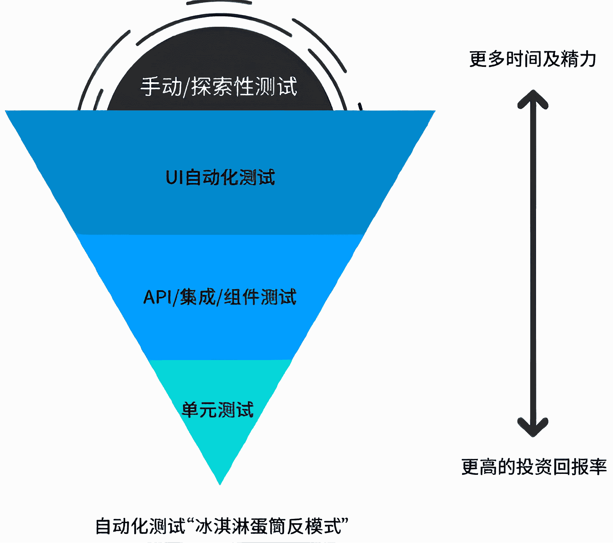

<script defer src="/javascripts/waline.min.js"></script>
<link rel="stylesheet" href="https://unpkg.com/@waline/client@v3/dist/waline.css" />
<link rel="stylesheet" href="/stylesheets/waline.min.css" />

# 自动化测试概念及UI自动化测试

## 自动化测试的概念

自动化测试是指使用自动化工具执行事先编写好的测试用例，通过程序控制的方式来进行测试，并生成测试报告的过程。它能够模拟用户操作，验证软件功能是否符合预期。自动化测试的主要目的是用来进行回归测试

所谓回归测试，就是在软件修改后重新执行之前的测试用例，以确保新的代码变更没有破坏原有功能的测试方法

## 自动化的分类

自动化一般分为两种：

1. 接口自动化：通过编写脚本或使用工具自动执行API接口测试，验证接口功能、性能和数据正确性的测试方法
2. 界面（UI）自动化：通过编写脚本或使用工具模拟用户在图形界面上的操作（如点击、输入、滑动等），自动执行界面功能测试的方法。常见的界面自动化测试包含Web自动化测试、移动端自动化测试等

## 自动化测试金字塔

理想的自动化测试金字塔表达了自动化测试的理想情况，利用较少的时间和精力在单元测试上就能够发现更多有效的问题，如下图所示：


但是在实际开发中，常常表现为“冰激凌”的形状：



自动化需要大量的初始投资，找到“突破点”，与手动测试相比，我们开始看到它对长期成本产生的积极影响，也能够清楚，这两种测试活动都是完全兼容，产生短期和长期利益。需要注意，**自动化测试并不能代替手动测试**

## Web自动化与Selenium介绍和基本使用

Web自动化是指通过编程方式控制浏览器自动执行网页操作（如点击、填表、导航等），实现Web应用功能测试和任务自动化的技术

实现Web自动化的方式有很多，比较有名的就是[Selenium](https://www.selenium.dev/)。Selenium是一个开源的Web自动化测试框架，支持多种编程语言和浏览器，能够模拟用户在浏览器中的各种操作来实现自动化测试

使用Selenium实现Web自动化一般需要执行下面的步骤：

1. 下载指定浏览器的驱动
2. 配置Selenium
3. 使用Selenium模仿图形化界面中的操作
4. 关闭浏览器（或者关闭当前驱动对应的标签页）

以Python为例，使用Selenium实现访问百度并搜索“柯懒不是柯南的博客”：

```py
from selenium import webdriver
from selenium.webdriver.chrome.service import Service
from selenium.webdriver.common.by import By
from webdriver_manager.chrome import ChromeDriverManager

# 打开浏览器
ChromeInstallPath = ChromeDriverManager().install() # 创建驱动
driver = webdriver.Chrome(service = Service(ChromeInstallPath)) # 传递驱动打开浏览器
# 访问百度网址
driver.get("https://www.baidu.com")
# 找到输入框输入关键词
driver.find_element(By.CSS_SELECTOR, "#chat-textarea").send_keys("柯懒不是柯南的博客")
# 点击搜索按钮
driver.find_element(By.CSS_SELECTOR, "#chat-submit-button").click()
# 关闭浏览器
driver.quit()
```

后续的介绍也将基于Python，其他的语言可以查看[官方文档](https://www.selenium.dev/documentation/)，基本使用类似

## 自动化测试相关函数

### 元素查找函数

元素查找函数分为两种：

1. 查找唯一元素：`find_element`，函数返回一个`WebElement`对象
2. 查找多个元素：`find_elements`，函数返回一个列表，列表中的元素都为`WebElement`对象

这两种函数使用方法一致，下面以`find_element`为例

在`find_element`中需要传递两个参数，第一个参数表示查找方式，第二个参数表示元素选择器。常见的查找方式是根据CSS选择器和<a href="javascript:;" class="custom-tooltip" data-title="XML路径语言，不仅可以在XML文件中查找信息，还可以在HTML中选取节点">XPath</a>，对应的第一个参数分别为：

1. `By.CSS_SELECTOR`：使用[CSS的选择器](https://www.help-doc.top/html-css/css/css.html#_5)进行元素选择
2. `By.XPATH`：使用XPath语法进行元素选择

XPath常见语法如下：

1. 获取HTML页面所有的节点：`//*`
2. 获取HTML页面指定的节点：`//[指定的节点]`
3. 获取一个节点中的直接子节点：`/`
4. 获取一个节点的父节点：`..`
5. 实现节点的属性匹配：`[@...]`
6. 使用指定索引的方式获取对应节点的内容（索引从1开始）

例如下面的代码：

```py
# 查找页面中id值为hotsearch-content-wrapper的元素中第二个li元素的子元素a中的第二个span元素
driver.find_element(By.XPATH, '//*[@id="hotsearch-content-wrapper"]/li[2]/a/span[2]')
```

### 操作测试对象

常见的操作有：

1. 点击元素`click()`
2. 模拟按键输入`send_keys()`
3. 清除文本内容`clear()`
4. 获取文本信息`text`
5. 获取元素属性`get_attribute()`

这些操作需要的对象类型均为`WebElement`

例如：

```py
# 获取元素打印元素的内容
ret = driver.find_element(By.XPATH, '//*[@id="hotsearch-content-wrapper"]/li[2]/a/span[2]')
print(ret.text)
# 获取元素属性值
value = driver.find_element(By.CSS_SELECTOR, "#chat-textarea").get_attribute("placeholder")
print(value)
```

### 键盘按键

在Selenium中，键盘按键操作可以通过`ActionChains`对象实现，对应的键盘操作按键描述通过[`Keys`类](https://github.com/SeleniumHQ/selenium/blob/selenium-4.2.0/py/selenium/webdriver/common/keys.py#L23)描述，对于非操作按键，可以参考[此文档](https://www.w3.org/TR/webdriver/#keyboard-actions)。具体使用方式可以参考[官方文档](https://www.selenium.dev/zh-cn/documentation/webdriver/actions_api/keyboard/)

常见的操作有：

1. 按键按下（不释放）：`key_down`
2. 按键释放：`key_up`
3. 按键按下立即释放：`send_keys`

例如下面的代码：

```py
# 在百度输入框中按下shift按键后输入abc -> 输入ABC
driver.get("https://www.baidu.com")
driver.find_element(By.CSS_SELECTOR, "#chat-textarea")
ActionChains(driver).key_down(Keys.SHIFT).send_keys("abc").perform()
# 复制内容：waited for copy and paste
# 操作步骤：全选内容，复制内容，光标回到当前内容结尾，粘贴内容
(ActionChains(driver).send_keys("waited for copy and paste")
 .key_down(Keys.CONTROL).send_keys("a").key_up(Keys.CONTROL)
 .key_down(Keys.CONTROL).send_keys("c").key_up(Keys.CONTROL)
 .key_down(Keys.END).key_up(Keys.END)
 .key_down(Keys.CONTROL).send_keys("vvv").perform())
```

### 获取页面的标题和URL

1. 获取页面标题：`title`
2. 获取页面URL：`current_url`

例如：

```py
driver.get("https://www.baidu.com")
# 获取到当前页面的标题和URL
title = driver.title
url = driver.current_url

print(f"页面标题：{title}，页面网址：{url}")
# 页面标题：百度一下，你就知道，页面网址：https://www.baidu.com/
```

### 窗口与切换

现在有这样一个场景，需要获取到页面跳转前后的标题和URL

以百度为例，如果是原地跳转，那么可以直接获取：

```py
driver.get("https://www.baidu.com")
# 页面原地跳转
print(f"页面跳转前：{driver.title} {driver.current_url}")
driver.find_element(By.CSS_SELECTOR, "#chat-textarea").send_keys("莫迪访华为何不参加九三阅兵")
driver.find_element(By.CSS_SELECTOR, "#chat-submit-button").click()
sleep(2) # 休眠确保服务器将数据完全响应给客户端
print(f"页面跳转后：{driver.title} {driver.current_url}")
```

但是如果是异地跳转，那么上面的代码获取到的两次标题和URL是相同的。出现这个问题的原因就在于**虽然网页的确发生了跳转，但是驱动程序还停留在上一个页面**，例如点击百度首页左上角的“图片”链接后：


此时两次获取页面标题和URL均为`百度一下，你就知道，页面网址：https://www.baidu.com/`

要解决这个问题就需要知道如何让驱动切换页面。在Selenium中，要实现这个效果，可以通过下面的步骤在**两个**标签中切换到另外一个标签：

1. 获取到当前窗口句柄：使用`current_window_handle`
2. 获取到所有窗口句柄列表：使用`window_handles`
3. 遍历所有窗口句柄列表找到非当前窗口句柄
4. 切换窗口：使用`switch_to`中的`window(窗口句柄)`

例如下面的代码：

```py
print(f"页面跳转前：{driver.title} {driver.current_url}")
# 页面跳转前：百度一下，你就知道 https://www.baidu.com/
driver.find_element(By.CSS_SELECTOR, "#s-top-left > a:nth-child(6)").click()
# 获取当前句柄
cur_handle = driver.current_window_handle
# 获取所有句柄
all_handle = driver.window_handles
# 遍历所有句柄，找到开启的第二个标签页
for win in all_handle:
    if cur_handle != win:
        # 切换句柄
        driver.switch_to.window(win)

print(f"页面跳转后：{driver.title} {driver.current_url}")
# 页面跳转后：百度图片 | 免费AI图像生成工具与海量高清图平台 https://image.baidu.com/
```

### 窗口操作

常见的窗口操作有以下几种：

1. 最小化窗口：使用`minimize_window()`
2. 最大化窗口：使用`maximize_window()`
3. 手动设置窗口大小：使用`set_window_size(width, height)`。需要传递两个参数，分别表示宽度和高度
4. 全屏窗口：使用`fullscreen_window()`

例如：

```py
# 最大化窗口
driver.maximize_window()
# 全屏
driver.fullscreen_window()
# 手动设置大小
driver.set_window_size(1024, 728)
# 最小化窗口
driver.minimize_window()
```

### 屏幕截图

屏幕截图可以使用`save_screenshot(filename)`函数，参数传递文件名（可以指定路径）。但是直接固定文件名会导致新的图片覆盖旧的图片，所以在截图时一般会考虑带上截图的时间，这里可以使用Python的内置库`datetime`中的函数`now()`来获取到当前系统时间，但是这个时间不能直接作为文件名，所以还需要考虑将时间进行格式化，可以调用`strftime()`函数进行格式化。例如：

```py
# 以年月日时分秒为文件命名
filename = "screenshot-" + datetime.now().strftime("%Y-%m-%d-%H-%M-%S.%f") +".png"
# 执行屏幕截图，将文件保存到screenshots目录下
driver.save_screenshot("./screenshots/" + filename)
```

如果想做到「不存在`screenshots`文件夹就创建，否则不创建」的操作，可以使用Python的`os`库进行文件操作：

```py
if not os.path.exists("./screenshots"):
    os.mkdir("./screenshots")
```

### 关闭标签页

关闭标签页可以使用`close()`函数：

```python
driver.close()
```

`close()`函数与`quit()`函数的不同点在于**`close()`并不会退出浏览器软件，只是关闭当前的标签页，但是`quit()`会直接退出浏览器**。需要注意的是，因为驱动和标签页是绑定的，所以一旦调用了`close()`，那么之后想在使用驱动需要重新获取指定页面

### 弹窗操作

前面使用`find_element`都是获取到网页内部的元素，但是对于弹窗来说其不属于网页内部的内容，也就无法通过`find_element`来获取。对于浏览器弹窗一般分为三种：

1. 警告弹窗（通过`alert`实现）
2. 确认弹窗（通过`confirm`实现）
3. 提示弹窗（通过`prompt`实现）

处理弹窗有一套固定的逻辑：

1. 切换到弹窗：通过`switch_to`的`alert`实现
2. 接受弹窗或者取消弹窗：分别通过`accept()`和`dismiss()`实现。其中，对于警告弹窗来说，`accept()`和`dismiss()`效果一致

特殊地，提示弹窗中的文本框可以通过`send_keys()`实现内容输入

例如：

```py
alert = driver.switch_to.alert
alert.accept()
```

### 导航操作

浏览器导航分为下面几种：

1. 前进：通过`forward()`实现
2. 后退：通过`back()`实现
3. 刷新：通过`refresh()`实现

例如：

```py
# 导航前进
driver.forward()
# 导航后退
driver.back()
# 导航刷新
driver.refresh()
```

### 文件上传

文件上传与内容输入非常类似，只是`send_keys()`为待上传的文件的**绝对路径**，例如：

```py
driver.find_element(By.CSS_SELECTOR, "input").send_keys(r"C:\test\test\test\upload_file.txt")
```

### 等待方式

除了使用`time`库中的`sleep(seconds)`函数以外，Selenium还提供了两种等待方式：

1. 隐式等待：也称为智能等待。驱动启动时通过调用`implicitly_wait(seconds)`函数设置等待时间，在查找元素时会消耗设置的等待时间，一旦某一个查找元素函数执行超时（一般是没有查找到元素）就报错，否则不报错
2. 显式等待：在执行查找指定元素之前先通过创建`WebDriverWait`对象设置超时时间，再由`WebDriverWait`对象根据指定条件通过`until()`进行等待，如果超时时间之内满足指定的条件，则不进行如何操作；如果没有满足指定条件或者超时，则报错

`until()`接口中可以传递`expected_conditions`，其是Selenium WebDriver中用于显式等待的一组预定义条件集合。以下是所有方法及其作用的介绍：

| 方法名                                                        | 作用                                            |
| ------------------------------------------------------------- | ----------------------------------------------- |
| `title_is(title)`                                             | 判断当前页面的标题是否完全等于给定的字符串      |
| `title_contains(title)`                                       | 判断当前页面的标题是否包含给定的字符串          |
| `presence_of_element_located(locator)`                        | 检查元素是否存在于DOM中（不一定可见）           |
| `visibility_of_element_located(locator)`                      | 检查元素是否存在于DOM中并且可见                 |
| `visibility_of(element)`                                      | 检查给定的元素是否可见                          |
| `presence_of_all_elements_located(locator)`                   | 检查定位器定位的所有元素是否都存在于DOM中       |
| `text_to_be_present_in_element(locator, text_)`               | 检查给定的文本是否出现在指定元素中              |
| `text_to_be_present_in_element_value(locator, text_)`         | 检查给定的文本是否出现在指定元素的`value`属性中 |
| `frame_to_be_available_and_switch_to_it(locator)`             | 检查`frame`是否可用并切换到该`frame`            |
| `invisibility_of_element_located(locator)`                    | 检查元素是否不可见或不存在于DOM中               |
| `element_to_be_clickable(locator)`                            | 检查元素是否可见且可点击                        |
| `element_to_be_selected(element)`                             | 检查元素是否被选中                              |
| `element_located_to_be_selected(locator)`                     | 检查定位的元素是否被选中                        |
| `element_selection_state_to_be(element, is_selected)`         | 检查元素的选中状态是否符合预期                  |
| `element_located_selection_state_to_be(locator, is_selected)` | 检查定位元素的选中状态是否符合预期              |
| `number_of_windows_to_be(num_windows)`                        | 检查当前窗口数量是否达到预期数量                |
| `new_window_is_opened(current_handles)`                       | 检查是否有新窗口打开                            |
| `url_to_be(url)`                                              | 检查当前URL是否完全等于给定URL                  |
| `url_contains(url)`                                           | 检查当前URL是否包含给定字符串                   |
| `url_matches(pattern)`                                        | 检查当前URL是否匹配给定的正则表达式模式         |
| `alert_is_present()`                                          | 检查是否出现`alert`弹窗                         |

例如：

```py
# 隐式等待
driver.implicitly_wait(2)
# 显式等待
wait = WebDriverWait(driver, timeout = 2)
wait.until(expected_conditions.visibility_of_element_located((By.CSS_SELECTOR, "#\\31  > div > div > div > div > div > div:nth-child(2) > div")))
# 如果在超时时间内查找到指定的元素，那么后续的查找就可以执行，否则就在等待位置报错
text = driver.find_element(By.CSS_SELECTOR, "#\\31  > div > div > div > div > div > div:nth-child(2) > div").text
print(text)
```

`until`中也可以使用Lambda表达式，例如：

```py
revealed = driver.find_element(By.ID, "revealed")
driver.find_element(By.ID, "reveal").click()

wait = WebDriverWait(driver, timeout=2)
wait.until(lambda _ : revealed.is_displayed())

revealed.send_keys("Displayed")
assert revealed.get_property("value") == "Displayed"
```

需要注意的是，隐式等待设置的是全局等待时间，也就是说，隐式等待的生命周期随驱动的结束（调用`quit()`）而结束，所以**不建议隐式等待和显式等待一起使用**，因为无法预估出总共需要等待的时间

### 启动参数

设置启动参数可以通过`webdriver.ChromeOptions()`的`add_argument()`进行设置，例如设置<a href="javascript:;" class="custom-tooltip" data-title="浏览器在没有图形用户界面（GUI）的情况下运行，浏览器在后台执行操作而不会弹出可见的窗口">无头模式</a>：

```py
options = webdriver.ChromeOptions()
options.add_argument("-headless")
# 将参数传递给Chrome驱动对象构造函数中
driver = webdriver.Chrome(options, service = Service(installPath))
```

### 加载策略

设置加载策略`webdriver.ChromeOptions()`的`page_load_strategy`参数进行设置，有三种取值：

| 加载策略 | 描述         | 特点     |
| -------- | -------------------------------------- | ---------------------------------------------------------------------- |
| `normal` | 默认加载策略，等待页面所有资源加载完成 | 等待HTML文档、CSS、JavaScript、图片等所有资源完全加载后才继续执行      |
| `eager`  | 等待`DOMContentLoaded`事件触发           | 只等待HTML文档完全加载和解析完成，不等待样式表、图片和子框架等资源加载 |
| `none`   | 只等待初始HTML文档加载完成             | 最快速的加载方式，只等待最初的HTML文档加载完成就继续执行               |

例如：

```py
options.page_load_strategy = 'eager'
```