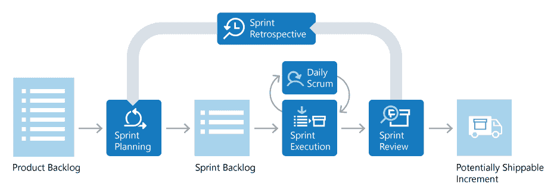
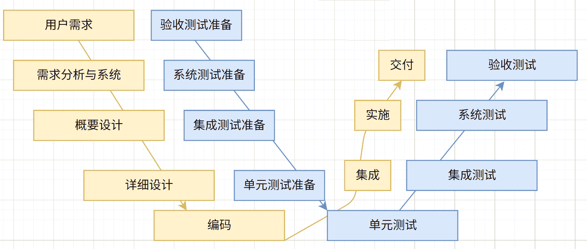

<script defer src="/javascripts/waline.min.js"></script>
<link rel="stylesheet" href="https://unpkg.com/@waline/client@v3/dist/waline.css" />
<link rel="stylesheet" href="/stylesheets/waline.min.css" />
<!-- 添加mermaid支持 -->
<script defer src="https://cdn.jsdelivr.net/npm/mermaid@11.5.0/dist/mermaid.min.js"></script>
<!-- 添加对Katex的支持 -->
<script defer src="/javascripts/katex.min.js"></script>
<script defer src="https://cdn.jsdelivr.net/npm/katex@0.16.21/dist/katex.min.js"></script>
<script defer src="https://cdn.jsdelivr.net/npm/katex@0.16.21/dist/contrib/auto-render.min.js"></script>

# 软件测试相关概念

## 何为测试

软件测试是指在规定的条件下对程序进行操作，以发现程序错误，衡量软件质量，并对其是否能满足设计要求进行评估的过程

测试的核心要素：

- 验证性：验证软件是否按照需求规格说明书正确实现
- 确认性：确认软件是否满足用户的实际需要
- 发现缺陷：通过执行程序发现其中的错误和缺陷
- 质量评估：评估软件产品的质量水平

测试的本质：测试是一个过程，为了发现错误而执行程序的过程。测试包括静态测试（不执行代码）和动态测试（执行代码）

## 为什么需要测试

软件测试在软件开发生命周期中具有至关重要的作用，主要原因包括：

1. 发现和预防缺陷
2. 保证软件质量
3. 降低风险
4. 建立信心
5. 经济效益
6. 法律和合规要求

软件测试是验证软件产品<a href="javascript:;" class="custom-tooltip" data-title="常见的特性包含：功能、性能、界面、易用性等">特性</a>是否满⾜⽤⼾的需求，其不仅仅是发现错误的手段，更是保证软件质量、降低风险、提升用户满意度的重要过程。在现代软件开发中，测试已经成为不可或缺的环节，**贯穿于整个软件开发生命周期**

## 测试岗位的分类

测试岗位一般分为两类：

1. 测试开发工程师：工作重心为可测试性以及通用测试基础框架。编写单元测试框架和自动化测试框架。软件测试开发⼯程师关注质量提升和测试覆盖率，一般还会开发一些用于测试的工具
2. 测试工程师：与软件测试开发工程师关系密切，但把用户放在第一位来思考。测试工程师组织整体测试实践，并进行分析总结，驱动测试执行，构建端到端的自动化测试

测试开发工程师与测试工程师的区别：

相同点：

1. 都统称为测试人员 
2. 对产品质量负责，保障产品的质量

不同点：测试开发比测试多「开发」二字，而这个开发并不是指业务开发，因为业务开发是开发人员的主要职责，这里的开发指的是需要开发测试效率工具，通过效率工具来提升测试效率和测试质量，比如自动化、性能测试等就属于效率工具

## 调试和测试的区别

测试经常会进行测试动作，而开发人员进行调试动作，二者对比如下：

|      | 调试     | 测试    |
| -------- | ------------------------------------ | --------------------------------------------------------------------------------------------------- |
| 目的     | 调试的任务是定位并且解决程序中的问题 | 测试的任务是发现程序中的缺陷            |
| 参与角色 | 主要由开发人员完成                   | 测试主要是由测试人员和开发人员来执行，黑盒测试主要由测试人员完成、单元/集成测试主要是由开发人员执行 |
| 执行阶段 | 开发/编码阶段         | 测试贯穿整个软件开发生命周期，并不局限于测试阶段  |

??? question "为什么测试岗位还需要学习开发的知识"

    1. 测试人员也需要编写代码，如自动化测试、性能测试、开发测试效率工具等。测试人员需要能够看懂代码、了解开发框架
    2. 学好开发知识能够提高软件测试质量。通过查看代码中数据的走向能够更好的从代码层面去发现问题

??? question "为什么不走开发，走测试"

    回答思路：从岗位工作性质分析+个人性格/爱好+个人职业规划三个方面阐述。例如下面的示例：

    1. 个人兴趣爱好：从性格和兴趣出发，测试工作需要测试人员具备良好的耐心、细心，接触了测试内容后对测试工作产生浓厚兴趣
    2. 岗位性质：不管是测试还是测试开发都统称为测试人员，测试人员主要以保障项目测试质量为主，通过开发一些测试效率工具来提高测试效率。而软件开发主要以业务编码为主
    3. 个人职业规划：大学期间就树立了走测试方向的目标，今后将继续提高测试和开发能力，争取在测试领域做出一番有影响力的事务

## 何为需求

软件需求是指用户对目标软件系统在功能、行为、性能、设计约束等方面的期望。它是软件开发和测试的基础，描述了软件系统应该做什么以及如何做。需求一般分为两种：

1. 用户需求：用户对软件系统的原始期望和要求
2. 软件需求：经过分析和处理后的技术性需求

二者的关系是：产品经理根据**用户需求**进行需求分析判断用户需求的技术可行性、市场可行性、成本投入、收益占比等方面是否有效后得到软件需求（一般是以需求文档形式呈现）

## 何为开发模型

开发模型（Software Development Model）是指软件开发过程中采用的工作流程和方法论，它定义了软件开发各个阶段的顺序、活动内容以及各阶段之间的关系

### 软件生命周期

软件的生命周期（Software Development Life Cycle, SDLC）通用的顺序如下：

1. 需求分析：确定用户需求和系统功能
2. 计划：对成立的需求执行需求执行计划，多长时间内完成该需求，每段时间具体完成哪些功能
3. 设计： 将需求细化成一个个任务，团队成员各司其职领取任务并进行技术设计（如何进行架构设计，设计哪些接口、采用什么技术）
4. 编码：根据设计文档编写代码
5. 测试：验证软件功能和质量
6. 运行维护：项目测试结束之后，项目需要进行上线，并对产品进行线上的维护

对于线上维护来说，一般分为三个方面：

1. 修复性维护：对项目中未发现的问题进行修复
2. 完善性维护：完善功能
3. 预防性维护：进行一些预防手段以避免产品在线上出现一些其他的问题

### 瀑布模型

瀑布模型参考图如下：


特点：每个流程只执行一次，属于线性的开发流程

优点：

1. 强调开发的阶段性
2. 其他模型的基础框架

缺点：

1. 测试后置：前面各阶段遗留的风险推迟到测试阶段才被发现，导致项目大面积返工，失去了及早修复的机会
2. 周期太长，产品很迟才能被看到和使用，可能会导致需求/功能过时

瀑布模型适用于需求固定的小项目

### 螺旋模型

螺旋模型参考图如下：


一般在软件开发初期阶段需求不是很明确时，采用渐进式的开发模式。螺旋模型是渐进式开发模型的代表之一

这对于那些规模庞大、复杂度高、风险大的项目尤其适合。这种迭代开发的模式给软件测试带来了新的要求，它不允许有一段独立的测试时间和阶段，测试必须跟随开发的迭代而迭代。因此，回归测试的重要性就不言而喻了

优点：

- 强调严格的全过程风险管理
- 强调各开发阶段的质量
- 增加风险分析和原型

缺点：

- 项目中可能存在的风险性与风险管理人员的技能水平有直接关系
- 需求人员、资金、时间的增加和投入，可能会导致项目的成本太高

螺旋模型适合规模庞大、复杂度高、风险大的项目

### 增量模型与迭代模型

增量开发能显著降低项目风险，结合软件持续构建机制，构成了当今流行的软件工程最佳实践之一。增量开发模型，鼓励用户反馈，在每个迭代过程中，促使开发小组以一种循环的、可预测的方式驱动产品的开发。因此，在这种开发模式下，每一次的迭代都意味着可能有需求的更改、构建出新的可执行软件版本，意味着测试需要频繁进行，测试人员需要与开发人员更加紧密地协作

与此类似的有一个迭代开发，增量开发和迭代开发往往容易混淆，但是其实两者是有区别的。增量是逐块建造的概念，迭代是反复求精的概念。以一副人物画像为例：


增量模型是根据人身体的部位逐个完善

迭代模型是先设计人身体的各个部位，再逐渐完善每一个部位的细节

### 敏捷模型

敏捷软件开发（英语：Agile software development），又称敏捷开发，是一种应对快速变化需求的软件开发模式，描述了一套软件开发的价值和原则。此模式中，自组织的跨功能团队在紧密的协作中发掘用户或顾客的需求以及改良解决方案，此模式也强调适度的项目、进化开发、提前交付与持续改进，并且鼓励快速与灵活的面对开发与变更。这些原则支持许多软件开发方法的定义和持续进化

“敏捷”（Agile 或 agile）一词由“敏捷软件开发宣言”（Manifesto for agile software development）中开始普及，“敏捷软件开发宣言”定义了相关的价值和原则：

- 个体和互动：高于流程和工具
- 工作的软件：高于详尽的文档
- 客户合作：高于合同谈判
- 响应变化：高于遵循计划

通过敏捷宣言可以总结出敏捷模型的四个特点：**轻文档，轻流程，重目标，重产出**。敏捷开发有很多种方式，其中Scrum是比较流行的一种。在Scrum模型中，主要有三个角色和五个重要会议

对于三个角色来说，分别是**产品经理**、**项目经理**和**研发团队**。其中产品经理负责需求分析，定义产品的商业价值，对其进行排序，制定发布计划，对产品负责；项目经理负责召开各种会议，协调项目，为研发团队服务；研发团队由不同技能的成员组成，通过紧密协同，完成每一次迭代的目标，交付产品

以下图为例，阐释五个重要会议：



在进行会议之前，产品负责人会整理出需求分析，形成图中最左侧的Product Backlog

1. 发布计划会议（Sprint Planning）：产品经理负责讲解需求分析，对其进行估算和排序。发布计划会议这一步的产出就是指定这一期迭代要完成的需求列表（Spring Backlog）
2. 迭代计划会议：项目团队对每一个需求进行任务分解，分解的标准是完成该需求的所有任务，每个任务都有明确的负责人，并完成工时的初估计
3. 每日例会（Daily Scrum）：每天项目经理召集站立会议，团队成员需要回答昨天做了什么今天计划做什么，有什么问题
4. 演示会议：迭代结束之后，召开演示会议，相关人员都受邀参加，团队负责向大家展示本次迭代取得的成果。期间大家的反馈记录下来，由产品经理整理形成新的需求
5. 回顾会议（Sprint Review）：项目团队对本期迭代进行总结，发现不足，制定改进计划，下一次迭代继续改进，以达到持续改进的效果（Spring Retrospective）

## 何为测试模型

测试模型是指导软件测试活动的框架和方法论，它定义了测试在软件开发生命周期中的位置、测试活动的组织方式以及测试与开发活动之间的关系。常见的模型有两种：

1. V模型
2. W模型

### V模型

V模型最早是由Paul Rook在20世纪80年代后期提出的，目的是改进软件开发的效率和效果，是瀑布模型的变种。示意图如下：


V模型**明确的标注了测试过程中存在的不同类型的测试，并且清楚的描述了这些测试阶段和开发过程期间各阶段的对应关系**，有效提升测试的质量和效率

根据上图，对于验收测试来说，需要根据用户需求来测试产品是否满足用户；对于系统测试来说，需要根据需求分析与系统来判断整个产品是否满足需求分析的结果；对于集成测试，需要根据概要设计判断产品整体是否满足需要；对于单元测试，需要针对详细设计的结果进行测试确保不会出错

V模型的缺点是仅仅把测试作为在编码之后的一个阶段，未在需求阶段就介入测试，这一缺点同瀑布模型

### W模型

W模型是针对V模型未将测试前置的一种改良模型。W模型如下图所示：



W模型增加了软件各开发阶段中应同步进行的验证和确认活动。W模型由两个V字型模型组成，分别代表测试与开发过程，图中明确表示出了测试与开发的并行关系

特点：测试的对象不仅是程序，需求、设计等同样要测试，测试与开发是同步进行的。这样做的优点是有利于尽早地全面的发现问题。例如，需求分析完成后，测试人员就应该参与到对需求的验证和确认活动中，以尽早地找出缺陷所在。同时，对需求的测试也有利于及时了解项目难度和测试风险，及早制定应对措施，显著减少总体测试时间，加快项目进度

但是，在W模型中需求、设计、编码等活动被视为串行的，测试和开发活动也保持着一种线性的前后关系，上一阶段完全结束，才可正式开始下一个阶段工作。另外W模型重流程，无法支持敏捷开发模式。对于当前软件开发复杂多变的情况，W模型并不能解除测试管理面临着困惑

## 软件测试生命周期

软件测试的生命周期是指测试流程，这个流程是按照一定顺序执行的一系列特定的步骤，去保证产品质量符合需求。在软件测试生命周期流程中，每个活动都按照计划的系统的执行。每个阶段有不同的目标和交付产物，常见的阶段如下：


各阶段具体内容如下：

1. 需求分析（相对于软件开发生命周期的**需求分析**）：从用户角度来看，软件需求是否合理；从技术角度来看，技术上是否可行，是否有优化的空间；从测试角度来看，是否存在业务逻辑错误、冗余、冲突等问题
2. 测试计划（相对于软件开发生命周期的**计划**）：制定测试计划，例如什么时候开发测试，什么时候结束测试，耗时多久
3. 测试设计与开发（相对于软件开发生命周期的**设计**）：参考需求文档、技术文档等编写测试用例、写测试文档、明确标注使用到的测试方法、测试工具、测试形式等等
4. 测试执行：充分利用测试用例和测试工具对项目尽可能做到全方面的测试覆盖
5. 测试评估：测试是否通过，本次测试是否有遗留的Bug，最终测试人员需要产出一个测试报告
6. 上线：项目测试结束后，将项目发布到线上环境，测试人员需求跟踪上线并测试线上环境下软件的运行是否正确
7. 运行维护（相对于软件开发生命周期的运行维护）：测试人员需要参与项目的实施工作。测试人员对项目产品的业务和操作非常了解，加上测试人员的沟通表达能力一般都比较强，所以测试人员可以参与用户使用软件的培训，在试运行项目时收集问题并及时反馈给相关负责人

其中，测试执行、测试评估和上线相对于软件开发生命周期的**编码**

## 测试分类

### 按照测试目标分类

按照测试目标分类一般可以分为以下几种：

1. 界面测试：指按照界面的需求（一般是UI设计稿）和界面的设计规则，对软件界面所展示的全部内容进行测试和检查
2. 功能测试：功能测试就是对产品的各功能进行验证，根据功能测试用例，逐项测试，检查产品是否达到用户要求的功能或者符合用户使用体验
3. 性能测试：通过模拟真实用户负载和使用场景，验证软件系统在特定条件下的响应时间、吞吐量、资源利用率和稳定性等性能指标是否满足预期要求的测试活动
4. 可用性测试：评估软件系统在正常运行条件下的可靠性、稳定性和持续服务能力，确保系统能够在预期的时间内正常工作而不出现故障或中断的测试活动
5. 安全性测试：通过模拟各种攻击手段和安全威胁，检测软件系统中的安全漏洞、权限控制缺陷和数据保护问题，确保系统能够抵御恶意攻击并保护敏感信息安全的测试活动
6. 易用性测试：评估软件界面设计、操作流程和用户体验的测试活动，通过真实用户或测试人员模拟实际使用场景，检验软件是否易于学习、操作简便、界面友好，确保用户能够高效、愉悦地完成预期任务

### 按照执行方式分类

按照执行方式分类一般可以分为以下两种：

1. 静态测试：在不执行程序代码的情况下，通过代码审查、文档检查、静态分析工具等方式检测软件中的缺陷、编码规范问题和潜在风险的测试方法
2. 动态测试：在程序运行过程中，通过执行代码并输入测试数据来检验软件功能、性能和行为是否符合预期要求的测试方法。**大部分测试都是动态测试**

### 按照测试方法分类

按照测试方法分类一般可以分为以下几种：

1. 白盒测试：基于程序内部结构和逻辑的测试方法，测试人员了解代码实现细节，通过设计测试用例来验证程序的逻辑路径、条件分支和内部数据流是否正确。白盒测试主要分为静态测试和动态测试两种。静态测试常见于桌面检查、代码审查、代码走查、代码扫描工具。动态测试方法主要包含六种测试方法：语句覆盖、判定覆盖、条件覆盖、判定条件覆盖、条件组合覆盖、路径覆盖
2. 黑盒测试：不考虑程序内部结构和实现细节的测试方法，测试人员仅基于软件的功能规格说明，通过输入数据验证输出结果是否符合预期要求
3. 灰盒测试：结合白盒测试和黑盒测试的测试方法，测试人员具有部分程序内部结构知识，既关注功能需求的实现，又考虑内部逻辑的合理性

下面主要介绍白盒测试中动态测试方法，以下面的代码为例：

```c
if (A && B) {
    // 语句1
} 
if (C || D) {
    // 语句2
}
```

=== "语句覆盖"

    语句覆盖的特点是**测试用例需要覆盖到所有需要执行的语句**。例如对于上面的代码需要执行语句1和语句2，那么根据`if`条件，可以得到下面的几种情况：

    1. 条件A和B均为`true`
    2. 条件C和D任一一个为`true`或者均为`true`

    所以可以得出一种测试用例：条件A和B为`true`，C为`true`，D为`false`

=== "判定覆盖"

    判定覆盖的特点是**测试用例需要覆盖到所有的判定条件**。例如对于上面的代码需要执行到两个判定条件的两种结果`A && B`为`true`或者`false`和`C || D`为`true`或者`false`，可以得到下面的几种情况：

    1. 满足`A && B`为`true`：`A`为`true`且`B`为`true`
    2. 满足`A && B`为`false`：`A`为`false`或者`B`为`false`
    3. 满足`C || D`为`true`：`C`为`true`、`D`为`true`或者`C`和`D`均为`true`
    4. 满足`C || D`为`false`：`C`和`D`同时为`false`

    所以可以得出测试用例：

    1. 两个判定均为真：`A`为`true`，`B`为`true`，`C`为`true`，`D`为`false` -> `A && B`为`true`，`C || D`为`true`
    2. 两个判断均为假：`A`为`true`，`B`为`false`，`C`为`false`，`D`为`false` -> `A && B`为`false`，`C || D`为`false`

=== "条件覆盖"

    条件覆盖的特点是**测试用例需要覆盖到所有的条件**。例如对于上面的代码需要执行到四个条件：`A`、`B`、`C`和`D`，对应的每一种条件都有两种结果：`true`和`false`

    可以得到测试用例：

    1. `A`、`B`、`C`和`D`均为`true`
    2. `A`、`B`、`C`和`D`均为`false`

=== "判定条件覆盖"

    判定条件覆盖的特点是**结合判定覆盖和条件覆盖**，即测试用例需要同时满足判定覆盖和条件覆盖。那么根据前面的分析，一共有四种判定覆盖：

    1. 满足`A && B`为`true`：`A`为`true`且`B`为`true`
    2. 满足`A && B`为`false`：`A`为`false`或者`B`为`false`
    3. 满足`C || D`为`true`：`C`为`true`、`D`为`true`或者`C`和`D`均为`true`
    4. 满足`C || D`为`false`：`C`和`D`同时为`false`

    那么，可以设计出两种测试用例满足下面的条件：

    1. 满足`A && B`为`true`，满足`C || D`为`true`
    2. 满足`A && B`为`false`，满足`C || D`为`false`

    可以设计的测试用例如下：

    1. `A`、`B`、`C`和`D`均为`true`
    2. `A`、`B`、`C`和`D`均为`false`

    这样，四种条件均测试到了`true`和`false`，并且两个判定也测试到了`false`

=== "条件组合覆盖"

    条件组合覆盖的特点是**将每一种条件可能的取值进行组合**

=== "路径覆盖"

    路径覆盖的特点是**测试用例能够覆盖程序中从入口到出口的所有可能执行路径，确保每条独立路径都至少被执行一次**。以下面的代码为例：

    ```cpp
    if (score >= 90) {          // 条件1
        return "A";
    } else if (score >= 80) {   // 条件2
        return "B";
    } else if (score >= 60) {   // 条件3
        return "C";
    } else {
        return "F";
    }
    ```

    流程图如下：

    ```mermaid
    flowchart TD
        A[开始] --> B{score >= 90?}
        
        B -->|是| C["返回 'A'"]
        B -->|否| D{score >= 80?}
        
        D -->|是| E["返回 'B'"]
        D -->|否| F{score >= 60?}
        
        F -->|是| G["返回 'C'"]
        F -->|否| H["返回 'F'"]
        
        C --> I[结束]
        E --> I
        G --> I
        H --> I
        
        %% 路径标注
        A -.->|路径1| B
        B -.->|路径1| C
        C -.->|路径1| I
        
        B -.->|路径2| D
        D -.->|路径2| E
        E -.->|路径2| I
        
        D -.->|路径3| F
        F -.->|路径3| G
        G -.->|路径3| I
        
        F -.->|路径4| H
        H -.->|路径4| I
        
        style A fill:#e1f5fe
        style I fill:#e8f5e8
        style C fill:#ffebee,color:#c62828
        style E fill:#fff3e0,color:#ef6c00
        style G fill:#e8f5e8,color:#2e7d32
        style H fill:#fce4ec,color:#ad1457
    ```

    设计的测试用例需要覆盖到每条路径，那么可以设计出下面的测试用例：

    | 路径编号 | 测试输入   | 预期输出 | 覆盖的判断条件               |
    | -------- | ---------- | -------- | ---------------------------- |
    | 路径1    | `score = 95` | `"A"`      | 条件1=真                     |
    | 路径2    | `score = 85` | `"B"`      | 条件1=假，条件2=真           |
    | 路径3    | `score = 70` | `"C"`      | 条件1=假，条件2=假，条件3=真 |
    | 路径4    | `score = 50` | `"F"`      | 条件1=假，条件2=假，条件3=假 |


### 按照测试阶段分类

按照测试阶段分类一般可以分为以下几种：

1. 单元测试：对软件中最小可测试单元（如函数、方法、类等）进行独立验证的测试活动，通过编写测试代码来检验单个模块的功能是否符合设计要求，确保代码的正确性和可靠性
2. 集成测试：在单元测试完成后，将多个已测试的软件模块组合在一起进行测试的活动，主要验证模块间的接口、数据传递和协同工作是否正确，以发现模块集成过程中产生的问题
3. 系统测试：在集成测试完成后，对整个软件系统进行的全面测试，验证系统是否满足用户需求和设计规格说明，确保系统在真实环境中能够正常运行并达到预期的功能、性能和质量要求
4. 验收测试：软件开发生命周期的最后阶段测试，由用户或客户代表执行，验证软件系统是否满足业务需求和合同要求，决定是否接受交付的软件产品

### 按照是否手工测试分类

按照是否手工测试分类一般可以分为以下两种：

1. 手动测试：由测试人员手工执行测试用例，通过人工操作软件界面、输入数据、观察结果来验证软件功能是否符合预期的测试方法
2. 自动化测试：使用测试工具、脚本或程序来自动执行测试用例，减少人工干预，提高测试效率和准确性的测试方法

### 按照实施组织分类

按照实施组织分类一般可以分为以下几种：

1. α测试（内测）：在软件开发组织内部进行的测试，由内部测试人员或开发人员在受控环境中执行，用于发现和修复软件的主要缺陷，为后续的β测试做准备
2. β测试（公测）：在α测试完成后，将软件发布给有限数量的外部用户或客户在真实环境中进行测试，以发现更多潜在问题并收集用户反馈的测试阶段
3. 第三方测试：由独立于软件开发组织和用户的专业测试机构或团队执行的测试活动，提供客观、公正的测试评估，确保软件质量的独立验证

### 按照测试地域分类

按照测试地域分类一般可以分为以下两种：

1. 国际化测试：验证软件在不同语言、地区和文化环境下能否正确显示、处理和运行的测试活动，确保软件具备多语言支持和跨文化适应性
2. 本地测试：验证软件在特定地区或国家的语言、文化、法规和技术环境下能否正确运行和显示的测试活动，确保软件符合目标市场的本地化需求

## 何为Bug

定义：一个计算机bug指在计算机程序中存在的一个错误（error）、缺陷（flaw）、疏忽（mistake）或者故障（fault），这些Bug使程序无法正确的运行。Bug产生于程序的源代码或者程序设计阶段的疏忽或者错误

更准确来说：

1. 当且仅当规格说明是存在的并且正确，**程序与规格说明之间的不匹配**才是错误
2. 当需求规格说明书没有提到的功能，判断标准以最终用户为准。当**程序没有实现其最终用户合理预期的功能要求**时，就是软件错误

## Bug的要素和级别

描述一个Bug一般具有以下要素：

1. 标题：简洁明了地描述问题的核心
2. 描述：详细说明发现的问题，包括问题的具体表现和影响
3. 重现步骤：详细列出触发Bug的操作步骤
4. 预期结果：描述正确的、期望的系统行为
5. 实际结果：描述实际发生的错误行为
6. 环境信息：触发Bug时程序所处的环境
7. 程序版本：触发Bug时程序所处的版本号
8. 优先级：评估Bug对系统和用户的影响程度

一般Bug有以下级别：

1. 崩溃（P0级）
2. 严重（P1级）
3. 一般（P2级）
4. 次要（P3级）

## Bug的生命周期

Bug生命周期用下图来描述：


上图中提到的状态：

- New：新发现的Bug，未经评审决定是否指派给开发人员进行修改
- Open：确认是Bug，并且认为需要进行修改，指派给相应的开发人员
- Fixed：开发人员进行修改后标识成修改状态，有待测试人员的回归测试验证
- Rejected：如果认为不是Bug，则拒绝修改
- Delay：如果认为暂时不需要修改或暂时不能修改，则延后修改
- Closed：修改状态的Bug经测试人员的回归测斌验证通过，则关闭Bug
- ReOpen：如果经验证Bug仍然存在，则需要重新打开Bug，开发人员重新修改

## 测试与开发争执如何解决

在测试工作中，最常遇到的是和开发人员的PK，作为测试经理还会和项目经理、产品经理的PK进度、质量。作为一名测试人员，解决方案有：

1. 先检查自身，是否Bug描述不清楚：如果能正确地、高质量地录入一个Bug，那么基本上已经成功地与开发人员沟通了一大半的关于Bug的信息。但是总有“书难达意”的时候，这时就需要测试人员主动与开发人员进行沟通了。如果测试人员发现在写完一个缺陷后，好像还有很多关于Bug的信息没有表达出来，或者很难用书面语言表达出来时，就应该在提交Bug后，马上找相关的程序员解释刚才录入的Bug，确保程序员明白Bug描述的意思，而不要等待开发人员找自己了解更多的信息
2. 站在用户角度考虑并抛出问题：应该让开发人员了解到Bug对用户可能造成的困扰，这样才能促使开发人员更加积极地、高质量地修改Bug。在争执时，可以问一句：“如果你是用户，你可以接受么？”
3. 有理有据地定Bug级别：Bug定级时，不仅要参考Bug级别，还要考虑Bug是否会影响到流程，往往用户的Bug级别和我们的是有区别的，需站在用户的角度定考虑定位级别
4. 提高自身技术和业务水平，做到不仅能提出问题，最好也能给出解决方案：提高自身的业务和技术水平，不但要做到能提出问题，还能够提出解决问题的思路。这样才能更让人信服。在工作中，你会发现同一Bug，资深测试工程师提出和初级测试工程师提出，两者的结果完全不同，两者最大的差别是资深测试工程师往往会提出解决方案。而长此以往，权威性逐渐的建立起来，那么开发人员看到Bug的第一反应，就是这是一个Bug，而不是这是一个Bug吗？注意，可以给出解决方案，**但是不能喧宾夺主，命令式让开发人员按照自己的想法来修改**
5. Bug评审会议：如果确实是Bug，友好沟通不能解决问题，那么就召开Bug评审

Bug评审主要解决两个问题：

1. 决定如何处理Bug
2. 分析缺陷产生的原因，找出预防的决策

Bug评审至少需要项目组各个方面的代表参加：

1. 测试代表：测试代表主要从Bug的具体表现、严重程度等方面提供信息，并提出自己对Bug的处理意见。需要注意的是，测试人员不应该一味地要求对Bug进行修改，因为修改可能带来回归的风险，同时带来的是回归测试的工作量，如果时间比较紧迫，修改后剩余的时间若不足以做一次有效的回归测试，可能不修改是个明智的选择
2. 开发代表：开发代表主要从修改缺陷的难度和风险出发，考虑缺陷修改需要付出的代价，以及可能影响的范围、可能引发的风险等，如果决定要修改，还要讨论出修改的初步方案
3. 产品代表：产品代表主要从产品的整体计划、用户的要求等方面对缺陷的修改必要性、缺陷修改的时间和版本提出自己的意见

## 何为测试用例

测试用例（Test Case）是为了实施测试而向被测试的系统提供的一组集合，这组集合包含：测试环境、操作步骤、测试数据、预期结果等要素。设计测试用例的时机在执行测试之前提前准备好，而不是开始测试时临时准备，所以此处测试用例中不包含实际结果

## 如何设计测试用例

设计测试用例的主要思想是：常规思维+逆向思维+发散性思维。在设计测试用例时可以从功能测试、界面测试、性能测试、兼容性测试、易用性测试、安全测试、弱网测试以及安全安装和卸载测试这几个方面进行思考

例如下面针对水杯的测试用例：


## 设计测试用例的方法

### 基于需求初步设计

基于需求的设计方法也是总的设计测试用例的方法，在工作中需要参考需求文档/产品规格说明书来设计测试用例。测试人员接到需求之后，要对需求进行分析和验证，从合理的需求中进一步分析细化需求，从细化的需求中找出测试点，根据这些测试点再去设计测试用例

### 等价类

依据需求将输入（特殊情况下会考虑输出）划分为若干个等价类，从等价类中选出一个测试用例，如果这个测试用例测试通过，则认为所代表的等价类测试通过，这样就可以用较少的测试用例达到尽量多的功能覆盖，解决了不能穷举测试的问题

等价类一般分为两种：

1. 有效等价类：对于程序的规格说明书是合理的、有意义的输入数据构成的集合，利用有效等价类验证程序是否实现了规格说明中所规定的功能和性能
2. 无效等价类：根据需求说明书，不满足需求的集合

例如，假设现在需要测试姓名的输入长度，规定姓名长度在[6, 15]位字符，使用等价类可以设计出下面两种：

1. 有效等价类：取[6, 15]区间内的长度值，例如10位字符。预期结果是有效姓名
2. 无效等价类：取[6, 15]区间外的长度值，例如1位字符和20位字符。预期结果是无效姓名

等价类的缺点是：只考虑<a href="javascript:;" class="custom-tooltip" data-title="指一个程序、函数或系统能够接受的所有合法和非法输入数据的完整集合，包括所有可能的输入参数、输入条件和输入组合">输入域</a>的分类，没有考虑输入域的组合，需要其他的设计方法和补充

### 边界值

边界值分析法就是对输入或输出的边界值进行测试的一种黑盒测试方法。通常边界值分析法是作为对等等价类划分法的补充，这种情况下，其测试用例来自等价类的边界。一般边界值分析包括边界值和次边界值

例如，依旧是针对姓名长度为[6, 15]进行测试：

1. 边界值为6和15
2. 次边界值为5和16

再结合等价类的测试值，可以去掉无效等价类的两个值1和20，用次边界值替代

需要注意，**边界值和次边界值是相对的**。如果边界值是区间中的有效数据，那么次边界值就是区间外的无效数据；如果边界值是区间外的无效数据，那么次边界值就是区间中的有效数据

例如如果姓名长度为(6, 15)，假设边界值为6和15，那么次边界值就为5和14

### 正交法

正交法（Orthogonal Experimental Design）是一种高效的测试用例设计方法，通过数学统计学原理来设计测试用例，能够用最少的测试用例覆盖最多的测试场景组合。正交法是基于正交表的一种试验设计方法，通过选择具有代表性的测试点组合来进行测试，以较少的测试用例获得较高的测试覆盖率

正交表用符号$L_n(t^k)$，其中：

1. $L$：正交表的标记
2. $n$：实验次数（行数）
3. $k$：<a href="javascript:;" class="custom-tooltip" data-title="影响试验结果的变量，在软件测试中通常指输入参数或测试条件">因子</a>个数（列数）
4. $t$：每个因子的<a href="javascript:;" class="custom-tooltip" data-title="因子可能取的值，每个因子可以有多个不同的取值">水平数</a>

正交表有如下性质：

- 每一列中，不同的数字出现的次数相等
- 任意两列中数字的排列方式齐全而且均衡

最简单的正交表是$L_4(2^3)$，对应表如下：

| 行（试验）号 | 列号1 | 列号2 | 列号3 |
| ------------ | ----- | ----- | ----- |
| 1            | 1     | 1     | 1     |
| 2            | 2     | 1     | 2     |
| 3            | 1     | 2     | 2     |
| 4            | 2     | 2     | 1     |

根据正交表的性质，一般人很难通过手动设计出正交表，所以可以借助外部的工具，例如allpairs

使用allpairs的基本步骤如下：

1. 找到因素和水平
2. 用allparis工具生成正交表：

    1. 将因素和水平写入Excel表格中
    2. allparis目录下创建新的文本文件`new.txt`，复制Excel中的因素和水平，直接粘贴到文本中保存并退出
    3. 使用allparis命令生成正交表：`allparis.exe new.txt>zhengjiao.txt`

3. 根据正交表编写测试用例
4. 补充遗漏的重要测试用例

### 判定表法

判定表是一种分析和表示复杂逻辑关系的工具，它以表格的形式清晰地描述了在不同条件组合下应该执行的动作。判定表特别适用于处理多个条件相互关联的复杂业务逻辑

根据判定表法设计测试用例的步骤：

1. 确认需求中输入条件和输出条件
2. 找出输入条件和输出条件之间的关系
3. 画判定表
4. 根据判定表编写测试用例

例如，用户输入的账号中包含`admin`字符，或者通过内部链接进入注册页面，点击注册按钮成为管理员身份；反之无管理员身份

根据上面的步骤：

1. 输入条件为：账号包含`admin`字符、内部连接进入注册页面、点击注册按钮。输出条件：管理员和非管理员
2. 输入条件和输出条件的关系：账号包含`admin`字符并点击注册按钮成为管理员、内部链接进入注册页面点击注册按钮成为管理员；其他情况均为非管理员
3. 画判定表，如下图所示：

    

4. 根据判定表编写测试用例：

    1. 账号包含`admin`，非内部注册链接，点击注册按钮，为管理员身份
    2. 账号不包含`admin`，内部注册链接，不点击注册按钮，非管理员身份
    3. 账号不包含`admin`，内部注册链接，点击注册按钮，为管理员身份
    4. 账号包含`admin`，内部注册链接，不点击注册按钮，非管理员身份
    5. 账号包含`admin`，内部注册链接，点击注册按钮，为管理员身份
    6. 账号包含`admin`，非内部注册链接，不点击注册按钮，非管理员身份
    7. 账号不包含`admin`，非内部注册链接，点击注册按钮，非管理员身份
    8. 账号不包含`admin`，非内部注册链接，不点击注册按钮，非管理员身份

### 场景法

现在的软件几乎都是用事件触发来控制流程的，事件触发时的情景便形成了场景，而同一事件不同的触发顺序和处理结果就形成事件流

通过运用场景来对系统的功能点或业务流程的描述，从而提高测试效果的一种方法。用例场景来测试需求是指模拟特定场景边界发生的事情，通过事件来触发某个动作的发生，观察事件的最终结果，从而用来发现需求中存在的问题。我们通常以正常的用例场景分析开始，然后再着手其他的场景分析

场景法一般包含基本流和备用流，从一个流程开始，通过描述经过的路径来确定的过程，经过遍历所有的基本流和备用流来完成整个场景。场景主要包括4种主要的类型：正常的用例场景，备选的用例场景，异常的用例场景，假定推测的场景

以逛街买衣服为例：


### 错误猜测法

错误猜测法是对被测试软件设计的理解，过往经验以及个人直觉，推测出软件可能存在的缺陷，从而针对性地设计测试用例的方法。这个方法强调的是对被测试软件的需求理解以及设计实现的细节把握，还有个人的经验和直觉

错误推测法和目前流行的“探索式测试方法”的基本思想一致，这类方法在敏捷开发模式下的投入产出比很高，被广泛应用于测试

但是这个方法的缺点是难以系统化，并且过度依赖个人能力