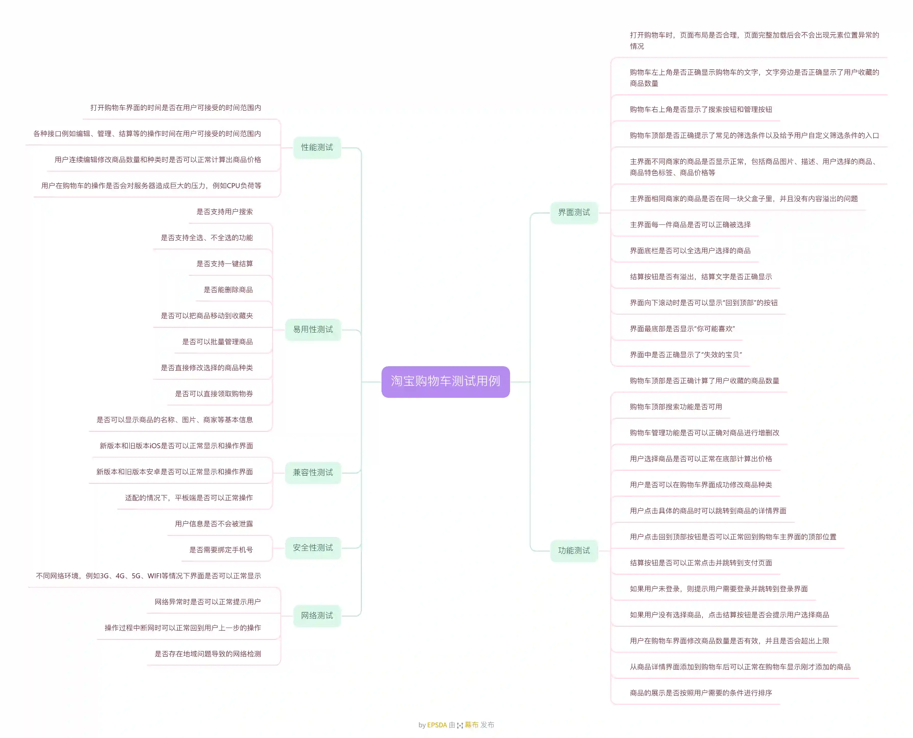
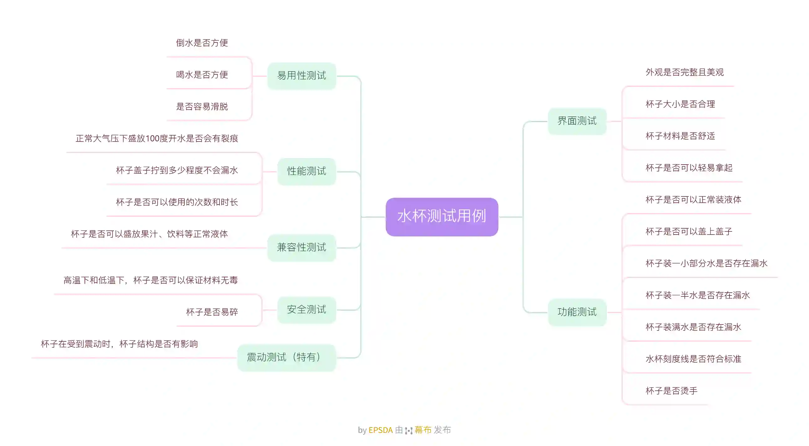
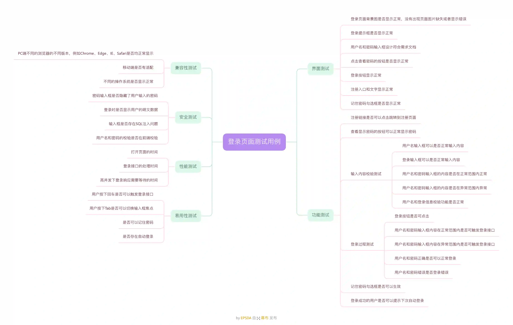
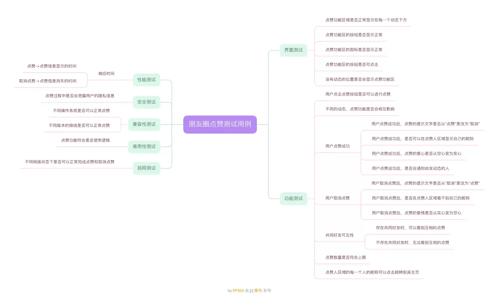

<link rel="stylesheet" href="https://help-site.oss-cn-hangzhou.aliyuncs.com/css/waline.css" />
<link rel="stylesheet" href="/stylesheets/waline.min.css" />

# 常见的测试用例设计

## 淘宝购物车

幕布链接：[https://www.mubu.com/doc/1Z_MRzK6iaT](https://www.mubu.com/doc/1Z_MRzK6iaT)

## 水杯

幕布链接：[https://www.mubu.com/doc/7Di7qI9GbiT](https://www.mubu.com/doc/7Di7qI9GbiT)

## 登录页面

幕布链接：[https://www.mubu.com/doc/2GYZsh9ys4T](https://www.mubu.com/doc/2GYZsh9ys4T)

## 朋友圈点赞用例

幕布链接：[https://www.mubu.com/doc/3lPPw_GGVkT](https://www.mubu.com/doc/3lPPw_GGVkT)