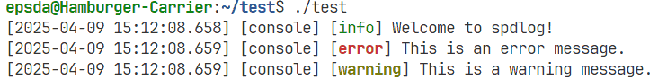

# 关于C++日志库spdlog

[spdlog](https://github.com/gabime/spdlog)是一个高性能、易于使用的C\+\+日志库，广泛应用于现代C\+\+项目中。它支持多线程、异步日志记录、多种日志格式、以及灵活的输出方式（如控制台、文件、甚至自定义输出）。下面将就常用功能方面介绍spdlog的安装、配置和使用方法

## 在Ubuntu下安装和配置spdlog库

安装spdlog库方式如下：

```bash
sudo apt install libspdlog-dev
```

安装完成后，还不可以直接使用，如果使用的是g++编译器，那么编译时需要写为如下例子：

```bash
g++ -std=c++11 -o test test.cpp -lspdlog -lfmt -lpthread
```

其中`fmt`是一个格式化库，spdlog使用`fmt`库来格式化日志消息，如果没有按照会出现链接时报错，Ubuntu下按照方式如下：

```bash
sudo apt-get install libfmt-dev
```

## 何为sink

为了后面的理解顺利，首先了解何为sink。在spdlog中，**sink（接收器）** 是一个核心概念，它决定了日志消息最终输出到哪里，每个日志对象可以关联一个或多个sink，其决定了日志的物理存储位置或显示方式

常见sink类型有如下几种：

- 控制台输出：`stdout_color_sink_mt`（彩色）、`stdout_sink_mt`
- 文件输出：`basic_file_sink_mt`、`rotating_file_sink_mt`
- 系统日志：`syslog_sink_mt`（Linux）、`win_eventlog_sink_mt`（Windows）
- 其他：UDP网络、数据库等（需自定义）

!!! note

    在spdlog中，命名后缀含义如下：

    - `_mt`：多线程安全版本（mutex protected）
    - `_st`：单线程版本（无锁，性能更高）

例如下面的代码：

```cpp
// 创建控制台彩色sink（多线程安全）
auto console_sink = std::make_shared<spdlog::sinks::stdout_color_sink_mt>();

// 创建文件sink（自动创建文件）
auto file_sink = std::make_shared<spdlog::sinks::basic_file_sink_mt>("logs/app.log");
```

spdlog中的sink工作原理如下：

- 当调用`logger->info()`时，消息会传递给所有关联的sink
- 每个sink独立处理消息（格式化、过滤、输出）
- sink之间互不影响

在实际应用中，sink的组合使用可以实现多种复杂的日志输出需求，例如：

- 同时输出到控制台和文件
- 不同级别日志输出到不同文件
- 关键错误同时发送到邮件/短信

## 基本用法

### 包含头文件

在代码中引入spdlog头文件：
```cpp
#include "spdlog/spdlog.h"
#include "spdlog/sinks/basic_file_sink.h" // 文件日志
#include "spdlog/sinks/stdout_color_sinks.h" // 控制台彩色日志
```

### 创建日志记录器

spdlog提供了多种日志记录器（logger），可以根据需求选择不同的类型：

1. 控制台日志
2. 文件日志
3. 混合日志（控制台 + 文件）

#### 控制台日志

```cpp
#include "spdlog/spdlog.h"
#include "spdlog/sinks/stdout_color_sinks.h"

int main() 
{
    // 创建一个控制台日志记录器
    auto console = spdlog::stdout_color_mt("console");

    // 记录日志
    console->info("Welcome to spdlog!");
    console->error("This is an error message.");
    console->warn("This is a warning message.");

    return 0;
}
```

输出结果：



在上面的代码中，`stdout_color_mt`函数的参数表示日志记录器的名称标识符，这是一个字符串标识符，用于唯一标识这个特定的日志记录器实例

如果想取出这个实例，可以通过下面的方式：

```cpp
auto console = spdlog::get("console");
```

例如：

```cpp
// 通过名称获取已注册的记录器
auto logger = spdlog::get("console");
if(logger) 
    logger->info("Got existing logger");
```

#### 文件日志

```cpp
#include "spdlog/spdlog.h"
#include "spdlog/sinks/basic_file_sink.h"

int main() 
{
    // 创建一个文件日志记录器
    auto file_logger = spdlog::basic_logger_mt("file_logger", "logs/basic-log.txt");

    // 记录日志
    file_logger->info("Log message to file.");
    file_logger->error("Error message to file.");

    return 0;
}
```

当前目录结构：

```
.
├── test.cc
├── logs
    └── basic-log.txt
```

文件内容如下：

```
[2025-04-09 15:28:07.245] [file_logger] [info] Log message to file.
[2025-04-09 15:28:07.245] [file_logger] [error] Error message to file.
```

在`basic_logger_mt`中还可以设置第三个参数，表示是否启用截断模式，即不论是否文件中存在内容都会清除该文件内容再继续写入，即：

```cpp
auto file_logger = spdlog::basic_logger_mt("file_logger", "logs/basic-log.txt", true); // true 表示截断文件
```

#### 混合日志（控制台 + 文件）

可以同时向多个目标输出日志：

```cpp
#include "spdlog/spdlog.h"
#include "spdlog/sinks/stdout_color_sinks.h"
#include "spdlog/sinks/basic_file_sink.h"

int main() 
{
    // 创建控制台和文件日志记录器
    auto console_sink = std::make_shared<spdlog::sinks::stdout_color_sink_mt>();
    auto file_sink = std::make_shared<spdlog::sinks::basic_file_sink_mt>("logs/mixed-log.txt", true);

    // 组合多个 sink
    spdlog::sinks_init_list sink_list = {console_sink, file_sink};
    auto combined_logger = std::make_shared<spdlog::logger>("multi_sink", sink_list.begin(), sink_list.end());

    // 注册日志记录器
    spdlog::register_logger(combined_logger);

    // 记录日志
    combined_logger->info("This message will appear in both console and file.");
    combined_logger->error("Error message to both outputs.");

    return 0;
}
```

在上面代码中，`sinks_init_list`是spdlog定义的一个类型别名，本质上是`std::initializer_list`的封装，专门用于传递多个sink的初始化列表

实际上在spdlog内部定义为：
```cpp
using sinks_init_list = std::initializer_list<sink_ptr>;
```

主要用于需要将日志同时输出到多个目标的情况，比如：
- 同时输出到控制台和文件
- 同时输出到本地文件和网络
- 不同日志级别输出到不同目标

### 日志级别

spdlog支持以下几种日志级别，等级程度从低到高（从详细到不启动日志，处于上面的日志会包含其下的所有日志等级）：

- `trace`: 最详细的调试信息
- `debug`: 调试信息
- `info`: 一般信息
- `warn`: 警告信息
- `error`: 错误信息
- `critical`: 致命错误信息
- `off`: 关闭日志

可以通过以下方式设置全局日志级别：

```cpp
spdlog::set_level(spdlog::level::debug); // 设置为 debug 级别
```

此时文件和控制台就会输出同样等级的日志信息，例如下面的示例：

```cpp
#include <iostream>
#include "spdlog/spdlog.h"
#include "spdlog/sinks/stdout_color_sinks.h"
#include "spdlog/sinks/basic_file_sink.h"

int main()
{
    // 创建控制台和文件日志记录器
    auto console = spdlog::stdout_color_mt("console");
    auto file_logger = spdlog::basic_logger_mt("file_logger", "logs/level-demo.txt", true);

    // 设置不同日志级别
    console->set_level(spdlog::level::debug);    // 控制台显示debug及以上级别
    file_logger->set_level(spdlog::level::warn); // 文件只记录warn及以上级别

    // 测试不同级别的日志
    console->trace("控制台trace消息 - 不会显示");
    console->debug("控制台debug消息");
    console->info("控制台info消息");
    console->warn("控制台warn消息");
    console->error("控制台error消息");

    file_logger->trace("文件trace消息 - 不会记录");
    file_logger->debug("文件debug消息 - 不会记录");
    file_logger->info("文件info消息 - 不会记录");
    file_logger->warn("文件warn消息");
    file_logger->error("文件error消息");

    // 动态修改日志级别
    console->info("准备修改日志级别...");
    console->set_level(spdlog::level::info); // 提高控制台日志级别

    console->debug("修改后的debug消息 - 现在不会显示了");
    console->info("修改后的info消息 - 仍然显示");

    return 0;
}
```

=== "控制台输出"

    ```
    [2025-04-09 17:13:32.158] [console] [debug] 控制台debug消息
    [2025-04-09 17:13:32.158] [console] [info] 控制台info消息
    [2025-04-09 17:13:32.158] [console] [warning] 控制台warn消息
    [2025-04-09 17:13:32.158] [console] [error] 控制台error消息
    [2025-04-09 17:13:32.158] [console] [info] 准备修改日志级别...
    [2025-04-09 17:13:32.158] [console] [info] 修改后的info消息 - 仍然显示
    ```

=== "文件内容"

    ```
    [2025-04-09 17:13:32.158] [file_logger] [warning] 文件warn消息
    [2025-04-09 17:13:32.158] [file_logger] [error] 文件error消息
    ```

也可以为每个日志记录器单独设置日志级别，例如下面的代码只会记录`warn`及之后所有的信息：

```cpp
#include <iostream>
#include "spdlog/spdlog.h"
#include "spdlog/sinks/basic_file_sink.h"

int main()
{
    // 首先删除旧的日志文件，确保结果准确
    // 创建一个文件日志记录器
    auto file_logger = spdlog::basic_logger_mt("file_logger", "logs/basic-log.txt", true); // true 表示截断文件

    file_logger->set_level(spdlog::level::warn);

    // 尝试记录不同级别的消息
    file_logger->trace("这是 trace 消息");
    file_logger->debug("这是 debug 消息");
    file_logger->info("这是 info 消息");
    file_logger->warn("这是 warn 消息");
    file_logger->error("这是 error 消息");
    file_logger->critical("这是 critical 消息");

    return 0;
}
```

文件中的内容如下：

```
[2025-04-09 17:11:03.019] [file_logger] [warning] 这是 warn 消息
[2025-04-09 17:11:03.019] [file_logger] [error] 这是 error 消息
[2025-04-09 17:11:03.019] [file_logger] [critical] 这是 critical 消息
```

## 格式化日志

默认情况下，spdlog有自己的格式风格，spdlog支持丰富的日志格式化功能，也可以通过 `set_pattern` 方法自定义日志格式

### 自定义日志格式

```cpp
#include "spdlog/spdlog.h"
#include "spdlog/sinks/stdout_color_sinks.h"

int main() 
{
    auto console = spdlog::stdout_color_mt("console");

    // 自定义日志格式
    console->set_pattern("[%Y-%m-%d %H:%M:%S.%e] [%^%l%$] %v");

    // 记录日志
    console->info("Custom format log message.");

    return 0;
}
```

对于上面的代码，格式说明如下：

- `%Y-%m-%d %H:%M:%S.%e`: 时间戳（年-月-日 时:分:秒.毫秒）
- `%^%l%$`: 日志级别（带颜色）
- `%v`: 日志消息内容

### 详细的日志格式说明

spdlog提供了丰富的格式占位符，可以自定义日志输出的格式。以下是常用的格式占位符及其说明：

### 基础格式占位符

1. **时间相关**：
   
      - `%Y`：4位年份（如2025）
      - `%m`：2位月份（01-12）
      - `%d`：2位日期（01-31）
      - `%H`：24小时制小时（00-23）
      - `%M`：分钟（00-59）
      - `%S`：秒（00-59）
      - `%e`：毫秒（000-999）
      - `%f`：微秒（000000-999999）
      - `%z`：时区偏移（如+0800）

2. **日志内容**：
   
      - `%v`：实际日志消息内容
      - `%n`：日志记录器名称
      - `%l`：日志级别（小写：trace/debug/info等）
      - `%L`：日志级别（大写：TRACE/DEBUG/INFO等）
      - `%t`：线程ID

3. **颜色控制**：
    
    - `%^`：开始颜色范围
    - `%$`：结束颜色范围
    - 示例：`%^%l%$`会给日志级别着色

### 高级格式占位符

显示进程信息：
   
- `%P`：进程ID
- `%u`：线程名称（如果设置了）

例如：

```cpp
#include "spdlog/spdlog.h"

int main() {
    auto logger = spdlog::stdout_color_mt("logger");
    
    // 自定义格式：时间+级别（彩色）+线程ID+消息
    logger->set_pattern("[%Y-%m-%d %H:%M:%S.%e] [%^%l%$] [thread:%t] %v");
    logger->info("这是一条测试消息");
    
    return 0;
}
```

输出结果如下：

```
[2025-04-09 15:30:45.678] [info] [thread:1234] 这是一条测试消息
```

### 注意事项

1. 要使用显示文件名和行号的日志，需要使用相关的宏函数，例如`SPDLOG_INFO("信息")`，具体使用见下面的日志宏函数部分

2. 颜色控制占位符`%^`和`%$`必须成对使用，通常用于日志级别显示

3. 性能考虑：越详细的格式（特别是源码位置）对性能影响越大，建议生产环境使用简单格式

## 异步日志

!!! abstract

    本部分后续会进一步补充，此处给出一个简单的示例，后续会详细介绍异步日志的使用

spdlog支持异步日志记录，可以显著提高性能。需要在初始化时启用异步模式

```cpp
#include "spdlog/async.h"
#include "spdlog/sinks/basic_file_sink.h"

int main() 
{
    // 初始化异步日志队列（建议大小为 8192）
    spdlog::init_thread_pool(8192, 1);

    // 创建异步文件日志记录器
    auto async_file = spdlog::basic_logger_mt<spdlog::async_factory>("async_file_logger", "logs/async-log.txt");

    // 记录日志
    async_file->info("Asynchronous log message.");
    async_file->error("Asynchronous error message.");

    // 刷新日志队列
    spdlog::flush_on(spdlog::level::info);

    return 0;
}
```

## 高级特性

### 日志轮转

日志轮转（Log Rotation）是一种日志管理技术，主要用于解决日志文件不断增长导致的问题，当日志文件达到特定条件（如大小限制或时间间隔）时，自动创建新的日志文件，同时归档或删除旧的日志文件。需要日志轮转的原因：

1. 防止单个日志文件过大
2. 自动归档历史日志
3. 节省磁盘空间
4. 便于日志管理和分析

常见轮转策略有下面两种：

1. **基于大小的轮转**：当日志文件达到指定大小时创建新文件
2. **基于时间的轮转**：按固定时间间隔(如每天)创建新文件

日志轮转过程模拟，假设配置为保留3个文件，文件名为`mylog.txt`：
- 初始：`mylog.txt`（当前日志）
- 第一次轮转：
  - `mylog.txt.1`（最新备份，包含的是最初的`mylog.txt`中的内容）
  - 新建空`mylog.txt`
- 第二次轮转：
  - `mylog.txt.2`（最新备份，最开始的`mylog.txt`中的内容）
  - `mylog.txt.1`（上一次`mylog.txt`中的内容）
  - `mylog.txt`
- 第三次轮转：
  - 删除`mylog.txt.3`（最新备份，包含的是最初的`mylog.txt`中的内容 ）
  - `mylog.txt.2`（包含的是第二次`mylog.txt.1`中的内容）
  - `mylog.txt.1 `（包含的是第二次的`mylog.txt`中的内容）
  - `mylog.txt`

日志轮转的实际应用场景一般有：

- 长期运行的服务程序
- 高频率日志记录的应用
- 磁盘空间有限的系统
- 需要长期保存历史日志的场景

在spdlog中，轮转是自动完成的，开发者只需配置轮转策略即可。spdlog支持基于文件大小或时间的日志轮转功能

??? info "日志轮转和日志回滚"

    需要注意，**spdlog本身并不支持日志回滚（Log Rollback），但是支持日志轮转（Log Rotation）**。如果想通过spdlog实现日志回滚可以结合C++ 17的filesystem库，关于filesystem具体在[C\+\+ 17相关新特性](https://www.help-doc.top/C%2B%2B/33.%20C%2B%2B17%E7%9B%B8%E5%85%B3%E6%96%B0%E7%89%B9%E6%80%A7/33.%20C%2B%2B17%E7%9B%B8%E5%85%B3%E6%96%B0%E7%89%B9%E6%80%A7.html#filesystem)有所介绍，例如：

    ```cpp
    #include "spdlog/spdlog.h"
    #include "spdlog/sinks/basic_file_sink.h"
    #include <filesystem>

    int main() {
        // 定义日志文件路径
        std::string log_file = "logs/mylog.txt";
        std::string backup_file = "logs/mylog_backup.txt";

        // 如果需要回滚，从备份文件恢复
        if (std::filesystem::exists(backup_file)) {
            std::filesystem::copy(backup_file, log_file, std::filesystem::copy_options::overwrite_existing);
        }

        // 创建日志器
        auto logger = spdlog::basic_logger_mt("logger_name", log_file);

        // 记录日志
        logger->info("This is a test log message.");

        // 备份当前日志文件
        std::filesystem::copy(log_file, backup_file, std::filesystem::copy_options::overwrite_existing);

        return 0;
    }
    ```

#### 基于文件大小的轮转

```cpp
#include "spdlog/sinks/rotating_file_sink.h"

int main() 
{
    // 创建一个轮转文件日志记录器（最大5MB，保留3个文件）
    auto rotating_logger = spdlog::rotating_logger_mt("rotating_logger", "logs/rotate-log.txt", 1024 * 1024 * 5, 3);

    // 记录日志
    for (int i = 0; i < 10; ++i) {
        rotating_logger->info("Log message {}", i);
    }

    return 0;
}
```

#### 基于时间的轮转

```cpp
#include "spdlog/sinks/daily_file_sink.h"

int main() 
{
    // 创建一个每日轮转日志记录器（每天凌晨 0 点轮转）
    auto daily_logger = spdlog::daily_logger_mt("daily_logger", "logs/daily-log.txt", 0, 0);

    // 记录日志
    daily_logger->info("Daily log message.");

    return 0;
}
```

### 自定义Sink

如果需要将日志输出到其他目标（如网络、数据库等），可以实现自定义Sink，例如下面的示例：

```cpp
#include "spdlog/sinks/base_sink.h"

// 自定义 Sink 类
template<typename Mutex>
class MySink : public spdlog::sinks::base_sink<Mutex> 
{
protected:
    void sink_it_(const spdlog::details::log_msg& msg) override {
        // 将日志消息转换为字符串
        spdlog::memory_buf_t formatted;
        this->formatter_->format(msg, formatted);

        // 输出到自定义目标（例如网络）
        std::cout << fmt::to_string(formatted);
    }

    void flush_() override {
        // 刷新操作
    }
};

using MySinkMT = MySink<std::mutex>;

int main() 
{
    auto my_sink = std::make_shared<MySinkMT>();
    auto logger = std::make_shared<spdlog::logger>("custom_logger", my_sink);

    // 记录日志
    logger->info("Custom sink log message.");

    return 0;
}
```

### 日志宏函数

spdlog提供了一组宏函数，用于简化日志记录操作，同时支持自动捕获源码位置（文件名、行号和函数名）。这些宏函数是spdlog的核心特性之一，尤其在调试和开发过程中非常有用

以下是spdlog中常见的宏函数及其用途的详细说明：

#### 基础日志宏函数

这些宏函数对应于不同的日志级别，自动捕获源码位置信息并记录日志，常见的有如下：

| 宏函数            | 对应的日志级别 | 用途                                                   |
| ----------------- | -------------- | ------------------------------------------------------ |
| `SPDLOG_TRACE`    | `trace`        | 记录最详细的调试信息，通常仅在开发或调试阶段使用。     |
| `SPDLOG_DEBUG`    | `debug`        | 记录调试信息，适合开发阶段使用。                       |
| `SPDLOG_INFO`     | `info`         | 记录一般信息，适合生产环境中的常规日志记录。           |
| `SPDLOG_WARN`     | `warn`         | 记录警告信息，提示潜在问题但不影响程序运行。           |
| `SPDLOG_ERROR`    | `error`        | 记录错误信息，表示程序运行中发生了错误但未导致崩溃。   |
| `SPDLOG_CRITICAL` | `critical`     | 记录严重错误信息，通常表示程序即将崩溃或无法继续运行。 |

例如下面的代码：

```cpp
#include "spdlog/spdlog.h"
#include "spdlog/sinks/stdout_color_sinks.h"

int main() {
    auto logger = spdlog::stdout_color_mt("logger");

    // 设置日志格式：显示文件名、行号和消息
    SPDLOG_TRACE("Trace message");
    SPDLOG_DEBUG("Debug message");
    SPDLOG_INFO("Info message");
    SPDLOG_WARN("Warning message");
    SPDLOG_ERROR("Error message");
    SPDLOG_CRITICAL("Critical message");

    return 0;
}
```

输出结果如下：

```
[2025-04-09 17:55:01.327] [info] [test.cc:151] Info message
[2025-04-09 17:55:01.327] [warning] [test.cc:152] Warning message
[2025-04-09 17:55:01.327] [error] [test.cc:153] Error message
[2025-04-09 17:55:01.327] [critical] [test.cc:154] Critical message
```

#### 自定义宏函数

除了上述预定义的宏函数，spdlog还允许用户定义自己的宏函数。这在需要扩展功能或适配特定需求时非常有用，例如下面的代码：

```cpp
#define MY_LOG_INFO(logger, ...) SPDLOG_INFO(__VA_ARGS__)
#define MY_LOG_ERROR(logger, ...) SPDLOG_ERROR(__VA_ARGS__)

int main() {
    auto logger = spdlog::stdout_color_mt("logger");

    // 使用自定义宏函数
    MY_LOG_INFO(logger, "This is a custom info message.");
    MY_LOG_ERROR(logger, "This is a custom error message.");

    return 0;
}
```

在上面的代码中，在C/C++宏定义中，`...`和`__VA_ARGS__`是可变参数宏（Variadic Macros）的语法，用于处理不定数量的参数。具体解释如下：

1. `...`（省略号）：在宏定义中表示该宏接受可变数量的参数，必须出现在宏参数列表的最后。
2. `__VA_ARGS__`：是一个预定义的宏，表示"variable arguments"（可变参数），用于展开宏定义中`...`部分传入的所有参数

例如，上面的宏还可以像下面这样使用：

```cpp
MY_LOG_INFO(my_logger, "用户{}登录成功，IP地址：{}", user_id, ip_address);
```
会被展开为：
```cpp
SPDLOG_INFO("用户{}登录成功，IP地址：{}", user_id, ip_address);
```

#### 异步日志的宏函数

如果启用了异步日志记录功能（通过 `spdlog::init_thread_pool` 初始化线程池），所有宏函数仍然可以正常工作。异步日志记录不会影响宏函数的行为

```cpp
#include "spdlog/async.h"
#include "spdlog/sinks/basic_file_sink.h"

int main() {
    // 初始化异步日志队列
    spdlog::init_thread_pool(8192, 1);

    // 创建异步文件日志记录器
    auto async_logger = spdlog::basic_logger_mt<spdlog::async_factory>("async_logger", "logs/async-log.txt");

    // 设置日志格式
    async_logger->set_pattern("[%s:%#] [%^%l%$] %v");

    // 使用宏函数记录日志
    SPDLOG_INFO("Asynchronous info message");
    SPDLOG_ERROR("Asynchronous error message");

    return 0;
}
```

#### 其他相关宏

除了日志级别的宏函数外，spdlog还提供了一些辅助宏，用于增强日志功能：

| 宏名称                | 含义                                               |
| --------------------- | -------------------------------------------------- |
| `SPDLOG_LOGGER_CALL`  | 通用日志记录宏，允许指定日志级别、日志记录器和消息 |
| `SPDLOG_LOGGER_INFO`  | 类似于`SPDLOG_INFO`，但允许指定特定的日志记录器    |
| `SPDLOG_LOGGER_ERROR` | 类似于`SPDLOG_ERROR`，但允许指定特定的日志记录器   |
| `SPDLOG_LOGGER_TRACE` | 类似于`SPDLOG_TRACE`，但允许指定特定的日志记录器   |

例如下面的代码：

```cpp
#include "spdlog/spdlog.h"
#include "spdlog/sinks/stdout_color_sinks.h"

int main() {
    auto logger1 = spdlog::stdout_color_mt("logger1");
    auto logger2 = spdlog::stdout_color_mt("logger2");

    // 使用SPDLOG_LOGGER_INFO指定日志记录器
    SPDLOG_LOGGER_INFO(logger1, "This is a message from logger1.");
    SPDLOG_LOGGER_INFO(logger2, "This is a message from logger2.");

    return 0;
}
```