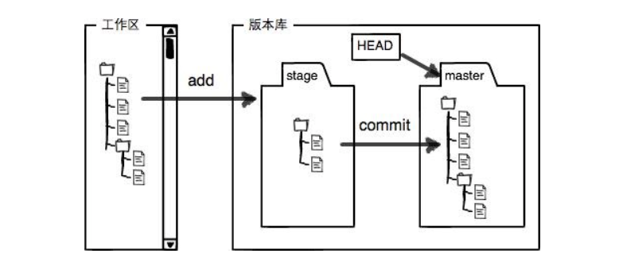
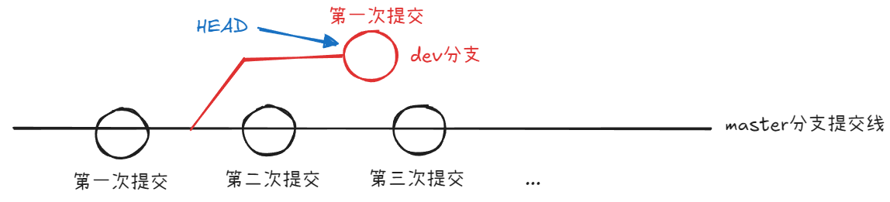
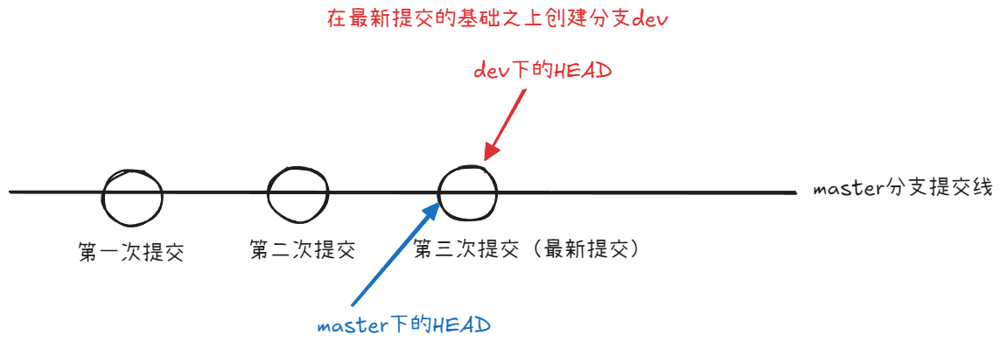
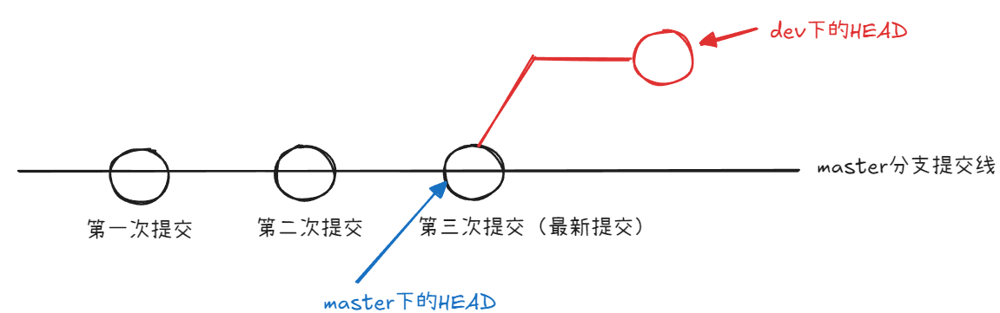
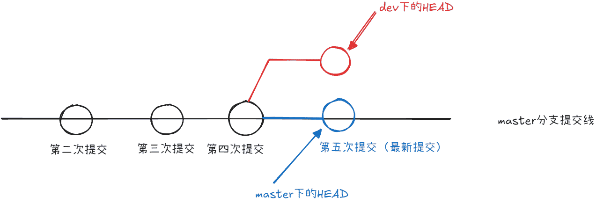
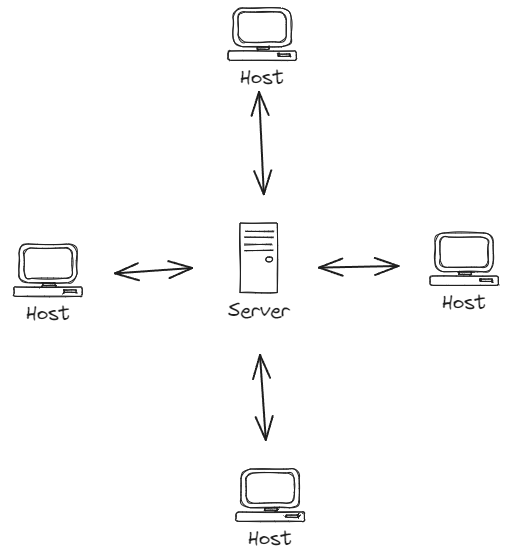
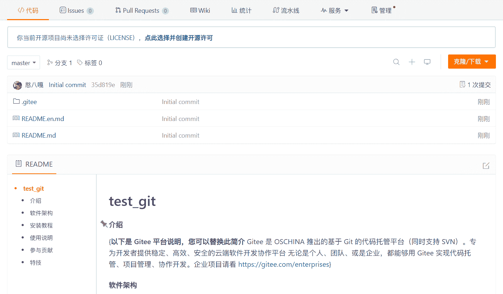
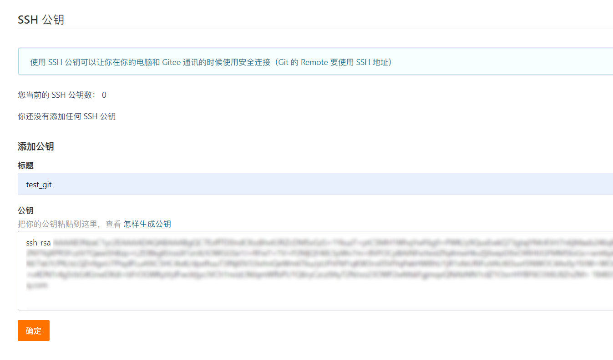

# Git基础操作

## Git介绍

Git是一个版本控制器，用于记录电脑上所有文件的变化，并且可以看到修改的各个版本

对于一个文本文件来说，Git可以跟踪到文件的某一行的改动

对于一个二进制文件（例如图片、视频等），Git无法直接读取到文件修改的内容，但是可以获取到该文件属性的变化，例如大小的改变、文件是否存在等

## Git安装

安装前可以使用下面的命令查看当前系统是否已经安装Git

```bash
git --version
```

如果可以正常显示Git版本，则代表当前系统已经安装Git，否则没有安装

### 在CentOS下安装Git

使用下面的指令在CentOS系统下安装Git

```bash
sudo yum install git -y
```

!!! note

    需要注意，如果当前用户为非root用户，则使用`sudo`命令需要确保当前用户在白名单中

安装完成后，可以再次使用版本查看命令查看是否安装成功

### 在Ubuntu下安装Git

使用下面的指令在Ubuntu系统下安装Git

```bash
sudo apt-get install git -y
```

安装完成后，可以再次使用版本查看命令查看是否安装成功

### 在Windows下安装Git

在官网[Git (git-scm.com)](https://git-scm.com/)上下载对应Windows版本的Git，安装即可

## 初始化本地仓库

Git可以管理仓库，但是前提是当前目录可以被管理，为了使普通目录变为可以被Git管理的仓库，需要使用下面的命令对当前目录进行初始化，这个过程也称为初始化本地仓库

```bash
git init
```

命令执行完毕后，查看当前目录时可以发现一个隐藏文件`.git`，该文件中会保存与Git相关的文件，一般情况下不要去修改，例如在CentOS下的目录结构

```
.git
├── branches
├── config
├── description
├── HEAD
├── hooks
│   ├── applypatch-msg.sample
│   ├── commit-msg.sample
│   ├── post-update.sample
│   ├── pre-applypatch.sample
│   ├── pre-commit.sample
│   ├── prepare-commit-msg.sample
│   ├── pre-push.sample
│   ├── pre-rebase.sample
│   └── update.sample
├── info
│   └── exclude
├── objects
│   ├── info
│   └── pack
└── refs
    ├── heads
    └── tags
```

## Git中的`name`和`email`配置

为了能够正确将指定文件提交到远程仓库，需要先对Git中的信息进行配置，在Git中需要配置与远端代码仓库所属账号相同的`name`和`email`。具体配置方式如下：

```bash
git config user.name "name"
git config user.email "email"
```

配置完成后，可以使用下面的命令查看是否已经将`name`和`email`信息存储到配置文件中

```bash
git config -l
```

如果配置成功，则会在原有配置信息的最后两行显示`name`和`email`，否则不显示

如果需要删除已经配置的信息，可以使用下面的命令进行删除

```bash
git config --unset user.name
git config --unset user.email
```

上面的方式会在当前本地仓库下配置一个`name`和`email`，并且只作用于当前仓库，如果需要一个可以作用于全局的配置，则需要使用`--global`选项

```bash
git config --global user.name "name"
git config --global user.email "email"
```

配置完成后，可以使用下面的命令查看是否已经将`name`和`email`信息存储到配置文件中

```bash
git config -l
```

如果配置成功，则会在原有配置信息的开始两行显示`name`和`email`，否则不显示

需要注意，如果使用了全局配置，则直接使用前面的删除命令是无法对全局配置信息进行删除。对于全局配置删除同样需要加上`--global`选项，如下：

```bash
git config --global --unset user.name
git config --global --unset user.email
```

## Git中的工作区、暂存区和版本库

工作区：当前电脑的目录（包含了`.git`目录和本地文件）
暂存区：对工作区中有改变的文件（新增、修改和删除）进行存储的位置。在`.git`目录中存在着对应的`index`文件，所以暂存区也可以称为索引区
版本库：也称本地仓库，即`.git`目录。其中包含了所有文件的修改内容和对应的版本信息

三者关系如下：



在上图中，对于版本库来说，存在一个`HEAD`指针，指向当前分支的最新一次提交。默认情况下，Git会自动将`HEAD`指针指向`master`分支，该分支是Git默认创建的分支。当对工作区中的文件进行修改后，需要使用`git add`命令将修改的文件添加到暂存区，然后使用`git commit`命令将暂存区中的文件提交到版本库中

从上面的过程可以看出，如果在工作区修改了文件，该文件不会被Git管理，只有在使用`git add`命令+`git commit`命令之后，文件才会被Git管理

## 添加文件到暂存区

使用下面的命令可以将工作区中的文件添加到暂存区中，该命令可以添加指定文件，也可以添加所有文件：

```bash
# 添加指定文件
git add <file>
# 添加指定目录
git add <directory>
# 添加所有文件
git add .
```

例如：

```bash
# 添加指定文件
git add test.txt
```

默认直接使用`git init`命令创建的`.git`目录下是没有`index`文件的，一旦第一次使用`git add`命令添加文件，Git会自动创建`index`文件

## 提交文件到版本库

### 基本使用

使用下面的命令可以将暂存区中的文件提交到版本库中，该命令需要添加提交信息：

```bash
git commit -m "提交信息"
```

!!! note

    注意，`-m`选项不能省略，建议是给出较为精确且具体的提交信息，便于后续查看

例如：

```bash
git commit -m "add test.txt"
```

如果一开始没有设置账户邮箱和账户名，那么会看到提示输入邮箱和用户名，例如：

```
Author identity unknown

*** Please tell me who you are.

Run

  git config --global user.email "you@example.com"
  git config --global user.name "Your Name"

to set your account's default identity.
Omit --global to set the identity only in this repository.

fatal: unable to auto-detect email address (got 'epsda@ham-carrier.(none)')
```

此时只需要按照前面配置`name`和`email`的步骤进行即可，注意`name`不是昵称，而是账户名（`@`后面的内容）

当然，也可以将暂存区的指定文件提交到版本库中，该命令需要添加提交信息：

```bash
# 提交指定文件
git commit <file> -m "提交信息" 
```

一旦使用`git commit`命令提交文件，会看到类似下面的信息：

```bash
[master (root-commit) 4ef19d7] add test.txt
 1 file changed, 0 insertions(+), 0 deletions(-)
 create mode 100644 test.txt
```

如果要查看提交记录，可以使用下面的命令：

```bash
git log
```

当前情况下会看到类似下面的信息：

```bash
commit 4ef19d7c8d4ed8be5e84057dc476c43e368f6a85 (HEAD -> master)
Author: EPSDA <1848312235@qq.com>
Date:   Mon Apr 14 10:42:44 2025 +0800

    add test.txt
```

如果想要查看较为简短的日志信息，可以带上`--pretty=oneline`选项：

```bash
git log --pretty=oneline
```

当前情况下会看到类似下面的信息：

```bash
4ef19d7c8d4ed8be5e84057dc476c43e368f6a85 (HEAD -> master) add test.txt
```

日志中的长数字代表的就是日志标识符，是一个哈希值

### 通过`.git`目录了解Git管理

下面进入`.git`目录查看其中的内容可以看到类似下面的结构：

```
.git
├── branches
├── COMMIT_EDITMSG
├── config
├── description
├── HEAD
├── hooks
│   ├── applypatch-msg.sample
│   ├── commit-msg.sample
│   ├── fsmonitor-watchman.sample
│   ├── post-update.sample
│   ├── pre-applypatch.sample
│   ├── pre-commit.sample
│   ├── pre-merge-commit.sample
│   ├── prepare-commit-msg.sample
│   ├── pre-push.sample
│   ├── pre-rebase.sample
│   ├── pre-receive.sample
│   ├── push-to-checkout.sample
│   ├── sendemail-validate.sample
│   └── update.sample
├── index
├── info
│   └── exclude
├── logs
│   ├── HEAD
│   └── refs
│       └── heads
│           └── master
├── objects
│   ├── 4e
│   │   └── f19d7c8d4ed8be5e84057dc476c43e368f6a85
│   ├── 5e
│   │   └── fb9bc29c482e023e40e0a2b3b7e49cec842034
│   ├── e6
│   │   └── 9de29bb2d1d6434b8b29ae775ad8c2e48c5391
│   ├── info
│   └── pack
└── refs
    ├── heads
    │   └── master
    └── tags

16 directories, 26 files
```

其中使用`git add`命令会在`objects`目录下创建一个对象，`objects`目录是Git的对象库，在使用`git log`命令查看日志信息中看到的长数字就是当前对象的具体标识，前两位表示目录名称，后面38位表示文件名称

获取到文件的哈希值后可以使用下面的命令查看其中的内容：

```bash
git cat-file -p <hash>
```

例如：

```bash
git cat-file -p 4ef19d7c8d4ed8be5e84057dc476c43e368f6a85
```

当前情况下会看到类似下面的信息：

```
tree 5efb9bc29c482e023e40e0a2b3b7e49cec842034
author EPSDA <1848312235@qq.com> 1744598564 +0800
committer EPSDA <1848312235@qq.com> 1744598564 +0800

add test.txt
```

在上面的信息中可以看到，`author`和`committer`后面的数字就是当前提交的作者和提交者的信息，另外还有一个`tree`，查看该行信息可以得到类似下面的内容：

```
100644 blob e69de29bb2d1d6434b8b29ae775ad8c2e48c5391	test.txt
```

查看对应的`test.txt`文件对应的哈希值会发现没有任何内容，因为当前`test.txt`文件中没有写任何内容，如果现在向`test.txt`中写入一些信息，如下：

```
hello git
```

再重复上面的步骤，查看`test.txt`文件对于的哈希值即可查看到最新修改的内容：

```
$ git cat-file -p 8d0e41234f24b6da002d962a26c2495ea16a425f
hello git
```

再执行上面的步骤也会发现一些步骤结果发生了变化，例如查看`git commit`命令结果变为如下：

```
[master d278be5] add test.txt
 1 file changed, 1 insertion(+)
```

此时可以看到`insertion`前面的值变为了1，表示文件新增一行内容

使用`git log`查看时结果变为如下：

```
commit d278be5bdcc5019b6785235e07edae9e9d8f64ab (HEAD -> master)
Author: EPSDA <1848312235@qq.com>
Date:   Mon Apr 14 15:34:10 2025 +0800

    add test.txt

commit 4ef19d7c8d4ed8be5e84057dc476c43e368f6a85
Author: EPSDA <1848312235@qq.com>
Date:   Mon Apr 14 10:42:44 2025 +0800

    add test.txt
```

除了多一条记录外，还可以看到当前`HEAD`指向了最新的提交记录，再使用`git cat-file -p`查看最新提交记录的哈希值会发现内容多了一行`parent`：

```
tree 20bf064f310e3386fb9681849c184a4ec16125b0
parent 4ef19d7c8d4ed8be5e84057dc476c43e368f6a85
author EPSDA <1848312235@qq.com> 1744616050 +0800
committer EPSDA <1848312235@qq.com> 1744616050 +0800

add test.txt
```

这个`parent`表示的就是当前提交的上一个提交记录的哈希值

除了通过`git log`查看外，上面还提到`HEAD`会指向最新的提交记录，现在通过`cat HEAD`会得到下面的结果：

```
ref: refs/heads/master
```

查看其中的内容会发现也是一个哈希值，而且这个哈希值就是最新的提交记录的哈希值：

```
$ cat .git/refs/heads/master 
d278be5bdcc5019b6785235e07edae9e9d8f64ab
```

使用`git cat-file -p`查看这个哈希值就可以得到与前面使用`git log` + `git cat-file -p` 一样的内容

## Git管理文件的修改

Git本质上管理的是**文件的内容**，而不是文件本身。具体来说，Git通过一种称为**内容寻址存储（Content-Addressable Storage）**的机制来跟踪文件的内容。以下是关键点：

- **内容为核心**：Git将文件的内容存储为“对象”（object），并对这些对象进行哈希计算（通常是SHA-1或SHA-256）。文件的内容被唯一地标识为一个哈希值
- **文件名与内容分离**：在Git中，文件的名称和路径信息是存储在树对象（tree object）中的，而文件的实际内容则存储在Blob对象中。这意味着Git可以独立地追踪内容的变化，而不依赖于文件的名称

尽管Git主要管理的是文件的内容，但它也通过元数据（如树对象）来记录文件的增删操作。那么如何解释文件的新增或者删除操作呢？

当一个新文件被添加到Git仓库时，Git会执行以下操作：

1. **生成Blob对象**：Git会读取该文件的内容，并将其存储为一个新的Blob对象。这个Blob对象的内容会被哈希化，生成一个唯一的标识符
2. **更新树对象**：Git会在当前的树对象中添加一条记录，这条记录包含文件的路径、名称以及对应的Blob对象的哈希值
3. **提交记录**：在下一次提交时，Git会将新的树对象与之前的提交关联起来，从而记录新增文件的操作

例如：
```bash
echo "Hello, World!" > test.txt
git add test.txt
git commit -m "add test.txt"
```

在这个过程中，`test.txt`的内容被存储为Blob对象，而文件的路径和名称被记录在树对象中

当一个文件被删除时，Git并不会立即从存储中移除Blob对象，而是通过以下方式处理：

1. **更新树对象**：在当前的树对象中，Git会移除与该文件相关的记录（即文件路径和名称的映射）。
2. **保留历史记录**：即使文件被删除，Git仍然保留之前提交中与该文件相关的内容（Blob对象），以便在需要时可以通过历史记录恢复

例如：
```bash
git rm newfile.txt
git commit -m "Remove newfile.txt"
```
在这个过程中，`newfile.txt`不再出现在当前的树对象中，但其内容仍然存在于Git的对象数据库中，直到垃圾回收（GC）清理掉未引用的对象。

Git的设计理念是将文件的内容与文件的路径/名称分离管理，这种设计带来了以下优势：

- **高效的内容存储**：由于Git基于内容的哈希值存储，相同内容的文件只会存储一次，节省了存储空间。
- **灵活的历史记录**：通过树对象和提交对象的组合，Git能够精确地记录文件的增删改操作，同时保留完整的历史信息。
- **可追溯性**：无论是新增文件还是删除文件，Git都能通过提交历史轻松还原任何状态。

如果现在修改了文件但不对文件进行`git add`操作和`git commit`操作，Git会指出文件的变动，这一点可以使用下面的命令查看：

```bash
git status
```

例如，向`test.txt`中写入一些内容：

```
hello world
```

当前情况下会看到类似下面的信息：

```
On branch master
Changes not staged for commit:
  (use "git add <file>..." to update what will be committed)
  (use "git restore <file>..." to discard changes in working directory)
	modified:   test.txt

no changes added to commit (use "git add" and/or "git commit -a")
```

当前情况下会看到`Changes not staged for commit`，表示当前文件的修改没有被暂存，接着将该文件添加到暂存区，再使用`git status`查看会看到类似下面的结果：

```
On branch master
Changes to be committed:
  (use "git restore --staged <file>..." to unstage)
	modified:   test.txt
```

当前情况下会看到`Changes to be committed`，表示当前文件的修改已经被暂存，使用`git commit`提交文件后再使用`git status`查看会看到类似下面的结果：

```
On branch master
nothing to commit, working tree clean
```

当前情况下会看到`nothing to commit, working tree clean`，表示当前文件的修改已经被提交，并且工作区没有任何修改。看到这段内容就表示当前目录下的文件内容和版本库中的文件内容是一致的

但是，`git status`只能查看哪些文件有变动，并不能具体变动在何处，如果想要查看这一点，可以使用下面的命令：

```bash
# 查看指定文件的变动
git diff <file>
# 查看所有文件的变动
git diff
```

例如，现在向`test.txt`中写入下面的内容：

```
hello Linux
```

再没有使用`git add`命令时，使用`git diff`命令查看会看到类似下面的结果：

```
diff --git a/test.txt b/test.txt
index 05fe86c..b3f64b9 100644
--- a/test.txt
+++ b/test.txt
@@ -1,2 +1,3 @@
 hello git
 hello world
+hello Linux
```

其中`@@ -1,2 +1,3 @@`中的`-1,2`表示当前旧文件从第一行开始的两行，`+1,3`表示新版本从第1行开始的3行，后面的`+hello Linux`就表示新增的内容，而没有任何前缀的就是没有发生修改的内容，如果内容前面存在`-`那么表示删除的内容

而`index 05fe86c..b3f64b9 100644`中的第一个`05fe86c`表示旧文件的哈希值（前五位），第二个`b3f64b9`表示新版本的哈希值（前五位），`100644`表示Linux下的文件的权限

## 版本回退

Git属于版本控制工具，既然可以控制文件版本，那么必然存在回退文件版本的功能。在Git中可以使用`git reset`命令回退文件，其完整形式如下：

```bash
git reset [--soft | --mixed（默认） | --hard] [<commit>/HEAD] 
```

首先看三个选项：

| **选项**  | **当前目录下的文件**                 | **暂存区**                         | **版本库**                       |
| --------- | ------------------------------------ | ---------------------------------- | -------------------------------- |
| `--soft`  | 不影响，文件内容保持不变             | 不影响，暂存区内容保持不变         | 版本库的`HEAD`指针回退到指定提交 |
| `--mixed` | 不影响，文件内容保持不变             | 回退到指定提交的状态，暂存区被重置 | 版本库的`HEAD`指针回退到指定提交 |
| `--hard`  | 回退到指定提交的状态，文件内容被重置 | 回退到指定提交的状态，暂存区被重置 | 版本库的`HEAD`指针回退到指定提交 |

三种选项对于用户最直观的感受如下：

| **选项**  | **用户看到的文件变化**                                                               | **用户需要做的操作**                                                         | **潜在风险**                                                     |
| --------- | ------------------------------------------------------------------------------------ | ---------------------------------------------------------------------------- | ---------------------------------------------------------------- |
| `--soft`  | 文件内容保持不变，工作目录和暂存区无变化                                             | 无需额外操作，可以直接重新提交；如果需要调整提交范围，可以手动修改暂存区内容 | 无数据丢失风险，适合安全地撤销提交                               |
| `--mixed` | 文件内容保持不变，但暂存区被清空或重置                                               | 需要重新将更改添加到暂存区（如使用 `git add`）                               | 工作目录中的文件内容不受影响，风险较低，适合重新组织暂存区内容   |
| `--hard`  | 文件内容被恢复到指定提交的状态，所有未提交的更改（包括文件修改、新增或删除）都会消失 | 无需额外操作，文件和暂存区已被完全重置                                       | 高风险，未提交的更改会永久丢失，需谨慎使用，通常用于清理工作目录 |

!!! note

    对于`--hard`来说必须确保版本库中的文件没有被提交到远程仓库，否则版本库无法回退

接着看`<commit>/HEAD`：

1. `<commit>`：回退到指定的提交记录
2. `HEAD`：回退到最新的提交记录

对于`HEAD`来说，常见的形式有：

1. `HEAD`：回退到最新的提交记录
2. `HEAD^`：回退到上一个提交记录
3. `HEAD^^`：回退到上上个提交记录
4. ...

另外还有数字版本：

1. `HEAD~0`：回退到最新的提交记录
2. `HEAD~1`：回退到上一个提交记录
3. `HEAD~2`：回退到上上个提交记录
4. `HEAD~3`：回退到上上上个提交记录
5. ...

如果使用了`--hard`选项，因为版本库中的内容也会回退，而`HEAD`指向版本库的文件树，所以此时`HEAD`也会改变，例如当前`HEAD`如下：

```
commit 2a08600aaf7aeed308c6d9c192a206d68fdd70b4 (HEAD -> master)
```

上一个版本值为：

```
commit d278be5bdcc5019b6785235e07edae9e9d8f64ab
```

现在回到上一个版本，使用`HEAD~1`会看到下面的结果：

```
epsda@ham-carrier:~/git_test$ git reset --hard HEAD~1
HEAD is now at d278be5 add test.txt
```

此时`HEAD`会变为如下：

```
commit d278be5bdcc5019b6785235e07edae9e9d8f64ab (HEAD -> master)
```

如果想查看最近的Git的操作记录，可以使用下面的命令：

```bash
git reflog
```

例如现在可以看到类似下面的结果：

```
d278be5 (HEAD -> master) HEAD@{0}: reset: moving to HEAD~1
2a08600 HEAD@{1}: commit: modify test.txt
d278be5 (HEAD -> master) HEAD@{2}: commit: add test.txt
4ef19d7 HEAD@{3}: commit (initial): add test.txt
```

整个过程中`HEAD`的改变如下图所示：


如果回退时使用的是哈希值，那么可以通过`git reflog`命令查看哈希值对应的操作记录从而回到上一次的最新版本，即哈希值前五位为`2a086`的版本，例如：

```bash
$ git reset --hard 2a08600aaf7aeed308c6d9c192a206d68fdd70b4
HEAD is now at 2a08600 modify test.txt
```

现在`HEAD`会变为类似如下的内容：

```
commit 2a08600aaf7aeed308c6d9c192a206d68fdd70b4 (HEAD -> master)
```

## 撤销修改

除了可以使用`git reset`命令回退文件外，还可以使用`git checkout`命令撤销修改，其完整形式如下：

```bash
git checkout -- <file>
```

!!! note

    不要省略`--`，⼀旦省略，该命令就变为其他意思了

这个命令可以对还没有进行`add`操作的文件进行撤销操作，因为这个命令的本质就是将暂存区的内容恢复到当前目录中，如果已经`add`但是没有`commit`，那么可以使用上面的`git reset --mixed`，如果已经`commit`，那么可以使用`git reset --hard`，但是必须保证没有提交到远程仓库

## 删除文件

删除文件有两种方式：

1. 直接在当前目录使用删除命令删除，例如`rm test.txt`
2. 使用`git rm`命令删除，例如`git rm test.txt`

这两种方式的区别在于，第一种方式只是删除了当前目录下的文件而没有修改暂存区和版本库，如果要删除暂存区和版本库中的对应文件就需要将当前修改进行`git add`和`git commit`，而第二种方式会直接将文件从暂存区和版本库中删除，并且会生成一条删除记录，例如：

```bash
$ git rm test.txt
rm 'test.txt'
```

## 分支管理

### 理解分支

所谓分支，可以理解为一条独立的提交记录线。在当前Git中，只有一个`master`，所有的提交记录都在`master`上，所以说当前提交只有一个分支，即为`master`，示例图如下：


如果现在创建一个新的分支，例如分支名称为`dev`，那么示例图如下：


此时当前Git下就存在着两个分支。既然存在着两个分支，那么Git如何标识当前分支呢？**通过`HEAD`指针**，`HEAD`指针所指向的就是当前分支，假设当前处于`dev`分支，那么`HEAD`指向的就是`dev`分支，如下图所示：



### 查看分支

前面提到，默认情况下Git会创建一个`master`分支，而对应的`HEAD`指向的就是`master`分支，如果想要查看当前分支可以使用下面的命令：

```bash
git branch
```

在当前情况下会看到下面的结果：

```
* master
```

所以，当前所有的提交都属于`master`分支。其中的`*`表示`HEAD`所指向的分支

### 新增分支

在Git中想要新增分支，可以使用下面的命令：

```bash
git branch <branch name>
```

例如，现在想要创建一个新的分支，名称为`dev`，那么可以使用下面的命令：

```bash
git branch dev
```

在当前情况下会看到下面的结果：

```
  dev
* master
```

此时Git下面就存在着两个分支，但是因为上面的命令只完成了创建分支并没有完成切换分支，所以`HEAD`依旧指向的是`master`分支

创建分支的过程是基于当前`HEAD`指针的，默认情况下，直接使用`git branch`命令创建的分支在切换后查看对应的`HEAD`会发现该值于`master`分支中查看的`HEAD`是相同的，所以实际上创建新的分支示意图如下：



这一点也可以通过不同分支的`HEAD`值来进行验证，每当创建一个分支就会在`refs/heads`目录下形成一个新的文件，所以分别查看`master`分支下的`HEAD`和`dev`分支下的`HEAD`值如下：

```
$ cat .git/refs/heads/master 
2a08600aaf7aeed308c6d9c192a206d68fdd70b4
$ cat .git/refs/heads/dev
2a08600aaf7aeed308c6d9c192a206d68fdd70b4
```

### 切换分支

创建完新的分支就可以使用下面的命令切换分支：

```bash
git checkout <branch name>
```

!!! note

    需要注意，此时的`checkout`命令后面不存在`--`

例如，现在想要切换到`dev`分支，那么可以使用下面的命令：

```bash
git checkout dev
```

切换完成后，会看到类似下面的结果：

```
Switched to branch 'dev'
```

现在`HEAD`指向的就是`dev`分支，接下来所有的文件修改都会在`dev`分支上进行

### 创建+切换分支

在Git中创建分支和切换分支是两个不同的操作，但是在实际使用中经常会同时进行这两个操作，所以Git提供了一个命令可以同时完成这两个操作：

```bash
git checkout -b <branch name>
```

!!! note

    需要注意，此时的`checkout`命令后面存在`-b`

例如，现在想要创建一个新的分支，名称为`dev1`，并且切换到`dev1`分支，那么可以使用下面的命令：

```bash
git checkout -b dev1
```

在当前情况下会看到下面的结果：

```
Switched to a new branch 'dev1'
```

### 合并分支

完成分支的创建和切换后，既然是创建了新的分支，那么肯定是需要在该分支上进行开发，例如当前在`dev`分支上对`test.txt`文件进行修改，当前`test.txt`文件内容如下：

```
hello git
hello world
```

接着在`test.txt`文件中添加一行内容：

```
hello Linux
```

修改完成后进行`git add`和`git commit`操作再切换到`master`分支。当前情况下，两个分支示意图如下：



从上图可以看到，当前`dev`分支的`HEAD`和`master`分支的`HEAD`并不指向同一个提交记录，如果此时想要二者保持一致，既需要将`master`分支下的内容与`dev`分支保持一致，可以用到下面的命令：

```bash
git merge <branch name>
```

需要注意，合并时需要确定用于合并的分支以及待合并的分支，而合并需要再被合并的分支下进行。在当前例子中，用于合并的分支为`dev`分支，待合并的分支为`master`分支，所以必须先确保处于`master`分支，接着使用下面的命令：

```bash
git merge dev
```

在当前情况下会看到下面的结果：

```
Updating 2a08600..6dd6869
Fast-forward
 test.txt | 1 +
 1 file changed, 1 insertion(+)
```

此时再看`master`分支下的`test.txt`中的内容会发现获取到了`dev`分支新添加的内容。当前情况下，两个分支示意图如下：


默认情况下，Git选择的合并策略为`Fast-forward`，这种策略下，Git会直接将`master`分支的`HEAD`指向`dev`分支的`HEAD`的值，所以这种方式的效率比较高，并且这种合并方式会自动进行`git commit`操作

### 合并冲突

在实际开发中，可能会遇到多个分支同时对同一个文件进行修改，此时Git会无法自动合并，因为Git无法确定到底使用哪个分支的内容，所以此时需要手动解决冲突。当前`test.txt`文件内容如下：

```
hello git
hello world
hello Linux
```

现在`dev`分支和`master`分支同时对`test.txt`文件进行修改，修改内容如下：

=== "`dev`分支"

    ```
    ...
    hello dev
    ```

=== "`master`分支"

    ```
    ...
    hello master
    ```

接着，二者都对自己的修改进行`git add`和`git commit`操作，此时两个分支的示意图如下：



同样，现在用于合并的分支为`dev`分支，待合并的分支为`master`分支，在`master`分支下执行合并命令：

```bash
git merge dev
```

此时会发现合并失败，提示下面的内容：

```
Auto-merging test.txt
CONFLICT (content): Merge conflict in test.txt
Automatic merge failed; fix conflicts and then commit the result.
```

这个提示中的`CONFLICT (content): Merge conflict in test.txt`就表示合并出现了冲突，对于这个冲突问题需要手动打开文件解决，现在在`master`分支下打开`test.txt`文件，会发现文件内容如下：

```
hello git
hello world
hello Linux
<<<<<<< HEAD
hello master
=======
hello dev
>>>>>>> dev
```

可以看到，Git在文件中添加了一些特殊的标记，这些标记的含义如下：

1. `<<<<<<< HEAD`：表示下面的内容为当前分支的内容
2. `>>>>>>> dev`：表示上面的内容为`dev`分支的内容
3. `=======`：表示两个分支内容的分割线

现在需要手动合并冲突，即删除标记并修改内容为期望的结果，例如：

```
hello git
hello world
hello Linux
hello dev
hello master
```

因为存在冲突导致Git无法将两个分支的内容进行合并，一旦处理完冲突还需要使用`git add`和`git commit`操作将内容提交到版本库中。如果想以图形的方式看到分支的提交记录，可以使用下面的命令：

```bash
git log --graph --abbrev-commit
```

在当前情况下会看到下面的结果：

```
*   commit 2cdb9d6 (HEAD -> master)
|\  Merge: 69b4e41 cf4de6b
| | Author: EPSDA <1848312235@qq.com>
| | Date:   Tue Apr 15 18:59:30 2025 +0800
| | 
| |     merge dev and master
| | 
| * commit cf4de6b (dev)
| | Author: EPSDA <1848312235@qq.com>
| | Date:   Tue Apr 15 11:29:37 2025 +0800
| | 
| |     dev modify test.txt
| | 
* | commit 69b4e41
|/  Author: EPSDA <1848312235@qq.com>
|   Date:   Tue Apr 15 11:29:00 2025 +0800
|   
|       master modify test.txt
| 
* commit 6dd6869
| Author: EPSDA <1848312235@qq.com>
| Date:   Tue Apr 15 11:10:09 2025 +0800
| 
|     dev modify test.txt
```

但是，如果使用的是`Fast-forward`合并策略会无法看到合并过程，例如下面的结果：

```
* commit 8343fb3 (HEAD -> master, dev)
| Author: EPSDA <1848312235@qq.com>
| Date:   Tue Apr 15 19:07:42 2025 +0800
| 
|     delete dev change
|   
*   commit 2cdb9d6 (HEAD -> master)
|\  Merge: 69b4e41 cf4de6b
| | Author: EPSDA <1848312235@qq.com>
| | Date:   Tue Apr 15 18:59:30 2025 +0800
| | 
| |     merge dev and master
| | 
| * commit cf4de6b (dev)
| | Author: EPSDA <1848312235@qq.com>
| | Date:   Tue Apr 15 11:29:37 2025 +0800
| | 
| |     dev modify test.txt
| | 
* | commit 69b4e41
|/  Author: EPSDA <1848312235@qq.com>
|   Date:   Tue Apr 15 11:29:00 2025 +0800
|   
|       master modify test.txt
| 
* commit 6dd6869
| Author: EPSDA <1848312235@qq.com>
| Date:   Tue Apr 15 11:10:09 2025 +0800
| 
|     dev modify test.txt
```

对于这种情况如果想要看到合并过程，需要使用下面的命令进行合并：

```bash
git merger --no-ff <branch-name>
```

例如现在`dev`新增内容，`master`进行合并，那么可以使用下面的命令：

```bash
git merger --no-ff dev
```

在当前情况下会看到下面的结果：

```
*   commit 22c8cdc (HEAD -> master)
|\  Merge: 8343fb3 0208559
| | Author: EPSDA <1848312235@qq.com>
| | Date:   Tue Apr 15 19:12:40 2025 +0800
| | 
| |     Merge branch 'dev'
| | 
| * commit 0208559 (dev)
|/  Author: EPSDA <1848312235@qq.com>
|   Date:   Tue Apr 15 19:11:58 2025 +0800
|   
|       dev change
| 
* commit 8343fb3
| Author: EPSDA <1848312235@qq.com>
| Date:   Tue Apr 15 19:07:42 2025 +0800
| 
|     delete dev change
|   
```

但是，上面的命令直接使用会发现合并时会弹出一个文件编辑器，其中需要写入提交信息，可以使用默认的提交信息：

```
Merge branch 'dev'
```

如果想在合并的使用不弹出这个对话框但是又可以自定义提交信息，可以使用下面的命令：

```bash
git merger --no-ff -m "<message>" <branch-name>
```

例如：

```bash
git merger --no-ff -m "dev change merged" dev
```

### 删除分支

删除分支有两种：

1. 正常删除分支
2. 强制删除分支

一般来说，想要正常删除分支，必须要保证该分支没有对文件进行任何修改或者修改以及提交（`git add`+`git commit`）到版本库，如果想要删除分支，可以使用下面的命令：

```bash
git branch -d <branch name>
```

如果当前分支对文件进行了修改并且没有进行提交，那么使用上面的命令是无法删除指定分支的，此时会提示使用下面的命令：

```bash
git branch -D <branch name>
```

需要注意的是，在删除分支时必须确保当前所处的分支不是要删除的分支

### 暂时保存更改

假如有下面的场景，`dev`分支现在是开发分支，`master`是稳定分支，目前`master`分支没有任何问题发生，`dev`分支此时开始添加新内容，例如：

```
this is a new feature
```

`dev`分支已经修改完成准备提交时，`master`分支突然发现存在一个严重的问题，需要紧急修复，此时需要切换到`master`分支对该问题进行修复，但是切换到`master`分支后并不能直接在`master`分支上进行修改，在实际开发中也会经常在稳定分支的最新提交上进行分支的创建来修复问题或者添加新的功能，根据这个理念，此时遇到了问题首先创建一个新的分支`bug_fix`：

```bash
git branch bug_fix
```

接着，需要切换到`bug_fix`分支并添加下面的内容表示修复问题：

```bash
this is a bug fix
```

但是此时会有一个提示：

```
M	test.txt
```

这个提示表示当前存在分支修改了`text.txt`文件并且还没有提交，此时需要再`dev`分支下可以使用下面的命令先将修改的内容暂存起来：

```bash
git stash
```

例如下面的结果：

```
Saved working directory and index state WIP on dev: 0208559 dev change
```

此时会在`.git/refs`目录下添加一个`stash`文件，这个文件保存的就是最新的修改信息，如何判断当前分支是最新的修改信息？**通过使用`git cat-file -p <stash>`查看其中`parent`记录对比`git log`的最新记录**

一旦执行了`git stash`命令，此时`test.txt`文件内容就不会包含最新添加的内容。再切换到`bug_fix`分支即可开始修复问题并提交到版本库

但是现在`dev`分支还没有拿到最新的提交信息，所以切换到`dev`分支后需要先合并再将刚才暂存的内容取出。但是实际上`master`分支也没有得到最新的文件内容，所以真正的顺序是**先将`bug_fix`分支的信息合并到`master`分支，再将`master`分支的信息合并到`dev`分支，最后取出刚才暂存的内容**，取出暂存内容的命令如下：

```bash
git stash pop
```

在执行完`git stash pop`命令之前可以先使用`git stash list`命令查看当前暂存的内容，例如下面的结果：

```
stash@{0}: WIP on dev: 0208559 dev change
```

可以看到当前有一个暂存的内容，此时再使用`git stash pop`命令会看到下面的结果：

```
Auto-merging test.txt
CONFLICT (content): Merge conflict in test.txt
On branch dev
Unmerged paths:
  (use "git restore --staged <file>..." to unstage)
  (use "git add <file>..." to mark resolution)
	both modified:   test.txt

no changes added to commit (use "git add" and/or "git commit -a")
The stash entry is kept in case you need it again.
```

接下来手动合并冲突再提交即可。回到`master`分支后，再进行合并即可看到修复问题并且有新功能的文件内容：

```
hello git
hello world
hello Linux
hello dev
hello master
this is dev change
this is a bug fix
this is a new feature
```

## 分布式版本控制系统与远程仓库操作

### 何为分布式版本控制系统

上面提到的所有的操作都只是在本地计算机上进行的，但是在实际开发中，往往都需要进行多人协作开发，此时如果只有上面的操作，那么势必会带来效率上的降低，那么有什么办法可以解决这个问题？答案就是将数据提交到一个公共的服务器上，其他人只需要公共服务器上获取和向公共服务器提交即可，但是这里还会存在一个问题，如果这个服务器是一个内网服务器，那么一旦开发者离开了当前内网服务器所在的局域网，那么就无法将自己的修改上传到服务器，也无法看到服务器上最新的修改，所以除了做到提供一个公共服务器之外，还需要确保这个公共服务器是在公网上的。示意图如下：



在上面这个过程中，每一台开发者的电脑都由完整的版本库，也包含着完整的记录，对应地还有一台服务器进行提交和拉取，所以整个结构就可以看作是分布式，而服务器上的版本会存在改变，所以综合起来看就是分布式版本控制系统

### 远程仓库

既然要实现分布式，首先需要有一个公共的中央仓库作为服务器端，这个中央仓库也被称为远程仓库，典型的中央仓库就是Github、Gitee等，下面以Gitee为例介绍远程仓库

在Gitee上创建仓库需要经过下面的步骤：

1. 登录Gitee账号
2. 点击右上角的加号，选择`新建仓库`
3. 填写仓库名称和描述，选择仓库类型，点击`创建仓库`

创建仓库的过程中可以选择对应的仓库初始化选项，例如当前选择设置模板，并且选择模板中的所有内容。另外，本次只演示一个分支，所以可以不勾选「选择分支模型」

创建完成后会看到类似下面的页面：



### 克隆远程仓库

接着，既然需要看到远程仓库上的内容，就需要将远程仓库的内容**克隆**到本地，克隆的方式有很多种，下面主要介绍两种：

1. 使用HTTPS方式克隆
2. 使用SSH方式克隆

不论是哪一种克隆方式，使用的命令都是一样的，命令如下：

```bash
git clone <url>
```

需要注意的是，克隆仓库一定要在一个不含有`.git`的目录下，否则会报错为目录不为空

**使用HTTPS方式克隆**

在当前电脑上找到合适的位置输入克隆命令，例如：

```bash
git clone https://gitee.com/xxx/xxx.git
```

使用`tree . -a`查看克隆的目录，会看到类似下面的内容：

```
test_git/
├── .git
│   ├── branches
│   ├── config
│   ├── description
│   ├── HEAD
│   ├── hooks
│   │   ├── applypatch-msg.sample
│   │   ├── commit-msg.sample
│   │   ├── fsmonitor-watchman.sample
│   │   ├── post-update.sample
│   │   ├── pre-applypatch.sample
│   │   ├── pre-commit.sample
│   │   ├── pre-merge-commit.sample
│   │   ├── prepare-commit-msg.sample
│   │   ├── pre-push.sample
│   │   ├── pre-rebase.sample
│   │   ├── pre-receive.sample
│   │   ├── push-to-checkout.sample
│   │   ├── sendemail-validate.sample
│   │   └── update.sample
│   ├── index
│   ├── info
│   │   └── exclude
│   ├── logs
│   │   ├── HEAD
│   │   └── refs
│   │       ├── heads
│   │       │   └── master
│   │       └── remotes
│   │           └── origin
│   │               └── HEAD
│   ├── objects
│   │   ├── info
│   │   └── pack
│   │       ├── pack-bdd402b6bcb8c55e3ee7732451f0b0a1a3c2525d.idx
│   │       ├── pack-bdd402b6bcb8c55e3ee7732451f0b0a1a3c2525d.pack
│   │       └── pack-bdd402b6bcb8c55e3ee7732451f0b0a1a3c2525d.rev
│   ├── packed-refs
│   └── refs
│       ├── heads
│       │   └── master
│       ├── remotes
│       │   └── origin
│       │       └── HEAD
│       └── tags
├── .gitee
│   ├── ISSUE_TEMPLATE.zh-CN.md
│   └── PULL_REQUEST_TEMPLATE.zh-CN.md
├── README.en.md
└── README.md
```

需要注意的是，新版的Github不再支持HTTPS+账户名和密码的凡是克隆，如果还想用HTTPS方式，可以考虑生成一个个人密钥，在密钥中给定需要的权限，再将密钥填入输入密码的位置即可

**使用SSH方式克隆**

使用SSH方式克隆的步骤比HTTPS方式多一步，首先查看本地是否存在SSH密钥（`id_rsa`和`id_rsa.pub`文件），查看的方式如下：

```bash
ls .ssh/
```

如果不存在`.ssh`目录或者目录中不存在密钥文件，则使用下面的命令进行生成：

```bash
ssh-keygen -t rsa -C "创建仓库的邮箱"
```

接着一直按++enter++保持默认即可看到类似下面的结果：

```
Generating public/private rsa key pair.
Enter file in which to save the key (/home/epsda/.ssh/id_rsa): 
Created directory '/home/epsda/.ssh'.
Enter passphrase (empty for no passphrase): 
Enter same passphrase again: 
Your identification has been saved in /home/epsda/.ssh/id_rsa
Your public key has been saved in /home/epsda/.ssh/id_rsa.pub
The key fingerprint is:
SHA256:xxx
The key's randomart image is:
xxx
```

此时在用户的家目录下就可以看到`.ssh`目录，其中包含了`id_rsa`和`id_rsa.pub`文件，其中`id_rsa`是私钥，`id_rsa.pub`是公钥：

```
.ssh
├── id_rsa
└── id_rsa.pub
```

接着，将`id_rsa.pub`文件中的内容复制到Gitee上的SSH公钥中，步骤为：在Gitee的设置中找到`SSH公钥`，点击`添加SSH公钥`，将公钥内容粘贴到输入框中，点击`确定`并输入当前账户密码即可：



最后，使用同样的方式克隆远程仓库即可，但是需要注意使用SSH方式：

```bash
git clone git@gitee.com:xxx/xxx.git
```

如果提示类似下面的内容，只需要输入`yes`即可：

```
Cloning into 'xxx'...
The authenticity of host 'gitee.com (180.76.199.13)' can't be established.
xxx key fingerprint is SHA256:xxx
This key is not known by any other names.
Are you sure you want to continue connecting (yes/no/[fingerprint])? 
```

克隆的结果与使用HTTPS方式克隆的结果是一样的，此处不再展示

### 推送本地分支

现在将本地的文件进行修改，例如在仓库中添加一个`test.txt`文件，内容为：

```
this is a test
```

接着，使用`git add`和`git commit`提交到本地仓库中，使用`git status`查看状态会看到类似下面的结果：

```
On branch master
Your branch is ahead of 'origin/master' by 1 commit.
  (use "git push" to publish your local commits)

nothing to commit, working tree clean
```

此时显示的信息不再是之前只有本地仓库情况的结果，而是提示目前本地仓库的分支比远程仓库的分支领先1个提交，接下来使用下面的命令进行提交到远程仓库：

```bash
git push 远程仓库名 本地分支名:远程分支名
```

要获取远程仓库名，可以使用下面的命令：

```bash
git remote -v
```

可以看懂类似下面的结果：

```bash
# 使用SSH克隆
origin	git@gitee.com:xxx/xxx.git (fetch)
origin	git@gitee.com:xxx/xxx.git (push)
```

此处的`origin`就是远程仓库名，后面的`fetch`和`push`表示用户当前存在拉取和推送的权限

当前分支和远程分支都是`master`，所以命令如下：

```bash
git push origin master:master
```

当本地分支名和远程分支名相同时，也可以简写为：

```bash
git push origin master
```

此时会看到类似下面的结果：

```
Enumerating objects: 4, done.
Counting objects: 100% (4/4), done.
Delta compression using up to 2 threads
Compressing objects: 100% (2/2), done.
Writing objects: 100% (3/3), 280 bytes | 280.00 KiB/s, done.
Total 3 (delta 1), reused 0 (delta 0), pack-reused 0
remote: Powered by GITEE.COM [1.1.5]
remote: Set trace flag 9849c69e
To gitee.com:xxx/xxx.git
   35d819e..0335f10  master -> master
```

再使用`git status`查看状态会看到类似下面的结果：

```
On branch master
Your branch is up to date with 'origin/master'.

nothing to commit, working tree clean
```

此时会提示当前本地仓库的分支和远程仓库的分支是同步的，推送就完成了，回到Gitee上的仓库中可以看到`test.txt`文件已经添加到仓库中

### 拉取远程分支

如果此时远程仓库的版本高于当前本地仓库的版本，根据前面的思路就是将远程仓库的代码合并到当前本地仓库中，所以可以使用下面的命令：

```bash
git pull 远程仓库名 远程分支名:本地分支名
```

例如：

```bash
git pull origin master:master
```

同样，如果本地分支名和远程分支名相同，也可以简写为：

```bash
git pull origin master
```

此时会看到类似下面的结果：

```
remote: Enumerating objects: 5, done.
remote: Counting objects: 100% (5/5), done.
remote: Compressing objects: 100% (2/2), done.
remote: Total 3 (delta 1), reused 0 (delta 0), pack-reused 0 (from 0)
Unpacking objects: 100% (3/3), 969 bytes | 484.00 KiB/s, done.
From gitee.com:EPSDA/test_git
 * branch            master     -> FETCH_HEAD
   0335f10..6dbcbd3  master     -> origin/master
Updating 0335f10..6dbcbd3
Fast-forward
 test.txt | 1 +
 1 file changed, 1 insertion(+)
```

默认情况下，`git pull`使用的是`Fast-forward`模式，如果此时出现冲突同样需要手动进行合并。因为`git pull`本质就是`git ferch + git merge`

## 配置其他相关内容

### 配置忽略文件`.gitignore`

如果需要Git不关心某一些文件，可以在指定目录下创建一个`.gitignore`文件，关心，其语法如下：

#### 基本语法规则

- 每行指定一个忽略规则
- 空行会被忽略
- 以`#`开头的行是注释
- 可以使用标准的glob模式匹配

#### 通配符

- `*` 匹配零个或多个任意字符（除了`/`）
- `?` 匹配任意一个字符（除了`/`）
- `[abc]` 匹配方括号中的任意一个字符
- `[0-9]` 匹配0到9之间的任意一个数字
- `**` 匹配任意中间目录

#### 路径规则

- 以`/`开头表示目录根目录
- 以`/`结尾表示目录
- 不以`/`开头或结尾则匹配任意路径

#### 取反规则

- 以`!`开头的模式表示取反，即不忽略匹配的文件

#### 常见示例

```
# 忽略所有.txt文件
*.txt

# 但是不忽略important.txt
!important.txt

# 仅忽略当前目录下的TODO文件
/TODO

# 忽略build目录下的所有文件
build/

# 忽略doc目录及其所有子目录下的.pdf文件
doc/**/*.pdf

# 忽略所有以~结尾的临时文件
*~

# 忽略.vscode目录
.vscode/

# 忽略node_modules目录
node_modules/

# 忽略所有.log文件
*.log

# 忽略所有.temp文件和.tmp文件
*.temp
*.tmp

# 忽略build目录下的所有文件，但不忽略build目录
build/*
```

#### 注意事项

1. `.gitignore`文件本身通常应该被包含在版本控制中
2. 如果文件已经被Git跟踪，添加到`.gitignore`不会停止跟踪
3. 可以在不同目录下创建多个`.gitignore`文件
4. 规则的优先级：
   - 后面的规则覆盖前面的规则
   - `!`取反规则的优先级高于普通规则

#### 常见用途

1. 忽略编译生成的文件（如`.class`, `.o`, `.pyc`）
2. 忽略依赖目录（如`node_modules/`, `vendor/`）
3. 忽略IDE和编辑器的配置文件（如`.vscode/`, `.idea/`）
4. 忽略系统生成的文件（如`.DS_Store`, `Thumbs.db`）
5. 忽略日志和临时文件
6. 忽略敏感信息文件（如配置文件中的密码、密钥）

#### 查看文件的忽略规则

如果想要检查某个文件是否被忽略，可以使用：

```bash
git check-ignore -v <file>
```

这个命令会显示是哪条规则导致了该文件被忽略

### 给指定指令取别名

在使用Git时，有些命令可能会经常使用但比较长，为了提高效率，Git允许为命令设置别名（alias）。设置别名的方式有两种：

1. 针对当前仓库设置别名
2. 全局设置别名

#### 针对当前仓库设置别名

在当前仓库下使用以下命令设置别名：

```bash
git config alias.<别名> <Git命令>
```

例如，将`git status`设置别名为`git st`：

```bash
git config alias.st status
```

设置完成后，就可以使用`git st`来代替`git status`命令。

#### 全局设置别名

如果想要设置全局可用的别名，需要加上`--global`选项：

```bash
git config --global alias.<别名> <Git命令>
```

例如，将`git checkout`设置别名为`git co`：

```bash
git config --global alias.co checkout
```

#### 常用别名示例

以下是一些常用的Git命令别名设置：

```bash
# 查看状态简写
git config --global alias.st status

# 切换分支简写
git config --global alias.co checkout

# 提交简写
git config --global alias.ci commit

# 分支简写
git config --global alias.br branch

# 查看最近的提交记录
git config --global alias.last 'log -1'
```

#### 查看已设置的别名

可以通过以下命令查看当前已经设置的所有别名：

```bash
# 查看当前仓库的别名设置
git config --get-regexp alias

# 查看全局别名设置
git config --global --get-regexp alias
```

#### 删除别名

如果想要删除已经设置的别名，可以使用以下命令：

```bash
# 删除当前仓库的别名
git config --unset alias.<别名>

# 删除全局别名
git config --global --unset alias.<别名>
```

例如，删除之前设置的`st`别名：

```bash
git config --unset alias.st
```

!!! note

    1. 别名可以是简单的命令替换，也可以是包含参数的复杂命令
    2. 如果别名中包含空格，需要用单引号或双引号括起来
    3. 设置的别名会保存在Git的配置文件中（全局配置在`~/.gitconfig`，仓库配置在`.git/config`）
    4. 建议设置的别名要容易记忆，并且与原命令有一定关联性

通过合理使用别名，可以大大提高Git命令的使用效率，减少重复输入长命令的工作量

## 标签管理

上面提到了可以通过`git log`查看提交历史，但是如果提交历史非常多，找某一个相对重要的提交就比较麻烦，为此可以考虑将某一个提交打上标签，使用下面的命令：

```bash
git tag <tagname>
```

默认情况下，使用上面的命令是为最新的一次提交打上标签，也可以指定某次提交的`commit id`，命令如下：

```bash
git tag <tagname> <commit id>
```

使用上面的命令无法给标签打上描述信息，可以考虑使用下面的命令：

```bash
git tag -a <tagname> -m "描述信息"
```

如果需要查看当前有多少个标签，可以使用下面的命令：

```bash
git tag
```

如果想要查看某个标签的详细信息，可以使用下面的命令：

```bash
git show <tagname>
```

如果想要删除某个标签，可以使用下面的命令：

```bash
git tag -d <tagname>
```

如果想要将标签推送到远程仓库，可以使用下面的命令：

```bash
git push origin <tagname>
```

如果想要将所有标签推送到远程仓库，可以使用下面的命令：

```bash
git push origin --tags
```

## 附录：Git常用命令

1. 初始化本地仓库：

    ```bash
    git init <directory>
    ```

2. 克隆一个远程仓库：

    ```bash
    git clone <url>
    ```

3. 添加文件到暂存区：

    ```bash
    git add <file>
    ```

4. 提交更改：

    ```bash
    git commit -m "<message>"
    ```

5. 从远程存储库中拉取更改：

    ```bash
    git pull <remote name> <branch>
    ```

6. 将更改推送到远程存储库：

    ```bash
    git push <remote name> <branch>
    ```

7. 从暂存区删除一个文件：

    ```bash
    git reset <file>
    ```

8. 移动或重命名文件：

    ```bash
    git mv <current path> <new path>
    ```

9. 从存储库中删除文件：

    ```bash
    git rm <file>
    ```

10. 显示分支：

    ```bash
    git branch
    ```

11. 创建一个分支：

    ```bash
    git branch <branch>
    ```

12. 切换到一个分支：

    ```bash
    git checkout <branch>
    ```

13. 删除一个分支：

    ```bash
    git branch -d <branch>
    ```

14. 合并分支：

    ```bash
    git merge <branch to merge into HEAD>
    ```

15. 查看之前的提交：

    ```bash
    git checkout <commit id>
    ```

16. 恢复提交：

    ```bash
    git revert <commit id>
    ```

17. 重置提交：

    ```bash
    git reset <commit id>
    ```

18. 查看存储库的状态：

    ```bash
    git status
    ```

19. 显示提交历史：

    ```bash
    git log
    ```

20. 显示对未暂存文件的更改：

    ```bash
    git diff
    ```

21. 显示两次提交之间的变化：

    ```bash
    git diff <commit id> <commit id>
    ```

22. 列出存储：

    ```bash
    git stash list
    ```

23. 删除一个藏匿处：

    ```bash
    git stash drop <stash id>
    ```

24. 删除所有藏匿处：

    ```bash
    git stash clear
    ```

25. 应用和删除存储：

    ```bash
    git stash pop <stash id>
    ```

26. 显示存储中的更改：

    ```bash
    git stash show <stash id>
    ```

27. 添加远程仓库：

    ```bash
    git remote add <remote name> <url>
    ```

28. 显示远程仓库：

    ```bash
    git remote
    ```

29. 删除远程仓库：

    ```bash
    git remote remove <remote name>
    ```

30. 重命名远程存储库：

    ```bash
    git remote rename <old name> <new name>
    ```

31. 从远程存储库中获取更改：

    ```bash
    git fetch <remote name>
    ```

32. 从特定分支获取更改：

    ```bash
    git fetch <remote name> <branch>
    ```

33. 将更改推送到特定分支：

    ```bash
    git push <remote name> <branch>
    ```
