# Tomcat安装和使用

## 介绍

Tomcat是Apache软件基金会（Apache Software Foundation）的Jakarta项目中的一个核心项目，由Apache、Sun和其他一些公司及个人共同开发而成。最新的Servlet和JSP规范总是能在Tomcat中得到体现，因为Tomcat技术先进、性能稳定，而且免费，因而深受Java爱好者的喜爱并得到了部分软件开发商的认可，成为目前比较流行的Web应用服务器，类似的其他软件如下：

- Jetty:更轻量级、更灵活的servlet容器
- JBoss（Redhat红帽）：支持JavaEE，应用比较广EJB容器 –> SSH轻量级的框架代替
- GlassFish（Orcale）：Oracle开发JavaWeb服务器，应用不是很广
- Resin（Caucho）：支持JavaEE，应用越来越广
- Weblogic（Orcale）：要钱的！支持JavaEE，适合大型项目
- Websphere（IBM）：要钱的！支持JavaEE，适合大型项目

在本次教程主要安装Tomcat的10版本，但是需要注意，根据官方文档的描述，在Tomcat10开始，所有API的基础包的后缀名由原来的`javax`改为了`jakarta`，所以如果项目本身是使用的Tomcat8或者Tomcat9，那么切换成Tomcat10就无法运行这些项目。一般情况下，在项目设计初期就会确定好Tomcat使用的版本，很少出现项目开发中途切换Tomcat版本

Tomcat版本、JDK版本和Servlet版本对照表：

| Servlet Version | Tomcat  Version | JDK Version                         |
| :------------------ | :------------------ | :-------------------------------------- |
| 6.1                 | 11.0.x              | 17 and later                            |
| 6.0                 | 10.1.x              | 11 and later                            |
| 5.0                 | 10.0.x (superseded) | 8 and later                             |
| 4.0                 | 9.0.x               | 8 and later                             |
| 3.1                 | 8.5.x               | 7 and later                             |
| 3.1                 | 8.0.x (superseded)  | 7 and later                             |
| 3.0                 | 7.0.x (archived)    | 6 and later (7 and later for WebSocket) |

## 下载和安装Tomcat

下载Tomcat只需要去其[官网](https://tomcat.apache.org/)即可

进入官网后，在左侧Download栏目选择Tomcat版本（本次选择Tomcat10）：


在Tomcat10页面中找到版本号下方的下载包，选中`64-bit Windows zip (pgp, sha512)`


!!! note

    这里Windows用户选择上面提到的压缩包即可，对于Linux用户选择前两个压缩包，最后一个是安装包，但是压缩包更加方便

将下载后的压缩包解压到一个没有中文的文件夹中，解压后进入对应的文件夹后可以看到下面的内容：


## 运行和关闭Tomcat

!!! note

    注意，因为Tomcat本身也是Java写的，所以运行Tomcat也需要用到JVM和JRE，在运行Tomcat前一定要确保当前电脑已经正确配置了JDK

在Tomcat软件文件夹中找到`bin`文件夹，在该文件夹中找到`start.bat`文件双击运行即可启动Tomcat：


双击后可以看到一个命令提示符窗口：


其中`["http-nio-8080"]`中的8080就代表当前Tomcat服务启动的端口号

在浏览器中输入`http://127.0.0.1:8080`或者`http://localhost:8080`，如果看到下面的页面，就证明Tomcat服务器启动正常：


如果需要关闭Tomcat则有两种方式：

1. 直接关闭刚才弹出的命令提示符
2. 在`bin`目录下找到`shutdown.bat`文件，双击打开即可关闭Tomcat

!!! note

    上面两种方式没有区别，使用哪一种都可以，后面会使用IDEA控制Tomcat的启动和关闭

注意，如果系统语言是中文，在命令提示符中可能会出现乱码，如下图所示：


如果出现了上面的乱码，本质原因是Windows的默认编码是`GBK`，而Tomcat默认打印的日志内容编码是`UTF-8`，可以不用管，因为它们都是日志信息，如果不希望看到这些乱码，可以按照下面的步骤更改：

1. 进入Tomcat软件目录中的`conf`目录

    

2. 找到`logging.properties`文件，使用文本编辑器打开

    

3. 找到`java.util.logging.ConsoleHandler.encoding`，将其值改为`GBK`即可

## Tomcat常用目录介绍

前面提到的Tomcat软件目录就是Tomcat当前所在的位置，例如：`C:\Apache Tomcat\apache-tomcat-10.1.33`

- `bin`目录：该目录下存放的是二进制可执行文件，如果是安装版，那么这个目录下会有两个`exe`文件：`tomcat10.exe`、`tomcat10w.exe`，前者是在控制台下启动Tomcat，后者是弹出GUI窗口启动Tomcat；如果是解压版，那么会有`startup.bat`和`shutdown.bat`文件，`startup.bat`用来启动Tomcat，但需要先配置`JAVA_HOME`环境变量才能启动，`shutdawn.bat`用来停止Tomcat。其他的文件可以不用关心
- `conf`目录：这是一个非常非常重要的目录，这个目录下有四个最为重要的文件：
    - `server.xml`：配置整个服务器信息。例如修改端口号，默认HTTP请求的端口号是：8080。如果这个端口号被占用，则可以通过修改8080为其他数值
    - `tomcat-users.xml`：存储Tomcat用户的文件，这里保存的是Tomcat的用户名及密码，以及用户的角色信息。可以按着该文件中的注释信息添加Tomcat用户，然后就可以在Tomcat主页中进入Tomcat Manager页面了

        ```xml
        <tomcat-users xmlns="http://tomcat.apache.org/xml"
                    xmlns:xsi="http://www.w3.org/2001/XMLSchema-instance"
                    xsi:schemaLocation="http://tomcat.apache.org/xml tomcat-users.xsd"
                    version="1.0">	
            <role rolename="admin-gui"/>
            <role rolename="admin-script"/>
            <role rolename="manager-gui"/>
            <role rolename="manager-script"/>
            <role rolename="manager-jmx"/>
            <role rolename="manager-status"/>
            <user 	username="admin" 
                    password="admin" 
                    roles="admin-gui,admin-script,manager-gui,manager-script,manager-jmx,manager-status"
            />
        </tomcat-users>
        ```

    - `web.xml`：部署描述符文件，这个文件中注册了很多MIME类型，即文档类型。这些MIME类型是客户端与服务器之间说明文档类型的，如用户请求一个HTML网页，那么服务器还会告诉客户端浏览器响应的文档是`text/html`类型的，这就是一个MIME类型。客户端浏览器通过这个MIME类型就知道如何处理它了。当然是在浏览器中显示这个`html`文件了。但如果服务器响应的是一个`exe`文件，那么浏览器就不可能显示它，而是应该弹出下载窗口才对。MIME就是用来说明文档的内容是什么类型的
    - `context.xml`：对所有应用的统一配置，通常不会去配置它
- `lib`：Tomcat的类库，里面是一大堆`jar`文件。如果需要添加Tomcat依赖的`jar`文件，可以把它放到这个目录中，当然也可以把应用依赖的`jar`文件放到这个目录中，这个目录中的`jar`所有项目都可以共享，但这样你的应用放到其他Tomcat下时就不能再共享这个目录下的`jar`包了，所以建议只把Tomcat需要的jar包放到这个目录下；
- `logs`：这个目录中都是日志文件，记录了Tomcat启动和关闭的信息，如果启动Tomcat时有错误，那么异常也会记录在日志文件中
- `temp`：存放Tomcat的临时文件，这个目录下的东西可以在停止Tomcat后删除
- `webapps`：存放`web`项目的目录，其中每个文件夹都是一个项目；如果这个目录下已经存在了目录，那么都是Tomcat自带的项目。其中`ROOT`是一个特殊的项目，在地址栏中访问：`http://127.0.0.1:8080`，没有给出项目目录时，对应的就是`ROOT`项目`http://localhost:8080/examples`，进入示例项目。其中`examples`就是项目名，即文件夹的名字
- `work`：运行时生成的文件，最终运行的文件都在这里。通过`webapps`中的项目生成的！可以把这个目录下的内容删除，再次运行时会生再次生成`work`目录。当客户端用户访问一个JSP文件时，Tomcat会通过JSP生成Java文件，然后再编译Java文件生成`class`文件，生成的`java`和`class`文件都会存放到这个目录下
- `LICENSE`：许可证
- `NOTICE`：说明文件

!!! note

    1. 需要注意，在上面的文件夹中，后面经常会用到webapps文件夹，其中存储的就是一个JavaWeb项目，一般情况下其文件名就是访问路径名，但是实际上在地址栏访问的是上下文路径名，不一定与路径名相同

    2. 因为JSP技术在现在的大部分项目中已经不再使用，所以`work`文件夹也基本上不怎么用了

## JavaWeb项目的标准结构

一个JavaWeb项目的标准结构如下：


其中：

- `app`文件夹为本应用根目录

- `static`非必要目录，约定俗成的名字，一般在此处放静态资源，例如css、js、img等
- `WEB-INF`必要目录，必须叫`WEB-INF`，受保护的资源目录，浏览器通过`url`不可以直接访问的目录
    - `classes`：必要目录，`src`下源代码，配置文件，编译后会在该目录下，JavaWeb项目中如果没有源码，则该目录不会出现
    - `lib`：必要目录，项目依赖的`jar`编译后会出现在该目录下，JavaWeb项目要是没有依赖任何`jar`，则该目录不会出现
    - `web.xml`：必要文件，JavaWeb项目的基本配置文件. 较新的版本中可以没有该文件，但是学习过程中还是需要该文件 
- `index.html`：非必要文件，`index.html`、`index.htm`、`index.jsp`为默认的欢迎页，直接访问欢迎页时可以不用写该文件

网页`url`的组成部分和项目中资源的对应关系：


## JavaWeb项目部署的方式

JavaWeb项目部署一般有三种方式：

1. 直接将编译好的项目放在`webapps`目录下
2. 将编译好的项目打成war包放在`webapps`目录下，Tomcat启动后会自动解压`war`包（其实和第一种一样）
3. 可以将项目放在非`webapps`的其他目录下，在Tomcat中通过配置文件指向Web应用的实际磁盘路径

下面简单介绍一下第三种方式：

1. 在磁盘的自定义目录上准备一个`app`，如下图所示：

    

2. 在Tomcat的`conf`文件夹下创建`Catalina/localhost`目录（如果已经有不用创建），并在该目录下准备一个`app.xml`（注意文件名一定要和磁盘上的Web软件相同，因为现在并没有设置上下文路径为其他）文件，在其中写入下面的内容：

    ```xml
    <!-- 
        path: 项目的访问路径，也是项目的上下文路径，就是在浏览器中，输入的项目名称
        docBase: 项目在磁盘中的实际路径
    -->
    <Context path="/app" docBase="D:\mywebapps\app" />
    ```

3. 启动Tomcat访问测试即可

## 使用IDEA开发并部署运行WEB项目

### IDEA关联本地Tomcat

1. 可以在创建项目前设置本地Tomcat，也可以在打开某个项目的状态下找到`settings`

    

2. 找到`Build，Execution，Eeployment`下的`Application Servers`，找到`+`号

    

3. 选择`Tomcat Server`

    

4. 选择Tomcat的安装目录

    

5. 点击`OK`

    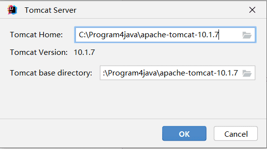

6. 关联完毕

    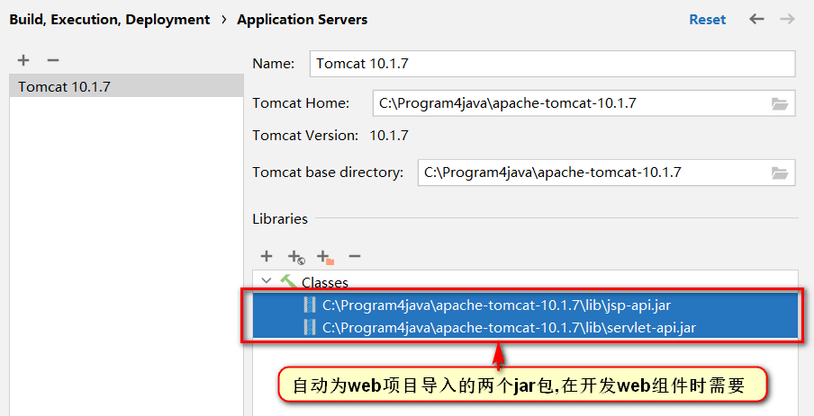

### IDEA创建web工程

1. 推荐先创建一个空项目，这样可以在一个空项目下同时存在多个`modules`，不用后续来回切换之前的项目，当然也可以忽略此步直接创建JavaWeb项目

    

    

2. 检查项目的`SDK`，语法版本，以及项目编译后的输出目录

    

    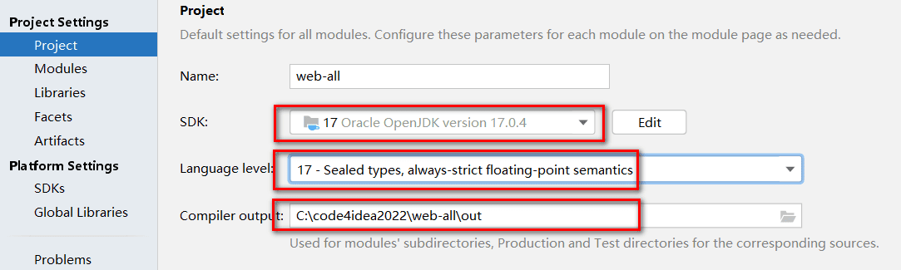

3. 先创建一个普通的Java项目

    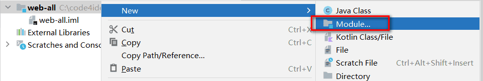

4. 检查各项信息是否填写有误

    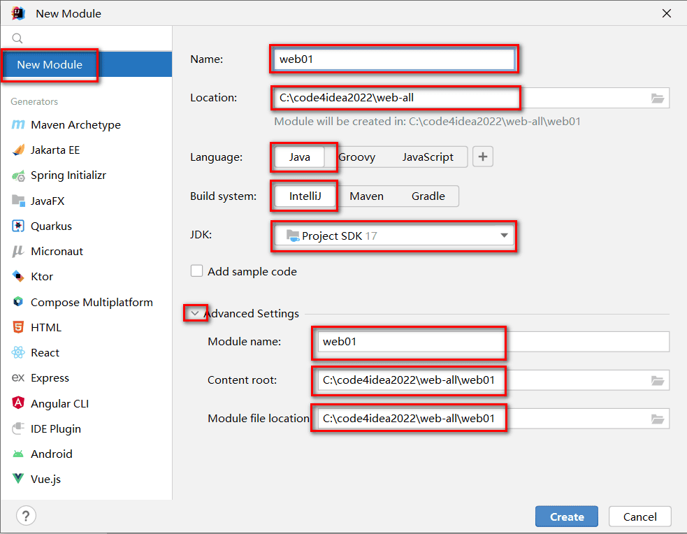

5. 创建完毕后，为项目添加Tomcat依赖

    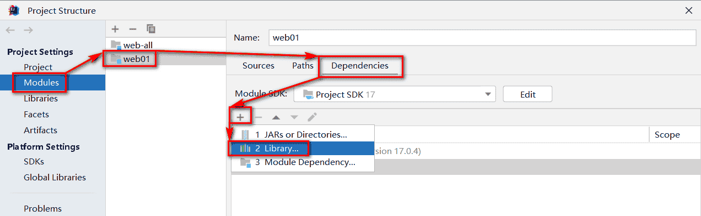

    

    

    !!! note

        本步骤是在前面关联Tomcat的第6步的基础之上进行的。之所以使用这种方式是因为后面在使用相关的`Servlet.jar`时不需要单独将`jar`包放到`lib`文件夹再点击`Add as Library`。当前使用的这种导入方式在存在多个项目时可以有效的减少磁盘空间的占用，因为在Tomcat中本身就有一个`lib`，这个`lib`中的所有`jar`包是供所有运行在Tomcat上的程序使用的

        在添加完Tomcat依赖后可以看到有一个`Scope`一栏对应的是`Provided`，表示当前的Tomcat的依赖在编译时或者构建时不携带这个`jar`包

6. 选择`modules`，右键点击`Add Framework Support`

    !!! note

        如果没有找到`Add Framework Support`，可以找到`Help->Find Actions`，在其中搜索`Add Framework Support`

    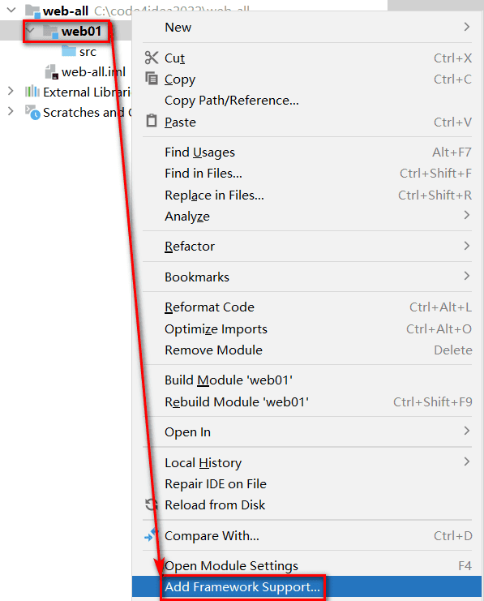

7. 选择`Web Application`注意`Version`，勾选`Create web.xml`

    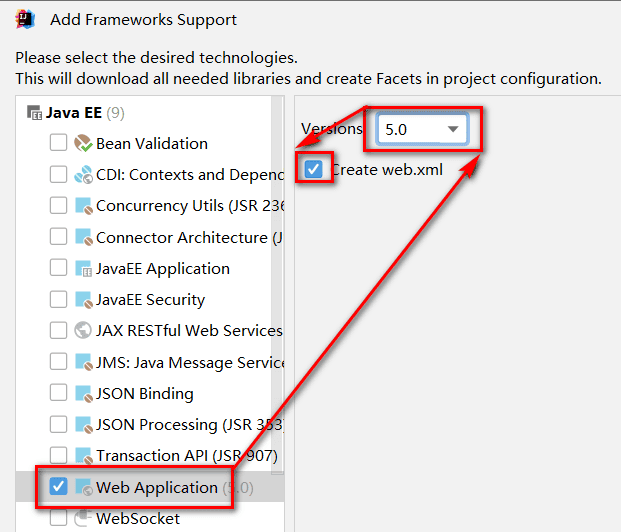

8. 删除`index.jsp` ，替换为`index.html`

    

    

9. 处理配置文件

      - 在工程下创建`resources`目录，专门用于存放配置文件（都放在`src`下也行，单独存放可以尽量避免文件集中存放造成的混乱）
      - 标记目录为资源目录，不标记的话则该目录不参与编译

    

      - 标记完成后，显示效果如下

    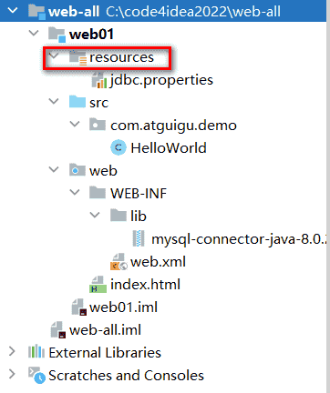

10. 处理依赖`jar`包问题

    - 在`WEB-INF`下创建`lib`目录
    - 必须在`WEB-INF`下，且目录名必须叫`lib`
    - 复制`jar`文件进入`lib`目录

    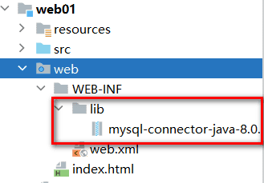

    - 将lib目录添加为当前项目的依赖，后续可以用maven统一解决

    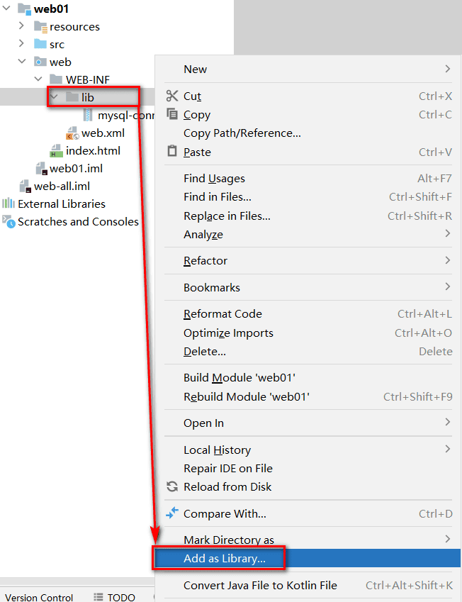

    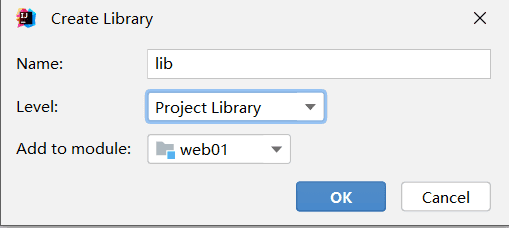

    - 环境级别推荐选择`module`级别，降低对其他项目的影响，`name`可以空着不写

    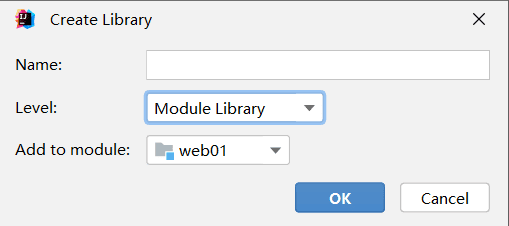

    - 查看当前项目有那些环境依赖

    

    

    - 在此位置，可以通过`-`号解除依赖

    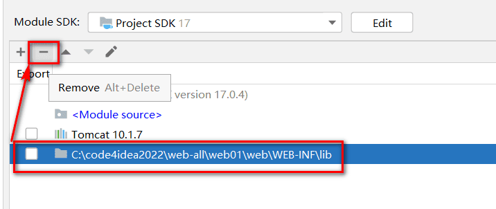

### 运行JavaWeb项目

1. 检查IDEA是否识别`modules`为Web项目并存在将项目构建成发布结构的配置

      - 就是检查工程目录下，web目录有没有特殊的识别标记

    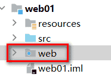

      - 以及`artifacts`下，有没有对应`_war_exploded`，如果没有，就点击`+`号添加

    

2. 点击向下箭头，出现`Edit Configurations`选项

    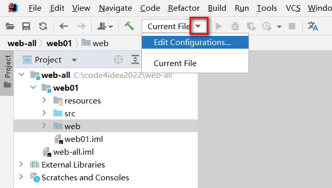

3. 出现运行配置界面

    

4. 点击`+`号，添加本地Tomcat服务器

    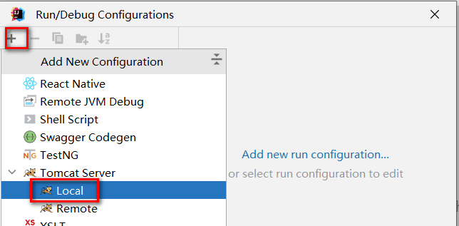

5. 因为IDEA只关联了一个Tomcat，红色部分就只有一个Tomcat可选

    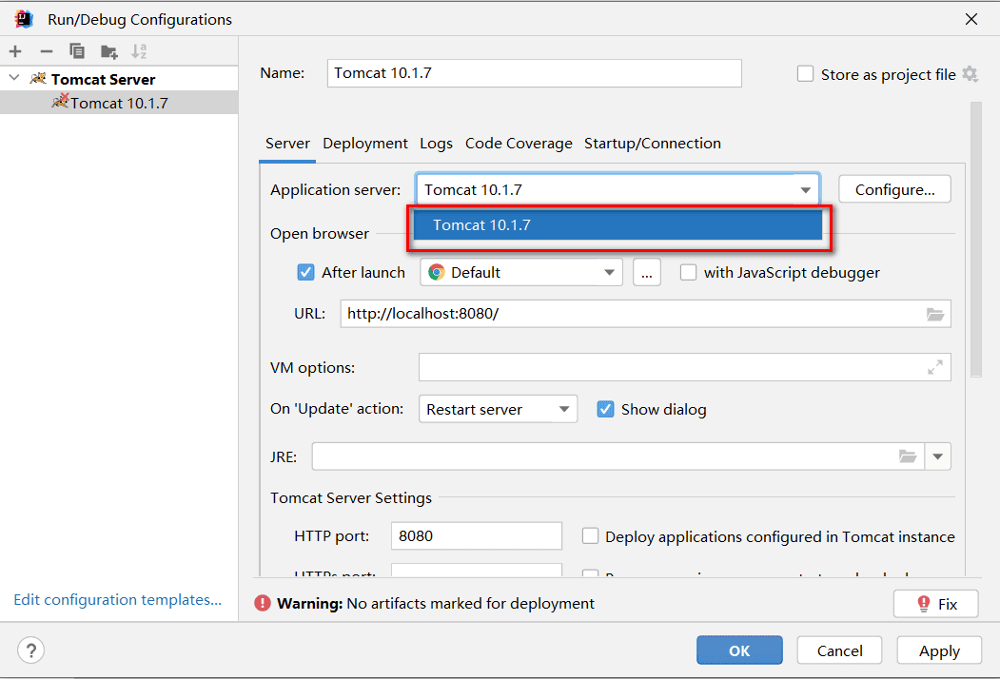

6. 选择`Deployment`，通过`+`添加要部署到Tomcat中的`artifact`

    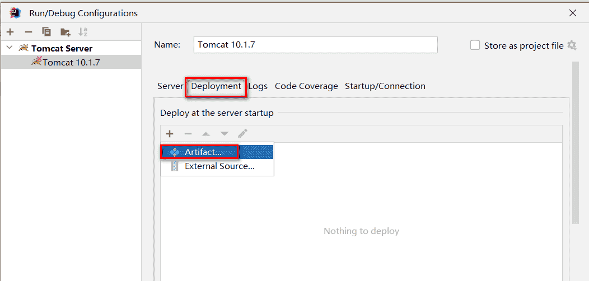

7. `applicationContext`中是默认的项目上下文路径，也就是`url`中需要输入的路径，这里可以自己定义，可以和工程名称不一样，也可以不写，但是要保留`/`，我们这里暂时就用默认的

    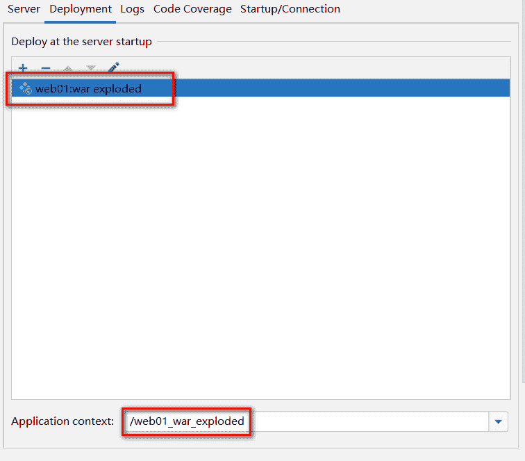

8. 点击`Apply`应用后，回到`Server`部分. `After Launch`是配置启动成功后，是否默认自动打开浏览器并输入`URL`中的地址，`HTTP port`是`Http`连接器目前占用的端口号

    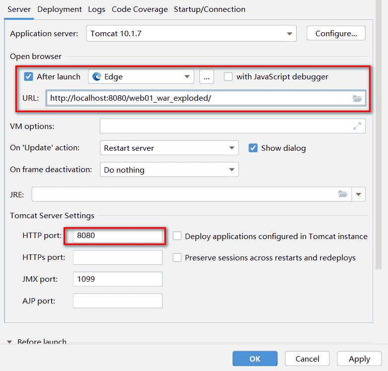

9. 点击`OK`后，启动项目，访问测试

    

    点击后，查看日志状态是否有异常

    

    浏览器自动打开并自动访问了`index.html`欢迎页

    

10. 工程结构和可以发布的项目结构之间的目录对应关系

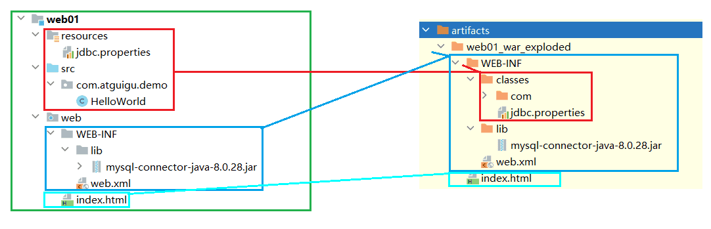

## IDEA部署并运行项目的原理

IDEA并没有直接进将编译好的项目放入Tomcat的`webapps`中，idea根据关联的Tomcat，创建了一个Tomcat副本，将项目部署到了这个副本中。默认情况下IDEA的Tomcat副本在`C:\用户\当前用户\AppData\Local\JetBrains\[IDEA版本]\tomcat\`中IDEA的Tomcat副本并不是一个完整的Tomcat，副本里只是准备了和当前项目相关的配置文件而已。IDEA启动Tomcat时，是让本地Tomcat程序按照Tomcat副本里的配置文件运行。IDEA的Tomcat副本部署项目的模式是通过`conf/Catalina/localhost/*.xml`配置文件的形式实现项目部署的。过程如下图所示：

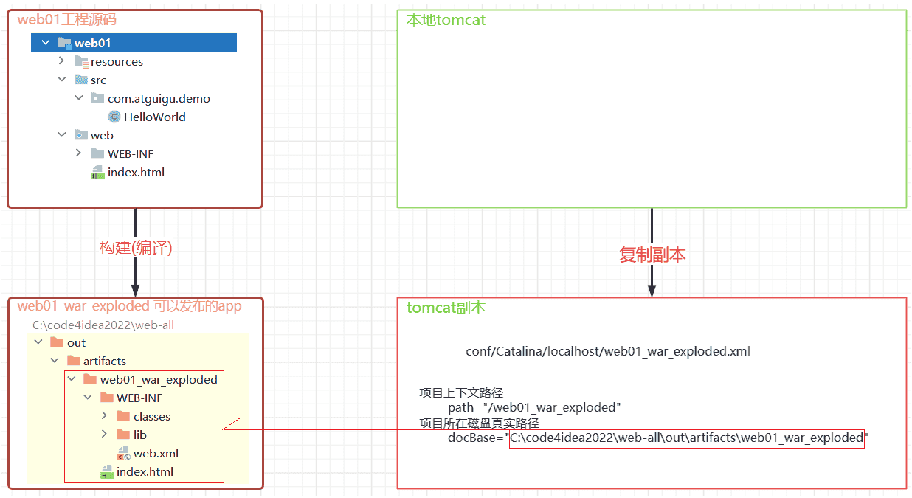