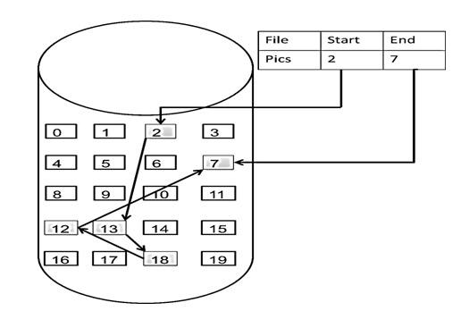

# 链表理论基础

## 链表简单介绍

什么是链表，链表是一种通过指针串联在一起的线性结构，每一个节点由两部分组成，一个是数据域一个是指针域（存放指向下一个节点的指针），最后一个节点的指针域指向`null`

链表的入口节点称为链表的头结点也就是`head`

如图所示：


## 链表的类型

接下来说一下链表的几种类型:

### 单链表

刚刚说的就是单链表

### 双链表

单链表中的指针域只能指向节点的下一个节点

双链表：每一个节点有两个指针域，一个指向下一个节点，一个指向上一个节点

双链表既可以向前查询也可以向后查询

如图所示：


### 循环链表

循环链表，顾名思义，就是链表首尾相连

循环链表可以用来解决约瑟夫环问题


## 链表的存储方式

了解完链表的类型，再来说一说链表在内存中的存储方式

数组是在内存中是连续分布的，但是链表在内存中可不是连续分布的

链表是通过指针域的指针链接在内存中各个节点，所以链表中的节点在内存中不是连续分布的 ，而是散乱分布在内存中的某地址上，分配机制取决于操作系统的内存管理

如图所示：



这个链表起始节点为2，终止节点为7，各个节点分布在内存的不同地址空间上，通过指针串联在一起。

## 链表的定义

接下来说一说链表的定义。

在面试的时候，一旦要自己手写链表，就写的错漏百出

这里给出C/C++的定义链表节点方式，如下所示：

```c++
// 单链表
struct ListNode {
    int val;  // 节点上存储的元素
    ListNode *next;  // 指向下一个节点的指针
    ListNode(int x)   // 节点的构造函数
        : val(x)
        , next(NULL) 
    {}
};
```

理论上来说可以不用定义构造函数，因为C++默认生成一个构造函数

但是这个构造函数不会初始化任何成员变量，下面举两个例子：

通过自己定义构造函数初始化节点：

```c++
ListNode* head = new ListNode(5);
```

使用默认构造函数初始化：

```c++
ListNode* head = new ListNode();
head->val = 5;
```

所以如果不定义构造函数使用默认构造函数的话，在初始化的时候就不能直接给变量赋值

## 链表的操作

### 删除节点

删除D节点，如图所示：


只要将`C`节点的`next`指针指向`E`节点就可以了

因为当前`D`节点还在内存中，所以在C++里最好是再手动释放这个`D`节点，释放这块内存

其他语言例如Java、Python，就有自己的内存回收机制，就不用自己手动释放

### 添加节点

如图所示：


可以看出链表的增添和删除都是O(1)操作，也不会影响到其他节点

但是要注意，要是删除第五个节点，需要从头节点查找到第四个节点通过`next`指针进行删除操作，查找的时间复杂度是O(N)

## 性能分析

再把链表的特性和数组的特性进行一个对比，如图所示：

|      | 插入/删除（时间复杂度） | 查询（时间复杂度） | 使用场景                         |
| ---- | ----------------------- | ------------------ | -------------------------------- |
| 数组 | O(N)                    | O(1)               | 数据量固定，频繁查询，较少增删   |
| 链表 | O(1)                    | O(N)               | 数据量不固定，频繁增删，较少查询 |

数组在定义的时候，长度就是固定的，如果想改动数组的长度，就需要重新定义一个新的数组，而链表的长度可以是不固定的，并且可以动态增删，适合数据量不固定，频繁增删，较少查询的场景

## 链表具体实现

有关链表的具体内容，在[数据结构部分](https://www.helper-wiki.top/%E6%95%B0%E6%8D%AE%E7%BB%93%E6%9E%84/3.%20%E9%93%BE%E8%A1%A8/3.%20%E9%93%BE%E8%A1%A8.html)已经很详细了，此处不再赘述