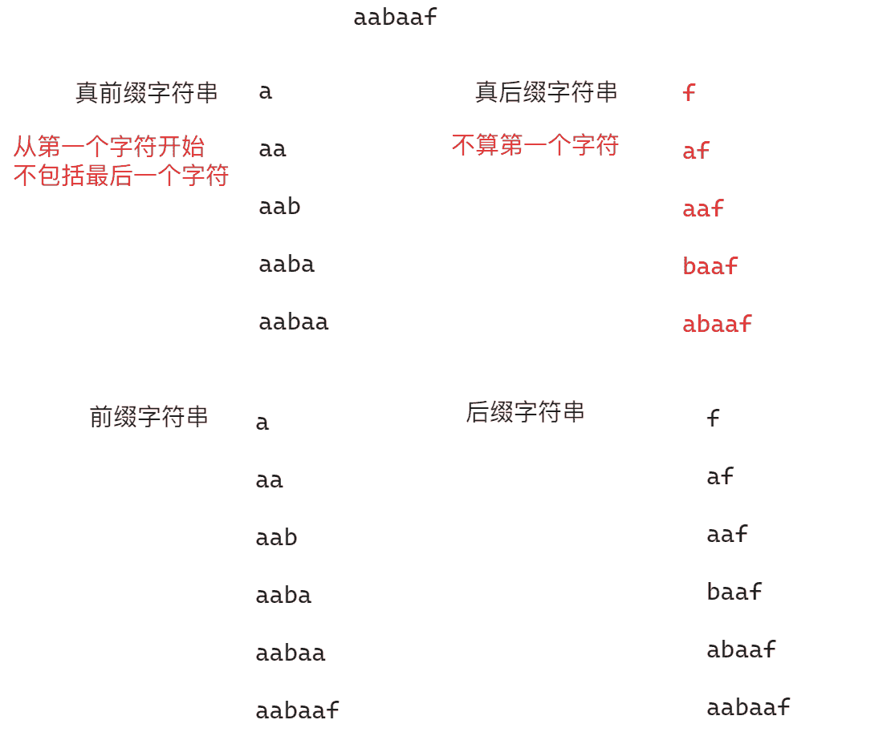

# KMP算法

## 介绍

在计算机科学中，克努斯-莫里斯-普拉特字符串查找算法（英语：Knuth–Morris–Pratt algorithm，简称为KMP算法）可在一个字符串`S`内查找一个词`W`的出现位置。一个词在不匹配时本身就包含足够的信息来确定下一个匹配可能的开始位置，此算法利用这一特性以避免重新检查先前配对的字符。

## KMP算法优化原理

在暴力解法部分，基本思路就是模式串与文本串依次匹配，如果遇到不相同的字符时，回到文本串最开始匹配的位置的下一个位置再次进行文本串和模式串的匹配，但是在这个匹配过程中，当遇到不相同的字符时，其前面的字符一定是匹配成功的，所以可能存在部分的字符不需要再次进行比较，而是从某一个位置开始重新进行比较，在这种情况下就可以避免重新匹配先前匹配成功的字符，这就是KMP算法利用的已知条件

!!! info "模式串与文本串"

    模式串是待匹配的字符串，文本串是原始字符串，而整个过程中所做的事情就是在文本串中找匹配模式串的字符串的起始位置
    
    例如：
    
    文本串：`aabaabaafa`
    
    模式串：`aabaaf`
    
    则需要做的事情就是在`aabaabaafa`找到与`aabaaf`匹配的第一个字符的下标，在本例中就是3

而KMP算法之所以可以找到所谓的某一个位置就是利用了最长相等前后缀字符串的长度，在理解什么是最长相等前后缀字符串的长度之前，先介绍何为前缀字符串以及何为后缀字符串

## 前缀字符串与后缀字符串

前缀字符串：从第一个字符开始到指定位置结束的子字符串，如果是不包括尾字符的所有子字符串，则被称为真前缀

后缀字符串：从指定位置开始到最后一个字符结束的字符串，如果是不包括首字符的所有子字符串，则被称为真后缀

例如在示例`aabaaf`中，其前缀字符串和后缀字符串分别如下图所示：



对于KMP算法来说，主要考虑的就是真前缀和真后缀

## 最长相等前后缀字符串的长度

对于一个以某一个位置为终点字符（不包括最后一个字符）的子字符串来说，最长相等前后缀是指该子字符串的真前缀和真后缀中最长的相等部分。例如，对于字符串`ababc`：

- 以第一个字符为结尾的子字符串`a`，其没有前缀也没有后缀，所以最长相等前后缀长度为0（没有相等的前后缀）
- 以第二个字符为结尾的子字符串`ab`，其前缀为`a`，后缀为`b`，所以最长相等前后缀长度为0（没有相等的前后缀）
- 以第三个字符为结尾的子字符串`aba`，其前缀为`a`，后缀为`a`时，最长相等前后缀长度为1（相等的前后缀是`a`）
- 以第四个字符为结尾的子字符串`abab`，其前缀为`ab`，后缀为`ab`时，最长相等前后缀长度为2（相等的前后缀是`ab`）

## KMP算法优化过程

以下面的两个字符串为例：

文本串：`aabaabaafa`

模式串：`aabaaf`

匹配过程如下：


从上面的示意图可以看出，当文本串中的字符和模式串的字符相同时，其比较方式与暴力方式一致，但是当遇到不一样的字符串时（后面称为冲突），暴力解法是让`i`回到开始时的下一个位置（即第二个`a`的下标位置），再从头进行匹配，但是KMP算法是让`j`跳到`b`所在位置继续向后进行匹配，并且`i`不回退

与暴力方式相同的部分不再解释，下面主要解释为什么KMP算法会跳到上面例子中`b`所在的位置

当遇到冲突时，说明前面的字符一定匹配成功，在前面的已经匹配成功的字符如果找到一个子字符串满足下面图示的条件：


就可以让模式串在下次进行匹配前移动最少的距离（也就是使得最长相等前缀和后缀的长度最大），从而继续从指定位置继续匹配，减少不必要的比较

显然，在上面的例子中，当`i`和`j`指向的字符产生冲突时，模式串中`f`字符前面的子串`aa`（对应抽象图中绿色的部分）与`b`字符前面的子串`aa`相同（对应抽象图中紫色的部分），且文本串中冲突位置之前的子串`aa`（对应抽象图中棕色的部分）与模式串`f`字符前面的子串的`aa`相同，则此时就可以让模式串只从`b`位置开始重新比较（对应抽象图中紫色部分的末端）

现在就产生了第二个问题，模式串中`b`字符的位置意味着什么

`b`字符的下标值实际上就是最长相等前后缀字符串的长度，以这个位置为对称轴就可以找到相等的前缀和后缀，如果找到后缀，那么就可以找到对应的前缀，也就是`b`位置之前的子字符串，因为前面提到前缀和后缀相同且二者等于文本串中的某一个子字符串，所以就是在已经匹配的字符串中确定不需要再进行匹配的字符串

现在就是最后一个问题，如何在产生冲突的时候让模式串的指针回退到下一次准备匹配的位置

这就需要使用到前缀表，前缀表中每一个元素代表的就是当前字符为结尾字符的子字符串中最长相等前缀和后缀的长度

## 前缀表

前缀表就是一个长度与模式串相同的、保存着以当前位置为结尾子字符串中最长相等前后缀的长度的数组。这个长度值同时对应的就是前缀和后缀相同时的对称轴所在的下标，这个对称轴只有两种情况：1. 后缀包括对称轴 2. 后缀不包括对称轴，根据这个对称轴就可以确定当出现冲突时，模式串下标需要跳转的位置

在计算前缀表之前，一定要记住前缀表存储的数据表示的是**以当前位置为结尾的子字符串中最长相等前后缀的长度**

求前缀表的思路一般分为4步：

1. 初始化相关变量
2. 处理前后缀不相同的情况
3. 处理前后缀相同的情况
4. 更新前缀表

例如对于字符串`s = aabaaf`来说，标记两个下标`prefix`从0开始，表示前缀字符串最后一个字符的位置，同时也表示最长相等前后缀的长度（初始化相关变量），`suffix`从1开始，表示后缀字符串最后一个字符的位置，则其前缀表中的内容计算方式如下：

- 前后缀相同的情况：`suffix = 1, prefix = 0`，当前`s[prefix] == s[suffix]`，所以存在最长相等前后缀，前缀为`a`，后缀为`a`，其长度为1；更新`prefix`为1；更新`next`数组第二个元素的值为1（注意不是更新`next`数组的第一个元素，因为对于第一个元素来说，其既没有前缀也没有后缀，所以最长相等前后缀长度为0）；向后移动`suffix`
- 前后缀不相同的情况：`suffix = 2, prefix = 1`，当前`s[prefix] != s[suffix]`，因为`prefix`和`suffix`分别代表的是前缀最后一个字符的位置和后缀最后一个字符的位置，所以当前字符不相同就说明遇到了不相等前缀字符串和后缀字符串，需要让`prefix`回退，即`prefix = next[prefix - 1]`（注意需要持续进行回退，因为不能保证回退一次之后的值与当前位置匹配）；如果`prefix-1`小于0时都无法匹配，此时说明没有相等的前缀和后缀，更新`next[suffix]`为0

!!! note

    1. 之所以让两个下标错开是为了产生比较，否则两个下标指向的字符始终是同一个字符从而导致每一个字符都是相等的
    2. 注意`prefix`值填充的位置，第一次填充时，`prefix`值填充到第二个元素的位置，依次往后，因为如果只有一个字符构成子字符串时，其既没有前缀也没有后缀，所以最长相等前后缀长度为0，即`next[0] = 0`，第二个元素的位置也就是后缀字符串最后一个字符的位置，所以填充的位置为`next[suffix]`
    3. 对于`prefix`和`suffix`之所以可以找出最长相等前后缀的长度，本质是因为`suffix`指向的是后缀字符串最后一个字符的位置，`prefix`指向的是前缀字符串最后一个字符的位置。当两个指针同时走到了某一个位置时，若二者对应的字符相等，说明前面的字符已经计算过相等前缀和后缀长度，二者都向后移动；若二者对应的字符不相等，则说明此时存在前缀和后缀的最后一个字符不相同，所以就需要向前移动`prefix`，直到满足要么`prefix`到最开始的位置（即`next[0]`）依旧不相等表示没有相等前后缀，要么`prefix`对应的字符与`suffix`对应的字符相同继续比较直到找到最长相等前后缀

## KMP算法求`next`数组代码

根据前面的思路，可以写出下面的求`next`数组的代码：

```C++
void getNext(vector<int> &next, string &needle)
{
    // 初始化相关变量
    int prefixEnd = 0;
    // 遍历
    // 后缀从1开始，形成比较
    for (int suffixEnd = 1; suffixEnd < needle.size(); suffixEnd++)
    {
        // 如果后缀字符和前缀字符不相等，说明遇到了不相等的子串
        // 此时prefixEnd就要向前移动找到对称轴的位置
        // 如果字符串找到开始都没有找到说明此时没有最长相等前后缀
        while (prefixEnd - 1 >= 0 && needle[prefixEnd] != needle[suffixEnd])
        {
            prefixEnd = next[prefixEnd - 1];
        }

        // 如果二者相等，说明此时新增了最长相等前后缀
        // 更改最长相等前后缀的长度
        if (needle[prefixEnd] == needle[suffixEnd])
        {
            prefixEnd++;
        }

        // 更新当前next数组
        next[suffixEnd] = prefixEnd;
    }
}
```

## KMP算法匹配文本串代码

```c++
int strStr(string haystack, string needle)
{
    // 构建next数组
    vector<int> next(needle.size());
    // 填充next值
    getNext(next, needle);

    int j = 0;
    // 遍历文本串
    for (int i = 0; i < haystack.size(); i++)
    {
        // 如果出现不同，说明此时要找到最长相等前后缀的长度
        // 回退到长度对应的位置值重新比较
        while (j - 1 >= 0 && haystack[i] != needle[j])
        {
            j = next[j - 1];
        }

        // 如果相同，说明需要继续匹配
        if (haystack[i] == needle[j])
            j++;

        // 如果j此时走到了模式串的结尾，则i一定在下一个待匹配字符的位置
        // 此时要求的匹配的子串的起始位置，与当前的i构成的区间就是左闭右闭
        // 所以返回i - needle.size() + 1
        if (j == needle.size())
            return i - needle.size() + 1;
    }

    // 找不到返回-1
    return -1;
}
```

## 力扣28.找出字符串中第一个匹配项的下标

[力扣28.找出字符串中第一个匹配项的下标](https://leetcode.cn/problems/find-the-index-of-the-first-occurrence-in-a-string/description/)

**问题描述：**

!!! quote
    给你两个字符串`haystack`和`needle`，请你在`haystack`字符串中找出`needle`字符串的第一个匹配项的下标（下标从 0 开始）。如果`needle`不是`haystack`的一部分，则返回-1。

    示例 1：

    ```c++
    输入：haystack = "sadbutsad", needle = "sad"
    输出：0
    解释："sad" 在下标 0 和 6 处匹配。
    第一个匹配项的下标是 0 ，所以返回 0 。
    ```

    示例 2：

    ```c++
    输入：haystack = "leetcode", needle = "leeto"
    输出：-1
    解释："leeto" 没有在 "leetcode" 中出现，所以返回 -1 。
    ```

**思路分析：**

本题就可以利用到KMP算法优化暴力搜索

**参考代码：**

```c++
class Solution
{
public:
    void getNext(vector<int> &next, string &needle)
    {
        // 初始化相关变量
        int prefixEnd = 0;
        // 遍历
        // 后缀从1开始，形成比较
        for (int suffixEnd = 1; suffixEnd < needle.size(); suffixEnd++)
        {
            // 如果后缀字符和前缀字符不相等，说明遇到了不相等的子串
            // 此时prefixEnd就要向前移动找重新相同的位置
            // 如果字符串找到开始都没有找到说明此时没有最长相等前后缀
            while (prefixEnd - 1 >= 0 && needle[prefixEnd] != needle[suffixEnd])
            {
                // prefixEnd回到上一次的具有相等前后缀的位置
                prefixEnd = next[prefixEnd - 1];
            }

            // 如果二者相等，说明此时新增了最长相等前后缀
            // 更改最长相等前后缀的长度
            if (needle[prefixEnd] == needle[suffixEnd])
            {
                prefixEnd++;
            }

            // 更新当前next数组
            next[suffixEnd] = prefixEnd;
        }
    }

    int strStr(string haystack, string needle)
    {
        // 构建next数组
        vector<int> next(needle.size());
        // 填充next值
        getNext(next, needle);

        int j = 0;
        // 遍历文本串
        for (int i = 0; i < haystack.size(); i++)
        {
            // 如果出现不同，说明此时要找到最长相等前后缀的长度
            // 回退到长度对应的位置值重新比较
            while (j - 1 >= 0 && haystack[i] != needle[j])
            {
                j = next[j - 1];
            }

            // 如果相同，说明需要继续匹配
            if (haystack[i] == needle[j])
                j++;

            // 如果j此时走到了模式串的结尾，则i一定在下一个待匹配字符的位置
            // 此时要求的匹配的子串的起始位置，与当前的i构成的区间就是左闭右闭
            // 所以返回i - needle.size() + 1
            if (j == needle.size())
                return i - needle.size() + 1;
        }

        // 找不到返回-1
        return -1;
    }
};
```